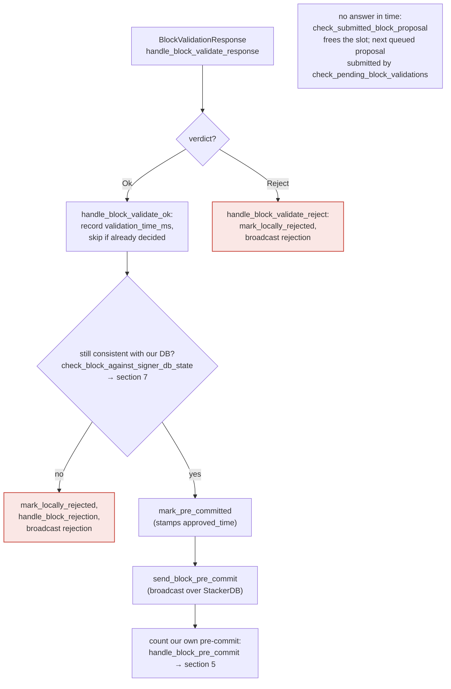
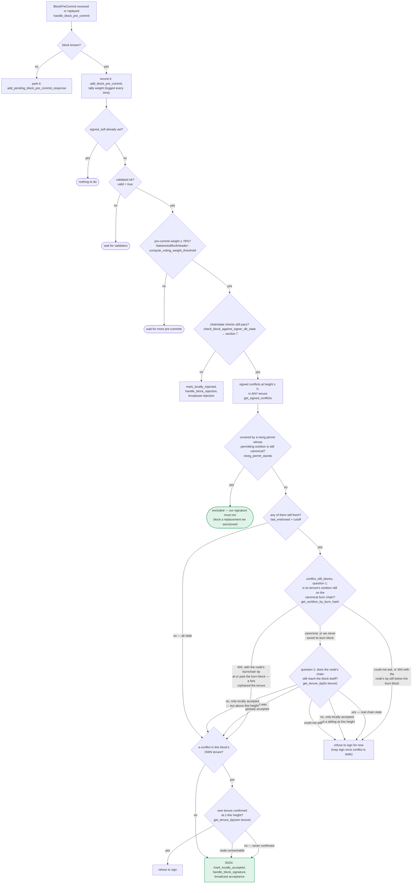

Found a solid analog. The bug-class ("attacker controls a resource-metering value that determines pass/fail of a sub-step, but different observers evaluate that resource non-deterministically, causing an outer/objective result to diverge from actual validity") maps directly onto the **wall-clock, non-deterministic validation deadlines** used in `postblock_proposal.rs`'s block-validation path.

### Title
Non-deterministic wall-clock validation deadlines let a miner make identical valid blocks be accepted by some signers and rejected by others - (File: `stackslib/src/net/api/postblock_proposal.rs`)

### Summary
`BlockProposal::validate` enforces an overall block-validation deadline and per-transaction execution/analysis budgets using `Instant::now()` wall-clock measurements rather than the deterministic Clarity `ExecutionCost` metric. A block proposer (the sortition-winning miner for that slot) can craft a block whose transactions sit right at the edge of these timeouts. Because wall-clock validation speed differs per node (hardware, concurrent load, OS scheduling), the *same* block, with the *same* deterministic execution cost, can pass on faster/idle signer nodes and time out (be rejected) on slower/busier ones — producing conflicting verdicts on an objectively valid, canonical block.

### Finding Description
`validate()` computes `block_deadline = Instant::now() + Duration::from_secs(timeout_secs)` and checks `Instant::now() >= block_deadline` between each transaction: [1](#0-0) . If the deadline trips, the block is rejected as `ValidateRejectCode::InvalidBlock` with no offending tx blamed [2](#0-1) .

Per-transaction execution/analysis time ceilings work the same way, built from `TransactionResourceBudgets::from_settings`, which wraps a `ResourceBudget` configured with `max_execution_time`/`max_analysis_time` — explicitly wall-clock durations, not Clarity cost units: [3](#0-2) . The code's own doc comment states these budgets "MUST be unlimited during consensus-critical processing, because that must remain deterministic," and are only ever used "during the miner's block construction and the signer node's proposal validation" as a "defense-in-depth measure" [4](#0-3) .

This is exactly the shape of the DAO gas-manipulation bug: a value that the block's author (miner) effectively controls (transaction cost calibrated against a resource ceiling) determines whether a sub-step "fails" or "succeeds," but the resource being consumed (wall-clock time) is not the deterministic quantity that everyone agrees on (Clarity's metered `ExecutionCost`, analogous to EVM gas being deterministic per opcode). Instead it is measured independently, per-node, in real time — so identical inputs produce different outcomes depending on the observer's hardware/load, not the block's actual validity.

In the signer flow, `handle_block_validate_response` → `handle_block_validate_reject` treats a timeout-triggered `InvalidBlock`/`ProblematicTransaction` rejection exactly like a rejection for a truly invalid block: it calls `mark_locally_rejected` and broadcasts the rejection over StackerDB, which is tallied by other signers and the miner (see the `BlockValidationResponse` flow) — see the `docs/signer-flows.md` diagram: [5](#0-4) . Meanwhile, a faster/idle signer, given the same block, validates within its own deadline and proceeds to `mark_pre_committed` → `send_block_pre_commit` → eventually signs (`handle_block_pre_commit`, `SIGN` in the same diagram) [6](#0-5) .

The tests in the repo confirm the exact mechanics of the deadline and per-tx budgets that make this reproducible: [7](#0-6)  and the per-tx execution/analysis expiry tests: [8](#0-7) .

### Impact Explanation
This breaks the "signed vs. validated" equality the signer network is supposed to preserve: the same, fully canonical, cost-valid block should produce the same accept/reject verdict everywhere. Because the deadline/timeout check is keyed to per-node wall-clock progress rather than the deterministic `ExecutionCost` that the chain actually enforces, a miner can deliberately author blocks whose real (metered) cost is safely under the consensus block budget but whose wall-clock validation time hovers near `block_proposal_validation_timeout_secs` / `block_proposal_max_tx_execution_time_secs`. On slower or momentarily busier signer nodes this manufactures spurious `InvalidBlock`/`ProblematicTransaction` rejections for a valid block, fragmenting signer weight between "accept" and "reject" camps for that exact proposal. This is a liveness degradation: a targeted attacker with knowledge of which signers run slower hardware or are momentarily loaded can repeatedly suppress specific signers' weight from ever reaching the acceptance threshold on time-sensitive proposals, without needing to compromise any signer key, control a majority, or use privileged access — a single malicious block proposer plus normal StackerDB gossip is sufficient.

### Likelihood Explanation
Likelihood is moderate: it requires the attacker (the block's proposer for that tenure slot) to calibrate transaction cost/complexity against the configured timeout values, which are visible defaults/config (`block_proposal_validation_timeout_secs`, `block_proposal_max_tx_execution_time_secs`, `block_proposal_max_tx_analysis_time_secs`) documented in `stackslib/src/config/mod.rs` and `sample/conf/mainnet-signer-conf.toml`. It does not require knowing exact per-signer hardware, only that variance exists across a decentralized signer set (which is guaranteed in practice), and the timing-sensitive boundary is reachable by any transaction whose Clarity execution genuinely runs close to the wall-clock cap (e.g., large reads/loops), which miners routinely construct.

### Recommendation
Do not let consensus-relevant accept/reject decisions hinge on non-deterministic wall-clock measurements. Either:
- Remove or significantly widen the wall-clock timeouts so they can never plausibly trip on legitimate blocks under the deterministic `ExecutionCost` budget (treat them purely as anti-DoS safety valves far above any theoretically-costed block), or
- Make the pass/fail decision solely a function of the deterministic `ExecutionCost` metric already tracked by the cost tracker (`cost_so_far`, `block_limit`) instead of `Instant::now()`, so that all signers reach an identical verdict for an identical block regardless of local hardware/load, or
- If wall-clock budgets must remain (e.g., to bound heap/compute abuse from malicious contract logic that beats the cost tracker's model), require an additional grace/consensus mechanism so a single slow-signer timeout is never treated the same as a definitive `InvalidBlock` rejection — e.g., retry validation once before broadcasting a rejection, or explicitly tag such rejections as `ConnectivityIssues`-like (as already done for the submission-timeout case at `check_submitted_block_proposal`, see [9](#0-8) ) so they are not conflated with genuine invalidity in vote tallying/miner heuristics.

### Proof of Concept
1. A miner wins a sortition slot and is due to propose a block.
2. The miner crafts (or includes) a transaction whose Clarity-metered `ExecutionCost` is safely within the consensus block budget, but whose actual wall-clock execution time is calibrated to sit just under `block_proposal_max_tx_execution_time_secs` / `block_proposal_validation_timeout_secs` on "typical" hardware (e.g., a contract call with heavy but not maximal read/compute work, exploiting the per-tx wall-clock gate at `postblock_proposal.rs:755-771` and the `TransactionResourceBudgets` wall-clock caps at `stacks/miner.rs:736-784`).
3. The miner proposes this single block and gossips it via StackerDB to all signers, as normal.
4. Signers running on slower or momentarily loaded nodes exceed their local per-node deadline mid-validation and return `Err(BlockValidateRejectReason{ reason_code: InvalidBlock | ProblematicTransaction, .. })`, which the signer turns into a broadcast rejection (`handle_block_validate_reject` → `mark_locally_rejected`).
5. Signers on faster/idle nodes finish within their local deadline, get `Ok(BlockValidateOk)`, and proceed through `mark_pre_committed` → sign the block.
6. The proposer/attacker observes and can iterate (adjusting tx cost slightly) to specifically target which signers time out, fragmenting the signer set's response to an objectively valid, deterministic-cost block purely through wall-clock variance it does not control uniformly across the network — reproducing, in the Stacks signer context, the DAO report's core issue of a resource-metering value under attacker influence non-deterministically flipping a sub-step's pass/fail outcome while the rest of the pipeline behaves as if the underlying content were the deciding factor.

### Citations

**File:** stackslib/src/net/api/postblock_proposal.rs (L731-771)
```rust
        let block_deadline = Instant::now() + Duration::from_secs(timeout_secs);
        let per_tx_max_execution_time = Duration::from_secs(max_tx_execution_time_secs);
        // Bound the analysis phase during proposal validation by the
        // dedicated per-tx analysis budget, independently of the eval budget above.
        let per_tx_max_analysis_time = Duration::from_secs(max_tx_analysis_time_secs);
        let mut receipts_total = 0u64;

        let max_tx_mem_bytes_opt = if max_tx_mem_bytes > 0 {
            Some(max_tx_mem_bytes)
        } else {
            None
        };
        let resource_budgets = TransactionResourceBudgets::new()
            .with_analysis_budget(
                ResourceBudget::new()
                    .with_max_duration(Some(per_tx_max_analysis_time))
                    .with_max_memory_use(max_tx_mem_bytes_opt),
            )
            .with_execution_budget(
                ResourceBudget::new()
                    .with_max_duration(Some(per_tx_max_execution_time))
                    .with_max_memory_use(max_tx_mem_bytes_opt),
            );

        for (i, tx) in self.block.txs.iter().enumerate() {
            // Enforce the overall block validation budget between txs. A tx
            // running over its own per-tx limit is the tx's fault and is
            // handled below; running out of overall budget is the block's
            // fault and shouldn't flag any specific tx as problematic.
            if Instant::now() >= block_deadline {
                warn!(
                    "Rejected block proposal";
                    "reason" => "Block validation timed out",
                    "next_tx_index" => i,
                );
                return Err(BlockValidateRejectReason {
                    reason: format!("Block validation timed out before tx {i} could be processed"),
                    reason_code: ValidateRejectCode::InvalidBlock,
                    failed_txid: None,
                });
            }
```

**File:** stackslib/src/chainstate/stacks/miner.rs (L736-784)
```rust
/// Defines limits on computing resources (heap allocation and wallclock time)
/// during processing of contract deploy and call transaction. These are
/// independent of cost tracking and MUST be [`ResourceBudget::unlimited`]
/// during consensus-critical processing, because that must remain deterministic.
///
/// The budgets are limited during the miner's block construction and the
/// signer node's proposal validation to ensure that a smart contract that
/// triggers excessive memory usage or delays is not included in the chain.
/// This is a defense-in-depth measure -- if these budgets are exceeded, that
/// probably means there's an underlying bug in the VM or analysis engine that
/// should be fixed.
pub struct TransactionResourceBudgets {
    /// The budget that applies during clarity evalution, used both during
    /// contract deploy and contract call transactions.
    execution_budget: ResourceBudget,

    /// The budget that applies during contract analysis, only used during
    /// contract deploy transactions.
    analysis_budget: ResourceBudget,
}

impl TransactionResourceBudgets {
    pub fn new() -> Self {
        Self {
            execution_budget: ResourceBudget::unlimited(),
            analysis_budget: ResourceBudget::unlimited(),
        }
    }

    pub fn unlimited() -> Self {
        Self::new()
    }

    pub fn from_settings(settings: &BlockBuilderSettings) -> Self {
        let memory_limit = if settings.max_assembly_mem_bytes > 0 {
            Some(settings.max_assembly_mem_bytes)
        } else {
            None
        };

        Self {
            execution_budget: ResourceBudget::new()
                .with_max_duration(settings.max_execution_time)
                .with_max_memory_use(memory_limit),
            analysis_budget: ResourceBudget::new()
                .with_max_duration(settings.max_analysis_time)
                .with_max_memory_use(memory_limit),
        }
    }
```

**File:** docs/signer-flows.md (L211-227)
```markdown


> Anchors: `handle_block_validate_response`, `handle_block_validate_ok`,
> `handle_block_validate_reject`, `check_block_against_signer_db_state`,
> `send_block_pre_commit` (signer.rs)
```

**File:** docs/signer-flows.md (L237-269)
```markdown


**File:** stackslib/src/net/api/tests/postblock_proposal.rs (L517-534)
```rust
/// Test that when block validation exceeds the overall block-level deadline
/// (`block_proposal_validation_timeout_secs`), the block is rejected as an
/// `InvalidBlock` without blaming any specific transaction.
#[test]
fn test_block_proposal_validation_timeout() {
    let test_observer = TestEventObserver::new();
    let mut rpc_test = TestRPC::setup_nakamoto(function_name!(), &test_observer);

    rpc_test
        .peer_1
        .network
        .connection_opts
        .block_proposal_validation_timeout_secs = 0;
    rpc_test
        .peer_2
        .network
        .connection_opts
        .block_proposal_validation_timeout_secs = 0;
```

**File:** stackslib/src/net/api/tests/postblock_proposal.rs (L709-733)
```rust
/// Test that when a transaction's execution phase exceeds the dedicated per-tx
/// execution budget (`block_proposal_max_tx_execution_time_secs`) during
/// block-proposal validation, the block is rejected as containing a problematic
/// transaction, and the rejection blames the offending txid so the miner can
/// drop it from the next proposal.
#[test]
fn test_block_proposal_validation_execution_time_expired_blames_tx() {
    let test_observer = TestEventObserver::new();
    let mut rpc_test = TestRPC::setup_nakamoto(function_name!(), &test_observer);

    // Force every tx execution to exceed its budget: a 0s deadline is already
    // elapsed at the first per-node check. The overall validation timeout and
    // the per-tx analysis limit are left at their (non-zero) defaults, so the
    // per-tx execution limit is what fires here, not the block-level deadline
    // nor the analysis budget.
    rpc_test
        .peer_1
        .network
        .connection_opts
        .block_proposal_max_tx_execution_time_secs = 0;
    rpc_test
        .peer_2
        .network
        .connection_opts
        .block_proposal_max_tx_execution_time_secs = 0;
```

**File:** stacks-signer/src/v0/signer.rs (L2150-2168)
```rust
        // We cannot determine the validity of the block, but we have not reached consensus on it yet.
        // Reject it so we aren't holding up the network because of our inaction.
        warn!(
            "{self}: Failed to receive block validation response within {} ms. Rejecting block.", self.block_proposal_validation_timeout.as_millis();
            "signer_signature_hash" => %proposal_signer_sighash,
        );
        let rejection = self.create_block_rejection(
            RejectReason::ConnectivityIssues(
                "failed to receive block validation response in time".to_string(),
            ),
            &block_info.block,
        );
        block_info.reject_reason = Some(rejection.response_data.reject_reason.clone());
        if let Err(e) = block_info.mark_locally_rejected() {
            if !block_info.has_reached_consensus() {
                warn!("{self}: Failed to mark block as locally rejected: {e:?}");
            }
        };
        self.send_block_response(&block_info.block, rejection.into());
```
