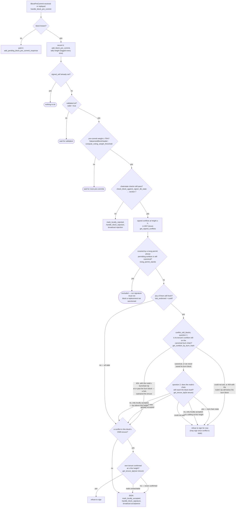
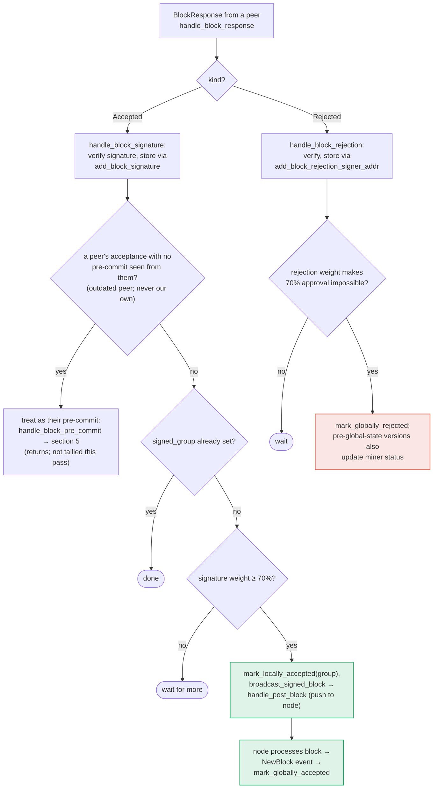

### Title
Aggregating peer signatures to the 70% group threshold broadcasts a block without re-checking `check_block_against_signer_db_state`, unlike the pre-commit path - (File: `stacks-signer/src/v0/signer.rs`)

### Summary
`check_block_against_signer_db_state` is documented and treated as mandatory just-in-time re-validation that must run immediately before a signer commits to a block, because chain/signerdb state can change between validation and the moment weight crosses a consensus threshold. It is explicitly re-run in `handle_block_validate_ok` (before `mark_pre_committed`) and in `handle_block_pre_commit` (before `mark_locally_accepted`/signing) <cite repo="ThankGod76/stacks-core--020" path="stacks-signer/src/v0/signer.rs" start="1340="/> [1](#0-0) . However, `store_and_process_block_signature` — the function that tallies *peer* acceptance signatures and, upon crossing the 70% signature-weight threshold, marks the block locally accepted and broadcasts it to the node — never calls this check before broadcasting [2](#0-1) .

This is directly analogous to the elFinder bug: one code path (`upload`/`handle_block_pre_commit`) runs the full validation pipeline, while a second path that produces the same "the signer commits/extracts" effect (`extract`/`store_and_process_block_signature` aggregating peer signatures) skips the "normalization"/re-validation step, silently bypassing the protection.

### Finding Description
The doc comments and code make explicit that `check_block_against_signer_db_state` must be re-run "before putting a signature over the block" or "before advertising willingness to sign", precisely because the signer's local DB state can change between the time a block was validated and the time enough weight accumulates to act on it:

- In `handle_block_validate_ok`, after the node validates a proposal, the signer re-checks its own DB state before `mark_pre_committed` [3](#0-2) .
- In `handle_block_pre_commit`, once pre-commit weight crosses 70%, the signer explicitly re-runs the same check "before putting a signature over the block" and rejects if it no longer passes [4](#0-3) .

But `store_and_process_block_signature` — invoked from `handle_block_signature` when a peer's `BlockAccepted` message arrives — only checks `block_info.signed_group.is_some()` and the raw signature weight threshold before calling `mark_locally_accepted(true)` and `broadcast_signed_block` (which pushes the block straight to the node via `handle_post_block`) [5](#0-4) . There is no call to `check_block_against_signer_db_state` (or any equivalent re-check) anywhere in this function.

Concretely, the doc for section 6 confirms this asymmetry: acceptance tallying goes directly `TALLY -- yes --> BCAST["mark_locally_accepted(group), broadcast_signed_block..."]` with no `RECHECK` node in the flow, unlike section 5's pre-commit flow which explicitly inserts a `RECHECK` step before `SIGN` [6](#0-5) [7](#0-6) .

This breaks the "aggregated-weight vs verified-accepts" equality the pre-commit path is designed to guarantee: a signer can reach the 70% signature threshold and push a block to its own node for processing even though that signer's own chainstate/signerdb view would now reject the block (e.g., because the signer itself has since signed a conflicting/superseding block in the same tenure, or the tenure-change parent confirmation no longer holds). The comment on `check_block_against_signer_db_state` even warns: "This is required in case a block has been approved since the initial checks of the block validation endpoint" [8](#0-7)  — exactly the scenario `store_and_process_block_signature` fails to guard against.

### Impact Explanation
This matches the "Critical" impact bucket: a rejection/aggregated-weight tally is treated as sufficient to *push* a block (`handle_post_block` submits it to `/v3/blocks/upload`/processing) without the signer re-verifying, at the moment of acting, that the block is still consistent with its own signerdb state — the same guarantee `handle_block_pre_commit` explicitly re-establishes right before signing. If the signer's local chainstate view has moved on (e.g., it locally signed a competing block at the same height, or the tenure-change parent relationship it once accepted is no longer valid), the signer will still broadcast a stale/now-invalid block to its node purely because enough *peer* signatures (which were valid at the time they were produced, under a different, now-stale local view) accumulated. This is a "signer acting on stale/aggregated state vs currently verified state" break, consistent with the excluded protections around conflicting-block signing described elsewhere in the same file (`handle_block_pre_commit`'s reorg/conflict guard) that this path entirely bypasses.

### Likelihood Explanation
No majority collusion is required beyond the normal 70% signature weight that is already necessary to push any block — the miner/gossip network only needs to deliver `BlockAccepted` messages produced honestly (at the time they were valid) after this signer's own local chainstate view changed (e.g., after this signer already locally-accepted a conflicting sibling). Given the explicit design intent visible elsewhere in the file (the pre-commit path re-checks specifically to cover this window), this asymmetry is a genuine, reachable gap rather than a theoretical one, triggerable by ordinary tenure-timing races that the codebase's own tests exercise for the pre-commit path (`async_sibling_validation`, `run_sibling_scenario`) but not for the signature-aggregation path.

### Recommendation
Add a `check_block_against_signer_db_state` (or equivalent) re-check inside `store_and_process_block_signature`, immediately before `mark_locally_accepted(true)` / `broadcast_signed_block`, mirroring the pattern already used in `handle_block_pre_commit` and `handle_block_validate_ok`. On failure, mark the block locally rejected and broadcast a rejection instead of pushing it, exactly as the other two call sites do.

### Proof of Concept
1. Signer S receives proposal for block A (tenure T, height h) and pre-commits/validates it; `check_block_against_signer_db_state` passes.
2. Before S accumulates 70% acceptance weight on A, S locally signs a different, conflicting block B at height h in a way that would make A fail `check_block_against_signer_db_state` if re-run now (e.g., B supersedes A's tenure-change parent expectation).
3. Peers who validated A earlier (before B existed) send their `BlockAccepted(A)` signatures, which arrive at S via `handle_block_signature` → `store_and_process_block_signature`.
4. Weight crosses 70%; `store_and_process_block_signature` calls `mark_locally_accepted(true)` and `broadcast_signed_block` → `handle_post_block`, pushing A to the node — with no re-verification against S's now-conflicting local state, unlike the equivalent point in `handle_block_pre_commit` which would have caught this and rejected instead.

### Citations

**File:** stacks-signer/src/v0/signer.rs (L1340-1366)
```rust
        // The chain and signer db state may have changed materially since this block passed the
        // proposal-time checks (e.g. between validation and reaching the pre-commit threshold we
        // may have signed a block that this one would reorg). Re-run the chainstate checks
        // before putting a signature over the block, and respond with a rejection if they no
        // longer pass, just as the block validation response handler does.
        if let Some(block_rejection) =
            self.check_block_against_signer_db_state(stacks_client, &block_info.block)
        {
            warn!(
                "{self}: Reached the pre-commit threshold for a block, but it no longer passes the chainstate checks. Rejecting.";
                "signer_signature_hash" => %block_hash,
                "block_height" => block_info.block.header.chain_length,
                "reject_code" => %block_rejection.reason_code,
                "reject_reason" => &block_rejection.reason,
            );
            if let Err(e) = block_info.mark_locally_rejected() {
                if !block_info.has_reached_consensus() {
                    warn!("{self}: Failed to mark block as locally rejected: {e:?}");
                }
            };
            self.signer_db
                .insert_block(&block_info)
                .unwrap_or_else(|e| self.handle_insert_block_error(e));
            self.handle_block_rejection(&block_rejection, sortition_state);
            self.send_block_response(&block_info.block, block_rejection.into());
            return;
        }
```

**File:** stacks-signer/src/v0/signer.rs (L1799-1803)
```rust
    /// WARNING: This is an incomplete check. Do NOT call this function PRIOR to check_proposal or block_proposal validation succeeds.
    ///
    /// Re-verify a block's chain length against the last signed block within signerdb.
    /// This is required in case a block has been approved since the initial checks of the block validation endpoint.
    fn check_block_against_signer_db_state(
```

**File:** stacks-signer/src/v0/signer.rs (L1941-1960)
```rust
        if !block_info.check_static_valid_block() {
            debug!("{self}: Block is syntatically invalid; will not store");
            return;
        }

        if let Some(block_rejection) =
            self.check_block_against_signer_db_state(stacks_client, &block_info.block)
        {
            // The signer db state has changed. We no longer view this block as valid. Override the validation response.
            if let Err(e) = block_info.mark_locally_rejected() {
                if !block_info.has_reached_consensus() {
                    warn!("{self}: Failed to mark block as locally rejected: {e:?}");
                }
            };
            self.signer_db
                .insert_block(&block_info)
                .unwrap_or_else(|e| self.handle_insert_block_error(e));
            self.handle_block_rejection(&block_rejection, sortition_state);
            self.send_block_response(&block_info.block, block_rejection.into());
        } else {
```

**File:** stacks-signer/src/v0/signer.rs (L2443-2538)
```rust
    fn store_and_process_block_signature(
        &mut self,
        stacks_client: &StacksClient,
        sortition_state: &mut Option<SortitionsView>,
        block_info: &mut BlockInfo,
        signer_address: &StacksAddress,
        signature: &MessageSignature,
    ) {
        let block_hash = &block_info.signer_signature_hash();
        // signature is valid! store it.
        // if this returns false, it means the signature already exists in the DB, so just return.
        if !self
            .signer_db
            .add_block_signature(block_hash, signer_address, signature)
            .unwrap_or_else(|_| panic!("{self}: Failed to save block signature"))
        {
            return;
        }

        // If this isn't our own signature and we haven't seen a pre-commit from this signer yet, try treating it as a pre-commit in case the caller is running an outdated version
        if signer_address != &self.stacks_address && !self.signer_db.has_committed(block_hash, signer_address).inspect_err(|e| warn!("Failed to check if pre-commit message already considered for {signer_address:?} for {block_hash}: {e}")).unwrap_or(false) {
            self.handle_block_pre_commit(stacks_client, sortition_state, signer_address, block_hash);
            return;
        }

        if block_info.signed_group.is_some() {
            // We have already processed this block to the accepted state. Adding more signatures will not change anything so nothing to check.
            return;
        }
        // do we have enough signatures to broadcast?
        // i.e. is the threshold reached?
        let signatures = self
            .signer_db
            .get_block_signatures(block_hash)
            .unwrap_or_else(|_| panic!("{self}: Failed to load block signatures"));

        // put signatures in order by signer address (i.e. reward cycle order)
        let addrs_to_sigs: HashMap<_, _> = signatures
            .into_iter()
            .filter_map(|sig| {
                let Ok(public_key) = Secp256k1PublicKey::recover_to_pubkey_without_validating_low_s(
                    block_hash.bits(),
                    &sig,
                ) else {
                    return None;
                };
                let addr = StacksAddress::p2pkh(self.mainnet, &public_key);
                Some((addr, sig))
            })
            .collect();

        let signature_weight = self.signer_weights.get(signer_address).unwrap_or(&0);
        let total_signature_weight = self.compute_signature_signing_weight(addrs_to_sigs.keys());
        let total_weight = self.compute_signature_total_weight();

        let min_weight = NakamotoBlockHeader::compute_voting_weight_threshold(total_weight)
            .unwrap_or_else(|_| {
                panic!("{self}: Failed to compute threshold weight for {total_weight}")
            });

        if min_weight > total_signature_weight {
            info!("{self}: Received block acceptance, but have not yet reached the acceptance threshold.";
                "signer_signature_hash" => %block_hash,
                "signature_weight" => signature_weight,
                "consensus_hash" => %block_info.block.header.consensus_hash,
                "block_height" => block_info.block.header.chain_length,
                "total_weight_approved" => total_signature_weight,
                "total_weight" => total_weight,
                "percent_approved" => (total_signature_weight as f64 / total_weight as f64 * 100.0),
            );
            return;
        }
        info!("{self}: have reached the block acceptance threshold";
            "signer_signature_hash" => %block_hash,
            "signature_weight" => signature_weight,
            "consensus_hash" => %block_info.block.header.consensus_hash,
            "block_height" => block_info.block.header.chain_length,
            "total_weight_approved" => total_signature_weight,
            "total_weight" => total_weight,
            "percent_approved" => (total_signature_weight as f64 / total_weight as f64 * 100.0),
        );

        // have enough signatures to broadcast!
        // move block to LOCALLY accepted state.
        // It is only considered globally accepted IFF we receive a new block event confirming it OR see the chain tip of the node advance to it.
        if let Err(e) = block_info.mark_locally_accepted(true) {
            if !block_info.has_reached_consensus() {
                warn!("{self}: Failed to mark block as locally accepted: {e:?}");
            }
        }
        let _ = self.signer_db.insert_block(block_info).map_err(|e| {
            warn!("Failed to set group threshold signature timestamp for {block_hash}: {e:?}");
            panic!("{self} Failed to write block to signerdb: {e}");
        });
        self.broadcast_signed_block(stacks_client, block_info.block.clone(), &addrs_to_sigs);
    }
```

**File:** docs/signer-flows.md (L237-268)
```markdown


**File:** docs/signer-flows.md (L357-387)
```markdown


The outdated-peer fallback keeps mixed-version fleets live: an acceptance from a
peer that never sent a pre-commit is routed into the pre-commit path instead, so
that peer's weight still counts toward the threshold that produces _our_
signature. Note that reaching 70% signatures still only marks the block
_locally_ accepted with the group timestamp; global acceptance waits for the node
to adopt it. Marking the miner invalid on a 30% `ReorgNotAllowed` rejection is
skipped once the active protocol version uses global signer state.

> Anchors: `handle_block_response`, `handle_block_signature`,
> `store_and_process_block_signature`, `broadcast_signed_block`,
> `handle_block_rejection`, `store_and_process_block_rejection` (signer.rs)
```
