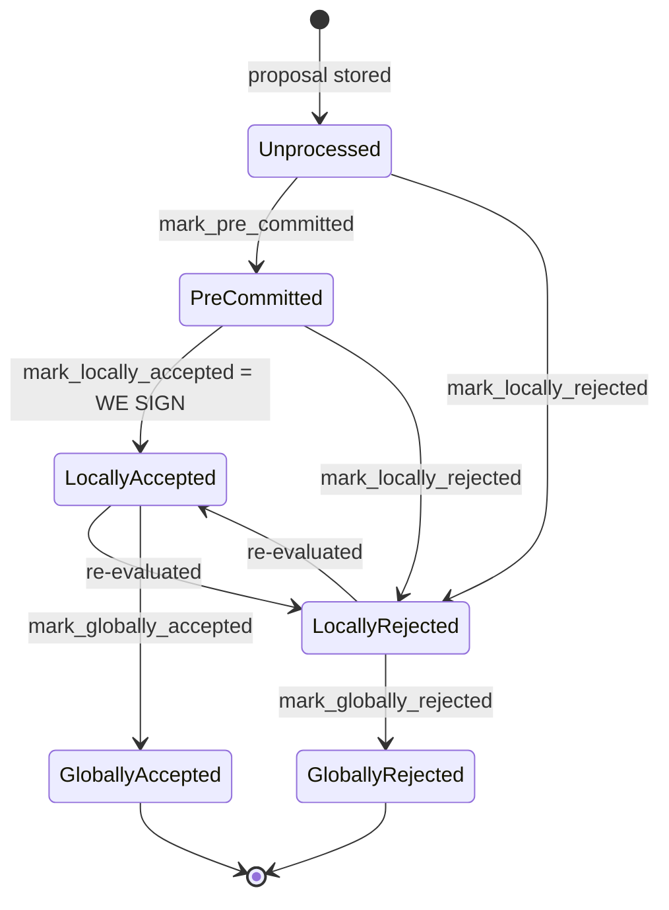
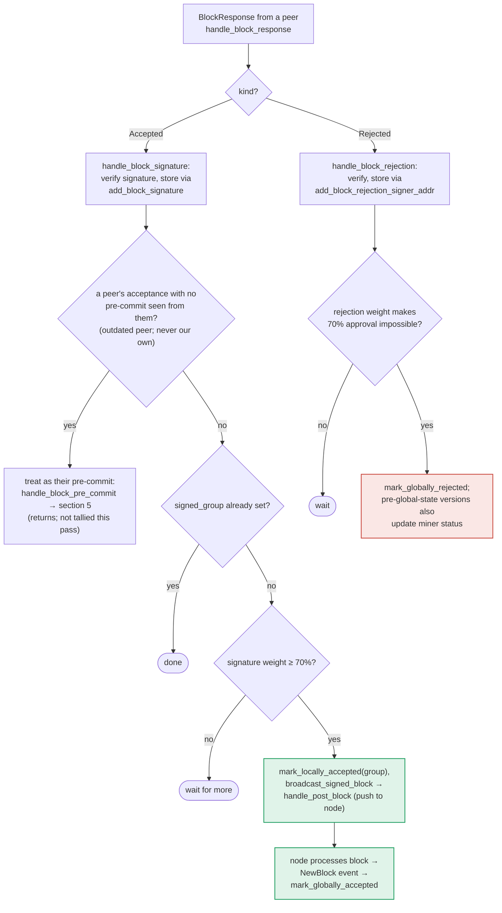

### Title
Peer-signature aggregation broadcasts a block without re-validating it against local chainstate/conflict state - (File: `stacks-signer/src/v0/signer.rs`, function `store_and_process_block_signature`)

### Summary
`store_and_process_block_signature` (the "Accepted" `BlockResponse` handling path) stores every incoming peer signature unconditionally and then decides to broadcast the aggregated signature set purely by comparing accumulated signature *weight* to the threshold. Unlike the signer's own decision to sign in `handle_block_pre_commit`, this path never re-runs `check_block_against_signer_db_state`, the conflict checks (`get_signed_conflicts`/`conflict_still_blocks`), or even the local `block_info.valid` flag before calling `mark_locally_accepted` and `broadcast_signed_block`. This is the analog of the `GameItems::safeBatchTransferFrom` bug: the "single" path (`handle_block_pre_commit`, section 5 of the flow docs) enforces validity/conflict checks before letting a signature count toward the threshold and before signing, but the alternate "batch" path that aggregates *other signers'* signatures skips those same checks entirely.

### Finding Description
`store_and_process_block_signature` at `stacks-signer/src/v0/signer.rs:2442-2539`: [1](#0-0) 

1. It stores the incoming peer signature unconditionally via `add_block_signature` — with no check of `block_info.valid`, no re-run of `check_block_against_signer_db_state`, and no conflict check.
2. Only if the sender has *never* pre-committed does it reroute into `handle_block_pre_commit`, which does enforce `block_info.valid`, the chainstate re-check, and the conflict guard, at `stacks-signer/src/v0/signer.rs:1250-1403` (e.g. the `valid` gate at lines 1323-1331, and the re-check at line 1345): [2](#0-1) [3](#0-2) 

3. But for every signature from a peer that *has already been counted as a pre-committer* (`has_committed == true` — a very common, normal case since a signer typically pre-commits before signing), the reroute is skipped and execution falls straight through to the weight tally: [4](#0-3) 

This tally step (`min_weight > total_signature_weight`) is the *only* gate before `mark_locally_accepted(true)` and `broadcast_signed_block`, at lines 2525-2538: [5](#0-4) 

Per the documented state machine, `LocallyRejected --> LocallyAccepted` is a legal, reachable transition ("re-evaluated"), meaning a block this signer previously rejected (invalid, or conflicting with a block it already signed) can still be pushed to its own node once enough raw peer signatures accumulate, because none of the checks that gate the *local* signing decision (`check_block_against_signer_db_state`, `get_signed_conflicts`/`conflict_still_blocks`, `block_info.valid`) are re-applied in the signature-aggregation path: [6](#0-5) 

The design intent, per the docs, explicitly frames this fallback as a weight-tallying shortcut, not a validity re-check: [7](#0-6) 

### Impact Explanation
This breaks the "signed vs validated" equality (Critical bucket): the signer ends up calling `broadcast_signed_block` → `handle_post_block` (pushing the block to its own node for processing) for a block whose validity/conflict/canonical-parent status was never confirmed by *this* signer through `check_block_against_signer_db_state` at the moment of the decision — it only confirmed that enough *other* signers had, at some point, produced a signature. If the block is stale, conflicting (a sibling at the same height that this signer separately signed), or was already locally rejected by this signer due to a chainstate re-check failure, this code path will still relay/push it once the raw signature weight crosses threshold, whereas the analogous own-decision path (`handle_block_pre_commit`) would refuse. This can force an invalid/non-canonical/conflicting block through a signer node that would otherwise never accept it, directly matching the "signer signing an invalid, non-canonical, or conflicting block" critical impact class.

### Likelihood Explanation
No majority compromise is required — only ordinary network conditions where a one-slot miner (or gossip delay) causes signers to receive pre-commits and then "Accepted" responses for a block whose local validity status has changed in the interim (e.g. this signer already signed a conflicting sibling, or independently marked the block `LocallyRejected` via `check_block_against_signer_db_state`). Because `has_committed` is true for essentially every honest signer that already pre-committed before signing, the reroute-to-`handle_block_pre_commit` path (which re-validates) is the exception, not the rule; the un-gated weight-tally path in `store_and_process_block_signature` is the common path taken for legitimate signature traffic, making the missing re-validation reachable under normal operation, not just a corner case.

### Recommendation
Before calling `mark_locally_accepted`/`broadcast_signed_block` in `store_and_process_block_signature`, re-run the same guard sequence used in `handle_block_pre_commit`: verify `block_info.valid == Some(true)`, re-run `check_block_against_signer_db_state`, and re-check `get_signed_conflicts`/`conflict_still_blocks` for the block before trusting the aggregated peer signature weight. Alternatively, refuse to advance a block out of `LocallyRejected` via this path at all, requiring it to go through the full pre-commit re-evaluation (as `should_reevaluate_block` does for re-proposals) rather than through raw signature-weight counting.

### Proof of Concept
1. Signer S receives and pre-commits to block A (tenure-start) and reaches its own accept threshold, signing A (`handle_block_pre_commit` → `mark_locally_accepted`).
2. A conflicting sibling block B at the same height (different tenure/miner) is proposed. S's own chainstate re-check (`check_block_against_signer_db_state`/conflict guard) would refuse to sign B, and any pre-commit for B that reaches S is rejected via the `handle_block_pre_commit` re-check at `signer.rs:1345-1366`.
3. Other signers, who processed B before A (e.g. due to network ordering) or before the conflict became visible to them, have already produced `Accepted` (signature) responses for B and pre-committed to B, satisfying `has_committed == true` for those addresses in S's DB.
4. S receives those signers' `Accepted` messages for B via `handle_block_response` → `handle_block_signature` → `store_and_process_block_signature`. Because `has_committed(block_hash, signer_address)` is already true for each sender, the reroute to `handle_block_pre_commit` (which would re-check chainstate/conflicts) is skipped every time.
5. Once the accumulated signature weight for B (from `get_block_signatures`) crosses `min_weight`, S calls `mark_locally_accepted(true)` and `broadcast_signed_block`/`handle_post_block` for B — pushing a block to its own node that its own conflict/chainstate logic would have refused to sign, without that logic ever being invoked in this code path.

### Citations

**File:** stacks-signer/src/v0/signer.rs (L1316-1331)
```rust
        if block_info.signed_self.is_some() {
            debug!(
                "{self}: Received pre-commit for a block that we have already signed. Doing nothing...",
            );
            return;
        }

        if !block_info.valid.unwrap_or(false) {
            // We received a pre-commit for a block that we have not validated or we have already marked this block as invalid.
            // We should not do anything further as we do not know what our response should be and we do not change our votes on rejected
            // blocks unless we receive a new block proposal for it and the reject reason allows us to reconsider.
            debug!(
                "{self}: Received a pre-commit for a block that we have not determined to be valid: {:?}. Doing nothing...", block_info.valid
            );
            return;
        }
```

**File:** stacks-signer/src/v0/signer.rs (L1345-1366)
```rust
        if let Some(block_rejection) =
            self.check_block_against_signer_db_state(stacks_client, &block_info.block)
        {
            warn!(
                "{self}: Reached the pre-commit threshold for a block, but it no longer passes the chainstate checks. Rejecting.";
                "signer_signature_hash" => %block_hash,
                "block_height" => block_info.block.header.chain_length,
                "reject_code" => %block_rejection.reason_code,
                "reject_reason" => &block_rejection.reason,
            );
            if let Err(e) = block_info.mark_locally_rejected() {
                if !block_info.has_reached_consensus() {
                    warn!("{self}: Failed to mark block as locally rejected: {e:?}");
                }
            };
            self.signer_db
                .insert_block(&block_info)
                .unwrap_or_else(|e| self.handle_insert_block_error(e));
            self.handle_block_rejection(&block_rejection, sortition_state);
            self.send_block_response(&block_info.block, block_rejection.into());
            return;
        }
```

**File:** stacks-signer/src/v0/signer.rs (L2452-2466)
```rust
        // signature is valid! store it.
        // if this returns false, it means the signature already exists in the DB, so just return.
        if !self
            .signer_db
            .add_block_signature(block_hash, signer_address, signature)
            .unwrap_or_else(|_| panic!("{self}: Failed to save block signature"))
        {
            return;
        }

        // If this isn't our own signature and we haven't seen a pre-commit from this signer yet, try treating it as a pre-commit in case the caller is running an outdated version
        if signer_address != &self.stacks_address && !self.signer_db.has_committed(block_hash, signer_address).inspect_err(|e| warn!("Failed to check if pre-commit message already considered for {signer_address:?} for {block_hash}: {e}")).unwrap_or(false) {
            self.handle_block_pre_commit(stacks_client, sortition_state, signer_address, block_hash);
            return;
        }
```

**File:** stacks-signer/src/v0/signer.rs (L2472-2522)
```rust
        // do we have enough signatures to broadcast?
        // i.e. is the threshold reached?
        let signatures = self
            .signer_db
            .get_block_signatures(block_hash)
            .unwrap_or_else(|_| panic!("{self}: Failed to load block signatures"));

        // put signatures in order by signer address (i.e. reward cycle order)
        let addrs_to_sigs: HashMap<_, _> = signatures
            .into_iter()
            .filter_map(|sig| {
                let Ok(public_key) = Secp256k1PublicKey::recover_to_pubkey_without_validating_low_s(
                    block_hash.bits(),
                    &sig,
                ) else {
                    return None;
                };
                let addr = StacksAddress::p2pkh(self.mainnet, &public_key);
                Some((addr, sig))
            })
            .collect();

        let signature_weight = self.signer_weights.get(signer_address).unwrap_or(&0);
        let total_signature_weight = self.compute_signature_signing_weight(addrs_to_sigs.keys());
        let total_weight = self.compute_signature_total_weight();

        let min_weight = NakamotoBlockHeader::compute_voting_weight_threshold(total_weight)
            .unwrap_or_else(|_| {
                panic!("{self}: Failed to compute threshold weight for {total_weight}")
            });

        if min_weight > total_signature_weight {
            info!("{self}: Received block acceptance, but have not yet reached the acceptance threshold.";
                "signer_signature_hash" => %block_hash,
                "signature_weight" => signature_weight,
                "consensus_hash" => %block_info.block.header.consensus_hash,
                "block_height" => block_info.block.header.chain_length,
                "total_weight_approved" => total_signature_weight,
                "total_weight" => total_weight,
                "percent_approved" => (total_signature_weight as f64 / total_weight as f64 * 100.0),
            );
            return;
        }
        info!("{self}: have reached the block acceptance threshold";
            "signer_signature_hash" => %block_hash,
            "signature_weight" => signature_weight,
            "consensus_hash" => %block_info.block.header.consensus_hash,
            "block_height" => block_info.block.header.chain_length,
            "total_weight_approved" => total_signature_weight,
            "total_weight" => total_weight,
            "percent_approved" => (total_signature_weight as f64 / total_weight as f64 * 100.0),
```

**File:** stacks-signer/src/v0/signer.rs (L2525-2538)
```rust
        // have enough signatures to broadcast!
        // move block to LOCALLY accepted state.
        // It is only considered globally accepted IFF we receive a new block event confirming it OR see the chain tip of the node advance to it.
        if let Err(e) = block_info.mark_locally_accepted(true) {
            if !block_info.has_reached_consensus() {
                warn!("{self}: Failed to mark block as locally accepted: {e:?}");
            }
        }
        let _ = self.signer_db.insert_block(block_info).map_err(|e| {
            warn!("Failed to set group threshold signature timestamp for {block_hash}: {e:?}");
            panic!("{self} Failed to write block to signerdb: {e}");
        });
        self.broadcast_signed_block(stacks_client, block_info.block.clone(), &addrs_to_sigs);
    }
```

**File:** docs/signer-flows.md (L130-150)
```markdown
## 2. Block lifecycle (`BlockState`)

Every proposal tracked in the signer DB carries a `BlockState`. **`PreCommitted`
carries no signature**: it means "validated, willing to sign if the pre-commit
threshold is met." The first signature appears at `mark_locally_accepted`.
Global states are terminal against each other.


```

**File:** docs/signer-flows.md (L357-387)
```markdown


The outdated-peer fallback keeps mixed-version fleets live: an acceptance from a
peer that never sent a pre-commit is routed into the pre-commit path instead, so
that peer's weight still counts toward the threshold that produces _our_
signature. Note that reaching 70% signatures still only marks the block
_locally_ accepted with the group timestamp; global acceptance waits for the node
to adopt it. Marking the miner invalid on a 30% `ReorgNotAllowed` rejection is
skipped once the active protocol version uses global signer state.

> Anchors: `handle_block_response`, `handle_block_signature`,
> `store_and_process_block_signature`, `broadcast_signed_block`,
> `handle_block_rejection`, `store_and_process_block_rejection` (signer.rs)
```
