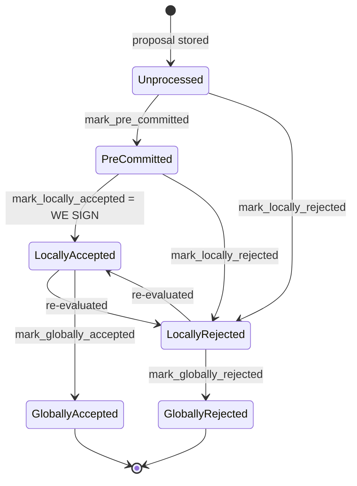

### Title
Reward-cycle signer cleanup can discard a `PreCommitted` block, permanently wedging the signer before it can ever sign - (File: `stacks-signer/src/runloop.rs`)

### Summary
`RunLoop::cleanup_stale_signers` decides whether it is safe to drop a stale reward-cycle's `Signer` instance by calling `has_unprocessed_blocks()`, which in turn only checks for blocks in the `Unprocessed` `BlockState`. A block that has already been validated and moved to `PreCommitted` — i.e. the signer has broadcast "I am willing to sign" but the 70% pre-commit threshold has not yet been reached — is **not** counted as "unprocessed," so the signer instance can be deleted while that block is still mid-flight, exactly as the Nouns DAO report describes `forkEscrow` being swapped out from under escrowed tokens that are mid-withdrawal.

### Finding Description
The block lifecycle documented in `docs/signer-flows.md` (and enforced by `BlockInfo::check_state`) is:
`Unprocessed → PreCommitted → LocallyAccepted/LocallyRejected → GloballyAccepted/GloballyRejected` [1](#0-0) 

`PreCommitted` is an explicit non-terminal, in-flight state: "carries no signature... validated, willing to sign if the pre-commit threshold is met." [2](#0-1) 

`SignerDb::has_unprocessed_blocks` is the sole gate used to decide if a stale-reward-cycle `Signer` still has work in flight, but it filters strictly on `state == Unprocessed`: [3](#0-2) 

`RunLoop::cleanup_stale_signers` calls exactly this check on any `Signer` whose `reward_cycle < current_reward_cycle`, and unconditionally deletes it from `self.stacks_signers` when the check returns `false`: [4](#0-3) 

`Signer::has_unprocessed_blocks` (the v0 trait implementation) simply forwards to that same DB query: [5](#0-4) 

Consequently, if a block reaches `PreCommitted` (validated, pre-commit broadcast, awaiting the ≥70% weight threshold from `handle_block_pre_commit`) right around a reward-cycle boundary, `has_unprocessed_blocks` returns `false` for that reward cycle even though the signer has an outstanding commitment. `refresh_runloop` — triggered by ordinary burn-block progression, requiring no majority or privileged action, just the normal passage of a miner's tenure across the cycle boundary — then calls `cleanup_stale_signers(current_reward_cycle)` and removes the `ConfiguredSigner::RegisteredSigner` entry for the old cycle entirely: [6](#0-5) 

Once removed, that `Signer` instance is gone from `self.stacks_signers`; no further `SignerMessage::BlockPreCommit` or `BlockResponse` traffic for that reward cycle is ever routed to it (`process_event` is simply never invoked for a deleted signer). The block that was `PreCommitted` can never advance to `LocallyAccepted`/signature or be resolved to `LocallyRejected`; the promise it made ("willing to sign if threshold met") is abandoned mid-flight, just as `withdrawFromForkEscrow` in the referenced report becomes permanently unusable once `ds.forkEscrow` is swapped by the DAO while tokens are still escrowed.

### Impact Explanation
This is a signer being "wedged into never signing valid blocks" for the affected proposal: a signer that had already pre-committed to a valid block loses the ability to complete that commitment (sign, reject, or otherwise resolve it) once its reward-cycle-scoped state is torn down. Because cleanup is driven purely by burn-block height and runs independently on every signer node near the same boundary, multiple/most cycle-N signers can be pruned in the same window, which can prevent a block that was close to the pre-commit threshold from ever collecting enough weight to be signed — stalling the tenure at exactly the reward-cycle rollover.

### Likelihood Explanation
No majority collusion, foreign key access, or privileged action is required — only ordinary tenure/reward-cycle progression (which any single miner's tenure naturally advances) coinciding with a block still sitting in `PreCommitted` when the local burn view crosses into the next reward cycle. The narrow timing window (a proposal must be validated and pre-committed but not yet at 70% right at the cycle boundary) makes this an edge-case rather than a per-block occurrence, but it is a normal-operation trigger, not an adversarial/majority scenario.

### Recommendation
Broaden the "has work outstanding" check used by `cleanup_stale_signers` (and `Signer::has_unprocessed_blocks`) to also cover blocks in `BlockState::PreCommitted` (and any queued `pending_block_validation` entries) for the reward cycle, not just `Unprocessed`. Only delete a stale-cycle `Signer` once all of its tracked blocks have reached a terminal (`LocallyRejected`/`GloballyAccepted`/`GloballyRejected`) or otherwise fully resolved state.

### Proof of Concept
1. Let a miner propose block `B` for reward cycle `N` near the very end of cycle `N`.
2. The signer validates `B`, transitions it to `PreCommitted` via `mark_pre_committed`, and broadcasts its pre-commit, but network-wide pre-commit weight has not yet reached 70% (e.g., because other signers are slow or briefly partitioned).
3. The burn chain advances one more block, crossing into reward cycle `N+1`; `refresh_runloop` computes `current_reward_cycle = N+1` and calls `cleanup_stale_signers(N+1)`.
4. For the `ConfiguredSigner::RegisteredSigner` at cycle `N`, `has_unprocessed_blocks()` queries `SignerDb` for `state == Unprocessed` and finds none (since `B` is `PreCommitted`), so it is added to `to_delete` and removed from `self.stacks_signers`.
5. Any subsequent `BlockPreCommit`/`BlockResponse` StackerDB messages for cycle `N` are no longer processed by this node for that cycle; `B` can never reach `LocallyAccepted` (signature) or `LocallyRejected` on this node, permanently stranding its earlier pre-commit — mirroring the escrowed-Nouns-left-stranded pattern from the reference report.

### Citations

**File:** docs/signer-flows.md (L132-134)
```markdown
Every proposal tracked in the signer DB carries a `BlockState`. **`PreCommitted`
carries no signature**: it means "validated, willing to sign if the pre-commit
threshold is met." The first signature appears at `mark_locally_accepted`.
```

**File:** docs/signer-flows.md (L137-150)
```markdown

```

**File:** stacks-signer/src/signerdb.rs (L1855-1868)
```rust
    /// Determine if there are any unprocessed blocks
    pub fn has_unprocessed_blocks(&self, reward_cycle: u64) -> Result<bool, DBError> {
        let query = "SELECT block_info FROM blocks WHERE reward_cycle = ?1 AND state = ?2 LIMIT 1";
        let result: Option<String> = query_row(
            &self.db,
            query,
            params!(
                &u64_to_sql(reward_cycle)?,
                &BlockState::Unprocessed.to_string()
            ),
        )?;

        Ok(result.is_some())
    }
```

**File:** stacks-signer/src/runloop.rs (L387-448)
```rust
    fn refresh_runloop(&mut self, ev_burn_block_height: u64) -> Result<(), ClientError> {
        let current_burn_block_height = std::cmp::max(
            self.stacks_client.get_peer_info()?.burn_block_height,
            ev_burn_block_height,
        );
        let reward_cycle_info = self
            .current_reward_cycle_info
            .as_mut()
            .expect("FATAL: cannot be an initialized signer with no reward cycle info.");
        let current_reward_cycle = reward_cycle_info.reward_cycle;
        let block_reward_cycle = reward_cycle_info.get_reward_cycle(current_burn_block_height);

        // First ensure we refresh our view of the current reward cycle information
        if block_reward_cycle != current_reward_cycle {
            let new_reward_cycle_info = RewardCycleInfo {
                reward_cycle: block_reward_cycle,
                reward_cycle_length: reward_cycle_info.reward_cycle_length,
                prepare_phase_block_length: reward_cycle_info.prepare_phase_block_length,
                first_burnchain_block_height: reward_cycle_info.first_burnchain_block_height,
                last_burnchain_block_height: current_burn_block_height,
            };
            *reward_cycle_info = new_reward_cycle_info;
        }
        let reward_cycle_before_refresh = current_reward_cycle;
        let current_reward_cycle = reward_cycle_info.reward_cycle;
        let is_in_next_prepare_phase =
            reward_cycle_info.is_in_next_prepare_phase(current_burn_block_height);
        let next_reward_cycle = current_reward_cycle.saturating_add(1);

        info!(
            "Refreshing runloop with new burn block event";
            "latest_node_burn_ht" => current_burn_block_height,
            "event_ht" =>  ev_burn_block_height,
            "reward_cycle_before_refresh" => reward_cycle_before_refresh,
            "current_reward_cycle" => current_reward_cycle,
            "configured_for_current" => Self::is_configured_for_cycle(&self.stacks_signers, current_reward_cycle),
            "registered_for_current" => Self::is_registered_for_cycle(&self.stacks_signers, current_reward_cycle),
            "configured_for_next" => Self::is_configured_for_cycle(&self.stacks_signers, next_reward_cycle),
            "registered_for_next" => Self::is_registered_for_cycle(&self.stacks_signers, next_reward_cycle),
            "is_in_next_prepare_phase" => is_in_next_prepare_phase,
        );

        // Check if we need to refresh the signers:
        //   need to refresh the current signer if we are not configured for the current reward cycle
        //   need to refresh the next signer if we're not configured for the next reward cycle, and we're in the prepare phase
        if !Self::is_configured_for_cycle(&self.stacks_signers, current_reward_cycle) {
            self.refresh_signer_config(current_reward_cycle);
        }
        if is_in_next_prepare_phase
            && !Self::is_configured_for_cycle(&self.stacks_signers, next_reward_cycle)
        {
            self.refresh_signer_config(next_reward_cycle);
        }

        self.cleanup_stale_signers(current_reward_cycle);
        if self.stacks_signers.is_empty() {
            self.state = State::NoRegisteredSigners;
        } else {
            self.state = State::RegisteredSigners;
        }
        Ok(())
    }
```

**File:** stacks-signer/src/runloop.rs (L471-500)
```rust
    fn cleanup_stale_signers(&mut self, current_reward_cycle: u64) {
        #[cfg(any(test, feature = "testing"))]
        if TEST_SKIP_SIGNER_CLEANUP.get() {
            warn!("Skipping signer cleanup due to testing directive.");
            return;
        }
        let mut to_delete = Vec::new();
        for (idx, signer) in &mut self.stacks_signers {
            let reward_cycle = signer.reward_cycle();
            if reward_cycle >= current_reward_cycle {
                // We are either the current or a future reward cycle, so we are not stale.
                continue;
            }
            match signer {
                ConfiguredSigner::RegisteredSigner(signer) => {
                    if !signer.has_unprocessed_blocks() {
                        debug!("{signer}: Signer's tenure has completed.");
                        to_delete.push(*idx);
                    }
                }
                ConfiguredSigner::NotRegistered { .. } => {
                    debug!("{signer}: Unregistered signer's tenure has completed.");
                    to_delete.push(*idx);
                }
            }
        }
        for idx in to_delete {
            self.stacks_signers.remove(&idx);
        }
    }
```

**File:** stacks-signer/src/v0/signer.rs (L418-426)
```rust
    fn has_unprocessed_blocks(&self) -> bool {
        self.signer_db
            .has_unprocessed_blocks(self.reward_cycle)
            .unwrap_or_else(|e| {
                error!("{self}: Failed to check for pending blocks: {e:?}",);
                // Assume we have pending blocks to prevent premature cleanup
                true
            })
    }
```
