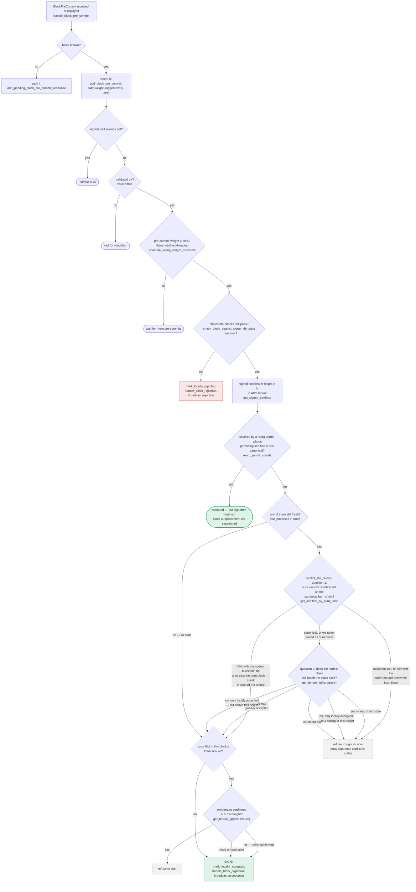

### Title
Missing chainstate re-check before broadcasting a fully-signed block lets a signer push a block it already knows is stale/conflicting - (File: stacks-signer/src/v0/signer.rs)

### Summary
The external report's bug class is that a fee/threshold gate is evaluated against shared mutable state that other participants can move between when a decision is requested and when it is actually executed, so the executed outcome silently diverges from what was checked. `stacks-signer` has the analogous shared mutable state: the local signer-DB view of which blocks have been signed/accepted (used by `check_block_against_signer_db_state` and `get_signed_conflicts`). This state changes continuously as proposals, pre-commits, and signatures arrive. The signer code deliberately re-checks this state at every point where it is about to *produce its own signature or pre-commit* — but the one remaining gate, the point where an already-gathered set of peer signatures crosses the 70% weight threshold and the fully-signed block is actually pushed to the stacks-node, has no such re-check.

### Finding Description
Two of the three places that move a block toward being signed explicitly re-run `check_block_against_signer_db_state` immediately before acting, precisely because the state can have changed in the interim:

- `handle_block_validate_ok` re-checks before marking the block pre-committed: [1](#0-0) 
- `handle_block_pre_commit` re-checks (and additionally re-derives cross-tenure signed conflicts via `get_signed_conflicts`/`reorg_permit_stands`/`conflict_still_blocks`) immediately before it will self-sign, with the comment explicitly stating why: "the chain and signer db state may have changed materially since this block passed the proposal-time checks... Re-run the chainstate checks before putting a signature over the block": [2](#0-1) 

However, `store_and_process_block_signature` — the function that tallies `BlockAccepted` signatures from peers (and the signer's own, funneled through the same path via `handle_block_signature`) and, once total weight crosses the same 70% threshold, immediately calls `broadcast_signed_block` to post the block to the stacks-node — contains no equivalent call to `check_block_against_signer_db_state` or `get_signed_conflicts`: [3](#0-2) 

The broadcast is unconditional once the weight tally clears the threshold: [4](#0-3) 

Concretely: the local signer can pre-commit and self-sign block B under a chainstate view where B has no known conflicts (the check in `handle_block_pre_commit` passed at that time). Before enough peer `BlockAccepted` messages arrive to cross the 70% *signature* threshold, this same signer's local `signer_db` state can change — e.g., it independently pre-commits/signs a different, conflicting block A at the same height (a legitimate scenario the whole conflict-guard machinery in section 5 of `docs/signer-flows.md` exists to police: [5](#0-4) ). When the delayed peer signatures for B then arrive and `store_and_process_block_signature` crosses the threshold, it broadcasts B to the node with no re-verification — even though `check_block_against_signer_db_state` run at that instant would reject it, exactly as it does in the pre-commit and validate-ok paths.

This breaks the invariant the codebase otherwise enforces everywhere else: "a signature must not be superseded while it's still fresh" / conflicting signed blocks must be actively screened right up to the moment of action. Here the final action — handing a fully-signed, conflicting block to the node — skips that screen entirely.

### Impact Explanation
This undermines the equivocation/reorg guard that the rest of `signer.rs` (and `docs/signer-flows.md` section 5) treats as consensus-relevant: a signer can end up actively pushing to its node a block that its own current local state considers stale or conflicting with another block it has already signed. Because this happens at the one funnel that actually delivers a signed block to the network (`handle_post_block`), it can contribute to two conflicting, independently 70%-signed blocks being pushed toward node acceptance — the exact "conflicting block" scenario the rest of the file works hard to prevent for the signing step, but not for the broadcast step. This maps to the "signer contributing to / relaying a non-canonical or conflicting block" impact category.

### Likelihood Explanation
This does not require a majority of colluding signers to attack the system — it fires on the *normal* completion path (crossing the honestly-accumulated 70% weight) and only requires ordinary network/timing skew: peer signatures for an earlier-proposed block arriving after this signer's local view has already moved on to a conflicting block. Given asynchronous StackerDB gossip and the multi-second windows already discussed in `docs/signer-flows.md` around pre-commit/signature timing, this is a realistic, miner/timing-triggerable race rather than a theoretical one.

### Recommendation
Call `check_block_against_signer_db_state` (and the same `get_signed_conflicts`/`reorg_permit_stands`/`conflict_still_blocks` logic used in `handle_block_pre_commit`) inside `store_and_process_block_signature` immediately before `broadcast_signed_block`, mirroring the existing re-check pattern, and respond with a rejection instead of broadcasting if the block no longer passes.

### Proof of Concept
1. Signer S receives proposal B (tenure T2, height H); `check_block_against_signer_db_state` passes; S pre-commits, then self-signs B via `handle_block_pre_commit`'s SIGN branch [6](#0-5) . Not yet at the 70%-signature threshold.
2. Before more peer signatures for B arrive, S independently processes a competing proposal A at the same height H (different tenure), which now passes S's own checks and S signs A, recording it in `signer_db` as a signed conflict for height H.
3. Delayed `BlockAccepted` messages for B from other peers now arrive and are processed by `handle_block_signature` → `store_and_process_block_signature` [7](#0-6) .
4. Total signature weight for B crosses `min_weight`; S immediately calls `broadcast_signed_block`/`handle_post_block` for B [4](#0-3)  — with no call to `check_block_against_signer_db_state`, even though S itself now holds a fresher signed conflict (A) at the same height that would fail that check if it were run, as it is for the pre-commit/self-sign path.

### Citations

**File:** stacks-signer/src/v0/signer.rs (L1340-1366)
```rust
        // The chain and signer db state may have changed materially since this block passed the
        // proposal-time checks (e.g. between validation and reaching the pre-commit threshold we
        // may have signed a block that this one would reorg). Re-run the chainstate checks
        // before putting a signature over the block, and respond with a rejection if they no
        // longer pass, just as the block validation response handler does.
        if let Some(block_rejection) =
            self.check_block_against_signer_db_state(stacks_client, &block_info.block)
        {
            warn!(
                "{self}: Reached the pre-commit threshold for a block, but it no longer passes the chainstate checks. Rejecting.";
                "signer_signature_hash" => %block_hash,
                "block_height" => block_info.block.header.chain_length,
                "reject_code" => %block_rejection.reason_code,
                "reject_reason" => &block_rejection.reason,
            );
            if let Err(e) = block_info.mark_locally_rejected() {
                if !block_info.has_reached_consensus() {
                    warn!("{self}: Failed to mark block as locally rejected: {e:?}");
                }
            };
            self.signer_db
                .insert_block(&block_info)
                .unwrap_or_else(|e| self.handle_insert_block_error(e));
            self.handle_block_rejection(&block_rejection, sortition_state);
            self.send_block_response(&block_info.block, block_rejection.into());
            return;
        }
```

**File:** stacks-signer/src/v0/signer.rs (L1466-1478)
```rust
        // It is only considered globally accepted IFF we receive a new block event confirming it OR see the chain tip of the node advance to it.
        if let Err(e) = block_info.mark_locally_accepted(false) {
            if !block_info.has_reached_consensus() {
                warn!("{self}: Failed to mark block as locally accepted: {e:?}",);
            }
        }
        self.signer_db
            .insert_block(&block_info)
            .unwrap_or_else(|e| self.handle_insert_block_error(e));
        let accepted = self.create_block_acceptance(&block_info.block);
        // have to save the signature _after_ the block info
        self.handle_block_signature(stacks_client, sortition_state, &accepted);
        self.send_block_response(&block_info.block, accepted.into());
```

**File:** stacks-signer/src/v0/signer.rs (L1946-1960)
```rust
        if let Some(block_rejection) =
            self.check_block_against_signer_db_state(stacks_client, &block_info.block)
        {
            // The signer db state has changed. We no longer view this block as valid. Override the validation response.
            if let Err(e) = block_info.mark_locally_rejected() {
                if !block_info.has_reached_consensus() {
                    warn!("{self}: Failed to mark block as locally rejected: {e:?}");
                }
            };
            self.signer_db
                .insert_block(&block_info)
                .unwrap_or_else(|e| self.handle_insert_block_error(e));
            self.handle_block_rejection(&block_rejection, sortition_state);
            self.send_block_response(&block_info.block, block_rejection.into());
        } else {
```

**File:** stacks-signer/src/v0/signer.rs (L2443-2538)
```rust
    fn store_and_process_block_signature(
        &mut self,
        stacks_client: &StacksClient,
        sortition_state: &mut Option<SortitionsView>,
        block_info: &mut BlockInfo,
        signer_address: &StacksAddress,
        signature: &MessageSignature,
    ) {
        let block_hash = &block_info.signer_signature_hash();
        // signature is valid! store it.
        // if this returns false, it means the signature already exists in the DB, so just return.
        if !self
            .signer_db
            .add_block_signature(block_hash, signer_address, signature)
            .unwrap_or_else(|_| panic!("{self}: Failed to save block signature"))
        {
            return;
        }

        // If this isn't our own signature and we haven't seen a pre-commit from this signer yet, try treating it as a pre-commit in case the caller is running an outdated version
        if signer_address != &self.stacks_address && !self.signer_db.has_committed(block_hash, signer_address).inspect_err(|e| warn!("Failed to check if pre-commit message already considered for {signer_address:?} for {block_hash}: {e}")).unwrap_or(false) {
            self.handle_block_pre_commit(stacks_client, sortition_state, signer_address, block_hash);
            return;
        }

        if block_info.signed_group.is_some() {
            // We have already processed this block to the accepted state. Adding more signatures will not change anything so nothing to check.
            return;
        }
        // do we have enough signatures to broadcast?
        // i.e. is the threshold reached?
        let signatures = self
            .signer_db
            .get_block_signatures(block_hash)
            .unwrap_or_else(|_| panic!("{self}: Failed to load block signatures"));

        // put signatures in order by signer address (i.e. reward cycle order)
        let addrs_to_sigs: HashMap<_, _> = signatures
            .into_iter()
            .filter_map(|sig| {
                let Ok(public_key) = Secp256k1PublicKey::recover_to_pubkey_without_validating_low_s(
                    block_hash.bits(),
                    &sig,
                ) else {
                    return None;
                };
                let addr = StacksAddress::p2pkh(self.mainnet, &public_key);
                Some((addr, sig))
            })
            .collect();

        let signature_weight = self.signer_weights.get(signer_address).unwrap_or(&0);
        let total_signature_weight = self.compute_signature_signing_weight(addrs_to_sigs.keys());
        let total_weight = self.compute_signature_total_weight();

        let min_weight = NakamotoBlockHeader::compute_voting_weight_threshold(total_weight)
            .unwrap_or_else(|_| {
                panic!("{self}: Failed to compute threshold weight for {total_weight}")
            });

        if min_weight > total_signature_weight {
            info!("{self}: Received block acceptance, but have not yet reached the acceptance threshold.";
                "signer_signature_hash" => %block_hash,
                "signature_weight" => signature_weight,
                "consensus_hash" => %block_info.block.header.consensus_hash,
                "block_height" => block_info.block.header.chain_length,
                "total_weight_approved" => total_signature_weight,
                "total_weight" => total_weight,
                "percent_approved" => (total_signature_weight as f64 / total_weight as f64 * 100.0),
            );
            return;
        }
        info!("{self}: have reached the block acceptance threshold";
            "signer_signature_hash" => %block_hash,
            "signature_weight" => signature_weight,
            "consensus_hash" => %block_info.block.header.consensus_hash,
            "block_height" => block_info.block.header.chain_length,
            "total_weight_approved" => total_signature_weight,
            "total_weight" => total_weight,
            "percent_approved" => (total_signature_weight as f64 / total_weight as f64 * 100.0),
        );

        // have enough signatures to broadcast!
        // move block to LOCALLY accepted state.
        // It is only considered globally accepted IFF we receive a new block event confirming it OR see the chain tip of the node advance to it.
        if let Err(e) = block_info.mark_locally_accepted(true) {
            if !block_info.has_reached_consensus() {
                warn!("{self}: Failed to mark block as locally accepted: {e:?}");
            }
        }
        let _ = self.signer_db.insert_block(block_info).map_err(|e| {
            warn!("Failed to set group threshold signature timestamp for {block_hash}: {e:?}");
            panic!("{self} Failed to write block to signerdb: {e}");
        });
        self.broadcast_signed_block(stacks_client, block_info.block.clone(), &addrs_to_sigs);
    }
```

**File:** docs/signer-flows.md (L229-272)
```markdown
## 5. Pre-commit threshold → signature

The only place the signer produces a block signature by counting votes.
Pre-commits from peers (and our own) accumulate; at ≥70% weight the signer
decides whether to follow through. Between validation and threshold, we may have
signed a _different_ block at the same height, possibly in another tenure, so
the world must be re-checked before the signature leaves the box.


```
