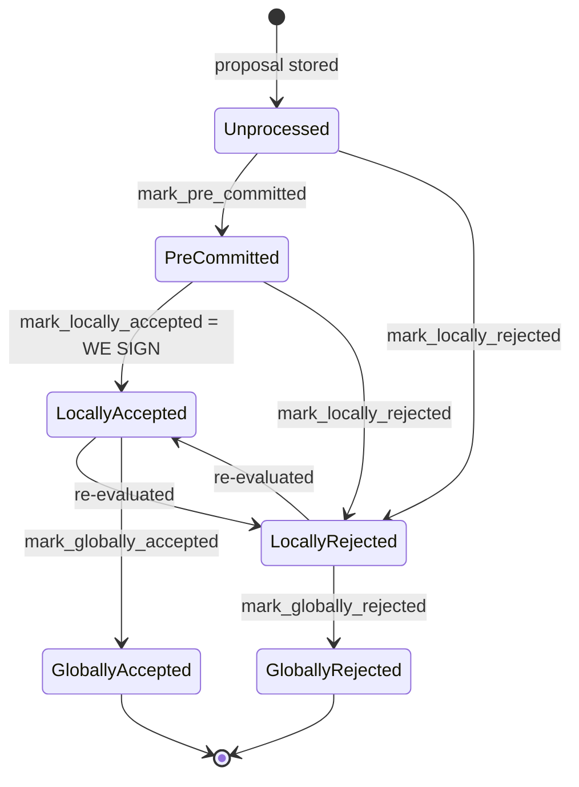

Based on the analysis, this is the strongest reachable analog to the external report's bug class in this repo.

### Title
Miner-controlled tenure-extend `check_proposal` gate is evaluated once at proposal time but never re-checked at pre-commit-threshold signing, letting a signer sign a now-invalid tenure-extend block - (File: stacks-signer/src/chainstate/v1.rs, stacks-signer/src/chainstate/v2.rs)

### Summary
The external report's root cause is a privileged actor (`onlyOwner`) being able to change a parameter (`auctionDecrement`/`auctionMultiplier`) in between the moment a user commits (bonds) and the moment the commitment is settled (`settleAuction()`), because only the commit path re-reads the parameter, and the settle path trusts stale state. The direct analog here is the miner (a one-slot actor who fully controls block contents and proposal timing) supplying a tenure-extend `TenureChangePayload` whose legality (`InvalidTenureExtend` gate on `changed_burn_view` / `enough_time_passed`) is evaluated once, at proposal arrival inside `check_proposal`, but is never re-evaluated at the two later checkpoints (`handle_block_validate_ok`'s `check_block_against_signer_db_state`, and the pre-commit-threshold `RECHECK` in `handle_block_pre_commit`) before the signer actually signs.

### Finding Description
`GlobalStateView::check_proposal` (v2) and `SortitionsView::check_proposal` (v1) are the only call sites that evaluate the tenure-extend legality rules: whether the burn view changed, whether enough idle time has passed, or whether a replay is in progress [1](#0-0) , mirrored in v1 at [2](#0-1) . This full check runs from `handle_block_proposal` → `check_block_against_state` (v1) / `check_block_against_global_state` (v2), i.e. only when the proposal first arrives [3](#0-2) .

After the node returns `Ok` for validation, the signer re-checks only a narrower function, `check_block_against_signer_db_state`, which covers tenure-change parent confirmation and "latest block in tenure," but does **not** re-run the tenure-extend burn-view/timing gate [4](#0-3) . The same narrower recheck (`check_block_against_signer_db_state`) is invoked again once the pre-commit weight crosses the 70% threshold, immediately before the signature is produced [5](#0-4) . The project's own documentation confirms this asymmetry explicitly: "the v2 `check_proposal` wrapper checks miner pubkey hash, consensus hash, the pox bitvec, and tenure-extend rules **before** delegating here" and lists this as one of "Two things [that] belong to the proposal path only and are **not** re-run at validate-ok or at signing" [6](#0-5) .

This mirrors the external report's equality break: the "commit-time" check (auction bond / here, block proposal arrival) and the "settle-time" check (`settleAuction()` / here, the final pre-commit-threshold signature) are evaluated against different, non-synchronized state, and only the commit-time check enforces the sensitive rule. Between proposal arrival and reaching the 70% pre-commit weight — which the pre-commit round is explicitly designed to make take real wall-clock time while gossip propagates ("First each signer says only 'I am willing to sign this'... time passes, the burn chain can fork") [7](#0-6)  — a new sortition/burn block can land, invalidating the `burn_view_consensus_hash` or idle-timeout window the tenure-extend proposal originally satisfied, yet no later checkpoint re-verifies it.

### Impact Explanation
This meets the Critical bar of "a signer signing an invalid, non-canonical, or conflicting block": a signer can end up placing its signature over a tenure-extend block whose extend conditions (burn-view freshness / idle-timeout eligibility) were only true at proposal time and are stale/false by the time 70% pre-commit weight is reached and the signature is actually produced. Because `check_block_against_signer_db_state` is the sole gate re-run at both the validate-ok and pre-commit-threshold checkpoints, and it structurally does not include the tenure-extend legality logic, this is not a hypothetical omission but a documented, intentional narrowing of the re-check surface.

### Likelihood Explanation
The trigger requires only a single miner (the party who already controls block proposal contents and timing for its own slot) plus normal StackerDB gossip delay for pre-commits to accumulate to 70% — no majority of signers, no other signer's key, and no auth token are needed. The pre-commit round is explicitly designed to introduce a real time gap between "willing to sign" and "actually sign" [7](#0-6) , which is exactly the window in which a sortition can land and flip `changed_burn_view`/`enough_time_passed` from true to false without triggering any re-validation.

### Recommendation
Re-run the full tenure-extend legality check (`check_proposal`'s burn-view/timing/replay gate) at both `check_block_against_signer_db_state` checkpoints — i.e. at `handle_block_validate_ok`'s recheck and at the pre-commit-threshold `RECHECK` in `handle_block_pre_commit` — not just at initial proposal arrival, so the conditions that justified accepting a tenure-extend are still true at the moment the signature is actually produced.

### Proof of Concept
1. Miner proposes a tenure-extend block whose `TenureChangePayload.burn_view_consensus_hash` matches the tenure tip's current burn view, and whose idle-timeout condition (`enough_time_passed`) is satisfied at the instant of proposal — `check_proposal` accepts it [8](#0-7) .
2. Signers validate it with the node (`Ok`) and broadcast pre-commits; per the state machine, this only stamps `PreCommitted`/`approved_time`, no signature yet [9](#0-8) .
3. While pre-commits are still accumulating toward the 70% threshold, a new sortition/burn block lands, which would now make `changed_burn_view` false and/or push `enough_time_passed` outside its valid window if evaluated fresh.
4. Once weight crosses 70%, `handle_block_pre_commit`'s `RECHECK` calls only `check_block_against_signer_db_state` [5](#0-4) , which does not re-run the tenure-extend gate, so the signer proceeds to `SIGN` over a block whose tenure-extend legality is now stale/violated.

### Citations

**File:** stacks-signer/src/chainstate/v2.rs (L199-249)
```rust
        // is there an unsupported tenure extend type?
        if let Some(tenure_extend) = block.get_tenure_extend_tx_payload().filter(|extend| {
            !(extend.cause.is_full_extend() || extend.cause.is_read_count_extend())
        }) {
            warn!(
                "Miner block proposal contains a tenure extend with an unsupported cause";
                "tenure_extend_cause" => %tenure_extend.cause,
            );
            return Err(RejectReason::InvalidTenureExtend);
        }

        // is there a full tenure extend in this block?
        if let Some(tenure_extend) = block
            .get_tenure_extend_tx_payload()
            .filter(|extend| extend.cause.is_full_extend())
        {
            // in full tenure extends, we need to check:
            // (1) if this is the most recent sortition, an extend is allowed if it changes the burnchain view
            // (2) if this is the most recent sortition, an extend is allowed if enough time has passed to refresh the block limit
            // (3) if we are in replay, an extend is allowed
            let tenure_tip = client.get_tenure_tip(tenure_id)
                .map_err(|e| {
                    warn!("Could not load current tenure tip while evaluating a tenure-extend; cannot approve."; "err" => %e);
                    RejectReason::InvalidTenureExtend
                })?;
            let Some(current_burn_view) = tenure_tip.burn_view else {
                warn!("Tenure-extend attempted in tenure without burn-view.");
                return Err(RejectReason::InvalidTenureExtend);
            };
            let changed_burn_view = tenure_extend.burn_view_consensus_hash != current_burn_view;
            let extend_timestamp = signer_db.calculate_full_extend_timestamp(
                self.config.tenure_idle_timeout,
                block,
                false,
            );
            let epoch_time = get_epoch_time_secs();
            let enough_time_passed = epoch_time >= extend_timestamp;
            let is_in_replay = self.signer_state.tx_replay_set.is_some();
            if !changed_burn_view && !enough_time_passed && !is_in_replay {
                warn!(
                    "Miner block proposal contains a tenure extend, but the conditions for allowing a tenure extend are not met. Considering proposal invalid.";
                    "proposed_block_consensus_hash" => %block.header.consensus_hash,
                    "signer_signature_hash" => %block.header.signer_signature_hash(),
                    "extend_timestamp" => extend_timestamp,
                    "epoch_time" => epoch_time,
                    "is_in_replay" => is_in_replay,
                    "changed_burn_view" => changed_burn_view,
                    "enough_time_passed" => enough_time_passed,
                );
                return Err(RejectReason::InvalidTenureExtend);
            }
```

**File:** stacks-signer/src/chainstate/v1.rs (L352-403)
```rust
        // is there a full tenure extend in this block?
        if let Some(tenure_extend) = block
            .get_tenure_extend_tx_payload()
            .filter(|extend| extend.cause.is_full_extend())
        {
            // in full tenure extends, we need to check:
            // (1) if this is the most recent sortition, an extend is allowed if it changes the burnchain view
            // (2) if this is the most recent sortition, an extend is allowed if enough time has passed to refresh the block limit
            let sortition_consensus_hash = &proposed_by.state().data.consensus_hash;
            let tenure_tip = client.get_tenure_tip(sortition_consensus_hash)
                .map_err(|e| {
                    warn!("Could not load current tenure tip while evaluating a tenure-extend; cannot approve."; "err" => %e);
                    RejectReason::InvalidTenureExtend
                })?;
            let Some(current_burn_view) = tenure_tip.burn_view else {
                warn!("Tenure-extend attempted in tenure without burn-view.");
                return Err(RejectReason::InvalidTenureExtend);
            };
            let changed_burn_view = tenure_extend.burn_view_consensus_hash != current_burn_view;
            let extend_timestamp = signer_db.calculate_full_extend_timestamp(
                self.config.tenure_idle_timeout,
                block,
                false,
            );
            let epoch_time = get_epoch_time_secs();
            let enough_time_passed = epoch_time >= extend_timestamp;
            let is_in_replay = replay_set.is_some();
            if !changed_burn_view && !enough_time_passed && !is_in_replay {
                warn!(
                    "Miner block proposal contains a tenure extend, but the conditions for allowing a tenure extend are not met. Considering proposal invalid.";
                    "proposed_block_consensus_hash" => %block.header.consensus_hash,
                    "signer_signature_hash" => %block.header.signer_signature_hash(),
                    "extend_timestamp" => extend_timestamp,
                    "epoch_time" => epoch_time,
                    "is_in_replay" => is_in_replay,
                    "changed_burn_view" => changed_burn_view,
                    "enough_time_passed" => enough_time_passed,
                );
                return Err(RejectReason::InvalidTenureExtend);
            }

            warn!(
                "Miner block proposal contains a tenure extend, but the conditions for allowing a tenure extend are not met. Considering proposal invalid.";
                "proposed_block_consensus_hash" => %block.header.consensus_hash,
                "signer_signature_hash" => %block.header.signer_signature_hash(),
                "extend_timestamp" => extend_timestamp,
                "epoch_time" => epoch_time,
                "is_in_replay" => is_in_replay,
                "changed_burn_view" => changed_burn_view,
                "enough_time_passed" => enough_time_passed,
            );
        }
```

**File:** stacks-signer/src/v0/signer.rs (L944-998)
```rust
    fn check_block_against_global_state(
        &mut self,
        stacks_client: &StacksClient,
        block: &NakamotoBlock,
    ) -> Option<BlockRejection> {
        let signer_signature_hash = block.header.signer_signature_hash();
        let block_id = block.block_id();
        let Some(global_state) = self.global_state_evaluator.determine_global_state() else {
            warn!(
                "{self}: Cannot validate block, no global signer state";
                "signer_signature_hash" => %signer_signature_hash,
                "block_id" => %block_id,
                "local_signer_state" => ?self.local_state_machine
            );
            return Some(self.create_block_rejection(RejectReason::NoSignerConsensus, block));
        };

        let global_state_view = GlobalStateView {
            signer_state: global_state,
            config: self.proposal_config.clone(),
        };

        info!(
            "{self}: Evaluating proposal against global state";
            "signer_state" => ?global_state_view.signer_state,
            "signer_signature_hash" => %signer_signature_hash,
            "block_id" => %block_id,
            "local_signer_state" => ?self.local_state_machine,
        );

        // Check if proposal can be rejected now if not valid against the global state
        match global_state_view.check_proposal(stacks_client, &mut self.signer_db, block) {
            // Error validating block
            Err(RejectReason::ConnectivityIssues(e)) => {
                warn!(
                    "{self}: Error checking block proposal: {e}";
                    "signer_signature_hash" => %signer_signature_hash,
                    "block_id" => %block_id,
                );
                Some(self.create_block_rejection(RejectReason::ConnectivityIssues(e), block))
            }
            // Block proposal is bad
            Err(reject_code) => {
                warn!(
                    "{self}: Block proposal invalid";
                    "signer_signature_hash" => %signer_signature_hash,
                    "block_id" => %block_id,
                    "reject_reason" => %reject_code,
                    "reject_code" => ?reject_code,
                );
                Some(self.create_block_rejection(reject_code, block))
            }
            // Block proposal passed check, still don't know if valid
            Ok(_) => None,
        }
```

**File:** stacks-signer/src/v0/signer.rs (L1340-1351)
```rust
        // The chain and signer db state may have changed materially since this block passed the
        // proposal-time checks (e.g. between validation and reaching the pre-commit threshold we
        // may have signed a block that this one would reorg). Re-run the chainstate checks
        // before putting a signature over the block, and respond with a rejection if they no
        // longer pass, just as the block validation response handler does.
        if let Some(block_rejection) =
            self.check_block_against_signer_db_state(stacks_client, &block_info.block)
        {
            warn!(
                "{self}: Reached the pre-commit threshold for a block, but it no longer passes the chainstate checks. Rejecting.";
                "signer_signature_hash" => %block_hash,
                "block_height" => block_info.block.header.chain_length,
```

**File:** stacks-signer/src/v0/signer.rs (L1803-1841)
```rust
    fn check_block_against_signer_db_state(
        &mut self,
        stacks_client: &StacksClient,
        proposed_block: &NakamotoBlock,
    ) -> Option<BlockRejection> {
        let signer_signature_hash = proposed_block.header.signer_signature_hash();
        // If this is a tenure change block, ensure that it confirms the correct number of blocks from the parent tenure.
        if let Some(tenure_change) = proposed_block.get_tenure_change_tx_payload() {
            // Ensure that the tenure change block confirms the expected parent block
            match SortitionData::check_tenure_change_confirms_parent(
                tenure_change,
                proposed_block,
                &mut self.signer_db,
                stacks_client,
                self.proposal_config.tenure_last_block_proposal_timeout,
                self.proposal_config.reorg_attempts_activity_timeout,
            ) {
                Ok(true) => return None,
                Ok(false) => {
                    return Some(self.create_block_rejection(
                        RejectReason::SortitionViewMismatch,
                        proposed_block,
                    ))
                }
                Err(e) => {
                    warn!("{self}: Error checking block proposal: {e}";
                        "signer_signature_hash" => %signer_signature_hash,
                        "block_id" => %proposed_block.block_id()
                    );
                    return Some(self.create_block_rejection(
                        RejectReason::ConnectivityIssues(
                            "error checking block proposal".to_string(),
                        ),
                        proposed_block,
                    ));
                }
            }
        }

```

**File:** docs/signer-flows.md (L15-22)
```markdown
Before the mechanics: what a proposal goes through, in plain terms. Signing is
deliberately split into two rounds. First each signer says only _"I am willing to
sign this"_ — a **pre-commit**, which carries no signature and commits nothing.
Only once 70% of the weight has said that does anyone actually sign. The gap
between the two rounds is where most of the subtlety lives: time passes, the
burn chain can fork, and another block may win the same slot, so a signer takes
one last look at the world before its signature — the one irreversible act —
leaves the box.
```

**File:** docs/signer-flows.md (L132-150)
```markdown
Every proposal tracked in the signer DB carries a `BlockState`. **`PreCommitted`
carries no signature**: it means "validated, willing to sign if the pre-commit
threshold is met." The first signature appears at `mark_locally_accepted`.
Global states are terminal against each other.


```

**File:** docs/signer-flows.md (L425-437)
```markdown
Two things belong to the proposal path only and are **not** re-run at validate-ok
or at signing:

- `validate_tenure_change_payload` rejects with `DuplicateBlockFound` when we
  have already accepted a block in the tenure a tenure-change block is starting.
  v2 counts locally or globally accepted blocks (`get_last_signed_block`); v1
  counts only globally accepted ones (`get_last_globally_accepted_block`).
- the v2 `check_proposal` wrapper checks miner pubkey hash, consensus hash, the
  pox bitvec, and tenure-extend rules before delegating here.

Because the duplicate check never runs again, a block that crosses the pre-commit
threshold long after it was proposed relies on section 5's own-tenure conflict
guard to cover the same ground.
```
