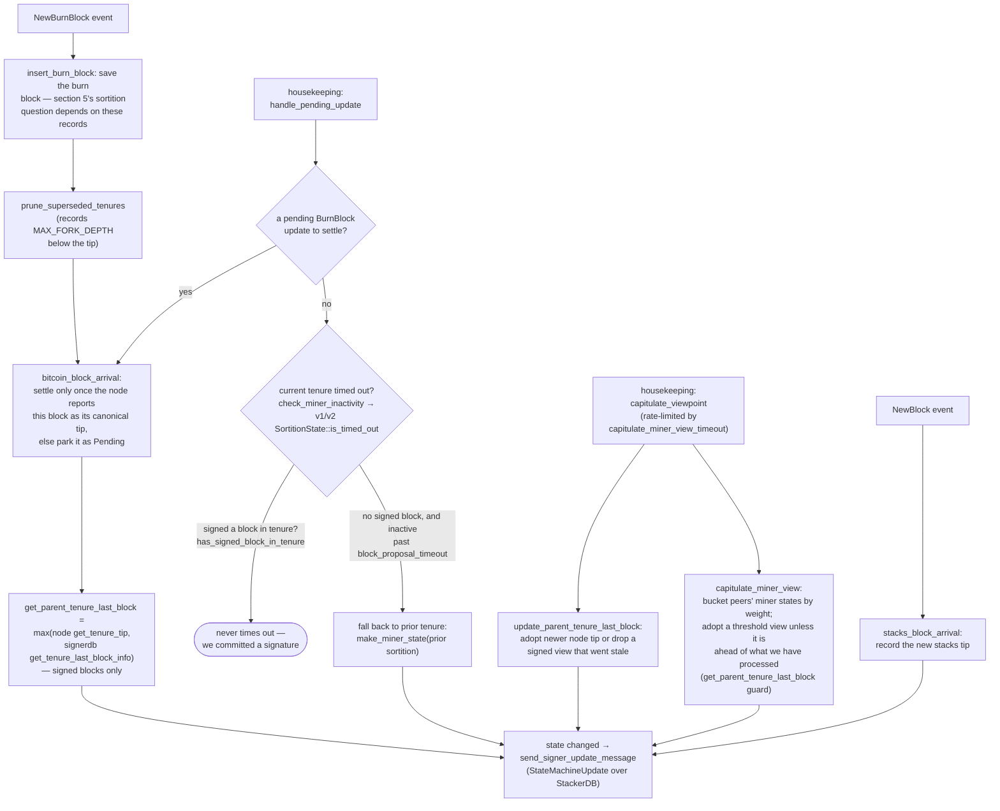

### Title
Sub-70% weight can satisfy `GlobalStateEvaluator::reached_agreement`, letting less than a real 70%-weight quorum force the signer's global miner/state-machine view — ([File: libsigner/src/v0/signer_state.rs])

### Summary
The consensus-critical 70% signer-weight threshold is computed two different ways in this codebase: the canonical, ceiling-rounded formula in `NakamotoBlockHeader::compute_voting_weight_threshold` (used for block-signature/rejection consensus), and a floor-rounded, non-equivalent formula in `GlobalStateEvaluator::reached_agreement`/`reached_disagreement` (used to determine the signer set's agreed global miner view, active signer protocol version, and transaction replay set). Because the latter silently rounds down instead of up, a coalition holding strictly less than 70% of signer weight can make an honest signer's `GlobalStateEvaluator` believe a 70%-threshold agreement was reached.

### Finding Description
`NakamotoBlockHeader::compute_voting_weight_threshold` computes the canonical approval threshold as a proper ceiling of 70%: [1](#0-0) 

This is the formula used both by consensus (`verify_signer_signatures`) and by the v0 signer's own block accept/reject counting logic, e.g. in `handle_block_pre_commit` and `store_and_process_block_signature`: [2](#0-1) [3](#0-2) 

However, `GlobalStateEvaluator::reached_agreement` and `reached_disagreement` — the functions that decide whether the signer set has reached agreement on the *global state machine* (active protocol version, current-miner view / `parent_tenure_last_block`, and the transaction replay set) — instead use plain floor division with no ceiling correction: [4](#0-3) 

For any `total_weight` where `total_weight * 7` is not a multiple of 10 (true for the overwhelming majority of real reward-set weight totals), `floor(total_weight*7/10) < ceil(total_weight*7/10)`. Concretely, for `total_weight = 11`: the canonical threshold is `compute_voting_weight_threshold(11) = ceil(77/10) = 8` (72.7%), but `reached_agreement` accepts any `vote_weight >= floor(77/10) = 7` (63.6%). A group holding only 7 of 11 weight units — well under the intended 70% supermajority and requiring no majority collusion by an outside definition of "majority" (63.6% < 70% required) — is treated by `GlobalStateEvaluator` as having reached the 70% threshold.

`GlobalStateEvaluator` is fed directly from gossiped `StateMachineUpdate` messages via `handle_state_machine_update`, with no additional validation of the aggregate weight math: [5](#0-4) 

The resulting `determine_global_state()` (built on `reached_agreement`) decides `active_signer_protocol_version`, the agreed `current_miner`/`parent_tenure_last_block`, and the `tx_replay_set`: [6](#0-5) 

Per the documented design, this miner-view state (in particular `parent_tenure_last_block`) is explicitly "consensus-visible" and feeds the state machine that governs `capitulate_miner_view`, which "adopt[s] a threshold view unless it is ahead of what we have processed": [7](#0-6) 

This is the same bug class as the external report: two implementations of what must be *the same* boundary/threshold quantity diverge on rounding, and the weaker one is trusted to gate an irreversible-consequence decision (there, `sqrt512`/`div512by256`'s inconsistent rounding vs. the intended Newton-Raphson invariant; here, `reached_agreement`'s floor threshold vs. the canonical `compute_voting_weight_threshold` ceiling).

### Impact Explanation
This breaks the "aggregated-weight vs verified threshold" equality that the 70%/30% supermajority design is supposed to guarantee for global signer-state consensus. A coalition below the true 70% weight (e.g., ~63.6%–69.9% depending on `total_weight`) can force honest signers to accept a global protocol version, miner/parent-tenure view, or transaction replay set that a genuine supermajority never actually endorsed. Since `parent_tenure_last_block`/`current_miner` derived here feeds tenure-change validation elsewhere in the state machine, and `active_signer_protocol_version` gates `uses_global_state()`-dependent branches (e.g., in `store_and_process_block_rejection`), this can cause signers to act on a miner/reward-set/threshold view that does not actually have supermajority backing — matching the High-impact category of "acting on a stale reward set/threshold." No majority is required to trigger it, no key compromise, and no local/auth_token access is needed — only ordinary `StateMachineUpdate` gossip from signers controlling roughly two-thirds of the weight.

### Likelihood Explanation
Every real-world reward-set weight distribution that is not a multiple of 10 (essentially all of them, since weights are proportional to stacked amounts) is affected on every `reached_agreement`/`reached_disagreement` evaluation, so this triggers under completely ordinary network conditions, not just crafted edge cases. It requires no special timing, no majority, and no cryptographic manipulation — only the existing `StateMachineUpdate` gossip path.

### Recommendation
Make `GlobalStateEvaluator::reached_agreement` and `reached_disagreement` use the same ceiling-based threshold formula as `NakamotoBlockHeader::compute_voting_weight_threshold` (or call that function directly) so that both consensus-signature counting and global-state agreement counting apply an identical, correctly-rounded 70%/30% threshold.

### Proof of Concept
Given `total_weight = 11` (a plausible small-scale reward-set weight sum):
- Canonical threshold: `NakamotoBlockHeader::compute_voting_weight_threshold(11)` → `(11*7)/10 = 7` remainder nonzero → `ceil = 1` → returns `8` (i.e. 8/11 ≈ 72.7% required).
- `GlobalStateEvaluator::reached_agreement(vote_weight = 7)`: `u64::from(7) >= u64::from(11).strict_mul(7)/10` → `7 >= 77/10 = 7` (integer floor) → `true`.

So a set of signers controlling only 7 of 11 total weight units (63.6%, strictly below the intended 70% and below the canonical 8-unit threshold) causes `determine_global_state()` to report agreement, letting them dictate the observing signer's `active_signer_protocol_version`, `current_miner`/`parent_tenure_last_block`, and `tx_replay_set` without a genuine supermajority.

### Citations

**File:** stackslib/src/chainstate/nakamoto/mod.rs (L1192-1207)
```rust
    /// Compute the threshold for the minimum number of signers (by weight) required
    /// to approve a Nakamoto block.
    pub fn compute_voting_weight_threshold(total_weight: u32) -> Result<u32, ChainstateError> {
        let threshold = NAKAMOTO_SIGNER_BLOCK_APPROVAL_THRESHOLD;
        let total_weight = u64::from(total_weight);
        let ceil = if (total_weight * threshold) % 10 == 0 {
            0
        } else {
            1
        };
        u32::try_from((total_weight * threshold) / 10 + ceil).map_err(|_| {
            ChainstateError::InvalidStacksBlock(
                "Overflow when computing nakamoto block approval threshold".to_string(),
            )
        })
    }
```

**File:** stacks-signer/src/v0/signer.rs (L1082-1106)
```rust
    fn handle_state_machine_update(
        &mut self,
        signer_public_key: &Secp256k1PublicKey,
        update: &StateMachineUpdate,
        received_time: &SystemTime,
    ) {
        let replay_txids = update.content.replay_txids();
        let pubkey = signer_public_key.to_hex();
        info!(
            "{self}: Received state machine update from signer {pubkey}: {update}";
            "replay_txids" => ?replay_txids
        );
        let address = StacksAddress::p2pkh(self.mainnet, signer_public_key);
        // Store the state machine update so we can reload it if we crash
        if let Err(e) = self.signer_db.insert_state_machine_update(
            self.reward_cycle,
            &address,
            update,
            received_time,
        ) {
            warn!("{self}: Failed to update global state in signerdb: {e}");
        }
        self.global_state_evaluator
            .insert_update(address, update.clone());
    }
```

**File:** stacks-signer/src/v0/signer.rs (L1296-1301)
```rust
        let total_weight = self.compute_signature_total_weight();

        let min_weight = NakamotoBlockHeader::compute_voting_weight_threshold(total_weight)
            .unwrap_or_else(|_| {
                panic!("{self}: Failed to compute threshold weight for {total_weight}")
            });
```

**File:** stacks-signer/src/v0/signer.rs (L2496-2501)
```rust
        let total_weight = self.compute_signature_total_weight();

        let min_weight = NakamotoBlockHeader::compute_voting_weight_threshold(total_weight)
            .unwrap_or_else(|_| {
                panic!("{self}: Failed to compute threshold weight for {total_weight}")
            });
```

**File:** libsigner/src/v0/signer_state.rs (L101-158)
```rust
    /// Check if there is an agreed upon global state
    pub fn determine_global_state(&self) -> Option<SignerStateMachine> {
        let active_signer_protocol_version =
            self.determine_latest_supported_signer_protocol_version()?;
        let mut state_views = HashMap::new();
        let mut tx_replay_sets = HashMap::new();
        let mut found_state_view = None;
        let mut found_replay_set = None;
        for (address, update) in &self.address_updates {
            let Some(weight) = self.address_weights.get(address) else {
                continue;
            };
            let (burn_block, burn_block_height) = update.content.burn_block_view();
            let current_miner = update.content.current_miner();
            let tx_replay_set = update.content.tx_replay_set();

            let state_machine = SignerStateMachine {
                burn_block: burn_block.clone(),
                burn_block_height,
                current_miner: current_miner.clone().into(),
                active_signer_protocol_version,
                // We need to calculate the threshold for the tx_replay_set separately
                tx_replay_set: ReplayTransactionSet::none(),
            };
            let key = SignerStateMachineKey(state_machine.clone());
            let entry = state_views.entry(key).or_insert_with(|| 0);
            *entry += weight;

            if self.reached_agreement(*entry) {
                found_state_view = Some(state_machine);
            }

            let replay_entry = tx_replay_sets
                .entry(tx_replay_set.clone())
                .or_insert_with(|| 0);
            *replay_entry += weight;

            if self.reached_agreement(*replay_entry) {
                found_replay_set = Some(tx_replay_set);
            }
            if found_replay_set.is_some() && found_state_view.is_some() {
                break;
            }
        }
        // Try to find agreed replay set, or find longest common prefix if no exact agreement
        let final_replay_set = if let Some(tx_replay_set) = found_replay_set {
            tx_replay_set
        } else {
            // No exact agreement found, try finding longest common prefix with majority support
            self.find_majority_prefix_replay_set(&tx_replay_sets)
                .unwrap_or_else(ReplayTransactionSet::none)
        };

        if let Some(state_view) = found_state_view.as_mut() {
            state_view.tx_replay_set = final_replay_set;
        }
        found_state_view
    }
```

**File:** libsigner/src/v0/signer_state.rs (L169-183)
```rust
    /// Check if the supplied vote weight crosses the global agreement threshold.
    /// Returns true if it has, false otherwise.
    pub fn reached_agreement(&self, vote_weight: u32) -> bool {
        u64::from(vote_weight)
            >= u64::from(self.total_weight).strict_mul(NAKAMOTO_SIGNER_BLOCK_APPROVAL_THRESHOLD)
                / 10
    }

    /// Check if the supplied vote weight crosses the blocking minority threshold.
    /// Returns true if it has, false otherwise.
    pub fn reached_disagreement(&self, vote_weight: u32) -> bool {
        u64::from(vote_weight)
            > u64::from(self.total_weight).strict_mul(10 - NAKAMOTO_SIGNER_BLOCK_APPROVAL_THRESHOLD)
                / 10
    }
```

**File:** docs/signer-flows.md (L450-476)
```markdown
## 8. Burn blocks & the miner-view state machine

Independent of any single block, the signer maintains a view of _who the current
miner is and what they should build on_, and broadcasts it as a
`StateMachineUpdate`. The whole miner state, including
`parent_tenure_last_block`, is the equality key for global agreement, so what
this flow computes is consensus-visible.


```
