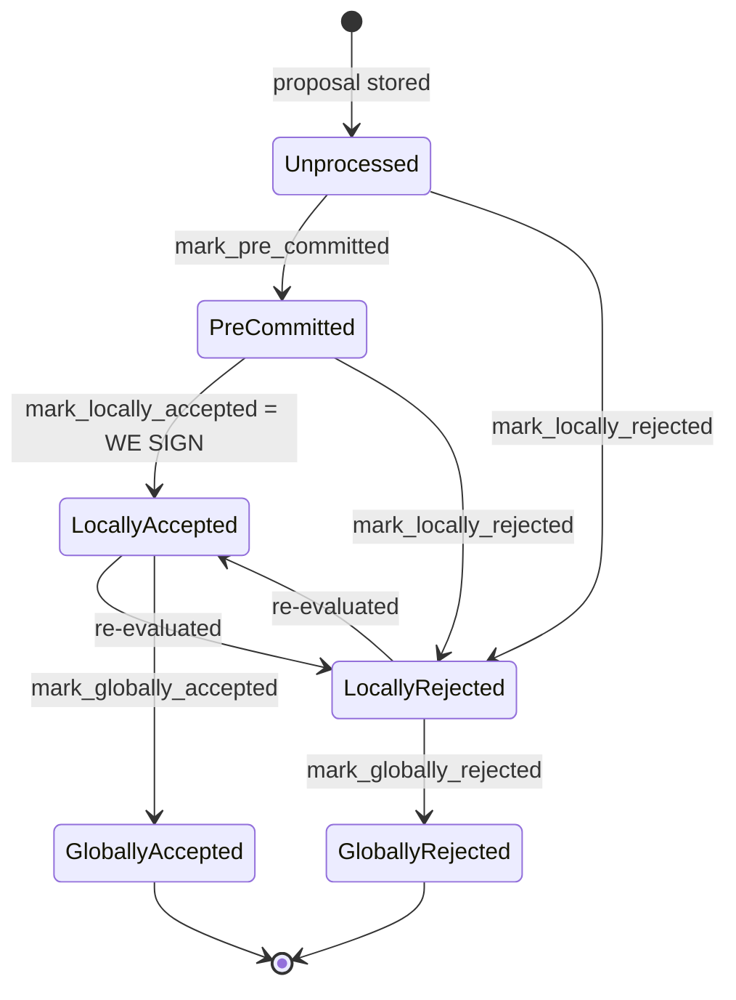
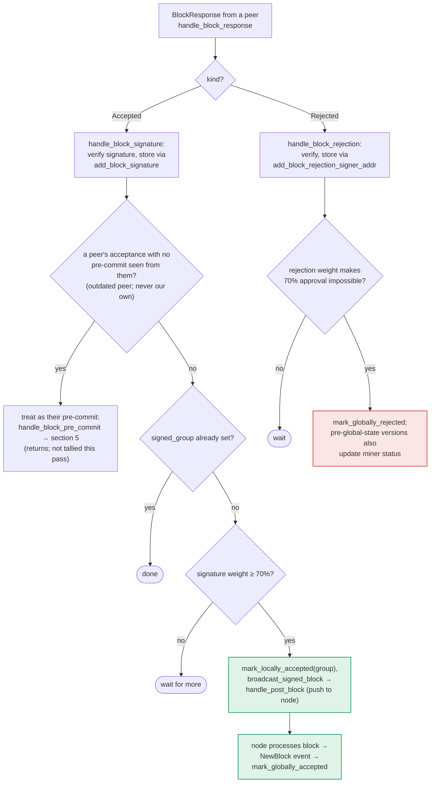

### Title
Rejection weight is never retracted when a signer flips to Accepted, letting a stale rejection tally block a block that has actually reached quorum - ([File: stacks-node/src/nakamoto_node/stackerdb_listener.rs])

### Summary
`StackerDBListener::handle_signer_messages` maintains two independent, additive tallies per block — `total_weight_approved` and `total_weight_rejected` — inside `BlockStatus`. The guard that prevents double-counting a signer's weight is asymmetric: the `Rejected` branch is guarded by `responded_signers.insert(slot_id)` [1](#0-0) , while the `Accepted` branch is guarded only by `!block.gathered_signatures.contains_key(&slot_id)` [2](#0-1) , and both branches unconditionally insert into the shared `responded_signers` set [3](#0-2) . As a result, a signer that legitimately re-evaluates a block from rejected to accepted (an explicitly modeled transition, `LocallyRejected --> LocallyAccepted: re-evaluated`) has its weight added to `total_weight_approved` on the second message without ever being subtracted from `total_weight_rejected`, so the same signer's weight is counted on both sides of the ledger simultaneously.

### Finding Description
The signer-side state machine explicitly permits a block to move `LocallyRejected -> LocallyAccepted` on re-evaluation [4](#0-3) , and `handle_block_response`'s rejection/acceptance flow shows both `BlockResponse::Rejected` and `BlockResponse::Accepted` for the same `signer_signature_hash` are valid, independent broadcasts a single signer can legitimately send over time [5](#0-4) .

On the node/coordinator side, `StackerDBListener` tracks per-block weight in `BlockStatus { responded_signers, gathered_signatures, total_weight_approved, total_weight_rejected, .. }` [6](#0-5) .

- On `BlockResponse::Rejected`: weight is added to `total_weight_rejected` and `slot_id` is inserted into `responded_signers`, guarded by `if block.responded_signers.insert(slot_id)` (i.e. only the first response from that slot counts) [1](#0-0) .
- On `BlockResponse::Accepted`: weight is added to `total_weight_approved`, guarded only by `!block.gathered_signatures.contains_key(&slot_id)` — a completely different set from `responded_signers` — and then `responded_signers.insert(slot_id)` is called unconditionally [7](#0-6) .

If the sequence for a given `slot_id` is Reject-then-Accept (a normal re-evaluation outcome):
1. Reject arrives first: `responded_signers.insert(slot_id)` succeeds (was empty) -> `total_weight_rejected += weight`.
2. Accept arrives later for the same block: `gathered_signatures.contains_key(slot_id)` is false (no signature was ever recorded for this slot) -> `total_weight_approved += weight` is added *again*, on top of the still-present rejection weight. `total_weight_rejected` is never decremented.

This is the same equality-boundary defect pattern as the referenced external report: exactly one side of an inequality/threshold check is validated ("did we already count this slot's *approval*?"), while the complementary condition ("did we already count this slot for *rejection* purposes and thus its weight must not also count toward the opposite bucket?") is silently ignored, letting a value that should have been excluded pass through and permanently corrupt the aggregate. Just as excess `msg.value` above `price+fees` was never reconciled and was "lost forever," here the previously-counted rejection weight for a slot is never reconciled/retracted and stays "stuck" in `total_weight_rejected` forever, even after that same signer has since accepted.

### Impact Explanation
`total_weight_rejected` feeds directly into the coordinator's block-rejection decision in `SignerCoordinator`: `if block_status.total_weight_rejected.saturating_add(self.weight_threshold) > self.total_weight { ... return Err(SignersRejected) }` [8](#0-7) . Because this rejected tally is a monotonically increasing, never-decremented accumulator, a signer flipping opinions across proposal re-evaluations (which the signer's own state machine explicitly allows and does not prevent from happening more than once for related but differently-hashed re-proposals sharing the same signer weight pool) inflates `total_weight_rejected` beyond what currently-standing rejections justify. This can cause the miner/coordinator to declare `SignersRejected` (and permanently or temporarily exclude transactions, per the same code path) for a block that in fact has, or would have, enough live approvals to cross the 70% signing threshold — i.e., a rejection is effectively being counted against a block whose signer has since moved to acceptance, corrupting the approve/reject accounting that is supposed to be a strict partition of `total_weight`. This falls under the "rejection recounted as acceptance"/miscounted-response class of Critical findings: the two tallies are no longer complementary, so the invariant `total_weight_approved + total_weight_rejected <= total_weight` (which the 70%/30% threshold arithmetic implicitly assumes) can be violated by a single signer's own, permitted, sequence of messages — no majority collusion is required.

### Likelihood Explanation
This requires only one signer (or its own key) sending two ordinary protocol messages — a legitimate `Rejected` followed later by a legitimate `Accepted` for the same `signer_signature_hash` — which is an explicitly-modeled and expected signer-side transition (`should_reevaluate_reject_reason` / `LocallyRejected -> LocallyAccepted`) rather than a fault injection or a majority-collusion scenario. No other signer's key, majority cooperation, or StackerDB-transport-level manipulation is needed; only the ordering of two messages from one slot is relevant, so this is reachable by a single participant (including gossip-relayed replay of the same slot's two messages arriving in this order at a listener).

### Recommendation
Make the two tallies mutually exclusive per slot, mirroring the fix pattern recommended for the analogous `msg.value` bug (be strict, or reconcile the excess): before adding to `total_weight_approved`, check (and if present, subtract) any weight previously counted for that slot in `total_weight_rejected` (and vice versa for a Reject arriving after an Accept, which is currently protected but should be handled symmetrically and explicitly rather than incidentally via `responded_signers`). Concretely, track at most one "current" vote and its weight per slot (e.g., replace the separate `gathered_signatures`/rejection bookkeeping with a single `HashMap<slot_id, VoteKind>` used to compute `total_weight_approved`/`total_weight_rejected` freshly, or explicitly decrement the old bucket's weight when a slot's vote changes) so `total_weight_approved + total_weight_rejected` can never exceed `total_weight`.

### Proof of Concept
1. Coordinator starts a `BlockStatus` for a proposed block with `total_weight_approved = 0`, `total_weight_rejected = 0`.
2. Signer S (slot 3, weight w) initially rejects the block (e.g., a transient state-machine mismatch); `handle_signer_messages` processes `BlockResponse::Rejected` for slot 3: `responded_signers.insert(3)` succeeds, `total_weight_rejected += w`.
3. S's local chainstate re-check subsequently passes (a normal `should_reevaluate_reject_reason` outcome) and S now sends `BlockResponse::Accepted` for the same block; `handle_signer_messages` processes it: `gathered_signatures.contains_key(&3)` is `false`, so `total_weight_approved += w` — added on top of the untouched `total_weight_rejected` value from step 2.
4. Now `total_weight_approved + total_weight_rejected` exceeds `total_weight` by `w`, and the stale `total_weight_rejected` can push `signer_coordinator.rs`'s `total_weight_rejected.saturating_add(weight_threshold) > total_weight` check to true, causing the coordinator to reject a block that in fact has S's (and possibly enough other signers') live approval, or to otherwise corrupt the accept/reject partition that downstream threshold logic assumes is exhaustive and non-overlapping.

Note: I was not able to execute this scenario end-to-end in a running node/test harness within this session — the analysis is based on static reading of `stackerdb_listener.rs` and `signer_coordinator.rs`; a background Devin session with access to the full test harness (e.g. `stacks-node/src/tests/signer/v0/*`) would be needed to write and run a concrete integration test confirming the double-count in practice.

### Citations

**File:** stacks-node/src/nakamoto_node/stackerdb_listener.rs (L70-82)
```rust
#[derive(Debug, Clone)]
pub struct BlockStatus {
    /// Set of the slot ids of signers who have responded
    pub responded_signers: HashSet<u32>,
    /// Map of the slot id of signers who have signed the block and their signature
    pub gathered_signatures: BTreeMap<u32, MessageSignature>,
    /// Total weight of signers who have signed the block
    pub total_weight_approved: u32,
    /// Total weight of signers who have rejected the block
    pub total_weight_rejected: u32,
    /// Per-txid rejection tracking from signers
    pub failed_txids: HashMap<Txid, FailedTxInfo>,
}
```

**File:** stacks-node/src/nakamoto_node/stackerdb_listener.rs (L443-465)
```rust
                        if !block.gathered_signatures.contains_key(&slot_id) {
                            block.total_weight_approved = block
                                .total_weight_approved
                                .saturating_add(signer_entry.weight);

                            info!("StackerDBListener: Signature Added to block";
                                "signer_signature_hash" => %block_sighash,
                                "signer_pubkey" => signer_pubkey.to_hex(),
                                "signer_slot_id" => slot_id,
                                "signature" => %signature,
                                "signer_weight" => signer_entry.weight,
                                "total_weight_approved" => block.total_weight_approved,
                                "percent_approved" => block.total_weight_approved as f64 / self.total_weight as f64 * 100.0,
                                "total_weight_rejected" => block.total_weight_rejected,
                                "percent_rejected" => block.total_weight_rejected as f64 / self.total_weight as f64 * 100.0,
                                "weight_threshold" => self.weight_threshold,
                                "tenure_extend_timestamp" => tenure_extend_timestamp,
                                "read_count_extend_timestamp" => read_count_extend_timestamp,
                                "server_version" => metadata.server_version,
                            );
                        }
                        block.gathered_signatures.insert(slot_id, signature);
                        block.responded_signers.insert(slot_id);
```

**File:** stacks-node/src/nakamoto_node/stackerdb_listener.rs (L515-519)
```rust
                        if block.responded_signers.insert(slot_id) {
                            block.total_weight_rejected = block
                                .total_weight_rejected
                                .saturating_add(signer_entry.weight);

```

**File:** docs/signer-flows.md (L130-150)
```markdown
## 2. Block lifecycle (`BlockState`)

Every proposal tracked in the signer DB carries a `BlockState`. **`PreCommitted`
carries no signature**: it means "validated, willing to sign if the pre-commit
threshold is met." The first signature appears at `mark_locally_accepted`.
Global states are terminal against each other.


```

**File:** docs/signer-flows.md (L357-375)
```markdown

```

**File:** stacks-node/src/nakamoto_node/signer_coordinator.rs (L509-540)
```rust
            if block_status
                .total_weight_rejected
                .saturating_add(self.weight_threshold)
                > self.total_weight
            {
                info!(
                    "{}/{} signer weight votes to reject block",
                    block_status.total_weight_rejected, self.total_weight;
                    "signer_signature_hash" => %block_signer_sighash,
                );
                counters.bump_naka_rejected_blocks();

                // Only act on failed txids that a blocking minority (>30% weight) agrees on
                let blocking_minority = self.total_weight.saturating_sub(self.weight_threshold);
                let mut temporarily_excluded_txids = HashSet::new();
                let mut permanently_excluded_txids = HashSet::new();
                for (txid, info) in &block_status.failed_txids {
                    if info.total_weight > blocking_minority {
                        // Do not perma ban txids that only a small minority of signers reported as problematic
                        // But make sure its removed from the next block proposal
                        if info.problematic_weight > blocking_minority {
                            permanently_excluded_txids.insert(txid.clone());
                        } else {
                            temporarily_excluded_txids.insert(txid.clone());
                        }
                    }
                }

                return Err(NakamotoNodeError::SignersRejected {
                    temporarily_excluded_txids,
                    permanently_excluded_txids,
                });
```
