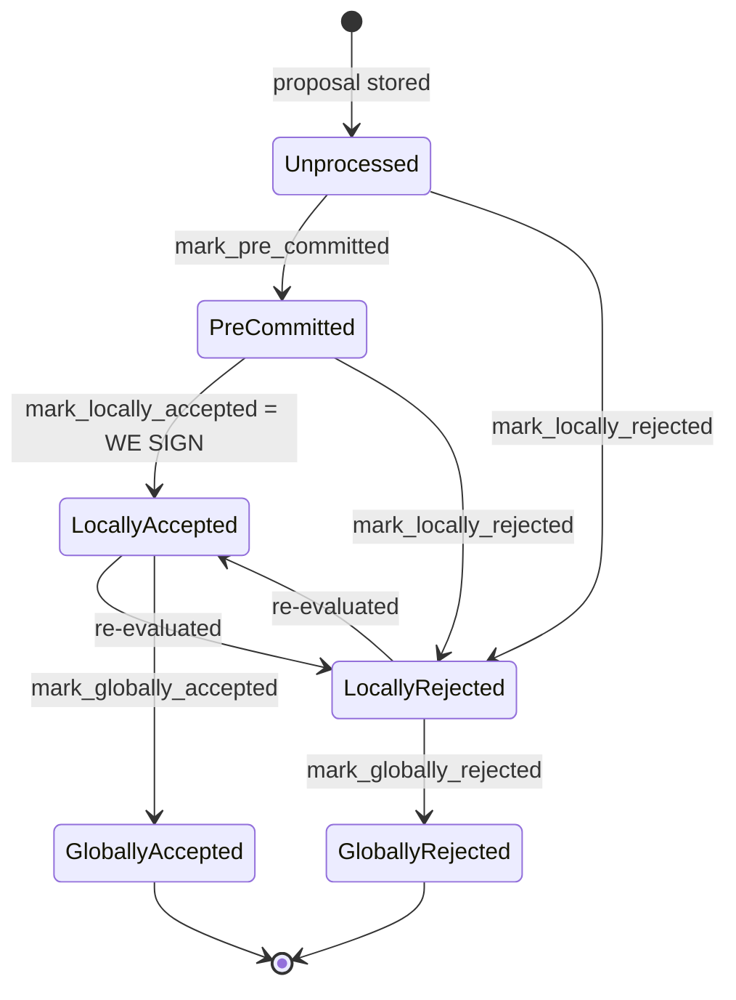

### Title
Outgoing-cycle signer instance is deleted from memory while a block is still only `PreCommitted` (not yet signed/resolved), silently discarding it - (File: `stacks-signer/src/runloop.rs`, `stacks-signer/src/signerdb.rs`)

### Summary
`cleanup_stale_signers` decides whether to drop the in-memory `ConfiguredSigner` for a reward cycle that has rolled over by asking `Signer::has_unprocessed_blocks`, which in turn queries `SignerDb::has_unprocessed_blocks`. That query only counts rows whose persisted `state` is literally `BlockState::Unprocessed`. Any block that has already been evaluated once — e.g. it reached `PreCommitted` (validated, "willing to sign if the pre-commit threshold is met," but carrying no signature yet, per `docs/signer-flows.md`) — is *not* counted as "unprocessed," even though it has not reached any terminal state (`LocallyAccepted`/`LocallyRejected`/`GloballyAccepted`/`GloballyRejected`). This mirrors the M-18 pattern: a housekeeping/cleanup action mutates top-level state (deleting the whole signer instance) without checking whether there is still outstanding, non-terminal work tied to that state, freezing that in-flight item.

### Finding Description
`SignerDb::has_unprocessed_blocks` runs:
```sql
SELECT block_info FROM blocks WHERE reward_cycle = ?1 AND state = ?2 LIMIT 1
```
with `state = BlockState::Unprocessed` only. [1](#0-0) 

`Signer::has_unprocessed_blocks` forwards this directly as the liveness gate for the runloop's cleanup decision, defaulting only to `true` on a DB *error* (not on any other non-terminal state): [2](#0-1) 

`RunLoop::cleanup_stale_signers` uses exactly this boolean to decide whether to remove a `ConfiguredSigner::RegisteredSigner` for a reward cycle that is behind the current one: [3](#0-2) 

The documented block lifecycle shows that `Unprocessed` is only the very first state; a block that has been pre-committed to (`PreCommitted`) has already left `Unprocessed` even though it is far from resolved (no signature yet, and not globally settled): [4](#0-3) 

So the equality this breaks is: *"a signer instance representing a reward cycle is retired only once all of that cycle's proposals are fully resolved."* Instead, the check effectively asks *"is there anything still in its very first state?"*, which is false for a block sitting in `PreCommitted` (or any other non-Unprocessed, non-terminal local state). When `cleanup_stale_signers` fires, the whole `ConfiguredSigner` — including `local_state_machine`, `submitted_block_proposal`, in-memory tracking, and the hashmap slot keyed by `reward_cycle % 2` — is dropped. Once dropped, `refresh_signer_config` will not resurrect an instance for an old (non-current, non-next) reward cycle, so no further `BlockPreCommit`/`BlockResponse`/validation-response `SignerMessage`s for that reward cycle have anywhere to be routed and processed by this node. The `PreCommitted` row is left permanently stuck in the SignerDB for this signer, and this signer never contributes a signature or rejection for it again.

### Impact Explanation
This is a liveness wedge on a specific signer's participation in an outstanding, in-flight block: the signer can never sign (or reject) a block it had already pre-committed to, because its whole state machine for that reward cycle is discarded rather than merely marked idle. If enough weight is concentrated in signers hitting this condition around a reward-cycle boundary, a block that is `PreCommitted` at the boundary may never reach the pre-commit/signing threshold, stalling tenure finalization for that block. This matches the High-impact category "a signer wedged into never signing valid blocks" — the wedge is a straightforward classification bug in `has_unprocessed_blocks` (checking for a specific enum value instead of "not yet terminal"), not attacker-controlled data corruption, but it is reachable purely from ordinary miner/gossip block-proposal timing at a reward-cycle rollover, without needing a majority of colluding signers.

### Likelihood Explanation
Triggering requires only ordinary conditions that recur at every reward-cycle boundary: a block proposal near the end of an outgoing tenure that reaches `PreCommitted` (a normal, frequent local state — it is the default path before signing) but is not immediately promoted to a terminal state before the runloop's next `refresh_runloop`/`cleanup_stale_signers` pass for the new reward cycle. No forged signatures, no majority collusion, and no unusual message content are needed — a miner (or the natural network timing of the last block(s) of a tenure) is enough to leave a block in `PreCommitted` at rollover time.

### Recommendation
Change `SignerDb::has_unprocessed_blocks` (and its call sites) to treat any state that is not one of the terminal states (`GloballyAccepted`, `GloballyRejected`) as "unprocessed" for cleanup purposes, e.g. `WHERE reward_cycle = ?1 AND state NOT IN (?2, ?3)` with the two global states, rather than matching only `BlockState::Unprocessed`. Additionally, consider not deleting a `ConfiguredSigner::RegisteredSigner` if it has any row in `PreCommitted` or `LocallyAccepted`/`LocallyRejected` for that cycle, mirroring the "settle before removing" recommendation from the source report.

### Proof of Concept
Conceptual (no test harness execution performed, since I cannot run code in this environment):
1. Boot a signer set for reward cycle N; have a miner propose a block near the very end of cycle N's tenure.
2. Ensure the block reaches `PreCommitted` on a given signer (pre-commit threshold met) but stall/delay before it becomes `LocallyAccepted`/`GloballyAccepted` (e.g., via `TEST_SIGNERS_IGNORE_PRE_COMMITS`/`TEST_STALL_BLOCK_RESPONSE`-style hooks already used in the test suite, such as `signers_reprocess_late_block_proposals_pre_commits`, to hold the block in `PreCommitted`). [5](#0-4) 
3. Advance the burn chain into the next reward cycle so `refresh_runloop`/`cleanup_stale_signers` runs for reward cycle N (`TEST_SKIP_SIGNER_CLEANUP` is disabled).
4. Query `SignerDb::has_unprocessed_blocks(N)` — it returns `false` because the row's `state` is `PreCommitted`, not `Unprocessed`, matching the unit test `test_has_unprocessed_blocks` which shows `Unprocessed`/`LocallyRejected` counted but demonstrates the query only keys off the literal `Unprocessed` string. [6](#0-5) 
5. Observe `cleanup_stale_signers` removes the `ConfiguredSigner` for reward cycle N from `self.stacks_signers` despite the still-outstanding `PreCommitted` block, and no further messages for that block are processed by this signer instance.

Note: I could not execute this scenario in the sandbox (no filesystem/terminal access here), so the exact runtime confirmation (e.g., stepping through `refresh_runloop`/`cleanup_stale_signers` in an integration test) would need to be done in a live Devin session to fully validate before treating this as confirmed rather than a strongly-supported code-level analog.

### Citations

**File:** stacks-signer/src/signerdb.rs (L1855-1868)
```rust
    /// Determine if there are any unprocessed blocks
    pub fn has_unprocessed_blocks(&self, reward_cycle: u64) -> Result<bool, DBError> {
        let query = "SELECT block_info FROM blocks WHERE reward_cycle = ?1 AND state = ?2 LIMIT 1";
        let result: Option<String> = query_row(
            &self.db,
            query,
            params!(
                &u64_to_sql(reward_cycle)?,
                &BlockState::Unprocessed.to_string()
            ),
        )?;

        Ok(result.is_some())
    }
```

**File:** stacks-signer/src/signerdb.rs (L3051-3090)
```rust
    #[test]
    fn test_has_unprocessed_blocks() {
        let db_path = tmp_db_path();
        let mut db = SignerDb::new(db_path).expect("Failed to create signer db");
        let (mut block_info_1, _block_proposal) = create_block_override(|b| {
            b.block.header.miner_signature = MessageSignature([0x01; 65]);
            b.burn_height = 1;
        });
        let (mut block_info_2, _block_proposal) = create_block_override(|b| {
            b.block.header.miner_signature = MessageSignature([0x02; 65]);
            b.burn_height = 2;
        });

        db.insert_block(&block_info_1)
            .expect("Unable to insert block into db");
        db.insert_block(&block_info_2)
            .expect("Unable to insert block into db");

        assert!(db
            .has_unprocessed_blocks(block_info_1.reward_cycle)
            .unwrap());

        block_info_1.state = BlockState::LocallyRejected;

        db.insert_block(&block_info_1)
            .expect("Unable to update block in db");

        assert!(db
            .has_unprocessed_blocks(block_info_1.reward_cycle)
            .unwrap());

        block_info_2.state = BlockState::LocallyAccepted;

        db.insert_block(&block_info_2)
            .expect("Unable to update block in db");

        assert!(!db
            .has_unprocessed_blocks(block_info_1.reward_cycle)
            .unwrap());
    }
```

**File:** stacks-signer/src/v0/signer.rs (L418-426)
```rust
    fn has_unprocessed_blocks(&self) -> bool {
        self.signer_db
            .has_unprocessed_blocks(self.reward_cycle)
            .unwrap_or_else(|e| {
                error!("{self}: Failed to check for pending blocks: {e:?}",);
                // Assume we have pending blocks to prevent premature cleanup
                true
            })
    }
```

**File:** stacks-signer/src/runloop.rs (L471-500)
```rust
    fn cleanup_stale_signers(&mut self, current_reward_cycle: u64) {
        #[cfg(any(test, feature = "testing"))]
        if TEST_SKIP_SIGNER_CLEANUP.get() {
            warn!("Skipping signer cleanup due to testing directive.");
            return;
        }
        let mut to_delete = Vec::new();
        for (idx, signer) in &mut self.stacks_signers {
            let reward_cycle = signer.reward_cycle();
            if reward_cycle >= current_reward_cycle {
                // We are either the current or a future reward cycle, so we are not stale.
                continue;
            }
            match signer {
                ConfiguredSigner::RegisteredSigner(signer) => {
                    if !signer.has_unprocessed_blocks() {
                        debug!("{signer}: Signer's tenure has completed.");
                        to_delete.push(*idx);
                    }
                }
                ConfiguredSigner::NotRegistered { .. } => {
                    debug!("{signer}: Unregistered signer's tenure has completed.");
                    to_delete.push(*idx);
                }
            }
        }
        for idx in to_delete {
            self.stacks_signers.remove(&idx);
        }
    }
```

**File:** docs/signer-flows.md (L130-154)
```markdown
## 2. Block lifecycle (`BlockState`)

Every proposal tracked in the signer DB carries a `BlockState`. **`PreCommitted`
carries no signature**: it means "validated, willing to sign if the pre-commit
threshold is met." The first signature appears at `mark_locally_accepted`.
Global states are terminal against each other.



Canonical paths shown; the exact rule in `BlockInfo::check_state` is: either
local state is reachable from anything not yet global, `PreCommitted` only from
`Unprocessed`, and each global state is unreachable from the other.
```

**File:** stacks-node/src/tests/signer/v0/signers_consider_late_proposals.rs (L34-101)
```rust
#[test]
#[ignore]
/// Tests that if pre-commits arrive before block proposals, signers reprocess
/// the late proposal and still reach acceptance once a threshold is met.
///
/// Test Setup:
/// - 5 signers attached to one miner
///
/// Test Execution:
/// 1. Configure 2 signers to ignore incoming block proposals.
/// 2. Propose a block to all signers.
/// 3. The other 3 signers pre-commit; the ignoring signers do not.
/// 4. Confirm the ignoring signers did not pre-commit.
/// 5. Switch: allow the 2 signers to process proposals, and make the other 3
///    ignore pre-commits and block responses so only the late signers' signatures
///    can trigger acceptance.
/// 6. Repropose the same block.
///
/// Test Assertions:
/// - Only the non-ignoring signers pre-commit initially (ignoring signers do not).
/// - After reproposal, all signers accept the block once the late signers
///   issue their pre-commits/signatures.
/// - The accepted block is pushed, and the node advances to the expected height.
///
fn signers_reprocess_late_block_proposals_pre_commits() {
    if env::var("BITCOIND_TEST") != Ok("1".into()) {
        return;
    }

    tracing_subscriber::registry()
        .with(fmt::layer())
        .with(EnvFilter::from_default_env())
        .init();

    info!("------------------------- Test Setup -------------------------");
    let num_signers = 5;
    let signer_test: SignerTest<SpawnedSigner> = SignerTest::new(num_signers, vec![]);
    let all_signers = signer_test.signer_test_pks();
    let ignoring_signers = all_signers.iter().take(2).cloned().collect::<Vec<_>>();
    let non_ignoring_signers = all_signers.iter().skip(2).cloned().collect::<Vec<_>>();
    let miner_pk = StacksPublicKey::from_private(
        &signer_test
            .running_nodes
            .conf
            .miner
            .mining_key
            .clone()
            .unwrap(),
    );
    signer_test.boot_to_epoch_3();
    TEST_IGNORE_ALL_BLOCK_PROPOSALS.set(ignoring_signers.clone());

    info!("------------------------- Mine Tenure A and Propose Block N -------------------------");
    let expected_height = signer_test.get_peer_info().stacks_tip_height + 1;
    signer_test.mine_bitcoin_block();
    signer_test.wait_for_signer_state_update();
    info!("------------------------- Wait for block proposal -------------------------");
    let block_proposal = wait_for_block_proposal(30, expected_height, &miner_pk)
        .expect("Miner failed to propose tenure start block");
    let sighash = block_proposal.block.header.signer_signature_hash();
    info!("------------------------- Wait for block pre-commits -------------------------");
    wait_for_block_pre_commits_from_signers(30, &sighash, &non_ignoring_signers)
        .expect("Non-ignoring signers failed to pre-commit to block proposal");
    // Only wait a few seconds longer than it takes for the non-ignoring signers to pre-commit to ensure the ignoring signers are not pre-committing
    assert!(
        wait_for_block_pre_commits_from_signers(5, &sighash, &ignoring_signers).is_err(),
        "Ignoring signers should not have pre-committed to block proposal"
    );
```
