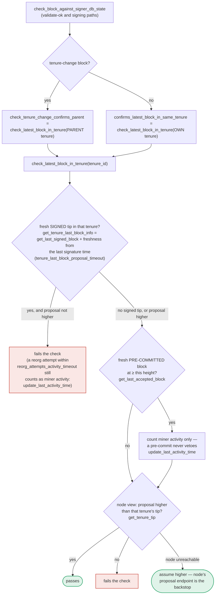

### Title
Fail-open "assume higher" fallback on node RPC failure lets a signer approve/sign a block that does not actually confirm the expected tenure tip - (File: `stacks-signer/src/chainstate/mod.rs`)

### Summary
`SortitionData::check_latest_block_in_tenure` is the function that answers "does this proposed block build on/confirm the highest known block of a given tenure?" It is invoked at proposal arrival, at validate-ok, and again at the pre-commit/signing moment [1](#0-0) . When the local signer DB has no record for that tenure, the function must ask the node via `client.get_tenure_tip(tenure_id)`. If that RPC call fails for *any* reason (timeout, connection error, node overloaded, node mid-restart, etc.), the code does not hold the proposal or reject it — it unconditionally returns `Ok(true)`, i.e. "the proposal is higher than the tenure tip," which is the same as passing the check.

### Finding Description
The relevant logic:
```
let tip = match client.get_tenure_tip(tenure_id) {
    Ok(tip) => tip.anchored_header,
    Err(e) => {
        warn!("Failed to fetch the tenure tip for the parent tenure: {e:?}. Assuming proposal is higher than the parent tenure for now.");
        return Ok(true);
    }
};
``` [2](#0-1) 

This is the direct structural analog of the sequencer-uptime bug: an external liveness dependency (there: the L2 sequencer; here: the signer's own `stacks-node` RPC) is not verified before a consequential decision is made, and the code fails *open* rather than *closed* when that dependency is unavailable. The comment justifies this as "safe because this proposal ultimately must be passed to the stacks-node for proposal processing" [3](#0-2)  — i.e. it relies on a *second*, later check (the node's own block-proposal validation endpoint, `postblock_proposal.rs`) as the real backstop.

However, this same `check_latest_block_in_tenure` function is also invoked at the **signing/pre-commit** decision point (`confirms_latest_block_in_same_tenure`, `check_tenure_change_confirms_parent`), which runs *after* the node has already validated the block once (`validate-ok`) [4](#0-3)  and right before the signer places its irreversible signature [5](#0-4) . At this later point there is no subsequent node-side gate — the node already accepted the block for validation, and this is the signer's own "one last look" before signing [6](#0-5) . If the client's own local RPC to the node transiently fails at exactly this second call (distinct network hiccup, node briefly restarting, resource exhaustion under load) while the node's chainstate has genuinely already produced a higher/conflicting block in that tenure that this signer simply failed to observe, the fallback silently treats the proposal as confirming the tenure tip and lets the pre-commit/sign pipeline proceed as if the check had actually passed.

This deviates from the documented philosophy used everywhere else in the same signing path for exactly this kind of external unavailability: `conflict_still_blocks` and `reorg_permit_stands` both explicitly choose to **fail closed** (keep blocking / treat the permit as void) when the node cannot be reached, with an explicit rationale that "blocking is the direction that can be taken back" [7](#0-6) , [8](#0-7) . `check_latest_block_in_tenure` breaks that equality by failing open instead.

### Impact Explanation
This does not by itself let a single signer produce a canonical, network-accepted block, since 70% weight is still required to reach global acceptance [9](#0-8) . But if the node-RPC hiccup is not isolated to one signer (e.g. correlated load on all signer nodes, or a shared upstream node outage during a burst of activity — the "sequencer down" equivalent), multiple signers could simultaneously hit the `Err` branch at the signing check and each independently sign a block that does not actually confirm the expected tenure tip, undermining the "does it still fit the chain" guarantee this function exists to enforce at the point right before an irreversible signature is placed.

### Likelihood Explanation
Low-to-moderate. It requires a transient RPC failure to the signer's own stacks-node specifically at the pre-commit/signing evaluation (not the earlier proposal-arrival check, where the "backstop" argument does hold), and further requires that this coincide with the tenure tip check actually differing from what the empty/local DB assumed. Single-signer occurrences have no consensus effect due to the threshold requirement; the risk is correlated failures across a large share of signer weight during infrastructure degradation.

### Recommendation
At minimum, distinguish the "node unreachable during proposal-arrival check" case (where the later node-side proposal validation is a genuine backstop) from the "node unreachable during pre-commit/signing check" case (where there is no further backstop). In the latter case, fail closed — treat the RPC failure as "not confirmed" rather than "assume higher" — matching the fail-closed convention already used by `conflict_still_blocks` and `reorg_permit_stands` for the same class of external-dependency failure.

### Proof of Concept
Not directly demonstrable from the indexed code alone: reproducing this requires forcing `StacksClient::get_tenure_tip` to return an `Err` at the exact moment `confirms_latest_block_in_same_tenure`/`check_tenure_change_confirms_parent` is called from the pre-commit path, while the signer's local DB holds no cached tip for that tenure and the real (unreachable) node state would have failed the check. Existing tests in `stacks-signer/src/v0/tests.rs` exercise the node-reachable branches of the sibling/conflict logic extensively (e.g. `orphan_404_not_trusted_while_node_is_behind`, `conflict_whose_sortition_is_canonical_still_blocks_signing`) [10](#0-9) [11](#0-10) , but I did not find an equivalent test that exercises the `Err` branch of `check_latest_block_in_tenure`'s `get_tenure_tip` call at the signing point, so the exact runtime behavior under that specific failure mode is inferred from the code comment and fallback logic itself rather than confirmed via a test harness.

### Citations

**File:** docs/signer-flows.md (L19-22)
```markdown
between the two rounds is where most of the subtlety lives: time passes, the
burn chain can fork, and another block may win the same slot, so a signer takes
one last look at the world before its signature — the one irreversible act —
leaves the box.
```

**File:** docs/signer-flows.md (L43-46)
```markdown
    TALLY{"meanwhile, every signer's<br/>answer is tallied by everyone"} -- "70% signed" --> PUSH["the signatures are gathered<br/>and the block handed to the node"]:::good
    TALLY -- "over 30% rejected —<br/>70% is now impossible" --> GR(["the block is dead:<br/>globally rejected"]):::bad
    TALLY -- "neither yet" --> W3(["wait"]):::hold
    PUSH --> ADOPT(["the chain adopts it:<br/>globally accepted"]):::good
```

**File:** docs/signer-flows.md (L391-417)
```markdown
`check_latest_block_in_tenure` answers "does this block confirm the tip we
expect?" and it runs in three places: at proposal arrival (inside
`check_proposal`), at validate-ok, and at the moment of signing. _Which_ tenure
it is asked about depends on the block: a tenure-change block is checked against
its **parent** tenure, every other block against its **own**. Never both. The
pivotal helper is `get_tenure_last_block_info`, which considers only blocks that
carry a signature (`get_last_signed_block`): a pre-commit never vetoes anything,
it only counts as miner activity.



**File:** stacks-signer/src/chainstate/mod.rs (L366-374)
```rust
    /// Check whether or not `block` is higher than the highest block in `tenure_id`.
    ///  returns `Ok(true)` if `block` is higher, `Ok(false)` if not.
    ///
    /// If we can't look up `tenure_id`, assume `block` is higher.
    /// This assumption is safe because this proposal ultimately must be passed
    /// to the `stacks-node` for proposal processing: so, if we pass the block
    /// height check here, we are relying on the `stacks-node` proposal endpoint
    /// to do the validation on the chainstate data that it has.
    ///
```

**File:** stacks-signer/src/chainstate/mod.rs (L450-460)
```rust
        let tip = match client.get_tenure_tip(tenure_id) {
            Ok(tip) => tip.anchored_header,
            Err(e) => {
                warn!(
                    "Failed to fetch the tenure tip for the parent tenure: {e:?}. Assuming proposal is higher than the parent tenure for now.";
                    "proposed_block_consensus_hash" => %block.header.consensus_hash,
                    "signer_signature_hash" => %block.header.signer_signature_hash(),
                    "parent_tenure" => %tenure_id,
                );
                return Ok(true);
            }
```

**File:** stacks-signer/src/v0/signer.rs (L1134-1136)
```rust
    /// If we have no saved burn block, or the node is unreachable, the conflict keeps blocking.
    /// That only delays the replacement until our signature goes stale, whereas wrongly signing
    /// cannot be taken back.
```

**File:** stacks-signer/src/v0/signer.rs (L1218-1221)
```rust
    /// A false 404 here (e.g. from a node still catching up) only restores a conflict the
    /// permit could have excluded, which at worst delays the replacement, so unlike
    /// `conflict_still_blocks` no tip-height guard is needed. A node error voids the permit for
    /// the same reason: blocking is the direction that can be taken back.
```

**File:** stacks-signer/src/v0/tests.rs (L1179-1191)
```rust
    #[test]
    fn orphan_404_not_trusted_while_node_is_behind() {
        // A 404 for the conflict's burn block only proves a burnchain fork if the node's
        // burnchain view covers that height: a node still catching up 404s canonical burn
        // blocks it has not processed yet. With the node's tip below the conflict's burn
        // block, the conflict must keep blocking.
        let (info_a, info_b) = run_cross_tenure_scenario(TenureAFate::SortitionOrphanedNodeBehind);
        assert_a_signed(&info_a);
        assert_b_refused(
            &info_b,
            "the node's burnchain tip has not reached the conflict's burn block",
        );
    }
```

**File:** stacks-signer/src/v0/tests.rs (L1224-1239)
```rust
    #[test]
    fn conflict_whose_sortition_is_canonical_still_blocks_signing() {
        // The burn chain question must cut both ways: when the node serves tenure 1's
        // sortition as canonical, the tenure is provably live, and the fresh sibling keeps
        // blocking exactly as if we had never asked. This is also what defers signing while a
        // mid-reorg node still serves the old branch (each later evaluation asks again), and
        // what makes a fork BACK onto an abandoned branch restore its conflicts: the sortition
        // is canonical again, so the very next evaluation sees the conflict as live -- there
        // is no stale orphan record to clear.
        let (info_a, info_b) = run_cross_tenure_scenario(TenureAFate::SortitionStillCanonical);
        assert_a_signed(&info_a);
        assert_b_refused(
            &info_b,
            "the conflicting sibling's tenure is still on the canonical burn chain",
        );
    }
```
