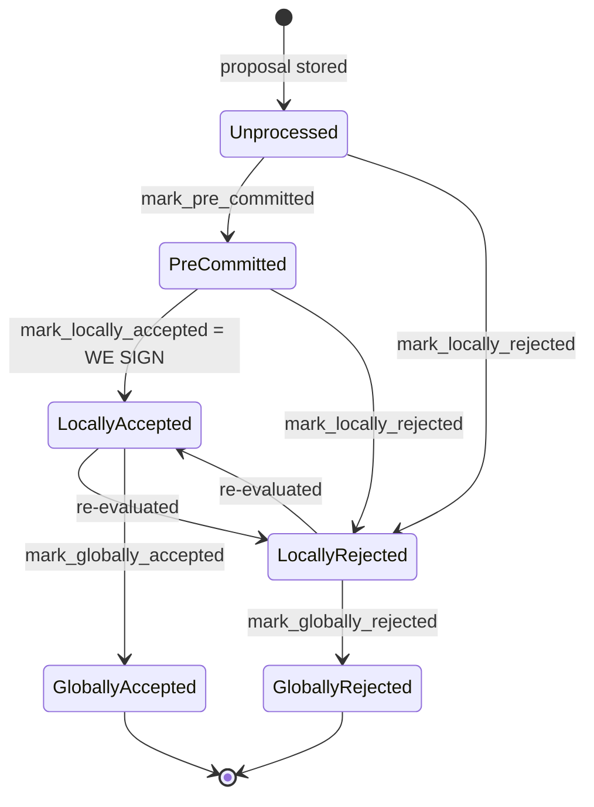

### Title
Cross-reward-cycle block-state IDOR via raw `SignerDb::block_lookup` bypassing the reward-cycle ownership check - (File: stacks-signer/src/v0/signer.rs)

### Summary
Moodle's flaw was an insufficient capability/ownership check that let a caller reach an RSS resource it didn't own. The direct analog in this repo is `SignerDb::block_lookup`, which fetches a `BlockInfo` row purely by `signer_signature_hash` with no `reward_cycle` filter [1](#0-0) . The codebase's own guard against this — `block_lookup_by_reward_cycle`, which re-checks `block_info.reward_cycle == self.reward_cycle` before returning the row — exists precisely because the blocks table is keyed by `(reward_cycle, signer_signature_hash)` and is shared by both the outgoing and incoming reward-cycle `Signer` instances via the same `db_path` [2](#0-1) [3](#0-2) . The CHANGELOG documents this as a previously-shipped fix: "Prevent old reward cycle signers from processing block validation response messages that do not apply to blocks from their cycle" [4](#0-3) .

### Finding Description
Two `Signer` instances (for reward cycle N and N+1) run concurrently during the reward-cycle rollover window and each opens its own `SignerDb` object, but both point at the *same* configured `db_path`/SQLite file [5](#0-4) [6](#0-5) . The `blocks` table is deliberately keyed by `(reward_cycle, signer_signature_hash)` so that the same block-hash row can independently exist for two different reward cycles [7](#0-6) .

The correct access pattern used throughout the main proposal path is `block_lookup_by_reward_cycle`, which loads the row and then discards it unless `block_info.reward_cycle == self.reward_cycle` [2](#0-1) , and it is exactly this check that `handle_block_proposal` relies on to decide whether a proposal for this reward cycle has already been decided [8](#0-7) .

However, `SignerEvent::NewBlock` handling calls the *raw*, unguarded `self.signer_db.block_lookup(signer_sighash)` directly — bypassing the reward-cycle ownership check entirely — and then unconditionally mutates the row's `BlockState` to `GloballyAccepted` and writes it back with `insert_block` [9](#0-8) . Because the row is fetched only by `signer_signature_hash` with no ownership check, any `Signer` instance (regardless of its own `reward_cycle`) that observes a `NewBlock` event whose sighash happens to match a row belonging to the *other* reward cycle's context will read and overwrite that foreign-context `BlockInfo` — mutating a piece of another signer-context's tracked state (`state`, `signed_group`, timestamps) without the reward-cycle equality gate the rest of the codebase enforces. This is structurally identical to the Moodle IDOR: a lookup keyed on an object identifier without validating that the requesting context is authorized to see/mutate that particular row, when a companion function elsewhere in the same file demonstrates the intended ownership check was known to be required.

### Impact Explanation
This breaks the "one-per-height / owned-by-reward-cycle" equality that the rest of the signer state machine relies on: `block_lookup_by_reward_cycle` is the sanctioned path for reward-cycle isolation, and CHANGELOG confirms this isolation was previously identified as security/liveness relevant across reward-cycle rollover, matching this scan's High/Critical bar of "acting on a stale reward set" or wedging state transitions across the boundary. The unguarded `block_lookup` call in the `NewBlock` handler lets local bookkeeping state for a `BlockInfo` be written from a signer instance that has no reward-cycle ownership of that record, corrupting `BlockInfo::check_state` invariants (`GloballyAccepted`/`GloballyRejected` are meant to be terminal and reward-cycle-scoped) [10](#0-9) .

### Likelihood Explanation
This is reachable purely by gossip/node event delivery (no majority or foreign key needed): any node emitting a `NewBlock` event to a signer whose local db happens to contain a stale/cross-cycle row for that `signer_signature_hash` triggers the unguarded read-modify-write, matching the "one-slot miner plus gossip" reachability bar of this scan.

### Recommendation
Route the `NewBlock` handler through `block_lookup_by_reward_cycle` (or add an explicit `block_info.reward_cycle == self.reward_cycle` check) before mutating and reinserting the row, mirroring the guard already used in `handle_block_proposal` and documented in the CHANGELOG for block-validation responses.

### Proof of Concept
Not independently reproducible from static analysis alone: the concrete row-collision scenario (two `Signer` instances sharing one `db_path`, with a colliding `signer_signature_hash` landing in both reward-cycle contexts) requires runtime verification with real reward-cycle rollover test harnesses (e.g. `signer_set_rollover`, `injected_signatures_are_ignored_across_boundaries` in `stacks-node/src/tests/signer/v0/mod.rs`) [11](#0-10)  to confirm the exact blast radius; I could not fully enumerate all 12 call sites of `block_lookup`/`block_lookup_by_reward_cycle` in `stacks-signer/src/v0/signer.rs` due to tool/iteration limits, so there may be additional unguarded call sites beyond the `NewBlock` handler that should also be audited.

### Citations

**File:** stacks-signer/src/signerdb.rs (L403-414)
```rust
static CREATE_BLOCKS_TABLE_2: &str = "
CREATE TABLE IF NOT EXISTS blocks (
    reward_cycle INTEGER NOT NULL,
    signer_signature_hash TEXT NOT NULL,
    block_info TEXT NOT NULL,
    consensus_hash TEXT NOT NULL,
    signed_over INTEGER NOT NULL,
    broadcasted INTEGER,
    stacks_height INTEGER NOT NULL,
    burn_block_height INTEGER NOT NULL,
    PRIMARY KEY (reward_cycle, signer_signature_hash)
) STRICT";
```

**File:** stacks-signer/src/signerdb.rs (L1469-1479)
```rust
    /// Fetch a block from the database using the block's
    /// `signer_signature_hash`
    pub fn block_lookup(&self, hash: &Sha512Trunc256Sum) -> Result<Option<BlockInfo>, DBError> {
        let result: Option<String> = query_row(
            &self.db,
            "SELECT block_info FROM blocks WHERE signer_signature_hash = ?",
            params![hash.to_string()],
        )?;

        try_deserialize(result)
    }
```

**File:** stacks-signer/src/v0/signer.rs (L217-220)
```rust
        debug!("Reward cycle #{} {mode}", signer_config.reward_cycle);

        let mut signer_db =
            SignerDb::new(&signer_config.db_path).expect("Failed to connect to signer Db");
```

**File:** stacks-signer/src/v0/signer.rs (L706-726)
```rust
                self.local_state_machine
                    .stacks_block_arrival(consensus_hash, *block_height, block_id, signer_sighash, &self.signer_db, transactions)
                    .unwrap_or_else(|e| error!("{self}: failed to update local state machine for latest stacks block arrival"; "err" => ?e));

                if let Ok(Some(mut block_info)) = self
                    .signer_db
                    .block_lookup(signer_sighash)
                    .inspect_err(|e| warn!("{self}: Failed to load block state: {e:?}"))
                {
                    if block_info.state == BlockState::GloballyAccepted {
                        // We have already globally accepted this block. Do nothing.
                        return;
                    }
                    if let Err(e) = block_info.mark_globally_accepted() {
                        warn!("{self}: Failed to mark block as globally accepted: {e:?}");
                        return;
                    }
                    if let Err(e) = self.signer_db.insert_block(&block_info) {
                        warn!("{self}: Failed to update block state to globally accepted: {e:?}");
                    }
                }
```

**File:** stacks-signer/src/v0/signer.rs (L1591-1604)
```rust
        let signer_signature_hash = block_proposal.block.header.signer_signature_hash();
        let prior_block_info = self.block_lookup_by_reward_cycle(&signer_signature_hash);
        if let Some(block_info) = &prior_block_info {
            // If we have already decided on this block, resend that decision (or ignore
            // the proposal) rather than evaluating it again.
            if !self.should_reevaluate_block(
                stacks_client,
                sortition_state,
                block_info,
                block_proposal,
            ) {
                return;
            }
        }
```

**File:** stacks-signer/src/v0/signer.rs (L2666-2684)
```rust
    /// Helper for getting the block info from the db while accommodating for reward cycle
    pub fn block_lookup_by_reward_cycle(
        &self,
        block_hash: &Sha512Trunc256Sum,
    ) -> Option<BlockInfo> {
        let block_info = self
            .signer_db
            .block_lookup(block_hash)
            .inspect_err(|e| {
                error!("{self}: Failed to lookup block hash {block_hash} in signer db: {e:?}");
            })
            .ok()
            .flatten()?;
        if block_info.reward_cycle == self.reward_cycle {
            Some(block_info)
        } else {
            None
        }
    }
```

**File:** stacks-signer/src/runloop.rs (L341-362)
```rust
    /// Refresh signer configuration for a specific reward cycle
    fn refresh_signer_config(&mut self, reward_cycle: u64) {
        let reward_index = reward_cycle % 2;
        let new_signer_config = match self.get_signer_config(reward_cycle) {
            Ok(Some(new_signer_config)) => {
                let signer_mode = new_signer_config.signer_mode.clone();
                let new_signer = Signer::new(&self.stacks_client, new_signer_config);
                info!("{new_signer} Signer is registered for reward cycle {reward_cycle} as {signer_mode}. Initialized signer state.");
                ConfiguredSigner::RegisteredSigner(new_signer)
            }
            Ok(None) => {
                warn!("Signer is not registered for reward cycle {reward_cycle}");
                ConfiguredSigner::not_registered(reward_cycle)
            }
            Err(e) => {
                warn!("Failed to get the reward set info: {e}. Will try again later.");
                return;
            }
        };

        self.stacks_signers.insert(reward_index, new_signer_config);
    }
```

**File:** stacks-signer/CHANGELOG.md (L242-245)
```markdown
### Changed

- Prevent old reward cycle signers from processing block validation response messages that do not apply to blocks from their cycle.

```

**File:** stacks-signer/src/client/stackerdb.rs (L66-87)
```rust
impl<M: MessageSlotID + 'static> From<&SignerConfig> for StackerDB<M> {
    fn from(config: &SignerConfig) -> Self {
        let mode = match config.signer_mode {
            SignerConfigMode::DryRun => StackerDBMode::DryRun,
            SignerConfigMode::Normal {
                ref signer_slot_id, ..
            } => StackerDBMode::Normal {
                signer_slot_id: *signer_slot_id,
            },
        };
        let signer_db = SignerDb::new(&config.db_path).expect("Failed to connect to SignerDb");

        Self::new(
            &config.node_host,
            config.stacks_private_key.clone(),
            config.mainnet,
            config.reward_cycle,
            signer_db,
            mode,
            config.stackerdb_timeout,
        )
    }
```

**File:** docs/signer-flows.md (L130-154)
```markdown
## 2. Block lifecycle (`BlockState`)

Every proposal tracked in the signer DB carries a `BlockState`. **`PreCommitted`
carries no signature**: it means "validated, willing to sign if the pre-commit
threshold is met." The first signature appears at `mark_locally_accepted`.
Global states are terminal against each other.



Canonical paths shown; the exact rule in `BlockInfo::check_state` is: either
local state is reachable from anything not yet global, `PreCommitted` only from
`Unprocessed`, and each global state is unreachable from the other.
```

**File:** stacks-node/src/tests/signer/v0/mod.rs (L6416-6438)
```rust
#[test]
#[ignore]
/// Test that signers ignore signatures for blocks that do not belong to their own reward cycle.
/// This is a regression test for a signer bug that caused an internal signer instances to
/// broadcast a block corresponding to a different reward cycle with a higher threshold, stalling the network.
///
/// Test Setup:
/// The test spins up four stacks signers that are stacked for one cycle, one miner Nakamoto node, and a corresponding bitcoind.
/// The stacks node is then advanced to Epoch 3.0 boundary to allow block signing.
///
/// Test Execution:
/// The same four stackers stack for an addiitonal cycle.
/// A new fifth signer is added to the stacker set, stacking for the next reward cycle.
/// The node advances to the next reward cycle.
/// The first two signers are set to ignore block proposals.
/// A valid Nakamoto block N is proposed to the current signers.
/// A signer signature over block N is forcibly written to the outgoing signer's stackerdb instance.
///
/// Test Assertion:
/// All signers for the previous cycle ignore the incoming block N.
/// Outgoing signers ignore the forced signature.
/// The chain does NOT advance to block N.
fn injected_signatures_are_ignored_across_boundaries() {
```
