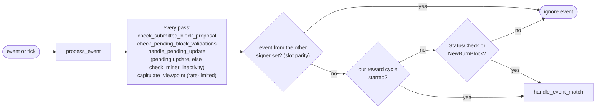

### Title
Attacker-chosen ancient `parent_tenure_id` forces an unbounded tenure-history walk in `check_parent_tenure_choice`, wedging the signer's event loop - (File: `stacks-signer/src/chainstate/mod.rs`)

### Summary
`check_parent_tenure_choice` is invoked on every block proposal whose declared `parent_tenure_id` differs from `prior_sortition` (i.e. any tenure-change proposal claiming a reorg) [1](#0-0) . It calls `StacksClient::get_tenure_forking_info`, which walks backwards from `prior_sortition` all the way to the miner-chosen `chosen_parent` (`parent_tenure_id`), looping in `DEPTH_LIMIT`-sized server-side batches until the requested parent is reached [2](#0-1) , then iterates every returned tenure and performs a DB lookup for each [3](#0-2) . Because `chosen_parent` is a value the proposing miner freely chooses from any consensus hash that still exists in the sortition history (which is never pruned), a single malicious/one-slot miner can name an arbitrarily old tenure ID as `parent_tenure_id`, forcing every signer that receives the gossiped proposal to perform O(chain-height) sequential round-trips and DB reads before it can reject (or accept) the proposal.

### Finding Description
This is the direct analog of the reported bug class: an attacker-influenced, unboundedly-growing history is walked in full inside a hot code path that every signer must execute per incoming message, rather than being bounded or indexed with a resumable cursor.

- `check_parent_tenure_choice` is reached from `check_proposal`/`check_block_against_state` whenever `self.prior_sortition != self.parent_tenure_id` — i.e. it runs on ordinary proposal handling, which every signer performs for every `BlockProposal` gossip event (see `docs/signer-flows.md` section 3, "fresh evaluation ... v1 SortitionsView::check_proposal or v2 GlobalStateView::check_proposal") [4](#0-3) .
- `get_tenure_forking_info` has no bound on how far back it will walk: it loops fetching `DEPTH_LIMIT`-sized pages from the node's `/v3/tenures/fork_info` until the cursor reaches `chosen_parent`, extending an ever-growing `VecDeque<TenureForkingInfo>` [5](#0-4) . The server-side handler itself only bounds a *single call* to `DEPTH_LIMIT` sortitions [6](#0-5) ; nothing bounds the number of *calls* the client issues to walk the entire chain back to an attacker-chosen ancient consensus hash.
- Once fetched, `check_parent_tenure_choice` iterates every one of these tenures, issuing a `SignerDb` read (`get_globally_accepted_block_count_in_tenure`, `get_first_approved_block_in_tenure`) per tenure [7](#0-6) , then on success re-iterates the collected `superseded_tenures` to write `mark_tenure_superseded` for each one [8](#0-7) , an unbounded, attacker-sized batch of DB writes.

Unlike the `stakerTierHistory` case, this isn't an on-chain gas bomb — it is a CPU/network-time bomb inside the signer's single-threaded `process_event` loop. `process_event` runs the housekeeping (`check_submitted_block_proposal`, `check_pending_block_validations`, `handle_pending_update`, `capitulate_viewpoint`) and dispatch synchronously each pass [9](#0-8) ; a proposal evaluation that blocks for an extended period on repeated network round-trips to walk millions of historical tenures stalls that same loop from processing pre-commits, signatures, and timeouts for other, legitimate blocks during that window.

### Impact Explanation
This maps to the High-severity class: "a signer wedged into never signing valid blocks" (temporarily, for the duration of the attacker-forced walk, and repeatably on each such proposal). A single non-majority miner, when it wins a slot (or via a re-gossiped/mocked proposal depending on protocol version), can name a `parent_tenure_id` from very early in chain history. Every signer that receives the proposal must synchronously perform an O(chain height / DEPTH_LIMIT) chain of dependent HTTP round trips to its own node plus O(chain height) SignerDb reads before it can even reach a verdict on the proposal, during which time-critical operations (pre-commit timeout checks, submitted-proposal timeout checks, competing valid-block evaluation) are delayed. Repeating this on subsequent proposals amplifies the effect into a sustained availability degradation of the signer network, without requiring any signer's key or a majority of signers.

### Likelihood Explanation
Low cost to trigger: the attacker only needs to be the block proposer for one tenure (a normal, expected occurrence in the miner rotation) and set `parent_tenure_id` to any historical consensus hash still present in the local `SortitionDB` (sortition history is retained indefinitely, unlike `superseded_tenures`, which is explicitly pruned to `MAX_FORK_DEPTH` (100) burn blocks [10](#0-9)  — that pruning only protects the *recorded permit*, not the cost of the lookup itself). No signer collusion, no majority, and no auth token is required; the crafted proposal is delivered exactly like any legitimate one via the existing gossip path.

### Recommendation
- Bound `get_tenure_forking_info`/`get_tenure_forking_info_step` walking distance (e.g., reject or short-circuit-reject any proposal whose `parent_tenure_id` is more than `MAX_FORK_DEPTH` sortitions behind `prior_sortition`) before issuing any network calls, mirroring the existing `MAX_FORK_DEPTH` bound already used for recording superseded tenures.
- Alternatively, have the node-side endpoint return a definitive "too deep, reject" response in one round trip instead of requiring the signer to page through the entire distance client-side.
- Ensure the per-tenure DB checks in `check_parent_tenure_choice` are also capped, and consider making this evaluation asynchronous/cancellable so it cannot block the main `process_event` loop's timeout housekeeping.

### Proof of Concept
Conceptual (cannot be executed without the full node/network harness available to a Devin session, so only the reachable path is demonstrated here):
1. Let signer S have processed a chain of height `H` (e.g., H = 1,000,000 tenures).
2. Malicious miner M wins a sortition and proposes a tenure-change block whose `parent_tenure_id` is the consensus hash of tenure #1 (near genesis), while `prior_sortition` is tenure #999,999.
3. `check_proposal`/`check_block_against_state` detects `prior_sortition != parent_tenure_id` and calls `check_parent_tenure_choice`, which calls `client.get_tenure_forking_info(tenure_1_hash, tenure_999999_hash)` [11](#0-10) .
4. `get_tenure_forking_info` loops, issuing ⌈999,998/DEPTH_LIMIT⌉ sequential HTTP requests to the local node, each blocking on the prior response [5](#0-4) .
5. On return, `check_parent_tenure_choice` performs up to ~999,998 `SignerDb` lookups in a single synchronous loop [12](#0-11) , blocking the signer's `process_event` loop for the entire duration and delaying its response to concurrent, legitimate, time-sensitive block proposals/pre-commits.

### Citations

**File:** stacks-signer/src/chainstate/mod.rs (L170-191)
```rust
    pub fn check_parent_tenure_choice(
        &self,
        signer_db: &mut SignerDb,
        client: &StacksClient,
        first_proposal_burn_block_timing: &Duration,
    ) -> Result<bool, SignerChainstateError> {
        // if the parent tenure is the last sortition, it is a valid choice.
        // if the parent tenure is a reorg, then all of the reorged sortitions
        //  must either have produced zero blocks _or_ produced their first (and only) block
        //  very close to the burn block transition.
        if self.prior_sortition == self.parent_tenure_id {
            return Ok(true);
        }
        info!(
            "Most recent miner's tenure does not build off the prior sortition, checking if this is valid behavior";
            "sortition_state.consensus_hash" => %self.consensus_hash,
            "sortition_state.prior_sortition" => %self.prior_sortition,
            "sortition_state.parent_tenure_id" => %self.parent_tenure_id,
        );

        let tenures_reorged =
            client.get_tenure_forking_info(&self.parent_tenure_id, &self.prior_sortition)?;
```

**File:** stacks-signer/src/chainstate/mod.rs (L201-245)
```rust
        // Track which tenures are superseded by the reorg, then mark them in
        // the DB after the reorg is permitted.
        let mut superseded_tenures = Vec::new();
        for tenure in tenures_reorged.iter() {
            if tenure.consensus_hash == self.parent_tenure_id {
                // this was a built-upon tenure, no need to check this tenure as part of the reorg.
                continue;
            }

            // disallow reorg if more than one block has already been signed
            let globally_accepted_blocks =
                signer_db.get_globally_accepted_block_count_in_tenure(&tenure.consensus_hash)?;
            if globally_accepted_blocks > 1 {
                warn!(
                    "Miner is not building off of most recent tenure, but a tenure they attempted to reorg has already more than one globally accepted block.";
                    "parent_tenure" => %self.parent_tenure_id,
                    "last_sortition" => %self.prior_sortition,
                    "violating_tenure_id" => %tenure.consensus_hash,
                    "violating_tenure_first_block_id" => ?tenure.first_block_mined,
                    "globally_accepted_blocks" => globally_accepted_blocks,
                );
                return Ok(false);
            }

            let Some(first_block_mined) = &tenure.first_block_mined else {
                // The node saw no blocks in this tenure, so the reorg takes nothing away from
                // the canonical chain. We may still hold a signature over a block in it that
                // the node has never seen (a block we accept locally is not handed to the node
                // until the whole signer set has signed it), so the reorg must still be
                // recorded if it is permitted.
                superseded_tenures.push(tenure);
                continue;
            };
            let Some(local_block_info) =
                signer_db.get_first_approved_block_in_tenure(&tenure.consensus_hash)?
            else {
                warn!(
                    "Miner is not building off of most recent tenure, but a tenure they attempted to reorg has already mined blocks, and there is no local knowledge for that tenure's block timing.";
                    "parent_tenure" => %self.parent_tenure_id,
                    "last_sortition" => %self.prior_sortition,
                    "violating_tenure_id" => %tenure.consensus_hash,
                    "violating_tenure_first_block_id" => %first_block_mined,
                );
                return Ok(false);
            };
```

**File:** stacks-signer/src/chainstate/mod.rs (L290-293)
```rust
        // Every reorged tenure cleared the rules, so the reorg is permitted.
        for tenure in superseded_tenures {
            self.record_superseded_tenure(signer_db, tenure);
        }
```

**File:** stacks-signer/src/client/stacks_client.rs (L318-357)
```rust
    /// Get information about the tenures between `chosen_parent` and `last_sortition`
    pub fn get_tenure_forking_info(
        &self,
        chosen_parent: &ConsensusHash,
        last_sortition: &ConsensusHash,
    ) -> Result<Vec<TenureForkingInfo>, ClientError> {
        debug!("StacksClient: Getting tenure forking info";
            "chosen_parent" => %chosen_parent,
            "last_sortition" => %last_sortition,
        );
        let mut tenures: VecDeque<TenureForkingInfo> =
            self.get_tenure_forking_info_step(chosen_parent, last_sortition)?;
        if tenures.is_empty() {
            return Ok(vec![]);
        }
        while tenures.back().map(|x| &x.consensus_hash) != Some(chosen_parent) {
            let new_start = tenures.back().ok_or_else(|| {
                ClientError::InvalidResponse(
                    "Should have tenure data in forking info response".into(),
                )
            })?;
            let mut next_results =
                self.get_tenure_forking_info_step(chosen_parent, &new_start.consensus_hash)?;
            if next_results.pop_front().is_none() {
                return Err(ClientError::InvalidResponse(
                    "Could not fetch forking info all the way back to the requested chosen_parent"
                        .into(),
                ));
            }
            if next_results.is_empty() {
                return Err(ClientError::InvalidResponse(
                    "Could not fetch forking info all the way back to the requested chosen_parent"
                        .into(),
                ));
            }
            tenures.extend(next_results);
        }

        Ok(tenures.into_iter().collect())
    }
```

**File:** docs/signer-flows.md (L80-98)
```markdown
Every pass through `process_event`, whether an event arrived or the loop just
ticked, runs the same housekeeping before dispatch: retire a timed-out
validation submission, submit the next queued proposal, settle any pending
state-machine update (or, if none is pending, check the current miner for
inactivity), and consider capitulating the miner view. If the local state
machine changed, a `StateMachineUpdate` is broadcast over StackerDB both before
and after the event is handled.



**File:** docs/signer-flows.md (L185-203)
```markdown
    KNOWN -- no --> DRAIN["collect early votes<br/>drain_pending_block_responses"] --> FRESH["fresh evaluation:<br/>new BlockInfo, fetch<br/>SortitionsView if needed"]
    FRESH --> CHECK["check_block_against_state:<br/>protocol version consensus (NoSignerConsensus),<br/>static validity, no problematic_txs<br/>(ProblematicTransactions), then<br/>v1 SortitionsView::check_proposal or<br/>v2 GlobalStateView::check_proposal → section 7"]
    CHECK -- invalid --> REJ["send rejection<br/>(not stored)"]:::bad
    CHECK -- "not provably invalid" --> BUSY{"validation slot free?<br/>submitted_block_proposal"}
    BUSY -- yes --> SUBMIT["submit_block_for_validation<br/>(ask the stacks-node)"]
    BUSY -- no --> QUEUE["queue it<br/>insert_pending_block_validation"]
    SUBMIT --> STORE["insert_block +<br/>process_pending_responses_for_block<br/>(replay early votes)"]
    QUEUE --> STORE
    classDef bad fill:#d84a3f22,stroke:#c9473d,stroke-width:1.5px;
```

Early votes: acceptances, rejections, and pre-commits that arrived before the
proposal itself are parked in pending tables and replayed once the proposal is
known.

> Anchors: `handle_block_proposal`, `should_reevaluate_block`,
> `should_reevaluate_reject_reason`, `check_block_against_state`,
> `submit_block_for_validation`, `process_pending_responses_for_block`
> (signer.rs); `check_proposal` (chainstate/v1.rs, v2.rs)
```

**File:** stackslib/src/net/api/get_tenures_fork_info.rs (L225-259)
```rust
            let mut results = vec![];
            let mut cursor = SortitionDB::get_block_snapshot_consensus(sortdb.conn(), &start_from)?
                .ok_or_else(|| ChainError::NoSuchBlockError)?;
            results.push(TenureForkingInfo::from_snapshot(
                &cursor,
                sortdb,
                chainstate,
                &network.stacks_tip.block_id(),
            )?);
            let mut depth = 0;
            while depth < DEPTH_LIMIT && cursor.consensus_hash != recurse_end {
                if height_bound >= cursor.block_height {
                    return Err(ChainError::NotInSameFork);
                }
                cursor =
                    SortitionDB::get_block_snapshot(sortdb.conn(), &cursor.parent_sortition_id)?
                        .ok_or_else(|| ChainError::NoSuchBlockError)?;
                if cursor.sortition
                    || chainstate
                        .nakamoto_blocks_db()
                        .is_shadow_tenure(&cursor.consensus_hash)?
                {
                    results.push(TenureForkingInfo::from_snapshot(
                        &cursor,
                        sortdb,
                        chainstate,
                        &network.stacks_tip.block_id(),
                    )?);
                }
                if cursor.sortition {
                    // don't count shadow blocks towards the depth, since there can be a large
                    // swath of them.
                    depth += 1;
                }
            }
```

**File:** stacks-signer/src/v0/signer.rs (L61-63)
```rust
/// How far below the burnchain tip the signer keeps a record that it sanctioned the reorg of
/// a tenure. A fork deeper than this would cause much bigger problems than a stale conflict.
const MAX_FORK_DEPTH: u64 = 100;
```
