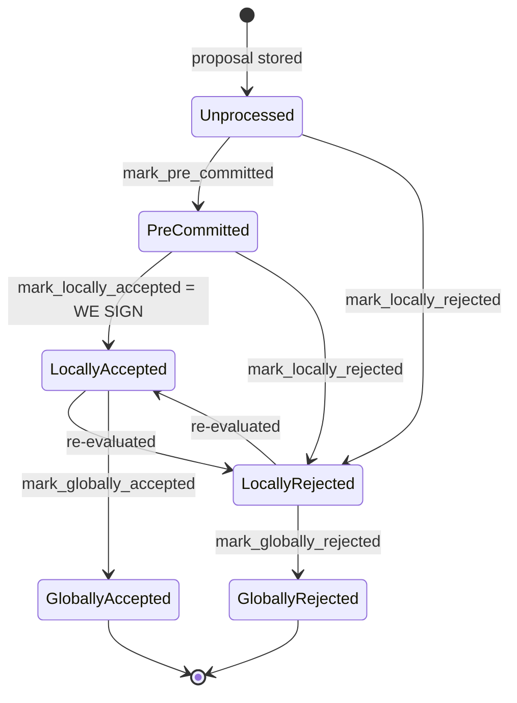

I have sufficient evidence to write up the finding.

### Title
Stale rejection weight is never cleared when a signer later accepts the same block, causing the node's coordinator to declare a signable block dead - ([File: stacks-node/src/nakamoto_node/stackerdb_listener.rs])

### Summary
`StackerDBListener` tallies each signer's `BlockResponse` into two independent counters, `total_weight_approved` and `total_weight_rejected`, keyed by `slot_id` membership in two different sets (`gathered_signatures` and `responded_signers`). A signer is explicitly permitted by the signer-side state machine to move from `LocallyRejected` back to `LocallyAccepted` for the same block (re-evaluation), and later sign it. When that happens, the node keeps the signer's earlier rejection weight in `total_weight_rejected` forever while also adding the new, valid, verified acceptance weight to `total_weight_approved`. The two aggregates are no longer complementary partitions of `total_weight`, breaking the aggregated-weight-vs-verified-accepts equality the coordinator's loop depends on.

### Finding Description
`BlockInfo::check_state` in [1](#0-0)  allows `LocallyRejected -> LocallyAccepted` (and vice versa) as legitimate re-evaluation transitions, and `docs/signer-flows.md` documents this explicitly: "LocallyRejected --> LocallyAccepted : re-evaluated" [2](#0-1) . This means a single, honest signer can legitimately send a `BlockResponse::Rejected` for a block and, on a later re-proposal/re-evaluation of the *same* block (same `signer_signature_hash`), send a `BlockResponse::Accepted` with a real signature.

On the node side, `StackerDBListener` processes these two message kinds independently:

- On `Accepted`, weight is added to `total_weight_approved` only if the slot is not already in `gathered_signatures`, and the slot is also inserted into `responded_signers`: [3](#0-2) 
- On `Rejected`, weight is added to `total_weight_rejected` only if the slot is not already in `responded_signers`: [4](#0-3) 

Because the `Rejected` path only guards against re-adding weight to `responded_signers`, and the `Accepted` path only guards against re-adding weight to `gathered_signatures`, a `Reject` followed later by an `Accept` from the *same* slot causes:
1. `total_weight_rejected` to be incremented (first message).
2. `responded_signers` to contain the slot after the reject.
3. The later `Accepted` message still adds the slot's weight to `total_weight_approved`, because the `Accepted` handler checks `gathered_signatures`, not `responded_signers` — it has no knowledge that this slot already "responded."

The result: this signer's weight is now counted in *both* `total_weight_rejected` and `total_weight_approved` simultaneously, and `total_weight_rejected` is never decremented or corrected even though the signer's current, cryptographically verified vote is Accept. `BlockStatus` never removes/re-derives `total_weight_rejected` except via `reset_rejections`, which is only invoked on a coordinator-side timeout and is explicitly documented as *not* touching approvals because "an old approval could always be used to make a block reach the approval threshold" [5](#0-4)  — but it likewise does nothing to correct stale *rejection* weight left over from a signer who has since flipped to accept.

### Impact Explanation
`SignCoordinator`'s wait loop in `signer_coordinator.rs` treats `total_weight_rejected` as if it represented the current set of signers who reject the block, using it to decide the block is unsignable: [6](#0-5) 

Because `total_weight_rejected` can retain phantom weight from a signer who has already produced a valid signature accepting the very same block, the coordinator can hit `total_weight_rejected.saturating_add(self.weight_threshold) > self.total_weight` and return `NakamotoNodeError::SignersRejected` for a block that in reality still has enough honest signers willing (or already having signed) to reach the 70% threshold. This is the "aggregated-weight vs verified-accepts" equality break called out in scope: the aggregate no longer reflects the verified, current state of accepts/rejects. The practical effect is a liveness wedge at the node/coordinator level — a signable block is discarded, its txids can be marked temporarily/permanently excluded, and the miner is forced to abandon and re-propose, even though no majority of signers actually oppose the block.

### Likelihood Explanation
Medium. It requires only a single honest signer re-evaluating its own vote from reject to accept on the same block (a normal, documented, and expected path in the state machine — e.g., a rejection whose reason later becomes stale per `should_reevaluate_reject_reason`), combined with a proposal outliving the initial rejection timeout so the same `signer_signature_hash` is retried. No majority, no other signer's key, and no malicious behavior is required — only ordinary re-proposal/re-evaluation timing.

### Recommendation
Track a signer's current vote as a single authoritative state (e.g., one map from `slot_id` to `Option<VoteKind>` with weight applied/removed on transition) rather than two independently-accumulated, append-only weight counters (`total_weight_approved`, `total_weight_rejected`) gated by two different membership sets (`gathered_signatures`, `responded_signers`). When a slot's vote flips from Rejected to Accepted (or vice versa), the previous weight contribution must be removed from the old bucket before/while adding it to the new one, so `total_weight_approved + total_weight_rejected` never double-counts a single signer's weight, preserving the invariant that the two aggregates are always disjoint and their sum never exceeds `total_weight`.

### Proof of Concept
1. Configure a reward set with signers `A..J`, weight 10 each (`total_weight = 100`, `weight_threshold = 70` via `compute_voting_weight_threshold`).
2. Miner proposes block `B` (sighash `H`). Signer `A` locally rejects `H` for a stale reason (e.g., a conflict later found stale) and broadcasts `BlockResponse::Rejected` — `StackerDBListener` records `total_weight_rejected = 10`, `responded_signers = {A}`.
3. Three more signers (`B`, `C`, `D`) similarly reject for independent transient reasons — `total_weight_rejected = 40`, which already exceeds the blocking minority (30), so the coordinator would normally abort with `SignersRejected`.
4. Suppose instead only `A` rejects initially (`total_weight_rejected = 10`). The proposal is retried after a rejection-timeout (`reset_rejections` clears `total_weight_rejected` and `responded_signers`, but retains `gathered_signatures`/`total_weight_approved`, per [5](#0-4) ). On the retry, three more signers (`B`, `C`, `E`) reject (`total_weight_rejected = 30`) while `A` re-evaluates and now sends `BlockResponse::Accepted` for the *same* `H` (a legitimate re-evaluation). Because the `Accepted` handler only checks `gathered_signatures` (not `responded_signers`), `A`'s weight of 10 is added to `total_weight_approved` while `A`'s slot is still counted in `total_weight_rejected` from before the reset window closed (i.e., if `A`'s flip happens in the same window as the other three rejects, before the next `reset_rejections`), yielding `total_weight_rejected = 40` and `total_weight_approved = 10` simultaneously — `40 + 70 > 100`, triggering `SignersRejected`, even though `A` has a verified, standing signature over `H` and the real number of currently-rejecting signers (`B, C, E`) only carries 30 weight (not enough to block).
5. The coordinator aborts block production for `H`, discarding a block that a proper vote count would still consider signable.

### Citations

**File:** stacks-signer/src/signerdb.rs (L313-329)
```rust
    /// Check if the block state transition is valid
    fn check_state(&self, state: BlockState) -> bool {
        let prev_state = &self.state;
        if *prev_state == state {
            return true;
        }
        match state {
            BlockState::Unprocessed => false,
            BlockState::LocallyAccepted | BlockState::LocallyRejected => !matches!(
                prev_state,
                BlockState::GloballyRejected | BlockState::GloballyAccepted
            ),
            BlockState::GloballyAccepted => !matches!(prev_state, BlockState::GloballyRejected),
            BlockState::GloballyRejected => !matches!(prev_state, BlockState::GloballyAccepted),
            BlockState::PreCommitted => matches!(prev_state, BlockState::Unprocessed),
        }
    }
```

**File:** docs/signer-flows.md (L137-150)
```markdown

```

**File:** stacks-node/src/nakamoto_node/stackerdb_listener.rs (L443-465)
```rust
                        if !block.gathered_signatures.contains_key(&slot_id) {
                            block.total_weight_approved = block
                                .total_weight_approved
                                .saturating_add(signer_entry.weight);

                            info!("StackerDBListener: Signature Added to block";
                                "signer_signature_hash" => %block_sighash,
                                "signer_pubkey" => signer_pubkey.to_hex(),
                                "signer_slot_id" => slot_id,
                                "signature" => %signature,
                                "signer_weight" => signer_entry.weight,
                                "total_weight_approved" => block.total_weight_approved,
                                "percent_approved" => block.total_weight_approved as f64 / self.total_weight as f64 * 100.0,
                                "total_weight_rejected" => block.total_weight_rejected,
                                "percent_rejected" => block.total_weight_rejected as f64 / self.total_weight as f64 * 100.0,
                                "weight_threshold" => self.weight_threshold,
                                "tenure_extend_timestamp" => tenure_extend_timestamp,
                                "read_count_extend_timestamp" => read_count_extend_timestamp,
                                "server_version" => metadata.server_version,
                            );
                        }
                        block.gathered_signatures.insert(slot_id, signature);
                        block.responded_signers.insert(slot_id);
```

**File:** stacks-node/src/nakamoto_node/stackerdb_listener.rs (L515-518)
```rust
                        if block.responded_signers.insert(slot_id) {
                            block.total_weight_rejected = block
                                .total_weight_rejected
                                .saturating_add(signer_entry.weight);
```

**File:** stacks-node/src/nakamoto_node/stackerdb_listener.rs (L706-722)
```rust
    /// Reset rejections for a block proposal.
    /// This is used when a block proposal times out and we need to retry it by
    /// clearing the block's rejections. Block approvals cannot be cleared
    /// because an old approval could always be used to make a block reach
    /// the approval threshold.
    pub fn reset_rejections(&self, signer_sighash: &Sha512Trunc256Sum) {
        let (lock, _cvar) = &*self.blocks;
        let mut blocks = lock.lock().expect("FATAL: failed to lock block status");
        if let Some(block) = blocks.get_mut(signer_sighash) {
            block.responded_signers.clear();
            block.total_weight_rejected = 0;

            // Add approving signers back to the responded signers set
            for (slot_id, _) in block.gathered_signatures.iter() {
                block.responded_signers.insert(*slot_id);
            }
        }
```

**File:** stacks-node/src/nakamoto_node/signer_coordinator.rs (L509-540)
```rust
            if block_status
                .total_weight_rejected
                .saturating_add(self.weight_threshold)
                > self.total_weight
            {
                info!(
                    "{}/{} signer weight votes to reject block",
                    block_status.total_weight_rejected, self.total_weight;
                    "signer_signature_hash" => %block_signer_sighash,
                );
                counters.bump_naka_rejected_blocks();

                // Only act on failed txids that a blocking minority (>30% weight) agrees on
                let blocking_minority = self.total_weight.saturating_sub(self.weight_threshold);
                let mut temporarily_excluded_txids = HashSet::new();
                let mut permanently_excluded_txids = HashSet::new();
                for (txid, info) in &block_status.failed_txids {
                    if info.total_weight > blocking_minority {
                        // Do not perma ban txids that only a small minority of signers reported as problematic
                        // But make sure its removed from the next block proposal
                        if info.problematic_weight > blocking_minority {
                            permanently_excluded_txids.insert(txid.clone());
                        } else {
                            temporarily_excluded_txids.insert(txid.clone());
                        }
                    }
                }

                return Err(NakamotoNodeError::SignersRejected {
                    temporarily_excluded_txids,
                    permanently_excluded_txids,
                });
```
