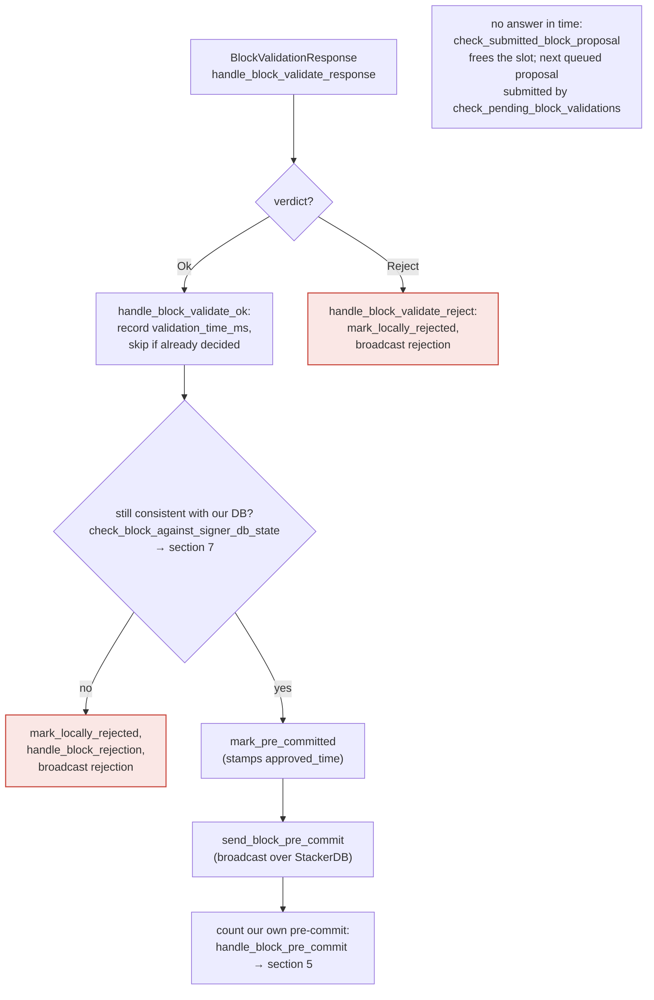
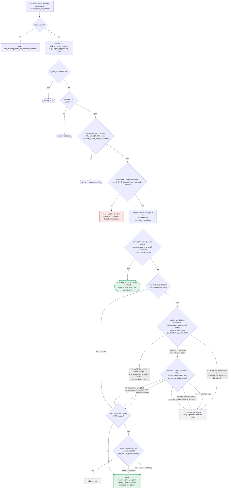
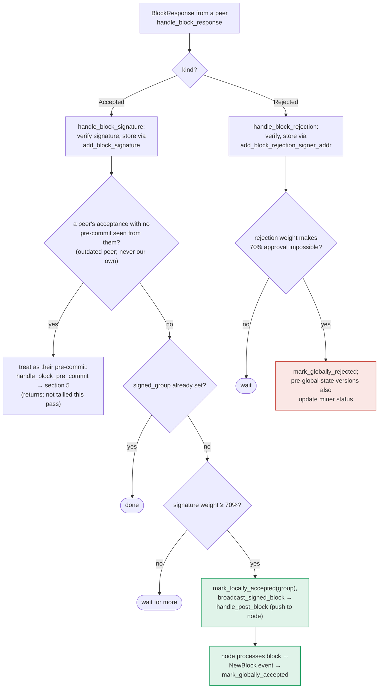

### Title
Peer-signature tally path can push a stale/conflicting block to the node without re-running the chainstate/conflict recheck that gates the local signing path - (File: `stacks-signer/src/v0/signer.rs`, `docs/signer-flows.md`)

### Summary
The v0 signer has two independent paths that can trigger the terminal, consensus-relevant action of handing a block's assembled signature set to the stacks-node (`handle_post_block`/`broadcast_signed_block`): (1) the local signing path, `handle_block_pre_commit`, which explicitly re-runs `check_block_against_signer_db_state` and the `get_signed_conflicts`/`reorg_permit_stands`/`conflict_still_blocks` "one last look" guard immediately before producing this signer's own signature; and (2) the peer-tally path, `handle_block_response` → `handle_block_signature`, which counts *other* signers' `Accepted` responses toward the 70% weight threshold and, once reached, calls `mark_locally_accepted(group)` and pushes the block via `broadcast_signed_block`. Per the documented event map, path (2) has no equivalent recheck step before the push. This mirrors the GoGoPool `whenNotPaused` finding: a primary state-changing action is properly guarded (`stakeGGP`/`withdrawGGP` behind `whenNotPaused`; this signer's own signature behind the re-run chainstate/conflict check), but a second path that produces the same externally consequential effect (`restakeGGP`/`claimAndRestake`; here, pushing the block to the node) omits the guard.

### Finding Description
`docs/signer-flows.md` §5 (Pre-commit threshold → signature) states explicitly:

> "Between validation and threshold, we may have signed a _different_ block at the same height, possibly in another tenure, so the world must be re-checked before the signature leaves the box"

and shows `handle_block_pre_commit` re-running `check_block_against_signer_db_state` (RECHECK) and the conflict guard (`get_signed_conflicts`, `reorg_permit_stands`, `conflict_still_blocks`) immediately before `SIGN` [1](#0-0) . Section 4 (`handle_block_validate_ok`) similarly re-runs `check_block_against_signer_db_state` before even broadcasting a pre-commit [2](#0-1) .

Section 6 (`handle_block_response`) describes the alternate path by which the *same* terminal effect — pushing the block to the node — is reached, this time driven purely by tallying peers' `Accepted` messages:

> "Rejections tally toward the blocking minority... Acceptances tally toward the 70% signing threshold and reaching it makes _this_ signer assemble the signature set and push the block to its node."

The diagram for this path is: `handle_block_signature` (verify + store) → `GRP`/`TALLY` weight check → `BCAST["mark_locally_accepted(group), broadcast_signed_block → handle_post_block (push to node)"]` [3](#0-2) . Unlike sections 4 and 5, this diagram contains no `RECHECK` node calling `check_block_against_signer_db_state` or the conflict guard before `BCAST`.

The code confirms the shape of the SIGN branch that section 5 protects — `mark_locally_accepted`, `handle_block_signature`, and `send_block_response` are invoked only after the chainstate recheck and conflict guard have both passed [4](#0-3) . The peer-tally path reuses `handle_block_signature` to store and count votes, but per the documented flow, reaching the 70% threshold there does not re-invoke that same guard before assembling and pushing the block.

Practically: a one-slot miner (plus ordinary gossip, no majority of signers required to be malicious) can create the exact race section 5 was built to close — propose block B at height h, get enough of the signer set's *pre-commits/acceptances* in flight before this signer's own view changes (e.g., before it learns of a conflicting block A at the same height that it has itself locally/globally accepted, or before block B's supporting tenure/sortition becomes stale). If the remaining peer acceptances needed to cross 70% arrive through `handle_block_response` after this signer's own local state has moved on, the tally path pushes B to the node with no re-derivation of `conflict_still_blocks`/`reorg_permit_stands`/`check_block_against_signer_db_state` — the exact checks that would have refused to let this signer's *own* signature "leave the box" under the same circumstances in `handle_block_pre_commit`.

### Impact Explanation
This breaks the "one-per-height"/approved-parent-vs-canonical equality the pre-commit re-check machinery exists to enforce: a signer can end up assembling and delivering a globally-signed, conflicting/stale block to its own node purely because it happened to receive the *last* peer acceptances through the un-guarded tally path rather than through its own guarded signing path. Under the taxonomy given, this falls under "a signer signing [participating in finalizing]... a conflicting block" and the "aggregated-weight vs verified-accepts" equality the rules call out — the aggregated weight is honored without re-verifying that this signer's own chainstate view still supports counting toward/acting on that weight.

### Likelihood Explanation
Medium. It requires ordinary timing — a competing proposal or state update arriving between this signer's earlier pre-commit/acceptance broadcast and the moment peer acceptances cross the 70% threshold via `handle_block_response` rather than via `handle_block_pre_commit`. No majority of malicious signers, no key compromise, and no auth-token access is needed; it is purely a race in message-arrival order that a single well-timed miner/proposal can provoke, matching the "one-slot miner plus gossip" constraint.

### Recommendation
Add the same `check_block_against_signer_db_state` plus the `get_signed_conflicts`/`reorg_permit_stands`/`conflict_still_blocks` guard sequence to the `handle_block_response`/`handle_block_signature` path immediately before `mark_locally_accepted(group)`/`broadcast_signed_block`, so that crossing the 70% peer-acceptance threshold is gated identically to crossing the 70% pre-commit threshold in `handle_block_pre_commit`.

### Proof of Concept
Conceptual, derived from the documented event map (I could not fetch the full body of `handle_block_response`/`handle_block_signature` within the remaining tool budget, so the internal-check claim rests on the absence of a `RECHECK` node in `docs/signer-flows.md` §6 versus its explicit presence in §4/§5; a Devin session with repo access should confirm this directly against the function bodies before treating this as fully proven):

1. Signer S locally accepts/signs block A at height h in tenure T1 (§5 SIGN branch), which should now make any conflicting block at height h "fresh" and blocked.
2. A conflicting block B at height h (e.g., a re-proposed tenure-start block in T2) is independently pre-committed and then accepted by enough *other* signers before they learn of A.
3. Those other signers' `Accepted` responses for B arrive at S via `handle_block_response`. Per §6, S tallies them with `handle_block_signature`; once weight ≥ 70%, S proceeds straight to `mark_locally_accepted(group)` + `broadcast_signed_block` for B.
4. Because (per the diagram) this path has no `RECHECK`/conflict-guard step, S pushes B to its own node even though, had B instead crossed the 70% threshold through S's own `handle_block_pre_commit`, the freshness/conflict check against already-signed block A would have refused it.

### Citations

**File:** docs/signer-flows.md (L205-227)
```markdown
## 4. The node's validation verdict

The stacks-node answers the `/v3/block_proposal` submission. On OK, the signer
re-checks its own DB state and only then advertises willingness to sign by
broadcasting a **pre-commit**. A signature is _not_ produced here.



> Anchors: `handle_block_validate_response`, `handle_block_validate_ok`,
> `handle_block_validate_reject`, `check_block_against_signer_db_state`,
> `send_block_pre_commit` (signer.rs)
```

**File:** docs/signer-flows.md (L229-272)
```markdown
## 5. Pre-commit threshold → signature

The only place the signer produces a block signature by counting votes.
Pre-commits from peers (and our own) accumulate; at ≥70% weight the signer
decides whether to follow through. Between validation and threshold, we may have
signed a _different_ block at the same height, possibly in another tenure, so
the world must be re-checked before the signature leaves the box.


```

**File:** docs/signer-flows.md (L349-387)
```markdown
## 6. Responses from other signers

Peer acceptances and rejections drive the two consensus outcomes. Acceptances
tally toward the 70% signing threshold and reaching it makes _this_ signer
assemble the signature set and push the block to its node. Rejections tally
toward the blocking minority (>30%), which makes the 70% unreachable and
finalizes the block as globally rejected.



The outdated-peer fallback keeps mixed-version fleets live: an acceptance from a
peer that never sent a pre-commit is routed into the pre-commit path instead, so
that peer's weight still counts toward the threshold that produces _our_
signature. Note that reaching 70% signatures still only marks the block
_locally_ accepted with the group timestamp; global acceptance waits for the node
to adopt it. Marking the miner invalid on a 30% `ReorgNotAllowed` rejection is
skipped once the active protocol version uses global signer state.

> Anchors: `handle_block_response`, `handle_block_signature`,
> `store_and_process_block_signature`, `broadcast_signed_block`,
> `handle_block_rejection`, `store_and_process_block_rejection` (signer.rs)
```

**File:** stacks-signer/src/v0/signer.rs (L1340-1479)
```rust
        // The chain and signer db state may have changed materially since this block passed the
        // proposal-time checks (e.g. between validation and reaching the pre-commit threshold we
        // may have signed a block that this one would reorg). Re-run the chainstate checks
        // before putting a signature over the block, and respond with a rejection if they no
        // longer pass, just as the block validation response handler does.
        if let Some(block_rejection) =
            self.check_block_against_signer_db_state(stacks_client, &block_info.block)
        {
            warn!(
                "{self}: Reached the pre-commit threshold for a block, but it no longer passes the chainstate checks. Rejecting.";
                "signer_signature_hash" => %block_hash,
                "block_height" => block_info.block.header.chain_length,
                "reject_code" => %block_rejection.reason_code,
                "reject_reason" => &block_rejection.reason,
            );
            if let Err(e) = block_info.mark_locally_rejected() {
                if !block_info.has_reached_consensus() {
                    warn!("{self}: Failed to mark block as locally rejected: {e:?}");
                }
            };
            self.signer_db
                .insert_block(&block_info)
                .unwrap_or_else(|e| self.handle_insert_block_error(e));
            self.handle_block_rejection(&block_rejection, sortition_state);
            self.send_block_response(&block_info.block, block_rejection.into());
            return;
        }

        // A pre-commit may be superseded by a competing proposal at the same height (e.g. a
        // re-proposed tenure-start block after the first failed to reach consensus), but a
        // signature must not be superseded while it's still "fresh". A signed block at the
        // same or higher height in ANY tenure is a conflict: two blocks at the same height are
        // siblings no matter which tenure they belong to (e.g. the next tenure's tenure-start
        // block conflicts with the current tenure's block at the same height). Blocks in
        // tenures whose reorg we sanctioned under the reorg-timing rules are excluded, but
        // only while the sortition the permit was granted to is still canonical
        // (`check_parent_tenure_choice` records the permit, `reorg_permit_stands` re-derives
        // its validity from the node); every other question about whether a conflict is
        // still live is derived from the node in `conflict_still_blocks`.
        //
        // Unlike the chainstate check above, a refusal here is "for now" rather than a
        // broadcast rejection: a later pre-commit re-evaluation may still sign the block once
        // the conflicting signature has gone stale.
        let conflicts = match self
            .signer_db
            .get_signed_conflicts(block_info.block.header.chain_length, &block_hash)
        {
            Ok(conflicts) => conflicts,
            Err(e) => {
                warn!("{self}: Failed to query the signed blocks. Refusing to sign block {block_hash}: {e:?}");
                return;
            }
        };
        let freshness_cutoff = get_epoch_time_secs().saturating_sub(
            self.proposal_config
                .tenure_last_block_proposal_timeout
                .as_secs(),
        );
        // A fresh signature only blocks while the block it covers could still be part of the
        // chain: see `conflict_still_blocks`, which asks the node whether it is. Check
        // freshness first: it is a local timestamp comparison, while `reorg_permit_stands`
        // and `conflict_still_blocks` each query the node, so stale conflicts cost no
        // round-trips.
        if let Some(conflict) = conflicts.iter().find(|conflict| {
            conflict.last_endorsed > freshness_cutoff
                && !self.reorg_permit_stands(stacks_client, conflict)
                && self.conflict_still_blocks(
                    stacks_client,
                    conflict,
                    block_info.block.header.chain_length,
                )
        }) {
            warn!(
                "{self}: Reached the pre-commit threshold for a block, but we have recently signed or accepted a different block at the same or higher height. Refusing to sign.";
                "signer_signature_hash" => %block_hash,
                "block_height" => block_info.block.header.chain_length,
                "conflicting_signer_signature_hash" => %conflict.signer_signature_hash,
                "conflicting_block_height" => conflict.stacks_height,
                "conflicting_consensus_hash" => %conflict.consensus_hash,
            );
            return;
        }

        // No conflict is both fresh and still live. A conflict that no longer matters, i.e.
        // stale, or provably dead per `conflict_still_blocks`, cannot veto on its own. A
        // stale conflict in another tenure in particular no longer speaks for us: whether this
        // block may replace what another tenure built is settled by the chainstate checks above.
        // A stale conflict in this block's own tenure still blocks if the node already has that
        // tenure at or above the proposed height, since the proposal then duplicates state the
        // node has already built on. (The chainstate checks don't cover this for tenure-change
        // blocks: those check the parent tenure instead of their own.)
        // The permit check is deferred to here so that only same-tenure conflicts pay for it.
        if conflicts.iter().any(|conflict| {
            conflict.consensus_hash == block_info.block.header.consensus_hash
                && !self.reorg_permit_stands(stacks_client, conflict)
        }) {
            match stacks_client.get_tenure_tip(&block_info.block.header.consensus_hash) {
                Ok(tip) => {
                    let tip_height = tip.anchored_header.height();
                    if tip_height >= block_info.block.header.chain_length {
                        warn!(
                            "{self}: Reached the pre-commit threshold for a block that conflicts with previously signed or accepted blocks, and the canonical tip of its tenure is already at or above the proposed height. Refusing to sign.";
                            "signer_signature_hash" => %block_hash,
                            "block_height" => block_info.block.header.chain_length,
                            "canonical_tip_height" => tip_height,
                        );
                        return;
                    }
                }
                Err(e) => {
                    warn!(
                        "{self}: Failed to fetch the canonical tip of the proposed block's tenure: {e:?}. Treating the tenure as unconfirmed.";
                        "signer_signature_hash" => %block_hash,
                        "consensus_hash" => %block_info.block.header.consensus_hash,
                    );
                }
            }
        }
        if !conflicts.is_empty() {
            info!(
                "{self}: Reached the pre-commit threshold for a block that conflicts with previously signed or accepted blocks, but none of those conflicts still blocks it. Signing the replacement.";
                "signer_signature_hash" => %block_hash,
                "block_height" => block_info.block.header.chain_length,
                "num_conflicts" => conflicts.len(),
            );
        }
        // It is only considered globally accepted IFF we receive a new block event confirming it OR see the chain tip of the node advance to it.
        if let Err(e) = block_info.mark_locally_accepted(false) {
            if !block_info.has_reached_consensus() {
                warn!("{self}: Failed to mark block as locally accepted: {e:?}",);
            }
        }
        self.signer_db
            .insert_block(&block_info)
            .unwrap_or_else(|e| self.handle_insert_block_error(e));
        let accepted = self.create_block_acceptance(&block_info.block);
        // have to save the signature _after_ the block info
        self.handle_block_signature(stacks_client, sortition_state, &accepted);
        self.send_block_response(&block_info.block, accepted.into());
    }
```
