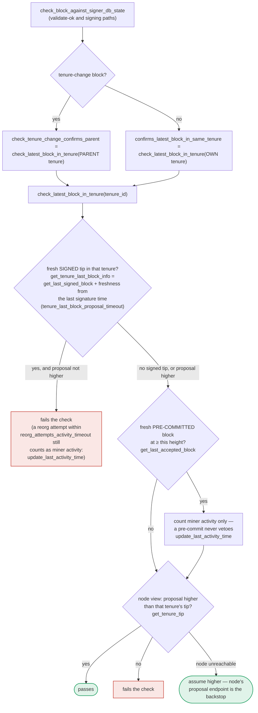

### Title
Off-by-one-second freshness gap in `SortitionData::get_tenure_last_block_info` can let a signer double-sign conflicting sibling blocks - (File: `stacks-signer/src/chainstate/mod.rs`)

### Summary
`SortitionData::get_tenure_last_block_info` decides whether a previously signed block in a tenure is still "fresh" (and therefore must veto a conflicting proposal at the same height) using a strict `>` comparison against second-granularity wall-clock time. Like the ERC20Airdrop2 `ongoingWithdrawals` modifier's strict `<` boundary that clipped a window one instant too early, this strict `>` combined with integer-second truncation from `get_epoch_time_secs()` clips the signer's conflict-freshness window up to one second short of the configured `tenure_last_block_proposal_timeout`. That gap is used by the same conflict-guard logic that gates whether the signer is allowed to place a second signature on a sibling block at the same height, so shrinking the window prematurely can let a signer sign two conflicting blocks that should both still be inside the "protected" freshness period.

### Finding Description
`get_tenure_last_block_info` computes: [1](#0-0) 

```
if signed_over_time.saturating_add(tenure_last_block_proposal_timeout.as_secs())
    > get_epoch_time_secs()
{
    // fresh -> Some(block_info)
} else {
    // timed out -> None
}
```

`signed_over_time` and `get_epoch_time_secs()` are both truncated to whole seconds, but the actual elapsed wall-clock time between the signature and "now" can be anywhere from just over 0 to just under 1 second less than the nominal `tenure_last_block_proposal_timeout`, purely due to truncation. Because the comparison is strict (`>`, not `>=`), the moment the second counters become equal, the function reports the previously-signed block as timed out — even though less than the configured timeout may actually have elapsed in real time.

This function is the sole source of truth for "is there still a fresh, signed tip in this tenure" and feeds `check_latest_block_in_tenure`, which is invoked from three places along the signing pipeline: at proposal arrival (`check_proposal` in `chainstate/v1.rs`/`v2.rs`), at validate-ok, and again at the pre-commit threshold (`check_block_against_signer_db_state` in `stacks-signer/src/v0/signer.rs`), per the documented flow: [2](#0-1) 

The same "freshness" notion (measured from `signed_self`/`signed_group`, whichever is later) is also used by the sibling-conflict guard at signing time (`get_signed_conflicts` / `conflict_still_blocks`, described in section 5 of the flow doc), which is the mechanism specifically responsible for preventing the signer from placing a second signature on a conflicting block at the same height while an earlier signature is still "fresh": [3](#0-2) [4](#0-3) 

Because both the height-veto check and the sign-time conflict guard derive freshness from the same integer-second, strict-`>` arithmetic, a single miner (with normal gossip timing, no other signer's key or majority needed) who obtains a signature over block A and then re-proposes a conflicting sibling block B for the same tenure/height timed to straddle the second boundary of A's `signed_self + tenure_last_block_proposal_timeout`, can cause the signer to treat A as stale up to ~1 second earlier than the real elapsed time would justify. If B's proposal, validation, and pre-commit round-trip land in that shrunk window, the signer's own conflict guard will not "hold" its signature back, and it will sign B — producing two valid signer signatures over two different, conflicting blocks at the same height in the same tenure.

The test suite `stacks-signer/src/v0/tests.rs::run_sibling_scenario` explicitly exercises this exact fresh/stale boundary for the sibling-conflict guard, confirming freshness (not majority behavior) is the deciding factor for whether the second sibling gets signed: [5](#0-4) [6](#0-5) 

### Impact Explanation
If the window closes early and a second conflicting sibling block collects a signature from the same signer while the first is (in real elapsed time) still supposed to be protected, this is a signer signing a conflicting block — the Critical-impact category defined by this scan's rules (equality: "signed-but-still-fresh" vs "already timed out" is broken by rounding). This can contribute signer weight toward two mutually exclusive blocks at the same height, undermining the one-signature-per-height invariant the freshness/conflict guard exists to enforce.

### Likelihood Explanation
The practical exploitation window is narrow — at most ~1 second, dictated purely by integer-second truncation of `get_epoch_time_secs()`, and additionally constrained by needing block re-proposal, validation, and pre-commit round-trips to land within that sub-second slack. This makes it a low-to-moderate likelihood, timing-sensitive condition rather than a reliably repeatable attack, but it requires no majority of signers, no other signer's key, and no node-side collusion — only a miner controlling proposal timing plus normal gossip, consistent with the in-scope threat model.

### Recommendation
Replace the strict `>` boundary in `get_tenure_last_block_info` with an inclusive `>=`-based check anchored on a monotonic, higher-resolution clock (e.g., `Instant`/millisecond epoch) instead of second-truncated `get_epoch_time_secs()`, and ensure `signed_self`/`signed_group` timestamps used elsewhere (`get_signed_conflicts`, `conflict_still_blocks`) are computed with the same precision so the "fresh" verdict cannot flip early relative to the actual configured `tenure_last_block_proposal_timeout`.

### Proof of Concept
No executable PoC was constructed given the tool constraints (this analysis is code-review based, not a running exploit). The reasoning is a direct code-path trace:
1. Signer signs block A for tenure T at height H; `signed_self` stored as second-truncated timestamp `t0`.
2. A miner immediately proposes conflicting sibling block B for the same tenure/height.
3. `get_tenure_last_block_info` is called at `now` where `now_seconds == t0 + tenure_last_block_proposal_timeout.as_secs()` (i.e., real elapsed time could be just under the configured timeout, e.g., `t0=100.9s`, timeout=5s, `now=105.1s` → integer seconds `100+5=105 > 105` is false, so it's already "timed out" though only 4.2s have truly elapsed).
4. `check_latest_block_in_tenure` no longer vetoes B on this basis, and the corresponding sign-time conflict-freshness check (same style of arithmetic) also treats A as stale.
5. The signer proceeds to sign B, resulting in two signed, conflicting sibling blocks at the same height. [7](#0-6)

### Citations

**File:** stacks-signer/src/chainstate/mod.rs (L330-364)
```rust
    pub fn get_tenure_last_block_info(
        consensus_hash: &ConsensusHash,
        signer_db: &SignerDb,
        tenure_last_block_proposal_timeout: Duration,
    ) -> Result<Option<BlockInfo>, ClientError> {
        // Get the last signed block in the tenure
        let last_signed_block = signer_db
            .get_last_signed_block(consensus_hash)
            .map_err(|e| ClientError::InvalidResponse(e.to_string()))?;

        let Some(block_info) = last_signed_block else {
            return Ok(None);
        };

        // `approved_time` may hold the pre-commit time; use the actual signature time.
        let Some(signed_over_time) = block_info.signed_self.max(block_info.signed_group) else {
            return Ok(None);
        };

        if signed_over_time.saturating_add(tenure_last_block_proposal_timeout.as_secs())
            > get_epoch_time_secs()
        {
            // The last accepted block is not timed out, return it
            Ok(Some(block_info))
        } else {
            // The last accepted block is timed out
            info!(
                "Last accepted block has timed out";
                "signer_signature_hash" => %block_info.block.header.signer_signature_hash(),
                "signed_over_time" => signed_over_time,
                "state" => %block_info.state,
            );
            Ok(None)
        }
    }
```

**File:** docs/signer-flows.md (L250-268)
```markdown
    RECHECK -- yes --> CONF["signed conflicts at height ≥ h,<br/>in ANY tenure<br/>get_signed_conflicts"]
    CONF --> PERM{"covered by a reorg permit whose<br/>permitting sortition is still canonical?<br/>reorg_permit_stands"}
    PERM -- yes --> EXCL(["excluded — our signature must not<br/>block a replacement we sanctioned"]):::good
    PERM -- no --> FRESH{"any of them still fresh?<br/>last_endorsed > cutoff"}
    FRESH -- yes --> SORT{"conflict_still_blocks, question 1:<br/>is its tenure's sortition still on the<br/>canonical burn chain?<br/>get_sortition_by_burn_hash"}
    SORT -- "404, with the node's burnchain tip<br/>at or past the burn block — a fork<br/>orphaned the tenure" --> OWN
    SORT -- "canonical, or we never<br/>saved its burn block" --> LIVE{"question 2: does the node's chain<br/>still reach the block itself?<br/>get_tenure_tip(its tenure)"}
    SORT -- "could not ask, or 404 with the<br/>node's tip still below the burn block" --> HOLD1
    LIVE -- "yes — real chain state" --> HOLD1["refuse to sign for now<br/>(may sign once conflict is stale)"]:::hold
    LIVE -- "no, and it was<br/>globally accepted" --> OWN
    LIVE -- "no, only locally accepted<br/>— but above this height" --> OWN
    LIVE -- "no, only locally accepted<br/>and a sibling at this height" --> HOLD1
    LIVE -- "could not ask" --> HOLD1
    FRESH -- "no — all stale" --> OWN{"a conflict in this block's<br/>OWN tenure?"}
    OWN -- yes --> TIP{"own tenure confirmed<br/>at ≥ this height?<br/>get_tenure_tip(own tenure)"}
    TIP -- yes --> HOLD2["refuse to sign"]:::hold
    TIP -- "no — never confirmed" --> SIGN
    TIP -- "node unreachable" --> SIGN
    OWN -- no --> SIGN["SIGN: mark_locally_accepted,<br/>handle_block_signature,<br/>broadcast acceptance"]:::good
```

**File:** docs/signer-flows.md (L389-418)
```markdown
## 7. The chainstate checks (shared)

`check_latest_block_in_tenure` answers "does this block confirm the tip we
expect?" and it runs in three places: at proposal arrival (inside
`check_proposal`), at validate-ok, and at the moment of signing. _Which_ tenure
it is asked about depends on the block: a tenure-change block is checked against
its **parent** tenure, every other block against its **own**. Never both. The
pivotal helper is `get_tenure_last_block_info`, which considers only blocks that
carry a signature (`get_last_signed_block`): a pre-commit never vetoes anything,
it only counts as miner activity.


```

**File:** stacks-signer/src/signerdb.rs (L1587-1605)
```rust
    /// Return every signed block at or above the given Stacks height, in ANY tenure, excluding
    /// the block with the given signer signature hash, ordered by height (highest first). A
    /// block is considered signed if a signature was ever put over it, ours (`signed_self`)
    /// or the observed group's (`signed_group`). Blocks that were only pre-committed carry no
    /// signature and are never returned. Each row carries the most recent endorsement time
    /// (`signed_self`/`signed_group`, whichever is later) so the caller can judge freshness per
    /// conflict.
    ///
    /// The search deliberately spans all tenures: two blocks at the same height are siblings
    /// no matter which tenure they belong to (e.g. a tenure-start block conflicts with the
    /// previous tenure's block at the same height), so a signature over either may conflict
    /// with a fresh signature over the other.
    ///
    /// Blocks in tenures whose reorg we sanctioned under the reorg-timing rules (see
    /// [`SignerDb::mark_tenure_superseded`]) are still returned, but annotated with the
    /// permitting tenure's sortition (`superseded_by_*`): the permit only holds while that
    /// sortition is canonical, which the caller derives from the node per evaluation (see
    /// `Signer::reorg_permit_stands`) -- like every other question about whether a conflict is
    /// still *live* (`Signer::conflict_still_blocks`), it is not recorded.
```

**File:** stacks-signer/src/v0/tests.rs (L770-807)
```rust
    #[test]
    fn signer_refuses_to_sign_second_sibling_tenure_start() {
        // Pin the fresh window far beyond the test's runtime so the guard can only take the
        // fresh branch; the stale branch is covered by the tests below.
        let (info_a, info_b, _) = run_sibling_scenario(Duration::from_secs(100_000), false, None);
        assert_a_signed(&info_a);
        // B is still pre-committed (the sibling is allowed to reach pre-commit), but the signer
        // must refuse to place a second signature on a conflicting same-height block in this
        // tenure while its signature on A is fresh.
        assert_eq!(
            info_b.state,
            BlockState::PreCommitted,
            "block B should be pre-committed but not promoted, got: {}",
            info_b.state
        );
        assert!(
            info_b.signed_self.is_none(),
            "block B must NOT be signed: the signer already signed a conflicting sibling in this tenure"
        );
    }

    #[test]
    fn stale_sibling_still_refused_when_canonical_tip_at_height() {
        // A zero timeout makes A's signature stale immediately, but the node reports A as the
        // canonical tip at the same height, so the replacement must still be refused.
        let (info_a, info_b, _) = run_sibling_scenario(Duration::ZERO, true, None);
        assert_a_signed(&info_a);
        assert_eq!(
            info_b.state,
            BlockState::PreCommitted,
            "block B should be pre-committed but not promoted, got: {}",
            info_b.state
        );
        assert!(
            info_b.signed_self.is_none(),
            "block B must NOT be signed: the conflicting sibling is canonical at this height"
        );
    }
```

**File:** stacks-signer/src/v0/tests.rs (L809-826)
```rust
    #[test]
    fn stale_sibling_replaced_when_canonical_tip_below() {
        // A zero timeout makes A's signature stale immediately, and the node's canonical tip
        // is still the parent (height 9): A failed to be confirmed, so the signer must sign
        // the replacement rather than stall the tenure (the reorg-recovery case).
        let (info_a, info_b, _) = run_sibling_scenario(Duration::ZERO, false, None);
        assert_a_signed(&info_a);
        assert_eq!(
            info_b.state,
            BlockState::LocallyAccepted,
            "block B should be signed: the conflicting sibling timed out and is not canonical, got: {}",
            info_b.state
        );
        assert!(
            info_b.signed_self.is_some(),
            "block B should carry our signature after the conflict timed out unconfirmed"
        );
    }
```
