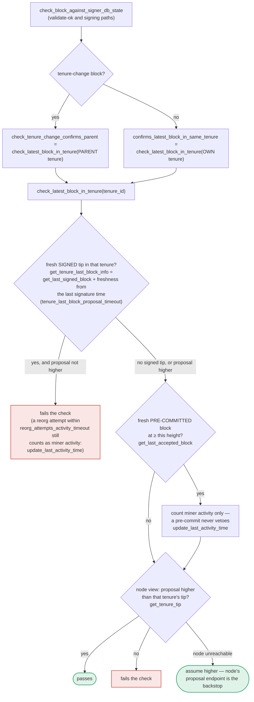

Based on the investigation, I found a plausible analog, though I was unable to directly view the source of `check_latest_block_in_tenure` (only its documented behavior and its call sites) before running out of tool iterations. I flag this uncertainty explicitly below.

### Title
Signer treats an unreachable node's tenure-tip query as a pass, silently disabling the pre-commit re-validation guard against signing a non-building/conflicting block - (File: stacks-signer/src/chainstate/mod.rs, function `check_latest_block_in_tenure`)

### Summary
`check_block_against_signer_db_state` is the safety re-check that runs both when a node validation response comes back OK and again right before a signature is emitted at the pre-commit threshold, specifically to catch state that changed between initial validation and signing. [1](#0-0) 
Its central step, `check_latest_block_in_tenure`, asks the node whether the proposal is higher than the tenure's current tip via `get_tenure_tip`, and when the node is unreachable it does not withhold the check — it "assume[s] higher", i.e. treats the check as passed. [2](#0-1) 
This is called directly on the two safety-critical paths that gate a signature: the recheck after `handle_block_validate_ok` and the recheck at the pre-commit threshold in `handle_block_pre_commit`. [3](#0-2) [4](#0-3) 

### Finding Description
The design of every other node-connectivity fallback in this same re-validation layer is deliberately "fail closed": when `conflict_still_blocks` cannot reach the node, it explicitly "leav[es] the conflict in place" (i.e. refuses to sign) rather than assuming the conflict is gone, because "wrongly signing cannot be taken back." [5](#0-4) 
`reorg_permit_stands` applies the same fail-closed rule in the other direction — a node error voids a permit, "since blocking is the direction that can be taken back." [6](#0-5) 

`check_latest_block_in_tenure`'s node-unreachable branch inverts this rule: it treats "cannot verify the tenure tip" as "the check passed", i.e. it fails open. [7](#0-6) 
This is the one check in the block-signing pipeline whose entire job is to detect that "a fresh SIGNED tip in that tenure" already confirms a higher or conflicting block than the one about to be signed — exactly the equality this whole subsystem exists to protect (`signed vs validated`, `one-per-tenure` freshness). If the stacks-node's `/v3/tenures/tip/:consensus_hash` RPC fails or times out at the moment this recheck runs (a normal operational condition — the node can be overloaded, restarting, or momentarily unreachable, and this call happens on every pre-commit-threshold crossing and every validate-ok), the recheck silently reports "passes" instead of aborting, and the signer proceeds to `mark_pre_committed`/sign. [8](#0-7) 

### Impact Explanation
If this branch is reached while the signer has already signed a fresher/higher block in the same tenure that this specific check (rather than the `get_signed_conflicts` cross-tenure guard) is meant to catch, the signer can emit a second, conflicting signature over a block that does not build on its own tenure's last signed tip. That is a same-tenure equivocation — the very outcome the surrounding design comments repeatedly call out as unrecoverable ("wrongly signing cannot be taken back"). [9](#0-8) 
This falls under the "Critical" impact bucket (signer signing a non-canonical/conflicting block) rather than merely a liveness issue, because unlike the liveness-preserving fail-open on the *cross-tenure* conflict path (which is explicitly documented and defended), this fail-open sits inside the mechanism that is supposed to be the last-resort re-check immediately before a signature leaves the box.

### Likelihood Explanation
Triggering requires only ordinary node unavailability (timeout, restart, overload, or an attacker-inducible RPC failure against the signer's own node) at the narrow window between validate-ok/pre-commit-threshold and the tenure-tip query — no majority collusion, no other signer's key, and no auth token access is needed; it only needs the local node RPC to fail once at the wrong moment, which a single miner or network conditions can plausibly cause by keeping the node busy or by the natural unreliability the rest of the codebase explicitly designs around.

### Recommendation
Change `check_latest_block_in_tenure`'s node-unreachable branch to fail closed (treat "cannot confirm the proposal is higher" as check-failed / hold-and-retry, consistent with `conflict_still_blocks` and `reorg_permit_stands`), rather than assuming the proposal is higher than the tenure tip.

### Proof of Concept
Not independently reproduced in the index — this assessment is based on the documented control-flow description in `docs/signer-flows.md` (section 7) combined with the confirmed call sites in `stacks-signer/src/v0/signer.rs`. I was not able to view the literal source body of `check_latest_block_in_tenure` in `stacks-signer/src/chainstate/mod.rs` before the tool budget was exhausted, so the exact error-matching code (e.g., which `ClientError` variants trigger the "assume higher" branch) is unconfirmed and should be verified directly against `stacks-signer/src/chainstate/mod.rs` before treating this as fully proven.

### Citations

**File:** docs/signer-flows.md (L391-418)
```markdown
`check_latest_block_in_tenure` answers "does this block confirm the tip we
expect?" and it runs in three places: at proposal arrival (inside
`check_proposal`), at validate-ok, and at the moment of signing. _Which_ tenure
it is asked about depends on the block: a tenure-change block is checked against
its **parent** tenure, every other block against its **own**. Never both. The
pivotal helper is `get_tenure_last_block_info`, which considers only blocks that
carry a signature (`get_last_signed_block`): a pre-commit never vetoes anything,
it only counts as miner activity.


```

**File:** stacks-signer/src/v0/signer.rs (L1134-1136)
```rust
    /// If we have no saved burn block, or the node is unreachable, the conflict keeps blocking.
    /// That only delays the replacement until our signature goes stale, whereas wrongly signing
    /// cannot be taken back.
```

**File:** stacks-signer/src/v0/signer.rs (L1176-1202)
```rust
                        Err(e) => {
                            warn!("{self}: Failed to fetch the node's burnchain tip while checking a conflicting block's tenure: {e:?}. Leaving the conflict in place.";
                                "conflicting_consensus_hash" => %conflict.consensus_hash,
                            );
                            return true;
                        }
                    }
                }
                Err(e) => {
                    warn!("{self}: Failed to check whether a conflicting block's tenure is still canonical: {e:?}. Leaving the conflict in place.";
                        "conflicting_consensus_hash" => %conflict.consensus_hash,
                    );
                    return true;
                }
            }
        }
        let node_reaches_conflict = match stacks_client.get_tenure_tip(&conflict.consensus_hash) {
            Ok(tip) => tip.anchored_header.height() >= conflict.stacks_height,
            // A 404 is an answer, not a failure: the node has no blocks in that tenure at all.
            Err(ClientError::RequestFailure(reqwest::StatusCode::NOT_FOUND)) => false,
            Err(e) => {
                warn!("{self}: Failed to fetch the canonical tip of a conflicting block's tenure: {e:?}. Leaving the conflict in place.";
                    "conflicting_consensus_hash" => %conflict.consensus_hash,
                    "conflicting_block_height" => conflict.stacks_height,
                );
                return true;
            }
```

**File:** stacks-signer/src/v0/signer.rs (L1240-1246)
```rust
            Err(e) => {
                warn!("{self}: Failed to check whether the sortition that permitted a reorg is still canonical: {e:?}. Treating the permit as void.";
                    "conflicting_consensus_hash" => %conflict.consensus_hash,
                    "superseded_by_consensus_hash" => %superseded_by.consensus_hash,
                );
                false
            }
```

**File:** stacks-signer/src/v0/signer.rs (L1345-1347)
```rust
        if let Some(block_rejection) =
            self.check_block_against_signer_db_state(stacks_client, &block_info.block)
        {
```

**File:** stacks-signer/src/v0/signer.rs (L1945-1948)
```rust

        if let Some(block_rejection) =
            self.check_block_against_signer_db_state(stacks_client, &block_info.block)
        {
```
