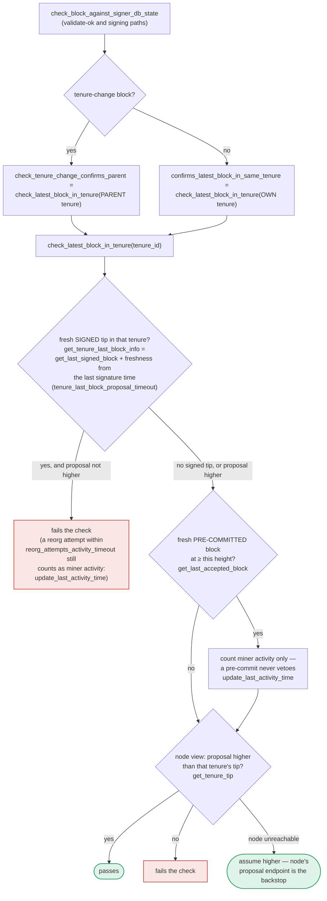

### Title
Proposal-time-only tenure duplicate-block guard lets a signer sign two conflicting tenure-change blocks for the same tenure once the first block goes stale unconfirmed — ([File: stacks-signer/src/v0/signer.rs], [File: stacks-signer/src/chainstate/v1.rs], [File: stacks-signer/src/chainstate/v2.rs])

### Summary
This is the same bug class as the ERC-721 report: a safety check exists on one code path (`mintPublic`'s EOA check) but is missing on sibling paths that perform the equivalent unsafe operation (`mintArcanaList`/`mintAspirantList`/`mintAllianceList`). In this codebase, the "one tenure, one accepted tenure-start block" duplicate check (`validate_tenure_change_payload`, which raises `DuplicateBlockFound`) is only executed in the proposal-arrival path (`check_proposal` in `stacks-signer/src/chainstate/v1.rs` / `v2.rs`) and is explicitly *not* re-run at validate-ok or at the signing moment [1](#0-0) . The codebase's own documentation states the gap is intentionally covered by a different mechanism — the own-tenure conflict guard in section 5 (`get_signed_conflicts` / `conflict_still_blocks`) — but that guard is staleness-gated and only blocks a stale same-tenure conflict if the node's tenure tip is confirmed at or above the proposed height [2](#0-1) . If the first tenure-change block a signer signed never reaches global acceptance (never gets pushed/confirmed by the node) and its signature goes stale, the guard's `TIP -- "no — never confirmed" --> SIGN` branch lets the signer sign a second, different tenure-change block for the *same* tenure.

### Finding Description
`check_latest_block_in_tenure` runs three times (proposal, validate-ok, signing), but two things are attached only to the proposal path and never repeated: the `validate_tenure_change_payload` duplicate check and the v2 pre-checks [3](#0-2) . The v1 and v2 implementations of this duplicate check even differ in scope — v2 counts locally-or-globally accepted blocks (`get_last_signed_block`), v1 counts only globally-accepted blocks (`get_last_globally_accepted_block`) [4](#0-3) , mirroring how the vulnerable report's sibling functions differ subtly from the protected one.

Because this check "never runs again," the documentation itself states that a block that crosses the pre-commit threshold long after being proposed depends entirely on the section-5 own-tenure conflict guard for protection [5](#0-4) . That guard, implemented in `stacks-signer/src/v0/signer.rs` around the pre-commit-threshold handling, evaluates fresh vs. stale conflicts differently: a fresh same-height conflict in any tenure always blocks signing, but once a conflict goes stale, the own-tenure branch only re-blocks if the node's tenure tip is confirmed at or above the proposed height [6](#0-5) . Per the documented decision table, when that tenure was "never confirmed" by the node, the outcome is `SIGN` rather than `HOLD` [2](#0-1) .

This produces exactly the scenario the proposal-time `DuplicateBlockFound` check exists to prevent: the signer places its signature on two different tenure-change blocks belonging to the same tenure — a conflicting/equivocating signature — because the only check that would have caught the duplicate at proposal time is not re-evaluated at signing time, and the fallback guard is bypassed by staleness plus lack of node confirmation.

### Impact Explanation
A signer signing two different, mutually-conflicting tenure-change blocks for the same tenure is a form of equivocation/double-signing over conflicting blocks at the miner-authority level for that tenure. If the second block instead of the first later gathers the aggregate signature threshold and gets pushed, the signer has contributed a valid-looking signature to two incompatible chain histories for the same tenure, which is the "signer signing a conflicting block" class explicitly called out as Critical impact in this scan's rules.

### Likelihood Explanation
This requires no majority collusion and no external key — it is triggered purely by ordinary network conditions a lone miner (plus normal gossip) can produce: propose tenure-change block A, get it pre-committed and signed by this signer, but never let it reach global acceptance/push (e.g., miner abandons it or it stalls); wait past `tenure_last_block_proposal_timeout` so A's signature goes stale; then propose a second tenure-change block B for the same tenure. Because `validate_tenure_change_payload`'s `DuplicateBlockFound` check only fires at proposal time and is not repeated at signing, and because the section-5 guard's "never confirmed" branch resolves to `SIGN`, this signer will place a second signature on B.

### Recommendation
Re-evaluate `validate_tenure_change_payload` (or an equivalent "have I already accepted/signed a tenure-change block for this tenure" check) at the signing moment inside `check_block_against_signer_db_state`/the pre-commit-threshold path in `stacks-signer/src/v0/signer.rs`, not only at proposal arrival, so staleness of the first signature cannot reopen the tenure to a second, conflicting tenure-start signature. Alternatively, treat "signed but never confirmed" tenure-change blocks as a non-stale-able veto for the remainder of that tenure, closing the `TIP -- "no — never confirmed" --> SIGN` branch for tenure-change conflicts specifically.

### Proof of Concept
1. Miner proposes tenure-change block `A` for tenure `T`. Signer validates, pre-commits, reaches 70% threshold, and signs `A` via the section-5 flow (`SIGN: mark_locally_accepted, handle_block_signature`) [7](#0-6) .
2. `A` never reaches global push/acceptance (e.g., the miner drops it or other signers fail to aggregate it in time).
3. Time passes beyond `tenure_last_block_proposal_timeout`, making the signer's conflict record for `A` stale (`last_endorsed <= freshness_cutoff`) [8](#0-7) .
4. Miner proposes a second, different tenure-change block `B` for the same tenure `T`. Proposal-time `validate_tenure_change_payload`/`DuplicateBlockFound` in `stacks-signer/src/chainstate/v1.rs`/`v2.rs` is the only place that would have compared against the tenure's already-accepted block, but this runs once at proposal and is not repeated at signing [9](#0-8) .
5. `B` reaches pre-commit threshold. The signer re-evaluates the own-tenure conflict guard; the stale conflict against `A` is checked via `TIP{"own tenure confirmed at ≥ this height?"}`. Since `A` was never pushed to the node, `TIP` resolves to "no — never confirmed" → `SIGN` [2](#0-1) .
6. The signer signs `B`, having previously also signed `A` for the same tenure — a conflicting signature the proposal-time duplicate check was meant to prevent but which is never re-checked at the point the signature is actually produced.

### Citations

**File:** docs/signer-flows.md (L263-268)
```markdown
    FRESH -- "no — all stale" --> OWN{"a conflict in this block's<br/>OWN tenure?"}
    OWN -- yes --> TIP{"own tenure confirmed<br/>at ≥ this height?<br/>get_tenure_tip(own tenure)"}
    TIP -- yes --> HOLD2["refuse to sign"]:::hold
    TIP -- "no — never confirmed" --> SIGN
    TIP -- "node unreachable" --> SIGN
    OWN -- no --> SIGN["SIGN: mark_locally_accepted,<br/>handle_block_signature,<br/>broadcast acceptance"]:::good
```

**File:** docs/signer-flows.md (L391-437)
```markdown
`check_latest_block_in_tenure` answers "does this block confirm the tip we
expect?" and it runs in three places: at proposal arrival (inside
`check_proposal`), at validate-ok, and at the moment of signing. _Which_ tenure
it is asked about depends on the block: a tenure-change block is checked against
its **parent** tenure, every other block against its **own**. Never both. The
pivotal helper is `get_tenure_last_block_info`, which considers only blocks that
carry a signature (`get_last_signed_block`): a pre-commit never vetoes anything,
it only counts as miner activity.



A failed check becomes a different rejection depending on who asked.
`check_block_against_signer_db_state` returns `SortitionViewMismatch`, or
`ConnectivityIssues` when the lookup itself errored rather than answering; the v2
`check_proposal` path returns `InvalidParentBlock`.

Two things belong to the proposal path only and are **not** re-run at validate-ok
or at signing:

- `validate_tenure_change_payload` rejects with `DuplicateBlockFound` when we
  have already accepted a block in the tenure a tenure-change block is starting.
  v2 counts locally or globally accepted blocks (`get_last_signed_block`); v1
  counts only globally accepted ones (`get_last_globally_accepted_block`).
- the v2 `check_proposal` wrapper checks miner pubkey hash, consensus hash, the
  pox bitvec, and tenure-extend rules before delegating here.

Because the duplicate check never runs again, a block that crosses the pre-commit
threshold long after it was proposed relies on section 5's own-tenure conflict
guard to cover the same ground.
```

**File:** stacks-signer/src/v0/signer.rs (L1393-1402)
```rust
        let freshness_cutoff = get_epoch_time_secs().saturating_sub(
            self.proposal_config
                .tenure_last_block_proposal_timeout
                .as_secs(),
        );
        // A fresh signature only blocks while the block it covers could still be part of the
        // chain: see `conflict_still_blocks`, which asks the node whether it is. Check
        // freshness first: it is a local timestamp comparison, while `reorg_permit_stands`
        // and `conflict_still_blocks` each query the node, so stale conflicts cost no
        // round-trips.
```

**File:** stacks-signer/src/v0/signer.rs (L1423-1432)
```rust
        // No conflict is both fresh and still live. A conflict that no longer matters, i.e.
        // stale, or provably dead per `conflict_still_blocks`, cannot veto on its own. A
        // stale conflict in another tenure in particular no longer speaks for us: whether this
        // block may replace what another tenure built is settled by the chainstate checks above.
        // A stale conflict in this block's own tenure still blocks if the node already has that
        // tenure at or above the proposed height, since the proposal then duplicates state the
        // node has already built on. (The chainstate checks don't cover this for tenure-change
        // blocks: those check the parent tenure instead of their own.)
        // The permit check is deferred to here so that only same-tenure conflicts pay for it.
        if conflicts.iter().any(|conflict| {
```
