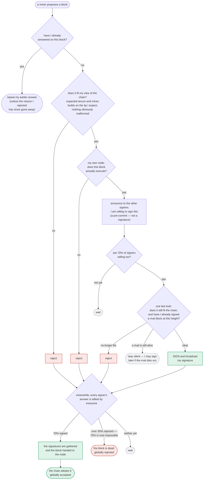

### Title
Non-exclusive block pre-commit allows two conflicting blocks to independently reach the 70% signing threshold across the signer set - ([File: stacks-signer/src/v0/signer.rs])

### Summary
The v0 signer's pre-commit round is explicitly **non-exclusive**: a signer may pre-commit to more than one conflicting block proposal at the same height/tenure, because the pre-commit path (`handle_block_validate_ok` → `check_block_against_signer_db_state`) only vetoes a competing proposal against an already-**signed** tip, never against an existing pre-commit. [1](#0-0)  The only safety backstop against actually placing a *signature* on two conflicting blocks is a purely **local, per-signer** check (`get_signed_conflicts` / `conflict_still_blocks`) evaluated at the moment each signer's own pre-commit weight crosses the 70% threshold. [2](#0-1)  Because this backstop only "sees" a conflict once *this signer's own database* already records a signature over the rival block, a byzantine miner (a single block-producing slot, using ordinary gossip/network timing) can propose two conflicting blocks A and B at the same height/tenure and have them delivered to different, non-identical signer subsets in different orders, so that each subset locks in its own candidate before ever learning about the other. If the two subsets each carry ≥70% signing weight, both A and B can independently collect enough valid signatures to pass `verify_signer_signatures`'s weight check on-chain, i.e., an equivocation (conflicting-block-signed) safety violation.

### Finding Description
The v0 signer pre-commit protocol is a two-round design: round 1 ("pre-commit") is a non-binding willingness signal; round 2 (the actual signature) is only cast once ≥70% weight has pre-committed. [3](#0-2) 

The chainstate re-check that runs both when a proposal is first validated and again when the pre-commit threshold is crossed (`check_block_against_signer_db_state`, backed by `check_latest_block_in_tenure`/`get_tenure_last_block_info` in `stacks-signer/src/chainstate/mod.rs`) is documented and tested to treat pre-committed-but-unsigned blocks as **non-vetoing**: only a *signed* tip blocks a competing proposal; a pre-commit "never vetoes," it only updates miner-activity bookkeeping. [1](#0-0)  This is directly confirmed by the regression test `pre_committed_block_does_not_veto_replacement`, which asserts that a block that was pre-committed (never signed) does not block a same-height replacement, and that only once the original block is *signed* does it become the tenure's enforced tip. [4](#0-3) 

The proposal-time `DuplicateBlockFound` guard has the same limitation: it fires only when a tenure-change block would duplicate a tenure that already has a **signed** (locally- or globally-accepted) block, per `validate_tenure_change_payload`; it is documented as running only once, at proposal arrival, and never again. [5](#0-4) 

Consequently, the *only* mechanism preventing a signer from actually placing a signature on two mutually conflicting blocks at the same height is the sign-time conflict check performed inside `handle_block_pre_commit`, once a proposal's pre-commit weight reaches the 70% threshold:
```
let conflicts = self.signer_db.get_signed_conflicts(block_info.block.header.chain_length, &block_hash)...
if let Some(conflict) = conflicts.iter().find(|conflict| {
    conflict.last_endorsed > freshness_cutoff
        && !self.reorg_permit_stands(stacks_client, conflict)
        && self.conflict_still_blocks(stacks_client, conflict, block_info.block.header.chain_length)
}) { ... return; }
``` [6](#0-5) 

`get_signed_conflicts` is a query against **this signer's own SignerDB** — it can only see a conflicting block if this same signer has itself signed it, or has separately observed a group-threshold signature for it. [7](#0-6)  Nothing in this flow synchronizes with what *other* signers have independently signed. This matches the tested and intended intra-signer behavior: `signer_refuses_to_sign_second_sibling_tenure_start` shows the SAME signer instance refusing to sign a second sibling **because it processed and recorded its own signature on the first block before evaluating the second's pre-commit crossing** — i.e., safety here relies entirely on the sequential order in which one signer instance happens to observe events, not on any global exclusivity of the pre-commit vote itself. [8](#0-7) 

Given a miner (a single slot, using only gossip to time delivery of two block variants A/B at the same height/tenure to different, possibly overlapping, subsets of signers), each signer independently and correctly follows the "pre-commit is non-exclusive, sign at local 70%" rule. If signer subset S_A (≥70% weight) happens to see A's pre-commits cross threshold locally before ever hearing of B, and a different signer subset S_B (≥70% weight, necessarily overlapping S_A by at least 40% of total weight by pigeonhole) crosses B's threshold locally before hearing of A, each subset signs its own candidate — because the pre-commit round never excluded the rival, and the sign-time conflict check only fires on conflicts *this signer already knows about*. The overlapping ≥40% of signers that end up participating in both quorums are the ones whose local processing order determines which of A/B they end up signing; there is no requirement that they process A before B or vice versa consistently across the network, since propagation order across a gossip-based StackerDB is not globally serialized.

This breaks exactly the equality the pre-commit protocol is designed to guarantee — "nobody signs alone" / at most one conflicting candidate can reach 70% signed weight — via network-timing manipulation rather than by compromising any signer's key or requiring a signer majority to misbehave.

### Impact Explanation
If both A and B independently accumulate ≥70% verified signing weight, `NakamotoBlockHeader::verify_signer_signatures` in the node's chainstate would accept **either** as chain-valid depending on which one a node/miner submits, and it is plausible for both to be separately pushed and accepted by different portions of the network before a burnchain fork resolves it — a genuine equivocation/conflicting-block-signed condition, which the prompt's rules classify as Critical impact ("a signer signing an invalid, non-canonical, or conflicting block").

### Likelihood Explanation
This requires no signer-key compromise and no majority-signer collusion — only a malicious/faulty miner able to craft two conflicting block proposals for the same slot and control (or simply benefit from) their gossip delivery order to different signer peers, which is squarely within the "one-slot miner (plus gossip)" threat model given in the rules. The likelihood in practice depends on network conditions (achieving a clean split where each side's local weight crosses 70% before hearing about the rival), which is a nontrivial but realistic condition to engineer under a Sybil/eclipse-adjacent network position or simply favorable network jitter, especially given how thoroughly the code otherwise documents and tests around this exact "pre-commit never vetoes" property as intentional behavior.

### Recommendation
Introduce a per-height, per-tenure **pre-commit lock**, so that once a signer pre-commits to a candidate at a given height in a given tenure, it refuses to pre-commit (not just refuses to sign) to any other conflicting candidate at that height/tenure unless the first candidate is proven dead by the same freshness/`conflict_still_blocks` logic already used at sign time. This closes the gap identified in `check_block_against_signer_db_state`/`get_tenure_last_block_info`, where only *signed* blocks veto a competitor and pre-commits are treated as non-binding. Extending exclusivity to the pre-commit stage (rather than deferring all exclusivity to a per-signer, order-dependent sign-time check) removes the network-timing race that lets disjoint-by-observation-order signer subsets independently commit to conflicting candidates.

### Proof of Concept
Conceptual PoC (not executable from index alone, but directly derivable from the cited tests/flows):
1. Miner wins a single sortition slot and crafts two distinct valid block bodies A and B for the same tenure-start height/consensus hash.
2. Miner (or a network position controlling delivery timing) sends A to signer subset S_A first and B to signer subset S_B first, where S_A and S_B are each ≥70% of signing weight (necessarily overlapping by ≥40%).
3. Each signer in S_A processes A: passes `check_proposal`/`check_block_against_signer_db_state` (no signed block yet exists, so no veto per `pre_committed_block_does_not_veto_replacement`), pre-commits to A, and — since no conflicting *signed* block is yet known locally — signs A once 70% pre-commit weight for A is observed (`handle_block_pre_commit`, signer.rs:1250-1421).
4. Symmetrically, each signer in S_B processes B first and signs B before ever learning of A.
5. Both A and B end up with ≥70% verified signature weight, satisfying `NakamotoBlockHeader::verify_signer_signatures`'s threshold check independently. [9](#0-8)

### Citations

**File:** docs/signer-flows.md (L13-50)
```markdown
## 0. The life of a block proposal (conceptual)

Before the mechanics: what a proposal goes through, in plain terms. Signing is
deliberately split into two rounds. First each signer says only _"I am willing to
sign this"_ — a **pre-commit**, which carries no signature and commits nothing.
Only once 70% of the weight has said that does anyone actually sign. The gap
between the two rounds is where most of the subtlety lives: time passes, the
burn chain can fork, and another block may win the same slot, so a signer takes
one last look at the world before its signature — the one irreversible act —
leaves the box.


```

**File:** docs/signer-flows.md (L322-327)
```markdown
A conflict is any block a signature was ever put over — ours, or a group
threshold we observed — whatever its state now. In particular rejection, even
_global_ rejection, does not clear one: a rejection is a revocable opinion,
while a signature is a bearer instrument that can still be aggregated toward
the 70% threshold if rejecting signers change their minds. Only staleness or
node-derived death (the two questions above) clears a conflict.
```

**File:** docs/signer-flows.md (L407-411)
```markdown
    CLB --> LSB{"fresh SIGNED tip in that tenure?<br/>get_tenure_last_block_info =<br/>get_last_signed_block + freshness from<br/>the last signature time<br/>(tenure_last_block_proposal_timeout)"}
    LSB -- "yes, and proposal not higher" --> RA["fails the check<br/>(a reorg attempt within<br/>reorg_attempts_activity_timeout still<br/>counts as miner activity:<br/>update_last_activity_time)"]:::bad
    LSB -- "no signed tip, or proposal higher" --> CARVE{"fresh PRE-COMMITTED block<br/>at ≥ this height?<br/>get_last_accepted_block"}
    CARVE -- yes --> ACT["count miner activity only —<br/>a pre-commit never vetoes<br/>update_last_activity_time"]
    CARVE -- no --> NODE
```

**File:** docs/signer-flows.md (L425-437)
```markdown
Two things belong to the proposal path only and are **not** re-run at validate-ok
or at signing:

- `validate_tenure_change_payload` rejects with `DuplicateBlockFound` when we
  have already accepted a block in the tenure a tenure-change block is starting.
  v2 counts locally or globally accepted blocks (`get_last_signed_block`); v1
  counts only globally accepted ones (`get_last_globally_accepted_block`).
- the v2 `check_proposal` wrapper checks miner pubkey hash, consensus hash, the
  pox bitvec, and tenure-extend rules before delegating here.

Because the duplicate check never runs again, a block that crosses the pre-commit
threshold long after it was proposed relies on section 5's own-tenure conflict
guard to cover the same ground.
```

**File:** stacks-signer/src/v0/signer.rs (L1368-1421)
```rust
        // A pre-commit may be superseded by a competing proposal at the same height (e.g. a
        // re-proposed tenure-start block after the first failed to reach consensus), but a
        // signature must not be superseded while it's still "fresh". A signed block at the
        // same or higher height in ANY tenure is a conflict: two blocks at the same height are
        // siblings no matter which tenure they belong to (e.g. the next tenure's tenure-start
        // block conflicts with the current tenure's block at the same height). Blocks in
        // tenures whose reorg we sanctioned under the reorg-timing rules are excluded, but
        // only while the sortition the permit was granted to is still canonical
        // (`check_parent_tenure_choice` records the permit, `reorg_permit_stands` re-derives
        // its validity from the node); every other question about whether a conflict is
        // still live is derived from the node in `conflict_still_blocks`.
        //
        // Unlike the chainstate check above, a refusal here is "for now" rather than a
        // broadcast rejection: a later pre-commit re-evaluation may still sign the block once
        // the conflicting signature has gone stale.
        let conflicts = match self
            .signer_db
            .get_signed_conflicts(block_info.block.header.chain_length, &block_hash)
        {
            Ok(conflicts) => conflicts,
            Err(e) => {
                warn!("{self}: Failed to query the signed blocks. Refusing to sign block {block_hash}: {e:?}");
                return;
            }
        };
        let freshness_cutoff = get_epoch_time_secs().saturating_sub(
            self.proposal_config
                .tenure_last_block_proposal_timeout
                .as_secs(),
        );
        // A fresh signature only blocks while the block it covers could still be part of the
        // chain: see `conflict_still_blocks`, which asks the node whether it is. Check
        // freshness first: it is a local timestamp comparison, while `reorg_permit_stands`
        // and `conflict_still_blocks` each query the node, so stale conflicts cost no
        // round-trips.
        if let Some(conflict) = conflicts.iter().find(|conflict| {
            conflict.last_endorsed > freshness_cutoff
                && !self.reorg_permit_stands(stacks_client, conflict)
                && self.conflict_still_blocks(
                    stacks_client,
                    conflict,
                    block_info.block.header.chain_length,
                )
        }) {
            warn!(
                "{self}: Reached the pre-commit threshold for a block, but we have recently signed or accepted a different block at the same or higher height. Refusing to sign.";
                "signer_signature_hash" => %block_hash,
                "block_height" => block_info.block.header.chain_length,
                "conflicting_signer_signature_hash" => %conflict.signer_signature_hash,
                "conflicting_block_height" => conflict.stacks_height,
                "conflicting_consensus_hash" => %conflict.consensus_hash,
            );
            return;
        }
```

**File:** stacks-signer/src/chainstate/tests/v2.rs (L955-1039)
```rust
/// proposal at the same height must pass the block-height check (a pre-commit is supersedable),
/// but it must still count toward miner activity. Once the block is signed, it becomes the
/// tenure's tip and a competing proposal at the same height must be rejected.
#[test]
fn pre_committed_block_does_not_veto_replacement() {
    let (stacks_client, mut signer_db, _block_sk, mut block, cur_sortition, _, _) =
        setup_test_environment(function_name!());

    let tenure_id = cur_sortition.data.consensus_hash.clone();
    block.header.consensus_hash = tenure_id.clone();

    // The originally-proposed block, which we pre-committed to but never signed.
    let existing_block_proposal = BlockProposal {
        block: block.clone(),
        burn_height: 2,
        reward_cycle: 1,
        block_proposal_data: BlockProposalData::empty(),
    };
    let mut existing_block_info = BlockInfo::from(existing_block_proposal);
    existing_block_info.mark_pre_committed().unwrap();
    signer_db.insert_block(&existing_block_info).unwrap();

    // The pre-committed block must not be reported as the tenure's last (signed) block.
    assert!(SortitionData::get_tenure_last_block_info(
        &tenure_id,
        &signer_db,
        Duration::from_secs(30),
    )
    .unwrap()
    .is_none());

    // A replacement block at the same height.
    let mut replacement = block.clone();
    replacement.header.timestamp += 1;
    assert_ne!(
        replacement.header.signer_signature_hash(),
        block.header.signer_signature_hash()
    );

    assert!(signer_db
        .get_last_activity_time(&tenure_id)
        .unwrap()
        .is_none());

    // The replacement passes the height check. (The stacks-node call inside fails since nothing
    // is listening, which makes the check fall back to assuming the proposal is higher; the
    // point here is that the pre-committed block does not early-reject it.)
    assert!(SortitionData::check_latest_block_in_tenure(
        &tenure_id,
        &replacement,
        &mut signer_db,
        &stacks_client,
        Duration::from_secs(30),
        Duration::from_secs(3),
    )
    .unwrap());

    // But conflicting with a fresh pre-commit still counts as miner activity.
    assert!(signer_db
        .get_last_activity_time(&tenure_id)
        .unwrap()
        .is_some());

    // Once we actually sign the original block, it becomes the tenure's tip and the replacement
    // at the same height must be rejected.
    existing_block_info.mark_locally_accepted(false).unwrap();
    signer_db.insert_block(&existing_block_info).unwrap();

    assert!(SortitionData::get_tenure_last_block_info(
        &tenure_id,
        &signer_db,
        Duration::from_secs(30),
    )
    .unwrap()
    .is_some());

    assert!(!SortitionData::check_latest_block_in_tenure(
        &tenure_id,
        &replacement,
        &mut signer_db,
        &stacks_client,
        Duration::from_secs(30),
        Duration::from_secs(3),
    )
    .unwrap());
```

**File:** stacks-signer/src/v0/tests.rs (L770-789)
```rust
    #[test]
    fn signer_refuses_to_sign_second_sibling_tenure_start() {
        // Pin the fresh window far beyond the test's runtime so the guard can only take the
        // fresh branch; the stale branch is covered by the tests below.
        let (info_a, info_b, _) = run_sibling_scenario(Duration::from_secs(100_000), false, None);
        assert_a_signed(&info_a);
        // B is still pre-committed (the sibling is allowed to reach pre-commit), but the signer
        // must refuse to place a second signature on a conflicting same-height block in this
        // tenure while its signature on A is fresh.
        assert_eq!(
            info_b.state,
            BlockState::PreCommitted,
            "block B should be pre-committed but not promoted, got: {}",
            info_b.state
        );
        assert!(
            info_b.signed_self.is_none(),
            "block B must NOT be signed: the signer already signed a conflicting sibling in this tenure"
        );
    }
```

**File:** stackslib/src/chainstate/nakamoto/mod.rs (L1180-1189)
```rust
        let threshold = Self::compute_voting_weight_threshold(total_weight)?;

        if total_weight_signed < threshold {
            return Err(ChainstateError::InvalidStacksBlock(format!(
                "Not enough signatures. Needed at least {} but got {} (out of {})",
                threshold, total_weight_signed, total_weight,
            )));
        }

        return Ok(total_weight_signed);
```
