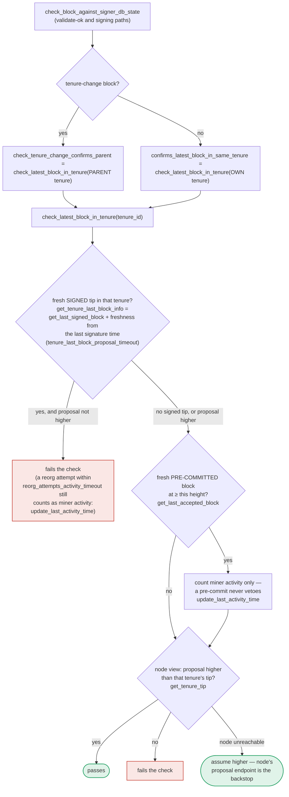

### Title
Pre-commit/validate-ok recheck skips the miner-status and reorg-permission checks from `check_proposal`, letting a signer sign a block from a miner it now considers invalid - ([File: stacks-signer/src/v0/signer.rs])

### Summary
The full proposal-acceptance logic (`SortitionsView::check_proposal` / `GlobalStateView::check_proposal`) is only ever executed once, at the moment a block proposal first arrives (`check_block_against_local_state` / `check_block_against_global_state`, invoked from `handle_block_proposal`). Later re-validation points — at `handle_block_validate_ok` (validate-ok) and at pre-commit-threshold crossing (`handle_block_pre_commit`) — call a narrower helper, `check_block_against_signer_db_state`, whose own doc comment warns it is "an incomplete check." That helper never re-examines `SortitionMinerStatus` (timed-out/invalidated miner), the reorg-permission logic (`check_parent_tenure_choice`), pubkey/bitvec checks, or tenure-extend timing — it only re-runs `check_tenure_change_confirms_parent` / `check_latest_block_in_tenure`. This is directly analogous to `BunniQuoter`: one code path (the initial "quote"/check) performs the full set of validations, but the "recheck" path performed later — after state may have changed — silently omits most of them, so a decision made on stale information (the proposal was "valid" at T0) is trusted at signing time (T1) without re-verifying the parts of validity that are time-sensitive.

### Finding Description
`SortitionsView::check_proposal` (`stacks-signer/src/chainstate/v1.rs`, `check_proposal`) performs several time-sensitive checks against the current view of chainstate: it marks a miner `InvalidatedBeforeFirstBlock`/`InvalidatedAfterFirstBlock` if `SortitionState::is_timed_out` fires, checks `check_parent_tenure_choice` for reorg legitimacy, verifies the miner pubkey hash, the bitvec, and (for tenure-change blocks) `validate_tenure_change_payload`. This whole function is invoked exactly once per proposal, from `check_block_against_local_state` (`stacks-signer/src/v0/signer.rs:872-939`) or `check_block_against_global_state` (`stacks-signer/src/v0/signer.rs:944-999`), both called from `handle_block_proposal`.

After that single pass, the signer submits the block to the node for validation and, on `Ok`, and again at pre-commit-threshold crossing, re-checks state via `check_block_against_signer_db_state` (`stacks-signer/src/v0/signer.rs:1803-1880`). Its own doc comment says:

> "WARNING: This is an incomplete check. Do NOT call this function PRIOR to check_proposal or block_proposal validation succeeds."

Its body only calls `SortitionData::check_tenure_change_confirms_parent` (for tenure-change blocks) or `SortitionData::check_latest_block_in_tenure` (otherwise) — both static, stateless helpers operating purely on `signer_db` + `stacks_client`. Neither of them touches `SortitionMinerStatus`, `is_timed_out`, or `check_parent_tenure_choice`; the function doesn't even take the cached `SortitionsView`/`sortition_state` as an input to re-derive miner status.

Per `docs/signer-flows.md` (sections 4 and 5), this recheck runs both at validate-ok (`handle_block_validate_ok` → `check_block_against_signer_db_state`) and again just before the signature is produced at pre-commit threshold (`handle_block_pre_commit` → `check_block_against_signer_db_state`). The docs explicitly acknowledge this gap for one case ("the duplicate check never runs again... relies on section 5's own-tenure conflict guard to cover the same ground") but do not mention any substitute guard for miner-timeout/reorg-permission invalidation. The elapsed time between the initial `check_proposal` pass and the eventual signature at pre-commit threshold can be arbitrary (bounded only by `block_proposal_timeout`/`tenure_last_block_proposal_timeout`), during which the signer's local view of the miner (`SortitionMinerStatus`) can change from `Valid` to `InvalidatedBeforeFirstBlock`/`InvalidatedAfterFirstBlock` without that change ever being consulted again for this specific proposal's remaining lifecycle.

### Impact Explanation
If the signer's own view of `cur_sortition.miner_status` flips to invalid (timeout, or `check_parent_tenure_choice` rejecting the parent-tenure choice due to an intervening reorg) between the initial `check_proposal` pass and the point the pre-commit weight threshold is met, the stale `check_block_against_signer_db_state` recheck cannot catch it, and the signer will proceed to `mark_locally_accepted` / produce its signature (`handle_block_pre_commit`, section 5 "SIGN" branch) for a block it would presently classify as coming from an invalid/non-canonical miner. This is a signer producing a signature inconsistent with its own current judgment of validity — the equality the report's rule set flags as Critical ("a signer signing an invalid/non-canonical/conflicting block").

### Likelihood Explanation
Triggering requires only ordinary conditions reachable by a single miner plus normal gossip delay: propose a valid-looking block, then let/force pre-commit accumulation to stall long enough (or force a burn-chain reorg) that the signer's cached miner status would flip if re-evaluated. No signer key, majority collusion, or node access is needed — only timing that a single slow/adversarial miner or network delay can produce. This makes exploitation plausible but timing-dependent (medium likelihood, since it depends on hitting the timeout/reorg window before pre-commit threshold is reached).

### Recommendation
Before producing a signature (in `handle_block_pre_commit`) and at validate-ok, refresh/re-derive `SortitionsView` and re-run the full `check_proposal` (or at minimum re-evaluate `SortitionMinerStatus`/`is_timed_out` and `check_parent_tenure_choice`) rather than relying solely on the narrower `check_block_against_signer_db_state`. Remove or tighten the "incomplete check" warning by making `check_block_against_signer_db_state` compose with a fresh miner-status/reorg-permission recheck, ensuring the signature reflects the signer's current, not stale, view of proposal validity.

### Proof of Concept
1. Miner proposes block `B` for the current sortition; `check_proposal` runs once and passes (`cur_sortition.miner_status == Valid`), signer submits `B` for node validation and begins accumulating pre-commits.
2. Before pre-commit weight reaches the 70% threshold, elapsed inactivity for that sortition exceeds `block_proposal_timeout` (or a burn-chain reorg makes `check_parent_tenure_choice` for that sortition's parent tenure now fail) — on the *next* fresh proposal evaluation this would set `cur_sortition.miner_status = InvalidatedBeforeFirstBlock`, but no such fresh evaluation happens for `B` because it is already tracked (`should_reevaluate_block` short-circuits re-proposal paths for pre-committed blocks; and `check_block_against_signer_db_state` — the only recheck actually invoked at pre-commit — never touches `miner_status`).
3. Pre-commit weight for `B` crosses 70%; `handle_block_pre_commit` calls `check_block_against_signer_db_state(stacks_client, &block)`, which only re-runs `check_tenure_change_confirms_parent`/`check_latest_block_in_tenure` and returns `Ok`/`None`.
4. Signer proceeds to `mark_locally_accepted` and broadcasts its signature for `B`, even though a fresh `check_proposal` call at this moment would return `Err(RejectReason::InvalidMiner)` per the current `SortitionMinerStatus`. [1](#0-0) [2](#0-1) [3](#0-2) [4](#0-3) [5](#0-4)

### Citations

**File:** stacks-signer/src/v0/signer.rs (L872-939)
```rust
    /// Check if block should be rejected based on the local view of the sortition state
    /// Will return a BlockRejection if the block is invalid, none otherwise.
    /// This is the pre-global signer state activation path.
    fn check_block_against_local_state(
        &mut self,
        stacks_client: &StacksClient,
        sortition_state: &mut Option<SortitionsView>,
        block: &NakamotoBlock,
    ) -> Option<BlockRejection> {
        let signer_signature_hash = block.header.signer_signature_hash();
        let block_id = block.block_id();
        // Get sortition view if we don't have it
        if sortition_state.is_none() {
            *sortition_state =
                SortitionsView::fetch_view(self.proposal_config.clone(), stacks_client)
                    .inspect_err(|e| {
                        warn!(
                            "{self}: Failed to update sortition view: {e:?}";
                            "signer_signature_hash" => %signer_signature_hash,
                            "block_id" => %block_id,
                        )
                    })
                    .ok();
        }

        // Check if proposal can be rejected now if not valid against sortition view
        if let Some(sortition_state) = sortition_state {
            match sortition_state.check_proposal(
                stacks_client,
                &mut self.signer_db,
                block,
                true,
                self.global_state_evaluator
                    .get_global_tx_replay_set()
                    .unwrap_or_default(),
            ) {
                // Error validating block
                Err(RejectReason::ConnectivityIssues(e)) => {
                    warn!(
                        "{self}: Error checking block proposal: {e}";
                        "signer_signature_hash" => %signer_signature_hash,
                        "block_id" => %block_id,
                    );
                    Some(self.create_block_rejection(RejectReason::ConnectivityIssues(e), block))
                }
                // Block proposal is bad
                Err(reject_code) => {
                    warn!(
                        "{self}: Block proposal invalid";
                        "signer_signature_hash" => %signer_signature_hash,
                        "block_id" => %block_id,
                        "reject_reason" => %reject_code,
                        "reject_code" => ?reject_code,
                    );
                    Some(self.create_block_rejection(reject_code, block))
                }
                // Block proposal passed check, still don't know if valid
                Ok(_) => None,
            }
        } else {
            warn!(
                "{self}: Cannot validate block, no sortition view";
                "signer_signature_hash" => %signer_signature_hash,
                "block_id" => %block_id,
            );
            Some(self.create_block_rejection(RejectReason::NoSortitionView, block))
        }
    }
```

**File:** stacks-signer/src/v0/signer.rs (L1799-1820)
```rust
    /// WARNING: This is an incomplete check. Do NOT call this function PRIOR to check_proposal or block_proposal validation succeeds.
    ///
    /// Re-verify a block's chain length against the last signed block within signerdb.
    /// This is required in case a block has been approved since the initial checks of the block validation endpoint.
    fn check_block_against_signer_db_state(
        &mut self,
        stacks_client: &StacksClient,
        proposed_block: &NakamotoBlock,
    ) -> Option<BlockRejection> {
        let signer_signature_hash = proposed_block.header.signer_signature_hash();
        // If this is a tenure change block, ensure that it confirms the correct number of blocks from the parent tenure.
        if let Some(tenure_change) = proposed_block.get_tenure_change_tx_payload() {
            // Ensure that the tenure change block confirms the expected parent block
            match SortitionData::check_tenure_change_confirms_parent(
                tenure_change,
                proposed_block,
                &mut self.signer_db,
                stacks_client,
                self.proposal_config.tenure_last_block_proposal_timeout,
                self.proposal_config.reorg_attempts_activity_timeout,
            ) {
                Ok(true) => return None,
```

**File:** stacks-signer/src/chainstate/v1.rs (L134-164)
```rust
impl SortitionsView {
    /// Apply checks from the SortitionsView on the block proposal.
    pub fn check_proposal(
        &mut self,
        client: &StacksClient,
        signer_db: &mut SignerDb,
        block: &NakamotoBlock,
        reset_view_if_wrong_consensus_hash: bool,
        replay_set: ReplayTransactionSet,
    ) -> Result<(), RejectReason> {
        if self.cur_sortition.miner_status == SortitionMinerStatus::Valid
            && SortitionState::is_timed_out(
                &self.cur_sortition.data.consensus_hash,
                signer_db,
                self.config.block_proposal_timeout,
            )?
        {
            info!(
                "Current miner timed out, marking as invalid.";
                "block_height" => block.header.chain_length,
                "block_proposal_timeout" => ?self.config.block_proposal_timeout,
                "current_sortition_consensus_hash" => ?self.cur_sortition.data.consensus_hash,
            );
            self.cur_sortition.miner_status = SortitionMinerStatus::InvalidatedBeforeFirstBlock;

            // If the current proposal is also for this current
            // sortition, then we can return early here.
            if self.cur_sortition.data.consensus_hash == block.header.consensus_hash {
                return Err(RejectReason::InvalidMiner);
            }
        } else if let Some(tip) = signer_db
```

**File:** stacks-signer/src/chainstate/v1.rs (L288-317)
```rust
        // check that this miner is the most recent sortition
        match proposed_by {
            ProposedBy::CurrentSortition(sortition) => {
                if sortition.miner_status != SortitionMinerStatus::Valid {
                    warn!(
                        "Current miner behaved improperly, this signer views the miner as invalid.";
                        "proposed_block_consensus_hash" => %block.header.consensus_hash,
                        "signer_signature_hash" => %block.header.signer_signature_hash(),
                        "current_sortition_miner_status" => ?sortition.miner_status,
                    );
                    return Err(RejectReason::InvalidMiner);
                }
            }
            ProposedBy::LastSortition(last_sortition) => {
                // should only consider blocks from the last sortition if the new sortition was invalidated
                //  before we signed their first block.
                if self.cur_sortition.miner_status
                    != SortitionMinerStatus::InvalidatedBeforeFirstBlock
                {
                    warn!(
                        "Miner block proposal is from last sortition winner, when the new sortition winner is still valid. Considering proposal invalid.";
                        "proposed_block_consensus_hash" => %block.header.consensus_hash,
                        "signer_signature_hash" => %block.header.signer_signature_hash(),
                        "current_sortition_miner_status" => ?self.cur_sortition.miner_status,
                        "last_sortition" => %last_sortition.data.consensus_hash
                    );
                    return Err(RejectReason::NotLatestSortitionWinner);
                }
            }
        };
```

**File:** docs/signer-flows.md (L391-437)
```markdown
`check_latest_block_in_tenure` answers "does this block confirm the tip we
expect?" and it runs in three places: at proposal arrival (inside
`check_proposal`), at validate-ok, and at the moment of signing. _Which_ tenure
it is asked about depends on the block: a tenure-change block is checked against
its **parent** tenure, every other block against its **own**. Never both. The
pivotal helper is `get_tenure_last_block_info`, which considers only blocks that
carry a signature (`get_last_signed_block`): a pre-commit never vetoes anything,
it only counts as miner activity.



A failed check becomes a different rejection depending on who asked.
`check_block_against_signer_db_state` returns `SortitionViewMismatch`, or
`ConnectivityIssues` when the lookup itself errored rather than answering; the v2
`check_proposal` path returns `InvalidParentBlock`.

Two things belong to the proposal path only and are **not** re-run at validate-ok
or at signing:

- `validate_tenure_change_payload` rejects with `DuplicateBlockFound` when we
  have already accepted a block in the tenure a tenure-change block is starting.
  v2 counts locally or globally accepted blocks (`get_last_signed_block`); v1
  counts only globally accepted ones (`get_last_globally_accepted_block`).
- the v2 `check_proposal` wrapper checks miner pubkey hash, consensus hash, the
  pox bitvec, and tenure-extend rules before delegating here.

Because the duplicate check never runs again, a block that crosses the pre-commit
threshold long after it was proposed relies on section 5's own-tenure conflict
guard to cover the same ground.
```
