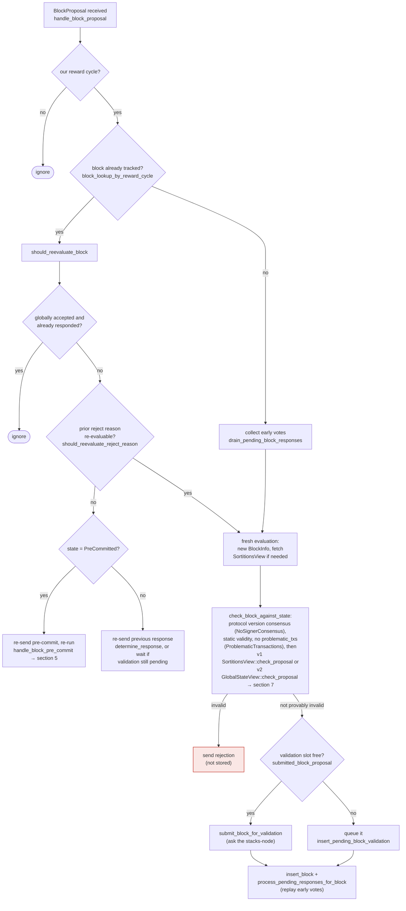

## Analysis: Stale rejected weight is never cleared when a signer flips its vote from Reject to Accept for the same block

### Title
Sticky, un-decremented `total_weight_rejected` lets stale signer rejections wedge the miner's block-acceptance tally — ([File: stacks-node/src/nakamoto_node/stackerdb_listener.rs])

### Summary
The `StackerDBListener` that the mining coordinator uses to tally signer votes for a proposed block tracks `total_weight_approved` and `total_weight_rejected` as two independent, monotonically-increasing counters keyed by `signer_signature_hash`. The `Rejected` branch is careful to add a signer's weight to `total_weight_rejected` only once (`block.responded_signers.insert(slot_id)` gate), but the `Accepted` branch never checks `responded_signers` at all — it only guards against double-counting inside its own `gathered_signatures` map. Consequently a signer that first rejects and later legitimately re-accepts the *same* block (a supported, tested flow) has its weight counted in **both** totals, and its earlier rejection weight is never removed from `total_weight_rejected`.

### Finding Description
`BlockStatus` (`stacks-node/src/nakamoto_node/stackerdb_listener.rs:70-82`) holds `total_weight_approved`, `total_weight_rejected`, `responded_signers` and `gathered_signatures` per block hash.

In the `Accepted` handler: [1](#0-0) 
weight is added to `total_weight_approved` only if `!block.gathered_signatures.contains_key(&slot_id)`, and `responded_signers.insert(slot_id)` is called unconditionally afterward — there is no check of whether that slot already rejected.

In the `Rejected` handler: [2](#0-1) 
weight is added to `total_weight_rejected` only `if block.responded_signers.insert(slot_id)` returns true (i.e., first response only). Nothing anywhere decrements `total_weight_rejected` when a signer later accepts.

This asymmetry means:
1. A signer who rejects, then later sends `Accepted` for the identical `signer_signature_hash`, gets its weight counted in **both** `total_weight_rejected` and `total_weight_approved` simultaneously — breaking the invariant that each signer's weight represents one, current vote.
2. `total_weight_rejected` is a *sticky, one-directional* counter for a given block hash: it never reflects a signer's subsequent reconsideration.

This "reject → accept for the same block" flow is not hypothetical; it is an explicitly supported and tested signer behavior: [3](#0-2) [4](#0-3) 
The signer-side logic that allows this reconsideration (`should_reevaluate_reject_reason`, re-validation on reproposal) is documented at: [5](#0-4) 

The miner-side coordinator (`SigningCoordinator::get_block_status`) checks the rejection-crossing condition **before** the acceptance condition on every poll: [6](#0-5) 
so once stale/sticky rejected weight (from signers who have since flipped to accept) pushes `total_weight_rejected` past the blocking-minority threshold, the coordinator declares `Err(NakamotoNodeError::SignersRejected)` and gives up on the block — even though the *current* signer votes for that exact block hash may already satisfy the 70% approval threshold.

### Impact Explanation
This breaks the "aggregated-weight vs verified-accepts" equality that the coordinator relies on to decide the fate of a proposed block. Because rejected weight is never retracted, a transient/re-evaluable rejection (e.g., `NotFoundError` due to a not-yet-processed burn block, or any other re-evaluable `RejectReason`) that a signer subsequently reverses is permanently counted against the block. If enough such stale rejections accumulate past the blocking-minority threshold before/while the affected signers reconsider and accept, the miner wedges: it abandons a block that a supermajority of *current* signer weight is willing to sign, forcing a costly reproposal/tenure-extension cycle. This is a liveness wedge on block production driven purely by message ordering/timing that a one-slot miner can influence by choosing when to (re)send proposals relative to node/burn-block readiness.

### Likelihood Explanation
The reject→accept-for-the-same-hash pattern is a normal, already-tested code path (transient validation failures such as missing burn blocks or not-yet-processed parents are common in practice, especially under network/miner timing pressure). No signer collusion or key compromise is required — a single miner can trigger it by controlling proposal/repropose timing relative to node state, which is entirely within a one-slot miner's normal capabilities.

### Recommendation
Make `total_weight_approved`/`total_weight_rejected` reflect each signer's *current* vote rather than a monotonic accumulation:
- Track a `HashMap<slot_id, Vote>` (Approved/Rejected) per block instead of (or alongside) the flat counters.
- When an `Accepted` message arrives for a slot that previously voted `Rejected`, subtract that signer's weight from `total_weight_rejected` before adding it to `total_weight_approved` (and vice versa, guard against the reverse flip too).
- Recompute `total_weight_approved`/`total_weight_rejected` from the vote map on each check rather than maintaining two independently-incremented sticky counters.

### Proof of Concept
1. Miner proposes block `B` referencing a not-yet-processed burn block/parent.
2. A supermajority-minus-one of signers pre-commit; a subset (>30% weight) rejects with a re-evaluable reason (e.g. `ValidationFailed(NotFoundError)`), matching `signer_reevaluates_proposal_with_missing_burn_view` / `signers_reprocess_bitcoin_block_not_found_proposals`. `total_weight_rejected` crosses the blocking-minority threshold in `stackerdb_listener.rs`.
3. `SigningCoordinator::get_block_status` (`signer_coordinator.rs:509-545`) observes this and returns `Err(SignersRejected)` on its next poll, abandoning proposal `B`.
4. Shortly after, the previously-rejecting signers finish processing the missing burn block and legitimately re-accept the identical `B` (per `should_reevaluate_reject_reason`), which would have pushed `total_weight_approved` over 70% — but the coordinator has already discarded `B` because of step 3, and `total_weight_rejected` was never decremented to reflect the reconsideration. [1](#0-0) [2](#0-1) [6](#0-5)

### Citations

**File:** stacks-node/src/nakamoto_node/stackerdb_listener.rs (L443-465)
```rust
                        if !block.gathered_signatures.contains_key(&slot_id) {
                            block.total_weight_approved = block
                                .total_weight_approved
                                .saturating_add(signer_entry.weight);

                            info!("StackerDBListener: Signature Added to block";
                                "signer_signature_hash" => %block_sighash,
                                "signer_pubkey" => signer_pubkey.to_hex(),
                                "signer_slot_id" => slot_id,
                                "signature" => %signature,
                                "signer_weight" => signer_entry.weight,
                                "total_weight_approved" => block.total_weight_approved,
                                "percent_approved" => block.total_weight_approved as f64 / self.total_weight as f64 * 100.0,
                                "total_weight_rejected" => block.total_weight_rejected,
                                "percent_rejected" => block.total_weight_rejected as f64 / self.total_weight as f64 * 100.0,
                                "weight_threshold" => self.weight_threshold,
                                "tenure_extend_timestamp" => tenure_extend_timestamp,
                                "read_count_extend_timestamp" => read_count_extend_timestamp,
                                "server_version" => metadata.server_version,
                            );
                        }
                        block.gathered_signatures.insert(slot_id, signature);
                        block.responded_signers.insert(slot_id);
```

**File:** stacks-node/src/nakamoto_node/stackerdb_listener.rs (L515-518)
```rust
                        if block.responded_signers.insert(slot_id) {
                            block.total_weight_rejected = block
                                .total_weight_rejected
                                .saturating_add(signer_entry.weight);
```

**File:** stacks-node/src/tests/signer/v0/mod.rs (L7153-7159)
```rust
#[test]
#[ignore]
/// This test verifies that a a signer will accept a rejected block if it is
/// re-proposed and determined to be legitimate. This can happen if the block
/// is initially rejected due to a test flag or because the stacks-node had
/// not yet processed the block's parent.
fn signer_can_accept_rejected_block() {
```

**File:** stacks-node/src/tests/signer/v0/reprocess_block_proposals.rs (L30-52)
```rust
///
/// This test verifies a race condition where a signer receives a block proposal building on a Bitcoin block
/// that has not yet been fully processed by the Stacks node. The signer should reconsider the block
/// proposal after the Bitcoin block is processed, allowing it to validate against the correct state
///
/// Test Setup:
/// - Distribute signers across two miners (3 on miner 1, 2 on miner 2)
///
/// Test Execution:
/// 1. Propose a block to all signers
/// 2. Pause bitcoin block processing on the node connect to the two signers (miner 2) to simulate the condition where the block proposal is received before the Bitcoin block is fully processed
/// 3. 3 signers on miner 1 issue pre-commits
/// 4. 2 signers on miner 2 issue a rejection due to the missing Bitcoin block
/// 5. Resume Bitcoin block processing
/// 6. Confirm the two miners on miner 2 reconsider the block proposal and issue pre-commits
/// 7. Confirm the block is accepted the node advances its tip.
///
/// Test Assertion:
/// The two signers issue rejections to the proposal
/// The two signers then reconsider the proposal after Bitcoin block processing is resumed issue pre-commits
/// The node tip advances after the block is reconsidered and accepted
fn signers_reprocess_bitcoin_block_not_found_proposals() {
    if env::var("BITCOIND_TEST") != Ok("1".into()) {
```

**File:** docs/signer-flows.md (L164-203)
```markdown
## 3. A block proposal arrives

The miner broadcasts a proposal. If we've seen this exact block before,
`should_reevaluate_block` decides whether the old verdict stands; a block we
only pre-committed to is deliberately routed back through the pre-commit
evaluation so a re-proposal cannot shortcut to a signature. A fresh proposal is
checked against our view of the world _before_ spending a node validation on it.



Early votes: acceptances, rejections, and pre-commits that arrived before the
proposal itself are parked in pending tables and replayed once the proposal is
known.

> Anchors: `handle_block_proposal`, `should_reevaluate_block`,
> `should_reevaluate_reject_reason`, `check_block_against_state`,
> `submit_block_for_validation`, `process_pending_responses_for_block`
> (signer.rs); `check_proposal` (chainstate/v1.rs, v2.rs)
```

**File:** stacks-node/src/nakamoto_node/signer_coordinator.rs (L509-545)
```rust
            if block_status
                .total_weight_rejected
                .saturating_add(self.weight_threshold)
                > self.total_weight
            {
                info!(
                    "{}/{} signer weight votes to reject block",
                    block_status.total_weight_rejected, self.total_weight;
                    "signer_signature_hash" => %block_signer_sighash,
                );
                counters.bump_naka_rejected_blocks();

                // Only act on failed txids that a blocking minority (>30% weight) agrees on
                let blocking_minority = self.total_weight.saturating_sub(self.weight_threshold);
                let mut temporarily_excluded_txids = HashSet::new();
                let mut permanently_excluded_txids = HashSet::new();
                for (txid, info) in &block_status.failed_txids {
                    if info.total_weight > blocking_minority {
                        // Do not perma ban txids that only a small minority of signers reported as problematic
                        // But make sure its removed from the next block proposal
                        if info.problematic_weight > blocking_minority {
                            permanently_excluded_txids.insert(txid.clone());
                        } else {
                            temporarily_excluded_txids.insert(txid.clone());
                        }
                    }
                }

                return Err(NakamotoNodeError::SignersRejected {
                    temporarily_excluded_txids,
                    permanently_excluded_txids,
                });
            } else if block_status.total_weight_approved >= self.weight_threshold {
                info!("Received enough signatures, block accepted";
                    "signer_signature_hash" => %block_signer_sighash,
                );
                return Ok(block_status.gathered_signatures.values().cloned().collect());
```
