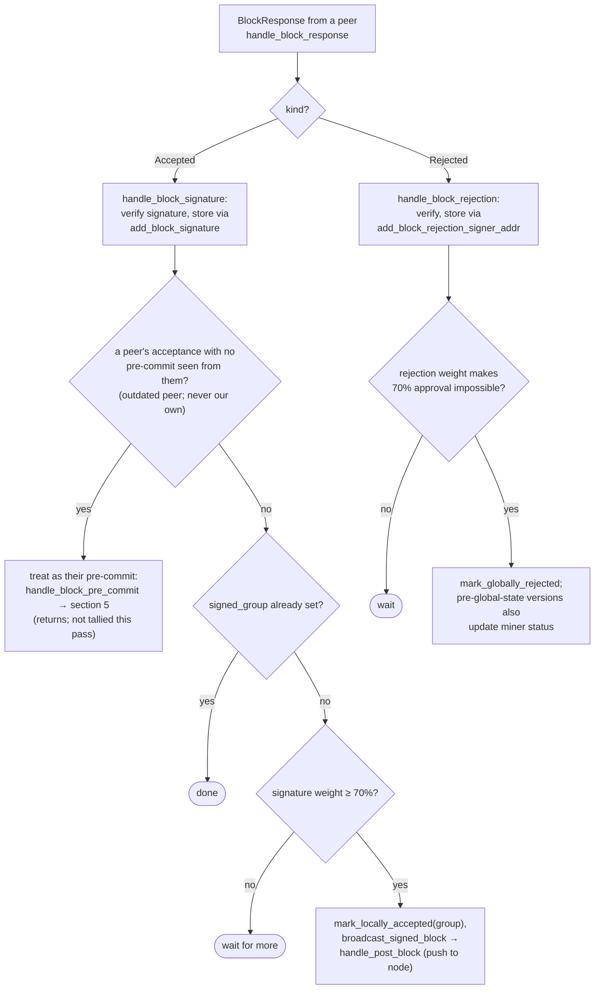

## Analysis

The report's bug class is: a "fast path" function (`fastUpgradePenguin`) omits a safety check (`underMaxLevel` modifier) that is present in the equivalent "slow path" function (`upgradePenguin`), letting state exceed an invariant boundary that other code paths rely on. The reachable analog in this repo is in the signer's dual paths for reaching a block signature/acceptance decision.

### Two paths to "sign/accept a block", only one of which rechecks conflicts

`stacks-signer/src/v0/signer.rs` has two independent code paths that can move a block to a signed/accepted state and push it to the node:

1. **Pre-commit → signature path** — `handle_block_pre_commit`. Once pre-commit weight crosses threshold, it explicitly re-validates chainstate and same-height conflicts before signing: [1](#0-0) [2](#0-1) 

2. **Aggregated-signature → broadcast path** — `store_and_process_block_signature`, invoked when peer `BlockResponse::Accepted` messages accumulate ≥70% weight for a block for which this signer already saw a pre-commit from that peer. This path checks only the weight threshold and `signed_group`, then immediately marks the block locally accepted and broadcasts/pushes it to the stacks-node — with **no call** to `check_block_against_signer_db_state`, `get_signed_conflicts`, `conflict_still_blocks`, or `reorg_permit_stands`: [3](#0-2) 

The project's own documentation and test suite establish that this recheck is a deliberate, required guard against signing/endorsing two conflicting sibling blocks at the same height (the exact scenario exercised by `async_sibling_validation` tests): [4](#0-3) [5](#0-4) [6](#0-5) 

### Title
Signature-tally path (`store_and_process_block_signature`) skips the sibling-conflict recheck that the pre-commit path enforces, allowing a signer to broadcast a conflicting block - ([File: stacks-signer/src/v0/signer.rs])

### Summary
`handle_block_pre_commit` re-validates chainstate and checks for signed conflicts at the same/higher height before this signer signs a block. `store_and_process_block_signature`, which is reached when *other* signers' acceptance signatures accumulate to threshold, performs none of these checks before marking the block locally accepted and pushing it to the node.

### Finding Description
Both functions can terminate in a `mark_locally_accepted` + broadcast-to-node action for a given block. `handle_block_pre_commit` treats this as sensitive enough to re-run `check_block_against_signer_db_state` and the `get_signed_conflicts`/`conflict_still_blocks`/`reorg_permit_stands` guard immediately beforehand, because time may have passed since validation and a *different* block at the same height may since have been signed. `store_and_process_block_signature` reaches the identical outcome (`mark_locally_accepted(true)` → `broadcast_signed_block` → `handle_post_block`, i.e. `stacks_client.post_block`) but has no equivalent recheck — it only gates on aggregate signature weight and `signed_group`: [7](#0-6) 

This is the same missing-modifier pattern as `fastUpgradePenguin()`: two functions that should share an invariant-preserving guard, but only one enforces it.

### Impact Explanation
Per the rules, "a signer signing an invalid, non-canonical, or conflicting block" is a Critical-class impact. If this signer has already signed/locally-accepted block A at height h via `handle_block_pre_commit` (which correctly checked for conflicts at signing time), and afterwards receives a stream of already-collected `BlockResponse::Accepted` messages for a sibling block B at the same height h (e.g., from the documented tenure-start race window, `async_sibling_validation`), `store_and_process_block_signature` will push B to the node once its aggregate weight crosses threshold — without ever checking that B conflicts with the already-signed A. This breaks the one-block-per-height / no-double-endorsement invariant that the codebase otherwise treats as sacrosanct.

### Likelihood Explanation
Medium. It requires the well-documented sibling/tenure-start race (two blocks proposed for the same height within the async validation window) already covered by the codebase's own tests, plus normal gossip delivery of acceptance messages for the stale sibling reaching this signer after it locally signed the other block. No signer-key compromise or attacker-controlled majority is needed — only ordinary timing variance among otherwise honest signers around a legitimate sibling-block race, which a single miner can help trigger by proposing two competing tenure-start blocks.

### Recommendation
In `store_and_process_block_signature` (stacks-signer/src/v0/signer.rs), before calling `block_info.mark_locally_accepted(...)` / `broadcast_signed_block`, re-run the same guard used in `handle_block_pre_commit`: call `check_block_against_signer_db_state`, then evaluate `get_signed_conflicts` / `conflict_still_blocks` / `reorg_permit_stands` for the block, and withhold/refuse the broadcast (rather than push it to the node) if a fresh, live conflict at the same or higher height exists.

### Proof of Concept
1. Miner proposes tenure-start block A; due to the async-validation timing gap, a sibling tenure-start block B is also proposed at the same height (as modeled in `stacks-signer/src/v0/tests.rs::async_sibling_validation`).
2. Signer S validates and pre-commits to A first; once pre-commit weight reaches threshold, `handle_block_pre_commit` checks `get_signed_conflicts`/`conflict_still_blocks` (no conflicts yet), and S signs A (`mark_locally_accepted`).
3. Separately, other signers who saw B before A's win became apparent continue to broadcast `BlockResponse::Accepted` for B. These messages arrive at S via `handle_block_response` → `handle_block_signature` → `store_and_process_block_signature` (since those peers already pre-committed to B, the "outdated peer" pre-commit fallback is skipped).
4. Once B's aggregate acceptance weight crosses `min_weight`, `store_and_process_block_signature` calls `block_info.mark_locally_accepted(true)` and `broadcast_signed_block` → `handle_post_block`, submitting the conflicting sibling B to S's stacks-node — with no recheck against the fact that S already signed conflicting block A at the same height.

### Citations

**File:** stacks-signer/src/v0/signer.rs (L1340-1366)
```rust
        // The chain and signer db state may have changed materially since this block passed the
        // proposal-time checks (e.g. between validation and reaching the pre-commit threshold we
        // may have signed a block that this one would reorg). Re-run the chainstate checks
        // before putting a signature over the block, and respond with a rejection if they no
        // longer pass, just as the block validation response handler does.
        if let Some(block_rejection) =
            self.check_block_against_signer_db_state(stacks_client, &block_info.block)
        {
            warn!(
                "{self}: Reached the pre-commit threshold for a block, but it no longer passes the chainstate checks. Rejecting.";
                "signer_signature_hash" => %block_hash,
                "block_height" => block_info.block.header.chain_length,
                "reject_code" => %block_rejection.reason_code,
                "reject_reason" => &block_rejection.reason,
            );
            if let Err(e) = block_info.mark_locally_rejected() {
                if !block_info.has_reached_consensus() {
                    warn!("{self}: Failed to mark block as locally rejected: {e:?}");
                }
            };
            self.signer_db
                .insert_block(&block_info)
                .unwrap_or_else(|e| self.handle_insert_block_error(e));
            self.handle_block_rejection(&block_rejection, sortition_state);
            self.send_block_response(&block_info.block, block_rejection.into());
            return;
        }
```

**File:** stacks-signer/src/v0/signer.rs (L1383-1421)
```rust
        let conflicts = match self
            .signer_db
            .get_signed_conflicts(block_info.block.header.chain_length, &block_hash)
        {
            Ok(conflicts) => conflicts,
            Err(e) => {
                warn!("{self}: Failed to query the signed blocks. Refusing to sign block {block_hash}: {e:?}");
                return;
            }
        };
        let freshness_cutoff = get_epoch_time_secs().saturating_sub(
            self.proposal_config
                .tenure_last_block_proposal_timeout
                .as_secs(),
        );
        // A fresh signature only blocks while the block it covers could still be part of the
        // chain: see `conflict_still_blocks`, which asks the node whether it is. Check
        // freshness first: it is a local timestamp comparison, while `reorg_permit_stands`
        // and `conflict_still_blocks` each query the node, so stale conflicts cost no
        // round-trips.
        if let Some(conflict) = conflicts.iter().find(|conflict| {
            conflict.last_endorsed > freshness_cutoff
                && !self.reorg_permit_stands(stacks_client, conflict)
                && self.conflict_still_blocks(
                    stacks_client,
                    conflict,
                    block_info.block.header.chain_length,
                )
        }) {
            warn!(
                "{self}: Reached the pre-commit threshold for a block, but we have recently signed or accepted a different block at the same or higher height. Refusing to sign.";
                "signer_signature_hash" => %block_hash,
                "block_height" => block_info.block.header.chain_length,
                "conflicting_signer_signature_hash" => %conflict.signer_signature_hash,
                "conflicting_block_height" => conflict.stacks_height,
                "conflicting_consensus_hash" => %conflict.consensus_hash,
            );
            return;
        }
```

**File:** stacks-signer/src/v0/signer.rs (L2462-2538)
```rust
        // If this isn't our own signature and we haven't seen a pre-commit from this signer yet, try treating it as a pre-commit in case the caller is running an outdated version
        if signer_address != &self.stacks_address && !self.signer_db.has_committed(block_hash, signer_address).inspect_err(|e| warn!("Failed to check if pre-commit message already considered for {signer_address:?} for {block_hash}: {e}")).unwrap_or(false) {
            self.handle_block_pre_commit(stacks_client, sortition_state, signer_address, block_hash);
            return;
        }

        if block_info.signed_group.is_some() {
            // We have already processed this block to the accepted state. Adding more signatures will not change anything so nothing to check.
            return;
        }
        // do we have enough signatures to broadcast?
        // i.e. is the threshold reached?
        let signatures = self
            .signer_db
            .get_block_signatures(block_hash)
            .unwrap_or_else(|_| panic!("{self}: Failed to load block signatures"));

        // put signatures in order by signer address (i.e. reward cycle order)
        let addrs_to_sigs: HashMap<_, _> = signatures
            .into_iter()
            .filter_map(|sig| {
                let Ok(public_key) = Secp256k1PublicKey::recover_to_pubkey_without_validating_low_s(
                    block_hash.bits(),
                    &sig,
                ) else {
                    return None;
                };
                let addr = StacksAddress::p2pkh(self.mainnet, &public_key);
                Some((addr, sig))
            })
            .collect();

        let signature_weight = self.signer_weights.get(signer_address).unwrap_or(&0);
        let total_signature_weight = self.compute_signature_signing_weight(addrs_to_sigs.keys());
        let total_weight = self.compute_signature_total_weight();

        let min_weight = NakamotoBlockHeader::compute_voting_weight_threshold(total_weight)
            .unwrap_or_else(|_| {
                panic!("{self}: Failed to compute threshold weight for {total_weight}")
            });

        if min_weight > total_signature_weight {
            info!("{self}: Received block acceptance, but have not yet reached the acceptance threshold.";
                "signer_signature_hash" => %block_hash,
                "signature_weight" => signature_weight,
                "consensus_hash" => %block_info.block.header.consensus_hash,
                "block_height" => block_info.block.header.chain_length,
                "total_weight_approved" => total_signature_weight,
                "total_weight" => total_weight,
                "percent_approved" => (total_signature_weight as f64 / total_weight as f64 * 100.0),
            );
            return;
        }
        info!("{self}: have reached the block acceptance threshold";
            "signer_signature_hash" => %block_hash,
            "signature_weight" => signature_weight,
            "consensus_hash" => %block_info.block.header.consensus_hash,
            "block_height" => block_info.block.header.chain_length,
            "total_weight_approved" => total_signature_weight,
            "total_weight" => total_weight,
            "percent_approved" => (total_signature_weight as f64 / total_weight as f64 * 100.0),
        );

        // have enough signatures to broadcast!
        // move block to LOCALLY accepted state.
        // It is only considered globally accepted IFF we receive a new block event confirming it OR see the chain tip of the node advance to it.
        if let Err(e) = block_info.mark_locally_accepted(true) {
            if !block_info.has_reached_consensus() {
                warn!("{self}: Failed to mark block as locally accepted: {e:?}");
            }
        }
        let _ = self.signer_db.insert_block(block_info).map_err(|e| {
            warn!("Failed to set group threshold signature timestamp for {block_hash}: {e:?}");
            panic!("{self} Failed to write block to signerdb: {e}");
        });
        self.broadcast_signed_block(stacks_client, block_info.block.clone(), &addrs_to_sigs);
    }
```

**File:** stacks-signer/src/v0/tests.rs (L319-327)
```rust
/// Tests for the asynchronous-validation tenure-start timing gap.
///
/// `check_proposal` rejects a second tenure-start block for a tenure, but it runs before the
/// node's async validation, so two sibling tenure-start blocks proposed within the validation
/// window can both be pre-committed. A signer must still refuse to place a *signature* on a
/// second sibling while its signature on the first is fresh, so a single winning miner cannot
/// obtain two signer certificates for one sortition. Once the signature has timed out, the
/// signer consults the node and signs the replacement only if the signed sibling is not
/// canonical at that height, so a sibling that failed to be confirmed can still be replaced.
```

**File:** stacks-signer/src/v0/tests.rs (L770-789)
```rust
    #[test]
    fn signer_refuses_to_sign_second_sibling_tenure_start() {
        // Pin the fresh window far beyond the test's runtime so the guard can only take the
        // fresh branch; the stale branch is covered by the tests below.
        let (info_a, info_b, _) = run_sibling_scenario(Duration::from_secs(100_000), false, None);
        assert_a_signed(&info_a);
        // B is still pre-committed (the sibling is allowed to reach pre-commit), but the signer
        // must refuse to place a second signature on a conflicting same-height block in this
        // tenure while its signature on A is fresh.
        assert_eq!(
            info_b.state,
            BlockState::PreCommitted,
            "block B should be pre-committed but not promoted, got: {}",
            info_b.state
        );
        assert!(
            info_b.signed_self.is_none(),
            "block B must NOT be signed: the signer already signed a conflicting sibling in this tenure"
        );
    }
```

**File:** docs/signer-flows.md (L349-371)
```markdown
## 6. Responses from other signers

Peer acceptances and rejections drive the two consensus outcomes. Acceptances
tally toward the 70% signing threshold and reaching it makes _this_ signer
assemble the signature set and push the block to its node. Rejections tally
toward the blocking minority (>30%), which makes the 70% unreachable and
finalizes the block as globally rejected.


