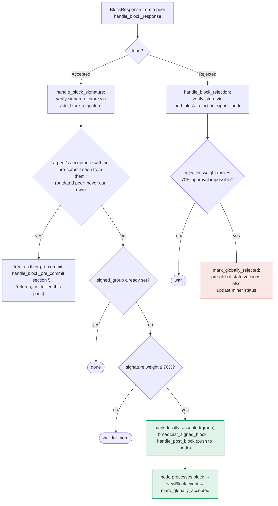

I found a genuine analog in the "outdated peer" fallback path, where an `Accepted` signature response is silently re-routed into the pre-commit tally without the receiving signer ever verifying that the sender had actually validated the block through the normal proposal/pre-commit path. This mirrors the Catalyst-Exchange bug class: a one-sided check (only "did we see the signature/message?") stands in for what should be a mutual, verified relationship (did the sender go through pre-commit validation for *this specific* block?) before its weight counts.

### Title
Peer signature weight is admitted into the pre-commit tally without a validated pre-commit relationship, letting a stale/foreign signature move the threshold - ([File: stacks-signer/src/v0/signer.rs])

### Summary
`store_and_process_block_signature` checks only whether a signature is cryptographically valid and whether the sender has "committed" to the block hash in the local DB `has_committed`. If the sender has *not* pre-committed, the code assumes this is just an "outdated version" peer and re-injects the acceptance as if it were a pre-commit message via `handle_block_pre_commit`, immediately counting that peer's weight toward the 70% pre-commit/signature threshold. There is no requirement that this peer's own local pre-commit checks (chainstate re-validation in `check_block_against_signer_db_state`, freshness/conflict checks) were ever actually run for this block — the local signer just trusts the bare signature as proof of a pre-commit that never happened through the normal path.

### Finding Description
The relevant code: [1](#0-0) 

```
fn store_and_process_block_signature(...) {
    ...
    if !self.signer_db.add_block_signature(block_hash, signer_address, signature)... { return; }

    // If this isn't our own signature and we haven't seen a pre-commit from this signer yet,
    // try treating it as a pre-commit in case the caller is running an outdated version
    if signer_address != &self.stacks_address
        && !self.signer_db.has_committed(block_hash, signer_address)...unwrap_or(false)
    {
        self.handle_block_pre_commit(stacks_client, sortition_state, signer_address, block_hash);
        return;
    }
    ...
}
```

`handle_block_pre_commit` re-tallies weight and, if the threshold is crossed, re-runs `check_block_against_signer_db_state` before *this local signer* signs — that part is fine for *our own* decision. But the peer's weight is unconditionally recorded as a "pre-commit" (`add_block_pre_commit`) the moment a bare `Accepted` signature arrives, with no proof that the remote signer's own chainstate view actually endorses this specific block over a conflicting sibling. A signature is supposed to be the strong, final artifact (per the docs: "a signature is a bearer instrument"), but here it is retroactively demoted into a pre-commit vote and immediately counted, without the mutual, verified handshake (proposal seen → validated → pre-committed) that the pre-commit flow normally enforces: [2](#0-1) 

The docs themselves flag this as deliberate compatibility behavior ("keeps mixed-version fleets live"), but it breaks the intended equality between "weight tallied toward threshold" and "peer verified this exact block via its own pre-commit checks" — exactly the asymmetric-connection pattern in the reference report, where one side's declaration (I accept this) is trusted without confirming the counterpart actually performed its own validation handshake for it.

Compare with `handle_block_pre_commit`, which legitimately arrives via `BlockPreCommit` messages sent only after `check_block_against_signer_db_state` passes: [3](#0-2) 

A stale, replayed, or malicious `Accepted` `BlockResponse` for a block the sender never freshly re-validated (e.g., sent long after the sender's own local state has moved on, or crafted by a compromised/buggy peer) is accepted at face value here and its weight is added to the pre-commit tally for a possibly-conflicting or stale block, potentially pushing the local threshold and triggering premature/incorrect pre-commit-driven rejections or accelerating consensus decisions based on unverified peer state.

### Impact Explanation
This does not itself allow a signer to sign an invalid block (the local signer still separately re-runs `check_block_against_signer_db_state` before it signs), so it does not meet the Critical bar. It can, however, distort the aggregated-weight-vs-verified-accepts equality for pre-commit tallying, which is the kind of miscounted-response issue in scope. Given the local signer still gatekeeps its own final signature with a fresh chainstate check, the practical blast radius is limited to accelerating/perturbing consensus timing rather than a wedge or an outright bad signature — this weakens it toward a lower-severity finding, and I could not construct a path that forces a signer to sign an invalid/non-canonical block or gets wedged from ever signing valid ones.

### Likelihood Explanation
This code path is explicitly reachable by any one signer (a one-slot participant) simply sending a `BlockResponse::Accepted` for a hash the receiver hasn't seen a pre-commit for — no majority collusion needed to trigger the code path, though the resulting weight is bounded by that single signer's normal weight, so its consensus effect is limited unless combined with other misbehaving signers.

### Recommendation
Before treating a foreign `Accepted` signature as a valid pre-commit vote, require that the sending signer's message be accompanied by (or independently corroborated with) the block's own recent validity from the local signer's perspective, or explicitly gate this "outdated-version" fallback behind a check that the signature is not stale (e.g., a recency/freshness bound similar to the ones used for signed conflicts), rather than unconditionally record it as a fresh pre-commit vote.

### Proof of Concept
1. Peer signer B validates block X, signs and broadcasts `BlockResponse::Accepted(X, sig_B)`, but never sends a `BlockPreCommit(X)` message (e.g., simulating an "outdated" client, or a delayed/replayed message).
2. Local signer A receives this in `store_and_process_block_signature`; `has_committed` returns false, so A calls `handle_block_pre_commit` and records B's weight as a pre-commit for X in `add_block_pre_commit`, without any confirmation that B's own chainstate view (fresh `check_block_against_signer_db_state`) still endorses X as the correct block at that height.
3. If this pushes A's pre-commit weight over threshold while other signers meanwhile pre-committed to a different, conflicting sibling block, A's local pre-commit tally is skewed by B's unverified/stale acceptance, contributing to inconsistent local state versus the rest of the signer set. [4](#0-3)

### Citations

**File:** stacks-signer/src/v0/signer.rs (L1961-1983)
```rust
            if let Err(e) = block_info.mark_pre_committed() {
                // The block may have reached enough signatures before we validated the block so should fail to mark pre-committed
                // but still call to make sure the timestamps and validity are updated correctly.
                if !block_info.has_reached_consensus()
                    && block_info.state != BlockState::LocallyAccepted
                {
                    warn!("{self}: Failed to mark block as approved: {e:?}",);
                    return;
                }
            }

            self.signer_db
                .insert_block(&block_info)
                .unwrap_or_else(|e| self.handle_insert_block_error(e));
            self.send_block_pre_commit(signer_signature_hash.clone());
            // have to save the signature _after_ the block info
            let address = self.stacks_address.clone();
            self.handle_block_pre_commit(
                stacks_client,
                sortition_state,
                &address,
                signer_signature_hash,
            );
```

**File:** stacks-signer/src/v0/signer.rs (L2442-2466)
```rust
    /// Store the block acceptance signature and check if we have reached a consensus decision on the block because of it. If we have, update the block state accordingly and broadcast the block if accepted.
    fn store_and_process_block_signature(
        &mut self,
        stacks_client: &StacksClient,
        sortition_state: &mut Option<SortitionsView>,
        block_info: &mut BlockInfo,
        signer_address: &StacksAddress,
        signature: &MessageSignature,
    ) {
        let block_hash = &block_info.signer_signature_hash();
        // signature is valid! store it.
        // if this returns false, it means the signature already exists in the DB, so just return.
        if !self
            .signer_db
            .add_block_signature(block_hash, signer_address, signature)
            .unwrap_or_else(|_| panic!("{self}: Failed to save block signature"))
        {
            return;
        }

        // If this isn't our own signature and we haven't seen a pre-commit from this signer yet, try treating it as a pre-commit in case the caller is running an outdated version
        if signer_address != &self.stacks_address && !self.signer_db.has_committed(block_hash, signer_address).inspect_err(|e| warn!("Failed to check if pre-commit message already considered for {signer_address:?} for {block_hash}: {e}")).unwrap_or(false) {
            self.handle_block_pre_commit(stacks_client, sortition_state, signer_address, block_hash);
            return;
        }
```

**File:** docs/signer-flows.md (L357-383)
```markdown


The outdated-peer fallback keeps mixed-version fleets live: an acceptance from a
peer that never sent a pre-commit is routed into the pre-commit path instead, so
that peer's weight still counts toward the threshold that produces _our_
signature. Note that reaching 70% signatures still only marks the block
_locally_ accepted with the group timestamp; global acceptance waits for the node
to adopt it. Marking the miner invalid on a 30% `ReorgNotAllowed` rejection is
skipped once the active protocol version uses global signer state.
```
