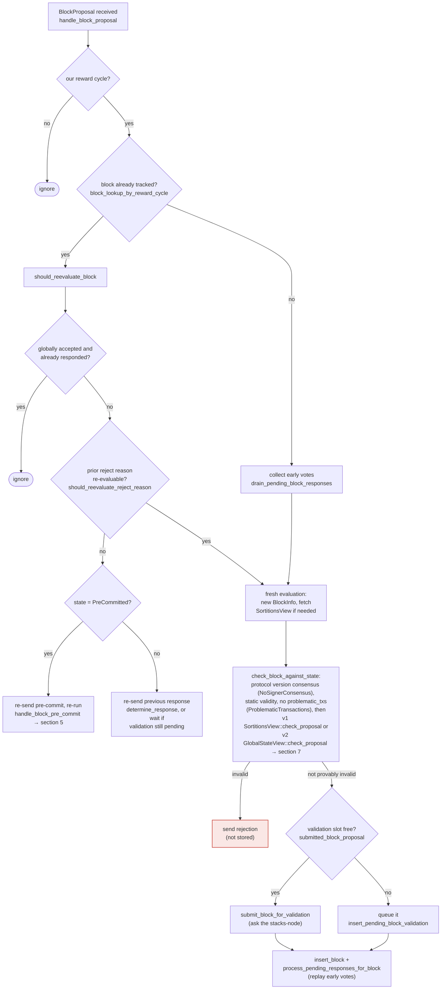

Confirmed: `check_proposal` (invoked directly from `handle_block_proposal`/`check_block_against_local_state`, i.e. on receipt of a bare, unsigned proposal from a single miner slot, before any node validation or signer votes) can call `check_parent_tenure_choice`, which on success unconditionally executes `record_superseded_tenure` → `SignerDb::mark_tenure_superseded`, an `INSERT OR REPLACE` keyed on the reorged tenure's `consensus_hash`. This is a single-slot-miner-reachable write that clobbers a security-relevant record used later to decide whether a signature-conflict guard should be excluded.

### Title
A single miner proposal can clobber the `superseded_tenures` reorg-permit record, letting the signer sign a fresh conflicting sibling while it should stay silent - ([File: stacks-signer/src/chainstate/mod.rs])

### Summary
`SortitionData::check_parent_tenure_choice` is invoked from `SortitionsView::check_proposal` at bare proposal arrival [1](#0-0) , i.e. before the block goes to node validation or any pre-commit/signature voting [2](#0-1) . If the reorg it describes clears the loose per-tenure rules (tenure produced ≤1 globally-accepted block and/or its first block arrived close enough to the sortition), the signer immediately calls `record_superseded_tenure`, which does an `INSERT OR REPLACE` on `superseded_tenures` keyed by the reorged tenure's `consensus_hash` [3](#0-2) [4](#0-3) . This record is later read by `reorg_permit_stands`/`get_signed_conflicts` at the pre-commit-threshold signing decision to *exclude* an otherwise-blocking conflicting signature [5](#0-4) [6](#0-5) .

### Finding Description
The "one signature per height / no-conflicting-sibling" guard depends on `get_signed_conflicts` + `reorg_permit_stands`: a signer refuses to place a second signature on a block that conflicts with one it already signed, *unless* a recorded "permit" says a later tenure was sanctioned to reorg the earlier one [7](#0-6) . That permit is supposed to be recorded only once the *reorging tenure itself* has been vetted (`check_parent_tenure_choice` on the new tenure-change block).

However, `check_parent_tenure_choice` is invoked from `check_proposal`, which every signer runs independently on each **raw, unsigned** `BlockProposal` message the miner slot broadcasts—well before the stacks-node validates it and before any signer votes or pre-commits are exchanged [8](#0-7) . A single miner can therefore, by simply crafting and broadcasting a tenure-change proposal whose `parent_tenure_id` reorgs a target tenure that (a) mined zero blocks, or (b) mined exactly one block whose local `approved_time` (or lack thereof) is "poorly timed" relative to the burn block transition, cause every online signer to unconditionally write (`INSERT OR REPLACE`) a `superseded_tenures` row naming that miner's own new tenure as the one that gets to bypass the sibling-conflict guard for the target tenure [9](#0-8) .

Because the primary key is the *reorged* tenure's `consensus_hash`, this record silently overwrites (clobbers) whatever permit state previously existed for that tenure — including the case where there was no prior permit at all, and the case of a competing/legitimate later tenure that should be the only one entitled to the exclusion. The write happens purely from evaluating an as-yet-unsigned, unvalidated proposal; no majority, no node validation, and no actual chain reorg needs to occur. Once written, any later block from that same attacker-chosen tenure (`superseded_by_consensus_hash`) that reaches the 70% pre-commit threshold will have its "fresh conflicting signature" veto bypassed via `reorg_permit_stands` returning `true` as long as the permitting sortition is still reachable at the node [10](#0-9) .

### Impact Explanation
This breaks the intended equality "a signer's own signature over one tenure's block must veto a signature over a conflicting sibling" by letting a single miner slot pre-plant a permit record (via a cheap, unsigned proposal broadcast) that later legitimizes signing a genuinely conflicting/competing block at the same height, before the network has actually agreed to the reorg. This matches the "Critical" impact bucket: a signer can end up placing a fresh signature on a conflicting/non-canonical sibling block that the equivocation/conflict guard was specifically designed to block, because the permit that lifts the guard was recorded from unauthenticated proposal content rather than from an actually-sanctioned, signed tenure transition.

### Likelihood Explanation
Reachable by exactly the actor allowed in scope: the one-slot block-proposing miner, using only ordinary `BlockProposal` gossip that every signer already processes at proposal-arrival time via `check_proposal`. It requires no majority of signers, no other signer's key, and no node cooperation beyond the client-side `get_tenure_forking_info` call the signer itself makes. The precondition (a target tenure with ≤1 globally-accepted block, or a first block whose recorded approval time is close to the sortition boundary) is a normal, frequently-occurring chain condition (e.g., any tenure that just started, or any block still awaiting/having no signature record locally) rather than a rare edge case.

### Recommendation
Do not record `mark_tenure_superseded` from the bare-proposal `check_proposal` path. The permit should only be persisted once the reorging block/tenure has itself cleared the validation the guard is meant to protect (e.g., after node validation succeeds and/or after the block reaches the pre-commit/signature threshold), not merely because an unvalidated, unsigned proposal happened to name a qualifying parent tenure. Alternatively, make the exclusion check re-verify the qualifying conditions (block counts / timing) at signing time against the *specific* conflicting block being excluded, rather than trusting a previously written, freely overwritable `superseded_tenures` row.

### Proof of Concept
1. Signer S has previously locally-accepted/signed a block `A` in tenure `T1` (which the node has not yet seen, so `get_globally_accepted_block_count_in_tenure(T1) == 0/1` and no `approved_time` is on record for its first block).
2. The one-slot miner crafts and broadcasts (over `.miners` StackerDB, no signatures from other signers needed) a new tenure-change `BlockProposal` for tenure `T2` whose `parent_tenure_id` points past `T1` (a "reorg").
3. Every signer's `handle_block_proposal` → `check_block_against_local_state` → `SortitionsView::check_proposal` runs on this raw proposal [11](#0-10) , hits the parent-tenure-mismatch branch, and calls `check_parent_tenure_choice` [12](#0-11) .
4. Since `T1` qualifies under the loose rules (empty tenure or poorly-timed first block), `mark_tenure_superseded(T1, ..., T2, ...)` is written unconditionally [13](#0-12) , regardless of whether `T2`'s block is ever validated or signed by anyone.
5. The same miner (or an accomplice with the same key set) later gets a genuinely conflicting sibling block `B` at `A`'s height, in tenure `T2`, to the pre-commit threshold. At the signing check, `get_signed_conflicts` finds `A` as a conflict, but `reorg_permit_stands` reads the just-planted `superseded_tenures` row naming `T2` and returns `true`, excluding the conflict [14](#0-13) , and S signs `B` — a second, conflicting signature at the same height that the guard should have refused.

### Citations

**File:** stacks-signer/src/chainstate/v1.rs (L176-186)
```rust
            let consensus_hash_match =
                self.cur_sortition.data.consensus_hash == tip.block.header.consensus_hash;
            let parent_tenure_id_match =
                self.cur_sortition.data.parent_tenure_id == tip.block.header.consensus_hash;
            if !consensus_hash_match && !parent_tenure_id_match {
                // More expensive check, so do it only if we need to.
                let is_valid_parent_tenure = self.cur_sortition.data.check_parent_tenure_choice(
                    signer_db,
                    client,
                    &self.config.first_proposal_burn_block_timing,
                )?;
```

**File:** docs/signer-flows.md (L164-193)
```markdown
## 3. A block proposal arrives

The miner broadcasts a proposal. If we've seen this exact block before,
`should_reevaluate_block` decides whether the old verdict stands; a block we
only pre-committed to is deliberately routed back through the pre-commit
evaluation so a re-proposal cannot shortcut to a signature. A fresh proposal is
checked against our view of the world _before_ spending a node validation on it.



**File:** docs/signer-flows.md (L496-511)
```markdown
One decision does have to be recorded, because it is ours rather than the
node's. When a miner builds off something other than the prior sortition,
`check_parent_tenure_choice` decides whether the reorg is allowed: it is, if
every tenure being reorged has at most one globally accepted block and produced
its first block too close to the next sortition to count
(`first_proposal_burn_block_timing`). Having sanctioned that replacement, the
signer records those tenures as **superseded** (`mark_tenure_superseded`), so its
own signature over what they built does not then block the replacement it just
permitted — the node cannot answer this one at signing time, since it still
serves the reorged tenure as fully live until the replacement lands. What _is_
still derived from the node is the permit's own validity: the record carries the
permitting tenure's sortition, and it only excludes conflicts while that
sortition remains canonical (section 5, `reorg_permit_stands`), so a burnchain
fork that orphans the permitting tenure automatically voids the permit. A record
more than `MAX_FORK_DEPTH` (100) burn blocks below the tip is dropped; a fork
that deep would cause far bigger problems than a stale conflict.
```

**File:** stacks-signer/src/chainstate/mod.rs (L204-315)
```rust
        for tenure in tenures_reorged.iter() {
            if tenure.consensus_hash == self.parent_tenure_id {
                // this was a built-upon tenure, no need to check this tenure as part of the reorg.
                continue;
            }

            // disallow reorg if more than one block has already been signed
            let globally_accepted_blocks =
                signer_db.get_globally_accepted_block_count_in_tenure(&tenure.consensus_hash)?;
            if globally_accepted_blocks > 1 {
                warn!(
                    "Miner is not building off of most recent tenure, but a tenure they attempted to reorg has already more than one globally accepted block.";
                    "parent_tenure" => %self.parent_tenure_id,
                    "last_sortition" => %self.prior_sortition,
                    "violating_tenure_id" => %tenure.consensus_hash,
                    "violating_tenure_first_block_id" => ?tenure.first_block_mined,
                    "globally_accepted_blocks" => globally_accepted_blocks,
                );
                return Ok(false);
            }

            let Some(first_block_mined) = &tenure.first_block_mined else {
                // The node saw no blocks in this tenure, so the reorg takes nothing away from
                // the canonical chain. We may still hold a signature over a block in it that
                // the node has never seen (a block we accept locally is not handed to the node
                // until the whole signer set has signed it), so the reorg must still be
                // recorded if it is permitted.
                superseded_tenures.push(tenure);
                continue;
            };
            let Some(local_block_info) =
                signer_db.get_first_approved_block_in_tenure(&tenure.consensus_hash)?
            else {
                warn!(
                    "Miner is not building off of most recent tenure, but a tenure they attempted to reorg has already mined blocks, and there is no local knowledge for that tenure's block timing.";
                    "parent_tenure" => %self.parent_tenure_id,
                    "last_sortition" => %self.prior_sortition,
                    "violating_tenure_id" => %tenure.consensus_hash,
                    "violating_tenure_first_block_id" => %first_block_mined,
                );
                return Ok(false);
            };

            let checked_proposal_timing = if let Some(sortition_state_received_time) =
                sortition_state_received_time
            {
                // how long was there between when the proposal was received and the next sortition started?
                let proposal_to_sortition = if let Some(approved_at) =
                    local_block_info.approved_time
                {
                    sortition_state_received_time.saturating_sub(approved_at)
                } else {
                    info!("We did not sign over the reorged tenure's first block, considering it as a late-arriving proposal");
                    0
                };
                if Duration::from_secs(proposal_to_sortition) < *first_proposal_burn_block_timing {
                    info!(
                        "Miner is not building off of most recent tenure. A tenure they reorg has already mined blocks, but the block was poorly timed, allowing the reorg.";
                        "parent_tenure" => %self.parent_tenure_id,
                        "last_sortition" => %self.prior_sortition,
                        "violating_tenure_id" => %tenure.consensus_hash,
                        "violating_tenure_first_block_id" => %first_block_mined,
                        "violating_tenure_proposed_time" => local_block_info.proposed_time,
                        "new_tenure_received_time" => sortition_state_received_time,
                        "new_tenure_burn_timestamp" => self.burn_header_timestamp,
                        "first_proposal_burn_block_timing_secs" => first_proposal_burn_block_timing.as_secs(),
                        "proposal_to_sortition" => proposal_to_sortition,
                    );
                    superseded_tenures.push(tenure);
                    continue;
                }
                true
            } else {
                false
            };

            warn!(
                "Miner is not building off of most recent tenure, but a tenure they attempted to reorg has already mined blocks.";
                "parent_tenure" => %self.parent_tenure_id,
                "last_sortition" => %self.prior_sortition,
                "violating_tenure_id" => %tenure.consensus_hash,
                "violating_tenure_first_block_id" => %first_block_mined,
                "checked_proposal_timing" => checked_proposal_timing,
            );
            return Ok(false);
        }
        // Every reorged tenure cleared the rules, so the reorg is permitted.
        for tenure in superseded_tenures {
            self.record_superseded_tenure(signer_db, tenure);
        }
        Ok(true)
    }

    /// Note that we have sanctioned `self`'s tenure replacing whatever `tenure` built, so a
    /// signature we already placed on one of its blocks must stop counting as a conflict while
    /// `self`'s sortition remains canonical.
    ///
    /// A failure to record only costs a delayed replacement -- the conflict keeps blocking until
    /// the signature goes stale -- so it is logged rather than propagated.
    fn record_superseded_tenure(&self, signer_db: &mut SignerDb, tenure: &TenureForkingInfo) {
        if let Err(e) = signer_db.mark_tenure_superseded(
            &tenure.consensus_hash,
            tenure.burn_block_height,
            &self.consensus_hash,
            &self.burn_block_hash,
        ) {
            warn!("Failed to record a tenure whose reorg we permitted: {e}";
                "superseded_tenure_id" => %tenure.consensus_hash,
                "superseded_by" => %self.consensus_hash,
            );
        }
    }
```

**File:** stacks-signer/src/signerdb.rs (L1642-1660)
```rust
    pub fn mark_tenure_superseded(
        &mut self,
        consensus_hash: &ConsensusHash,
        burn_block_height: u64,
        superseded_by_consensus_hash: &ConsensusHash,
        superseded_by_burn_block_hash: &BurnchainHeaderHash,
    ) -> Result<(), DBError> {
        self.db.execute(
            "INSERT OR REPLACE INTO superseded_tenures (consensus_hash, burn_block_height, superseded_by_consensus_hash, superseded_by_burn_block_hash, superseded_at) VALUES (?1, ?2, ?3, ?4, ?5)",
            params![
                consensus_hash,
                u64_to_sql(burn_block_height)?,
                superseded_by_consensus_hash,
                superseded_by_burn_block_hash,
                u64_to_sql(get_epoch_time_secs())?
            ],
        )?;
        Ok(())
    }
```

**File:** stacks-signer/src/v0/signer.rs (L897-930)
```rust
        // Check if proposal can be rejected now if not valid against sortition view
        if let Some(sortition_state) = sortition_state {
            match sortition_state.check_proposal(
                stacks_client,
                &mut self.signer_db,
                block,
                true,
                self.global_state_evaluator
                    .get_global_tx_replay_set()
                    .unwrap_or_default(),
            ) {
                // Error validating block
                Err(RejectReason::ConnectivityIssues(e)) => {
                    warn!(
                        "{self}: Error checking block proposal: {e}";
                        "signer_signature_hash" => %signer_signature_hash,
                        "block_id" => %block_id,
                    );
                    Some(self.create_block_rejection(RejectReason::ConnectivityIssues(e), block))
                }
                // Block proposal is bad
                Err(reject_code) => {
                    warn!(
                        "{self}: Block proposal invalid";
                        "signer_signature_hash" => %signer_signature_hash,
                        "block_id" => %block_id,
                        "reject_reason" => %reject_code,
                        "reject_code" => ?reject_code,
                    );
                    Some(self.create_block_rejection(reject_code, block))
                }
                // Block proposal passed check, still don't know if valid
                Ok(_) => None,
            }
```

**File:** stacks-signer/src/v0/signer.rs (L1208-1247)
```rust
    /// Whether a reorg permit recorded for this conflict's tenure still stands.
    ///
    /// `check_parent_tenure_choice` records a permit when the reorg-timing rules sanction a
    /// later tenure replacing what the conflict's tenure built (see
    /// [`SignerDb::mark_tenure_superseded`]). A standing permit excludes the conflict entirely:
    /// our signature must not stand in the way of a replacement we sanctioned. But the permit
    /// is only as alive as the sortition it was granted to: if a burnchain fork orphaned the
    /// permitting sortition, the reorg we sanctioned can no longer happen, and the record must
    /// not keep suppressing the conflict.
    ///
    /// A false 404 here (e.g. from a node still catching up) only restores a conflict the
    /// permit could have excluded, which at worst delays the replacement, so unlike
    /// `conflict_still_blocks` no tip-height guard is needed. A node error voids the permit for
    /// the same reason: blocking is the direction that can be taken back.
    fn reorg_permit_stands(
        &self,
        stacks_client: &StacksClient,
        conflict: &SignedConflictInfo,
    ) -> bool {
        let Some(superseded_by) = &conflict.superseded_by else {
            return false;
        };
        match stacks_client.get_sortition_by_burn_hash(&superseded_by.burn_block_hash) {
            Ok(_) => true,
            Err(ClientError::RequestFailure(reqwest::StatusCode::NOT_FOUND)) => {
                info!("{self}: The tenure we permitted to reorg a conflicting block's tenure was itself orphaned by a burnchain fork. The permit no longer excludes the conflict.";
                    "conflicting_consensus_hash" => %conflict.consensus_hash,
                    "superseded_by_consensus_hash" => %superseded_by.consensus_hash,
                    "superseded_by_burn_block_hash" => %superseded_by.burn_block_hash,
                );
                false
            }
            Err(e) => {
                warn!("{self}: Failed to check whether the sortition that permitted a reorg is still canonical: {e:?}. Treating the permit as void.";
                    "conflicting_consensus_hash" => %conflict.consensus_hash,
                    "superseded_by_consensus_hash" => %superseded_by.consensus_hash,
                );
                false
            }
        }
```

**File:** stacks-signer/src/v0/signer.rs (L1403-1421)
```rust
        if let Some(conflict) = conflicts.iter().find(|conflict| {
            conflict.last_endorsed > freshness_cutoff
                && !self.reorg_permit_stands(stacks_client, conflict)
                && self.conflict_still_blocks(
                    stacks_client,
                    conflict,
                    block_info.block.header.chain_length,
                )
        }) {
            warn!(
                "{self}: Reached the pre-commit threshold for a block, but we have recently signed or accepted a different block at the same or higher height. Refusing to sign.";
                "signer_signature_hash" => %block_hash,
                "block_height" => block_info.block.header.chain_length,
                "conflicting_signer_signature_hash" => %conflict.signer_signature_hash,
                "conflicting_block_height" => conflict.stacks_height,
                "conflicting_consensus_hash" => %conflict.consensus_hash,
            );
            return;
        }
```

**File:** stacks-signer/src/v0/signer.rs (L1432-1457)
```rust
        if conflicts.iter().any(|conflict| {
            conflict.consensus_hash == block_info.block.header.consensus_hash
                && !self.reorg_permit_stands(stacks_client, conflict)
        }) {
            match stacks_client.get_tenure_tip(&block_info.block.header.consensus_hash) {
                Ok(tip) => {
                    let tip_height = tip.anchored_header.height();
                    if tip_height >= block_info.block.header.chain_length {
                        warn!(
                            "{self}: Reached the pre-commit threshold for a block that conflicts with previously signed or accepted blocks, and the canonical tip of its tenure is already at or above the proposed height. Refusing to sign.";
                            "signer_signature_hash" => %block_hash,
                            "block_height" => block_info.block.header.chain_length,
                            "canonical_tip_height" => tip_height,
                        );
                        return;
                    }
                }
                Err(e) => {
                    warn!(
                        "{self}: Failed to fetch the canonical tip of the proposed block's tenure: {e:?}. Treating the tenure as unconfirmed.";
                        "signer_signature_hash" => %block_hash,
                        "consensus_hash" => %block_info.block.header.consensus_hash,
                    );
                }
            }
        }
```

**File:** stacks-signer/src/v0/signer.rs (L1670-1673)
```rust
        // Check if proposal can be rejected now if not valid against sortition view
        let block_rejection =
            self.check_block_against_state(stacks_client, sortition_state, &block_info);

```
