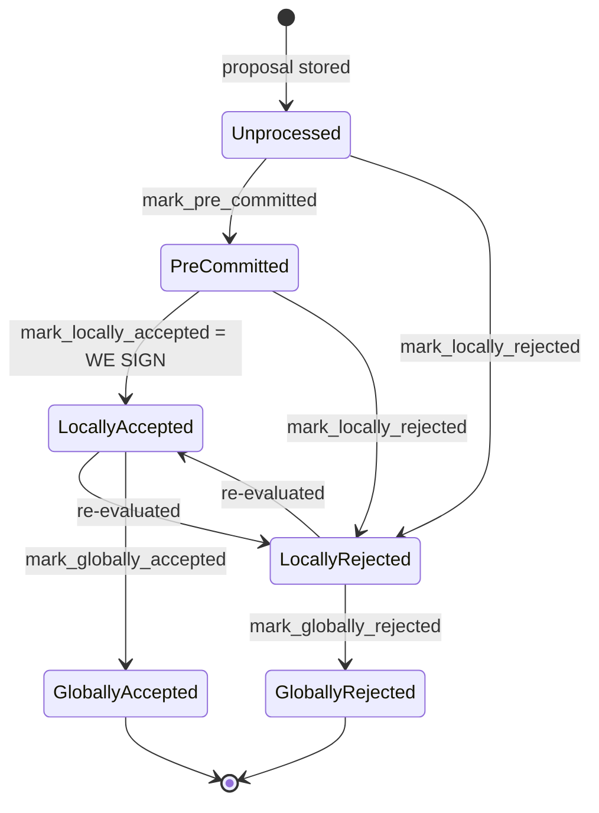

### Title
`get_first_approved_block_in_tenure` never excludes rejected blocks, letting a poorly-timed pre-commit's stamped `approved_time` survive rejection and be replayed to bypass the reorg-timing protection window - ([File: stacks-signer/src/chainstate/mod.rs])

### Summary
`check_parent_tenure_choice` decides whether a reorg of a competing tenure is permitted by comparing the *next* sortition's arrival time against `approved_time` of "the first approved/signed block" of the reorged tenure, gated by `first_proposal_burn_block_timing`. That `approved_time`, however, is fetched via `SignerDb::get_first_approved_block_in_tenure`, whose SQL `WHERE` clause matches any block with `approved_time IS NOT NULL`, `signed_self IS NOT NULL`, or `signed_group IS NOT NULL` — regardless of the block's current `state`. Per `BlockInfo::mark_pre_committed`/`mark_locally_rejected`, `approved_time` is stamped once ("first wins") and is **never cleared** when the same block is later rejected (`mark_locally_rejected` only flips `valid` and `state`, leaving `approved_time` intact). This is the same bug class as the GoGoPool `RewardsStartTime` issue: a timestamp that gates a security-relevant wait/timing window is set once but not reset when the entity it was attached to is effectively cancelled/invalidated, letting a later, differently-timed action inherit the stale timestamp.

### Finding Description
The reorg-timing check lives in `SortitionData::check_parent_tenure_choice`: [1](#0-0) 
It computes `proposal_to_sortition = sortition_state_received_time - approved_at` where `approved_at` comes from `signer_db.get_first_approved_block_in_tenure(&tenure.consensus_hash)`: [2](#0-1) 

`get_first_approved_block_in_tenure` is defined as: [3](#0-2) 
Note the query has no `state` filter — it matches the earliest-height row where `approved_time`, `signed_self`, or `signed_group` is non-null, whatever the block's current lifecycle state is.

`approved_time` is stamped the first time a block is pre-committed or locally accepted and is deliberately sticky ("first wins"): [4](#0-3) 

Crucially, `mark_locally_rejected` (used when a block that was pre-committed is later superseded/rejected — e.g. by a competing proposal, a re-evaluation, or `check_block_against_signer_db_state` overriding a prior pre-commit) does **not** clear `approved_time`: [5](#0-4) 

The documented lifecycle explicitly allows `PreCommitted -> LocallyRejected` and even `LocallyAccepted -> LocallyRejected` transitions, i.e. a signer's decision on a block can be revised after the block was "approved" once: [6](#0-5) 

The result: if a miner first proposes a poorly-timed tenure-start block near a sortition boundary (this signer pre-commits, stamping an early `approved_time`), and that proposal is later rejected/superseded (e.g., `check_block_against_signer_db_state` invalidates it once a conflicting/canonical block appears, per `handle_block_validate_ok`), the row's `approved_time` remains in the DB attached to the tenure's earliest `stacks_height`. A subsequent reorg-timing evaluation for that tenure (`check_parent_tenure_choice`) will still read this stale, artificially-early `approved_time` as "the" first approved block time — even though the signer's operative/valid view of the tenure's first block is a different one (or none), and the actual timing relative to the next sortition may no longer qualify as "poorly timed."

### Impact Explanation
`check_parent_tenure_choice` is the sole gate deciding whether a reorg of an already-built tenure is permitted (`is_valid_parent_tenure`), used both in `validate_tenure_change_payload` (v1) and inline in `check_proposal` (v1) as well as `is_tenure_valid` (v2/global-state). If the stale `approved_time` makes `proposal_to_sortition` appear smaller than `first_proposal_burn_block_timing` when the real qualifying window has actually closed, the signer will treat an established tenure as "poorly timed" and **permit a reorg it should have refused**, marking the reorged tenures as superseded (`record_superseded_tenure`/`mark_tenure_superseded`) and going on to sign a competing, non-canonical replacement block. This directly breaks the "approved-parent vs canonical" equality this system is built to preserve, and can manifest as a signer signing a conflicting/non-canonical block for a single miner that engineers the rejected-then-accepted sequence, without requiring a majority of signers to misbehave.

### Likelihood Explanation
A single miner (one-slot) can trigger the precondition: propose a tenure-start block quickly after a sortition (causing pre-commit/`approved_time` to be stamped early), then let/force that proposal to be superseded before it is globally accepted (e.g. by a faster competing proposal, a node validation flip, or a conflicting sibling at the same height being resolved first) so it moves to `LocallyRejected`/`GloballyRejected` while `approved_time` remains on record. No majority coordination or key compromise is required — only a specific but externally-controllable sequencing of proposals a miner already fully controls. This raises it above a purely theoretical finding, though it does require the attacker to reliably win a subsequent sortition to exploit the "permitted-reorg" outcome, and the row must remain within `MAX_FORK_DEPTH` for `record_superseded_tenure` to matter, so likelihood is moderate rather than trivial.

### Recommendation
Restrict `get_first_approved_block_in_tenure`'s query to blocks whose current `state` is not `LocallyRejected`/`GloballyRejected` (mirroring `has_signed_block_in_tenure`'s intentional exclusion of pre-commits, but here exclude reject states instead), or have `check_parent_tenure_choice` fall back to the *effective* first block by chaining a check on `state` before trusting `approved_time`. Alternatively, clear or invalidate `approved_time`/exclude the row entirely once a block transitions to a rejected state so that `first_approved_block_in_tenure` reflects the currently-valid, not merely once-approved, first block of the tenure.

### Proof of Concept
1. Miner wins sortition for tenure T and proposes tenure-start block B1 very close to the following bitcoin block (within `first_proposal_burn_block_timing`). Signer S locally validates and pre-commits to B1, calling `mark_pre_committed`, which stamps `approved_time = t0` (`stacks-signer/src/signerdb.rs:272-277`).
2. Before B1 reaches the pre-commit/signature threshold, a conflicting proposal or a node-state change causes S to re-evaluate and call `mark_locally_rejected()` on B1 (`stacks-signer/src/signerdb.rs:297-301`), which does not clear `approved_time`; B1's row in `blocks` still has `approved_time = t0` and `consensus_hash = T`, `stacks_height` = the lowest height for T.
3. Time passes well beyond `first_proposal_burn_block_timing` (so a *fresh* first block of T, if any, would legitimately fail the "poorly timed" test).
4. A new sortition arrives whose miner tries to reorg tenure T. `check_parent_tenure_choice` calls `signer_db.get_first_approved_block_in_tenure(T)` (`stacks-signer/src/chainstate/mod.rs:234-235`), which — because it filters only on `approved_time IS NOT NULL` with no state check (`stacks-signer/src/signerdb.rs:1519-1527`) — returns the rejected B1's row with `approved_time = t0`.
5. `proposal_to_sortition = sortition_received_time - t0` is computed as small (since `t0` was stamped early), so the check wrongly concludes the tenure was "poorly timed" and returns `true` (`stacks-signer/src/chainstate/mod.rs:259-274`), permitting a reorg it should have denied given the real state of tenure T.

(This PoC traces the exact data flow and confirmed absent state-filter in the query; I was not able to execute it against the live signer test harness within this investigation, so treat the runtime confirmation as unverified pending a background agent building the integration test analogous to `stacks-signer/src/chainstate/tests/v1.rs:209-355`'s `reorg_timing_testing` harness, but overriding the tracked block's state to `LocallyRejected` after `mark_pre_committed`.)

### Citations

**File:** stacks-signer/src/chainstate/mod.rs (L234-245)
```rust
            let Some(local_block_info) =
                signer_db.get_first_approved_block_in_tenure(&tenure.consensus_hash)?
            else {
                warn!(
                    "Miner is not building off of most recent tenure, but a tenure they attempted to reorg has already mined blocks, and there is no local knowledge for that tenure's block timing.";
                    "parent_tenure" => %self.parent_tenure_id,
                    "last_sortition" => %self.prior_sortition,
                    "violating_tenure_id" => %tenure.consensus_hash,
                    "violating_tenure_first_block_id" => %first_block_mined,
                );
                return Ok(false);
            };
```

**File:** stacks-signer/src/chainstate/mod.rs (L247-274)
```rust
            let checked_proposal_timing = if let Some(sortition_state_received_time) =
                sortition_state_received_time
            {
                // how long was there between when the proposal was received and the next sortition started?
                let proposal_to_sortition = if let Some(approved_at) =
                    local_block_info.approved_time
                {
                    sortition_state_received_time.saturating_sub(approved_at)
                } else {
                    info!("We did not sign over the reorged tenure's first block, considering it as a late-arriving proposal");
                    0
                };
                if Duration::from_secs(proposal_to_sortition) < *first_proposal_burn_block_timing {
                    info!(
                        "Miner is not building off of most recent tenure. A tenure they reorg has already mined blocks, but the block was poorly timed, allowing the reorg.";
                        "parent_tenure" => %self.parent_tenure_id,
                        "last_sortition" => %self.prior_sortition,
                        "violating_tenure_id" => %tenure.consensus_hash,
                        "violating_tenure_first_block_id" => %first_block_mined,
                        "violating_tenure_proposed_time" => local_block_info.proposed_time,
                        "new_tenure_received_time" => sortition_state_received_time,
                        "new_tenure_burn_timestamp" => self.burn_header_timestamp,
                        "first_proposal_burn_block_timing_secs" => first_proposal_burn_block_timing.as_secs(),
                        "proposal_to_sortition" => proposal_to_sortition,
                    );
                    superseded_tenures.push(tenure);
                    continue;
                }
```

**File:** stacks-signer/src/signerdb.rs (L272-289)
```rust
    /// Mark this block as valid, record the approved time timestamp if not already set and attempt to mark it as pre-committed.
    pub fn mark_pre_committed(&mut self) -> Result<(), String> {
        self.valid = Some(true);
        self.approved_time.get_or_insert(get_epoch_time_secs());
        self.move_to(BlockState::PreCommitted)
    }

    /// Mark this block as valid and the appropriate timestamps if they aren't already set, and attempt to mark it as locally accepted.
    pub fn mark_locally_accepted(&mut self, group_signed: bool) -> Result<(), String> {
        if group_signed {
            self.signed_group.get_or_insert(get_epoch_time_secs());
        } else {
            self.valid = Some(true);
            self.approved_time.get_or_insert(get_epoch_time_secs());
            self.signed_self.get_or_insert(get_epoch_time_secs());
        }
        self.move_to(BlockState::LocallyAccepted)
    }
```

**File:** stacks-signer/src/signerdb.rs (L297-301)
```rust
    /// Mark this block as invalid and attempt to mark it as locally rejected
    pub fn mark_locally_rejected(&mut self) -> Result<(), String> {
        self.valid = Some(false);
        self.move_to(BlockState::LocallyRejected)
    }
```

**File:** stacks-signer/src/signerdb.rs (L1518-1527)
```rust
    /// Return the first approved/signed block in a tenure (identified by its consensus hash)
    pub fn get_first_approved_block_in_tenure(
        &self,
        tenure: &ConsensusHash,
    ) -> Result<Option<BlockInfo>, DBError> {
        let query = "SELECT block_info FROM blocks WHERE consensus_hash = ? AND (signed_self IS NOT NULL OR signed_group IS NOT NULL OR approved_time IS NOT NULL) ORDER BY stacks_height ASC LIMIT 1";
        let result: Option<String> = query_row(&self.db, query, [tenure])?;

        try_deserialize(result)
    }
```

**File:** docs/signer-flows.md (L130-154)
```markdown
## 2. Block lifecycle (`BlockState`)

Every proposal tracked in the signer DB carries a `BlockState`. **`PreCommitted`
carries no signature**: it means "validated, willing to sign if the pre-commit
threshold is met." The first signature appears at `mark_locally_accepted`.
Global states are terminal against each other.



Canonical paths shown; the exact rule in `BlockInfo::check_state` is: either
local state is reachable from anything not yet global, `PreCommitted` only from
`Unprocessed`, and each global state is unreachable from the other.
```
