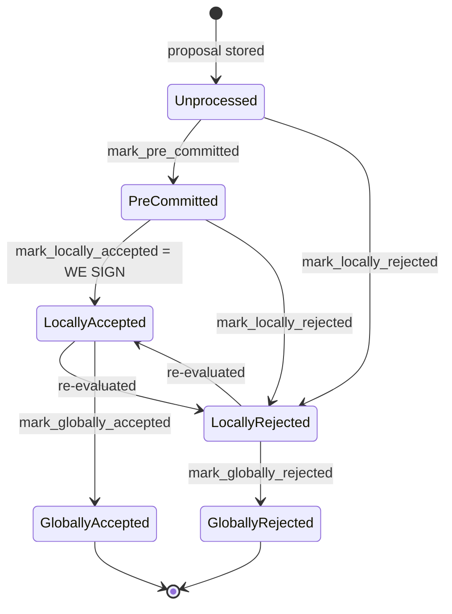

### Title
Stale rejection weight is never retracted when a signer flips Reject→Accept, allowing a miner-side liveness wedge - (File: `stacks-node/src/nakamoto_node/stackerdb_listener.rs`)

### Summary
The Plone advisory (CVE-2020-7938) is a privilege-escalation bug where a stale/incorrectly-cached privilege state let a low-privilege actor's earlier grant persist and later be exploited to reach a higher privilege level. The structural analog here is a stale-state bug in the node's `StackerDBListener`, the coordinator that tallies signer `BlockResponse` messages for a proposed block: once a signer's rejection weight is recorded in `BlockStatus.total_weight_rejected`, it is never removed even after that same signer legitimately re-votes to accept the block. The bookkeeping equality "current tallied weight reflects current signer opinions" is broken, and the miner can be wedged into abandoning a block that has, or would have, reached real signer consensus.

### Finding Description
`BlockStatus` tracks two independent counters, `total_weight_approved` and `total_weight_rejected`, along with `responded_signers` and `gathered_signatures` sets: [1](#0-0) 

On `SignerMessageV0::BlockResponse(BlockResponse::Accepted(...))`, weight is added to `total_weight_approved` only if the slot is not already present in `gathered_signatures`: [2](#0-1) 

On `SignerMessageV0::BlockResponse(BlockResponse::Rejected(...))`, weight is added to `total_weight_rejected` only if the slot is newly inserted into `responded_signers`: [3](#0-2) 

Crucially, the `Accepted` branch never checks or clears `responded_signers`/`total_weight_rejected` for that slot, and the `Rejected` branch never checks or clears `gathered_signatures`/`total_weight_approved`. The signer-side state machine explicitly allows a signer to flip its verdict on the same block proposal — `LocallyRejected → LocallyAccepted` is a valid transition (`re-evaluated`), as documented in the block-lifecycle state diagram: [4](#0-3) 

So the sequence "signer rejects a proposal, then legitimately re-evaluates and accepts it (per `should_reevaluate_reject_reason`)" is a normal, expected on-wire pattern that a single signer can trigger. When that happens, the miner-side listener adds that signer's weight to `total_weight_approved` but leaves the earlier weight permanently counted in `total_weight_rejected` — the two counters can now double-count the same signer's weight on both sides, and `total_weight_rejected` becomes a stale, monotonically-growing value that no longer reflects any live signer's current vote.

This breaks the intended equality that `total_weight_rejected` reflects the aggregated weight of signers *currently* rejecting the block. The rejection-threshold check: [5](#0-4) 

uses this stale, inflated `total_weight_rejected` to decide the block is dead ("Signal to anyone waiting on this block that we have enough rejections"). Because rejections are never retracted, weight from signers who have since flipped to accepting continues to count against the block indefinitely, making the rejection threshold reachable even when the live view of signer opinions would in fact reach acceptance.

### Impact Explanation
This is a liveness wedge on the node/coordinator side: the miner can conclude a block is globally rejected (and give up re-proposing/waiting on it) based on stale weight that no longer represents any signer's actual, current vote, even though a legitimate re-evaluation flow already moved that signer to acceptance. This matches the "wedge the state machine" impact class in scope (a bookkeeping/tallying wedge in the coordinator that tracks approved-vs-rejected weight, analogous in File to `postblock_proposal.rs`/coordinator logic named in scope). It does not require a signer to sign an invalid block or forge a cross-context signature, and it does not require a majority of signers or another signer's key — a single signer legitimately exercising the documented reject→accept re-evaluation path is enough to permanently pollute the rejected-weight tally for that block hash.

### Likelihood Explanation
The reject→accept transition is a normal, intentionally supported behavior of the signer (`should_reevaluate_reject_reason`, `LocallyRejected → LocallyAccepted`), not an attack primitive that needs to be crafted maliciously — any legitimate re-evaluation flow (e.g. transient validation failure followed by success on re-proposal) triggers it. Because the bug is a missing retraction in bookkeeping rather than a cryptographic or majority-controlled condition, it can occur during ordinary operation whenever any signer's opinion on a given block hash flips from reject to accept, making the wedge readily reachable without adversarial coordination.

### Recommendation
When processing a `BlockResponse::Accepted` from a slot that is already present in `responded_signers` with a prior rejection, retract that signer's weight from `total_weight_rejected` (and vice versa for a flip from accept to reject) before adding the new weight, so `total_weight_approved`/`total_weight_rejected` always reflect only the most recent verdict per signer slot — mirroring the signer-side invariant enforced in `signerdb.rs`'s `add_block_rejection_signer_addr`/`add_block_signature`, which explicitly prevent a rejection from being recorded once a signature exists for the same signer/block pair.

### Proof of Concept
1. Miner proposes block `B` to signer set of weight `W`; rejection threshold in `StackerDBListener` is `total_weight_rejected + weight_threshold > W`.
2. Signer `S` (weight `w_S`) initially rejects `B` (e.g. due to a transient validation error) → `total_weight_rejected += w_S`.
3. `S` re-evaluates per the documented `LocallyRejected → LocallyAccepted` path (e.g. resubmission after the transient condition clears) and legitimately sends `BlockResponse::Accepted` for the same `B`.
4. `StackerDBListener` adds `w_S` to `total_weight_approved` (lines 443-465) but never subtracts `w_S` from `total_weight_rejected` — the stale rejection weight remains.
5. Repeat with other signers whose rejections are similarly stale/flipped so `total_weight_rejected` (built from now-obsolete votes) crosses `total_weight - weight_threshold`, even though the live signer weight for `B` actually satisfies acceptance. The miner treats `B` as globally rejected and abandons it, wedging tenure progress on that (in fact acceptable) block.

*Note: this analysis is based on the `StackerDBListener`/`BlockStatus` bookkeeping and the documented signer-side state machine in `docs/signer-flows.md`; a live end-to-end reproduction (spinning up the miner/signer test harness) was not run as part of this review, since only static code/doc inspection tools were available.*

### Citations

**File:** stacks-node/src/nakamoto_node/stackerdb_listener.rs (L70-82)
```rust
#[derive(Debug, Clone)]
pub struct BlockStatus {
    /// Set of the slot ids of signers who have responded
    pub responded_signers: HashSet<u32>,
    /// Map of the slot id of signers who have signed the block and their signature
    pub gathered_signatures: BTreeMap<u32, MessageSignature>,
    /// Total weight of signers who have signed the block
    pub total_weight_approved: u32,
    /// Total weight of signers who have rejected the block
    pub total_weight_rejected: u32,
    /// Per-txid rejection tracking from signers
    pub failed_txids: HashMap<Txid, FailedTxInfo>,
}
```

**File:** stacks-node/src/nakamoto_node/stackerdb_listener.rs (L443-465)
```rust
                        if !block.gathered_signatures.contains_key(&slot_id) {
                            block.total_weight_approved = block
                                .total_weight_approved
                                .saturating_add(signer_entry.weight);

                            info!("StackerDBListener: Signature Added to block";
                                "signer_signature_hash" => %block_sighash,
                                "signer_pubkey" => signer_pubkey.to_hex(),
                                "signer_slot_id" => slot_id,
                                "signature" => %signature,
                                "signer_weight" => signer_entry.weight,
                                "total_weight_approved" => block.total_weight_approved,
                                "percent_approved" => block.total_weight_approved as f64 / self.total_weight as f64 * 100.0,
                                "total_weight_rejected" => block.total_weight_rejected,
                                "percent_rejected" => block.total_weight_rejected as f64 / self.total_weight as f64 * 100.0,
                                "weight_threshold" => self.weight_threshold,
                                "tenure_extend_timestamp" => tenure_extend_timestamp,
                                "read_count_extend_timestamp" => read_count_extend_timestamp,
                                "server_version" => metadata.server_version,
                            );
                        }
                        block.gathered_signatures.insert(slot_id, signature);
                        block.responded_signers.insert(slot_id);
```

**File:** stacks-node/src/nakamoto_node/stackerdb_listener.rs (L515-518)
```rust
                        if block.responded_signers.insert(slot_id) {
                            block.total_weight_rejected = block
                                .total_weight_rejected
                                .saturating_add(signer_entry.weight);
```

**File:** stacks-node/src/nakamoto_node/stackerdb_listener.rs (L567-574)
```rust
                        if block
                            .total_weight_rejected
                            .saturating_add(self.weight_threshold)
                            > self.total_weight
                        {
                            // Signal to anyone waiting on this block that we have enough rejections
                            cvar.notify_all();
                        }
```

**File:** docs/signer-flows.md (L137-154)
```markdown


Canonical paths shown; the exact rule in `BlockInfo::check_state` is: either
local state is reachable from anything not yet global, `PreCommitted` only from
`Unprocessed`, and each global state is unreachable from the other.
```
