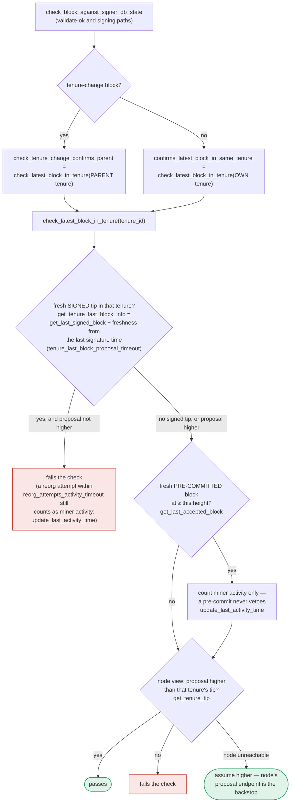

## Analysis

The Surge report's bug class is: a duration-based recovery/decay variable can be tricked into never elapsing (or resetting) by an attacker who cheaply manipulates the input that feeds the "how much time has passed" check, letting the attacker skip a safety timeout entirely. In `stacks-signer` the directly analogous mechanism is the miner-liveness timeout that gates fallback from an unresponsive/malicious sortition winner back to the previous miner.

### Root cause

`SortitionData::check_latest_block_in_tenure` treats a rejected reorg attempt as "valid miner activity" for the *new* (potentially malicious) tenure whenever the parent tenure's last signed block has not yet been marked `signed_group` by this signer — and that check is unconditional (no timeout) in that branch: [1](#0-0) 

```
if info.signed_group.is_none_or(|signed_time| {
    signed_time + reorg_attempts_activity_timeout.as_secs() > get_epoch_time_secs()
}) {
    ...
    signer_db.update_last_activity_time(&block.header.consensus_hash, get_epoch_time_secs())
    ...
}
```

`is_none_or` means: if `signed_group` is `None` (this signer never itself observed/recorded global acceptance of the parent tenure's last block — the normal state right after a tenure boundary, or after a restart, or on any signer that missed the `NewBlock` echo), **every** rejected reorg attempt refreshes `last_activity_time` for the new tenure, with no bound at all.

That `last_activity_time` is the sole liveness signal consumed by `SortitionState::is_timed_out`, which is what lets signers eventually treat a sortition winner as inactive and fall back to the prior miner: [2](#0-1) 

`is_timed_out` computes `elapsed = now - last_activity` and only returns `true` (timed out) once `elapsed > block_proposal_timeout`. As long as `last_activity` keeps getting refreshed by the unconditional branch above, `elapsed` never grows and the miner is never declared inactive.

Crucially, the alternate, weight-based invalidation path (mark miner invalid once ≥30% signer weight rejects with `ReorgNotAllowed`) is explicitly disabled for the currently-active global-state protocol: [3](#0-2) 

So under the global-state protocol, `is_timed_out` is the *only* mechanism left to unstick a stalled tenure, and it is exactly the mechanism the unconditional `is_none_or` branch defeats.

### Attack

A single sortition winner (no majority, no other signer's key needed — matches the "one-slot miner (plus gossip)" constraint) that repeatedly (re-)proposes a tenure-change block which legitimately fails the reorg check against a parent tenure it has not (from this signer's point of view) reached `signed_group` on, keeps every signer's `last_activity_time` for its own tenure perpetually fresh. Each proposal is correctly rejected on the merits (so no invalid/non-canonical block is ever signed), but the signer set also never times the malicious miner out, so it never falls back to the honest previous miner either. The tenure is wedged — no valid block gets signed for the remainder of the sortition window — a concrete liveness break ("a signer wedged into never signing valid blocks... or acting on a stale reward set/threshold").

### Supporting docs confirming intended-vs-actual behavior [4](#0-3) [5](#0-4) 

---

### Title
Unbounded "miner activity" credit from rejected reorg attempts when `signed_group` is unset defeats `block_proposal_timeout` and wedges the global-state signer set - (File: `stacks-signer/src/chainstate/mod.rs`)

### Summary
`check_latest_block_in_tenure` grants a rejected reorg proposal unconditional "miner activity" credit whenever the parent tenure's last block has no recorded `signed_group` timestamp for this signer, with no time bound. This activity credit is the sole input to `SortitionState::is_timed_out` (the only miner-liveness/fallback mechanism under the global-state signer protocol, since the alternate 30%-rejection-weight invalidation path is explicitly skipped for that protocol version). A malicious sortition winner can therefore keep every signer's activity timer perpetually fresh by repeatedly sending doomed reorg proposals, preventing the signer set from ever timing it out and falling back to the honest previous miner, while its own proposals are (correctly) rejected — wedging block production.

### Finding Description
See analysis above: `stacks-signer/src/chainstate/mod.rs::check_latest_block_in_tenure` lines 403-417, `stacks-signer/src/chainstate/v2.rs::SortitionState::is_timed_out` lines 46-89, and the disabled fallback in `stacks-signer/src/v0/signer.rs` lines 2342-2353.

### Impact Explanation
High: this is a liveness wedge — signers are prevented from ever signing a valid block (from the honest previous miner) for as long as the attacker keeps refreshing its own tenure's activity, matching the "signer wedged into never signing valid blocks... or acting on a stale reward set/threshold" category.

### Likelihood Explanation
Reachable by any single sortition winner without collusion. The precondition (`signed_group == None` for the parent tenure's last block, from this signer's perspective) is not a rare edge case: it is the default state immediately following a tenure change/before this signer observes the group/global acceptance echo, and can also persist longer if the signer's connectivity to the `NewBlock` event stream lags.

### Recommendation
Bound the "no signed_group" branch of `check_latest_block_in_tenure` by a real deadline (e.g., time since the reorging tenure's own sortition/burn-block, or a cap on the number of times a single tenure can renew activity via this path) instead of granting indefinite credit. Alternatively, restore an equivalent weight-based invalidation path for the global-state protocol so a signer majority rejecting a miner's proposals can force fallback independent of the activity timer.

### Proof of Concept
1. Win a sortition as the new miner in tenure `T_new`, with parent tenure `T_prev`.
2. Ensure (naturally occurs, or wait for) `signed_group` to be `None` on the last signed block of `T_prev` for the target signers (true immediately after `T_prev`'s tip was only just locally/self-signed and before the signer observed a `NewBlock` confirming global acceptance).
3. Repeatedly submit a tenure-change block proposal for `T_new` that fails `check_latest_block_in_tenure` against `T_prev` (i.e., does not confirm enough of `T_prev`).
4. Each rejected attempt hits the `info.signed_group.is_none_or(...)` branch (`stacks-signer/src/chainstate/mod.rs:403-417`) and calls `update_last_activity_time` for `T_new`, unconditionally, at every repeat.
5. `SortitionState::is_timed_out` (`stacks-signer/src/chainstate/v2.rs:46-89`) never observes `elapsed > block_proposal_timeout`, so the signer set never marks the miner invalid and never falls back to `T_prev`'s miner.
6. Because the active protocol uses global state, the alternate ReorgNotAllowed 30%-rejection invalidation is skipped (`stacks-signer/src/v0/signer.rs:2347-2353`), leaving no recovery path until the next natural sortition.

### Citations

**File:** stacks-signer/src/chainstate/mod.rs (L403-417)
```rust
                if info.signed_group.is_none_or(|signed_time| {
                    signed_time + reorg_attempts_activity_timeout.as_secs() > get_epoch_time_secs()
                }) {
                    // Note if there is no signed_group time, this is a locally accepted block (i.e. tenure_last_block_proposal_timeout has not been exceeded).
                    // Treat any attempt to reorg a locally accepted block as valid miner activity.
                    // If the call returns a globally accepted block, check its globally accepted time against a quarter of the block_proposal_timeout
                    // to give the miner some extra buffer time to wait for its chain tip to advance
                    // The miner may just be slow, so count this invalid block proposal towards valid miner activity.
                    if let Err(e) = signer_db.update_last_activity_time(
                        &block.header.consensus_hash,
                        get_epoch_time_secs(),
                    ) {
                        warn!("Failed to update last activity time: {e}");
                    }
                }
```

**File:** stacks-signer/src/chainstate/v2.rs (L45-89)
```rust
impl SortitionState {
    /// Check if the sortition identified by the ConsensusHash is timed out based on
    /// the blocks within the signer db and the block proposal timeout
    pub fn is_timed_out(
        sortition: &ConsensusHash,
        signer_db: &SignerDb,
        eval: &GlobalStateEvaluator,
        local_address: &StacksAddress,
        timeout: Duration,
    ) -> Result<bool, SignerChainstateError> {
        // If we've already signed a block in this tenure, the miner can't have timed out: we have
        // committed a signature to this tenure and must not help abandon it.
        //
        // Importantly, a block we have only pre-committed to does not count! A pre-commit carries
        // no signature, and if it never reaches the pre-commit threshold the tenure can stall
        // indefinitely. Treating it as signed here would suppress the inactivity timeout for
        // exactly the signers that pre-committed, so they could never fall back to the prior
        // miner and the tenure could never recover.
        let has_block = signer_db.has_signed_block_in_tenure(sortition)?;
        if has_block {
            return Ok(false);
        }
        let Some(received_ts) =
            signer_db.get_burn_block_received_time_from_signers(eval, sortition, local_address)?
        else {
            return Ok(false);
        };
        let received_time = UNIX_EPOCH + Duration::from_secs(received_ts);
        let last_activity = signer_db
            .get_last_activity_time(sortition)?
            .map(|time| UNIX_EPOCH + Duration::from_secs(time))
            .unwrap_or(received_time);

        let Ok(elapsed) = std::time::SystemTime::now().duration_since(last_activity) else {
            return Ok(false);
        };
        if elapsed > timeout {
            info!("Sortition has timed out";
                "sorition" => %sortition,
                "timeout" => %timeout.as_secs(),
                "elapsed" => %elapsed.as_secs()
            )
        }
        Ok(elapsed > timeout)
    }
```

**File:** stacks-signer/src/v0/signer.rs (L2342-2353)
```rust
        // NOTE: This is only used by active signer protocol versions < Global state activation
        // If 30% of the signers have rejected the block due to an invalid
        // reorg, mark the miner as invalid.
        // If we cannot determine the active signer protocol version it means we are
        // running a global state machine version that couldn't reach consensus, so we can skip this check
        if self
            .determine_active_signer_protocol_version()
            .map(|version| version.uses_global_state())
            .unwrap_or(true)
        {
            return;
        };
```

**File:** docs/signer-flows.md (L400-417)
```markdown


**File:** stacks-signer/CHANGELOG.md (L186-188)
```markdown
- Add new reject codes to the signer response for better visibility into why a block was rejected.
- When allowing a reorg within the `reorg_attempts_activity_timeout_ms`, the signer will now watch the responses from other signers and if >30% of them reject this reorg attempt, then the signer will mark the miner as invalid, reject further attempts to reorg and allow the previous miner to extend their tenure.

```
