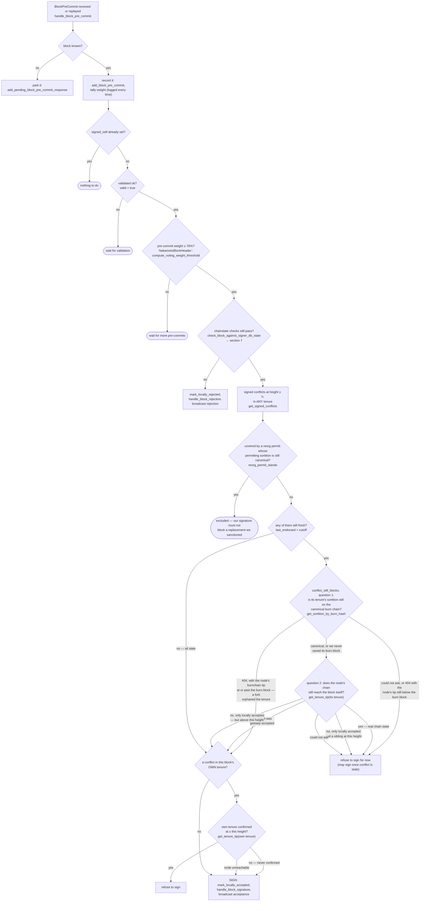

### Title
Local wall-clock "freshness" heuristic lets the equivocation guard expire while a conflicting block is still live, enabling a signer to sign two conflicting blocks at the same height - (File: `stacks-signer/src/v0/signer.rs`)

### Summary
The pre-commit-threshold equivocation guard that stops a signer from signing two conflicting blocks at the same height decides whether an earlier signed block is still "live" using a purely local, elapsed-wall-clock heuristic (`last_endorsed > freshness_cutoff`) rather than tracking whether that earlier block's signature is still in flight toward the 70% network threshold. Once that local timer expires, the guard is bypassed even though the first block's signature is still a valid, aggregable "bearer instrument" circulating among the rest of the signer set — exactly the same class of bug as the reference report, where a value that is transiently "in flight" (there: bridged assets; here: an outstanding signature/pre-commit still propagating) is not tracked by the component that must reason about total state, allowing the state to be exploited during the untracked window.

### Finding Description
The pre-commit → signature path in `handle_block_pre_commit` guards against double-signing at a given height with `get_signed_conflicts`, which returns every block this signer has ever signed (`signed_self`) or observed reach group threshold (`signed_group`) at or above the proposed height, in *any* tenure [1](#0-0) . As `docs/signer-flows.md` explicitly documents, this cross-tenure guard is the *only* backstop for a signed sibling at the same height in a different tenure, because the chainstate re-check (`check_block_against_signer_db_state`) only ever inspects one tenure [2](#0-1) .

Whether a conflict still "blocks" signing is decided by first checking local freshness before even asking the node anything: [3](#0-2) 

`last_endorsed` is `MAX(signed_self, signed_group)`, a timestamp stamped once, at the moment this signer signed (or first observed group threshold for) the earlier block [4](#0-3) . It is never refreshed based on any subsequent evidence that the block is still circulating or accumulating weight elsewhere in the network. The design's own documentation frames the tradeoff: "a rejection is a revocable opinion, while a signature is a bearer instrument that can still be aggregated toward the 70% threshold if rejecting signers change their minds. Only staleness or node-derived death... clears a conflict" [5](#0-4) . Staleness (elapsed local wall-clock time exceeding `tenure_last_block_proposal_timeout`) is treated as equivalent to "node-derived death," but it is not: it is merely a heuristic guess that the block is dead, based on time-since-*this-signer*-last-touched-it, not on the block's actual liveness among the rest of the signer set.

If message delivery to this one signer for the first block's continuing pre-commits/acceptances (or a second proposal attempt that would refresh signer db state) is delayed past `tenure_last_block_proposal_timeout` — whether by ordinary network partition/latency, or by a miner/relay deliberately delaying gossip to a subset of signers while continuing to feed it to the rest — this signer's freshness cutoff expires and the guard is bypassed. The signer then treats a competing proposal at the same height as unblocked and signs it via `check_block_against_signer_db_state`'s own-tenure/parent-tenure checks + this now-defeated cross-tenure conflict guard, producing a *second* validly signed block at the same height while the first block's signature remains circulating and aggregable elsewhere.

### Impact Explanation
This breaks the core safety invariant the guard exists to enforce: "Nobody signs alone... a block that will never reach 70% rarely collects stray signatures at all" and, more specifically, the equivocation guard's purpose of preventing one signer from endorsing two blocks that could both end up in the chain [6](#0-5) . If the earlier, "stale-by-timeout" block is in fact still live and reaches its own 70% threshold via the rest of the signer set (who never experienced the delay), and this signer's second signature helps a different, conflicting block at the same height reach its own threshold, two conflicting blocks at the same height can each be independently signable/pushable — a signing of a conflicting/non-canonical block, which is a Critical-class outcome per this analysis's own impact classification (a signer signing a conflicting block).

### Likelihood Explanation
This requires no majority of signers, no other signer's key, and no auth token — only that message delivery of the first block's ongoing endorsements to a single target signer lags past `tenure_last_block_proposal_timeout` while the block is still alive elsewhere. This is achievable by a miner or a relay that controls propagation timing/ordering to a specific signer subset (in-scope "one slot miner plus gossip" capability), or simply by natural network jitter/partition around the configured timeout boundary, since the freshness clock is a one-shot stamp with no re-validation against actual network state before it is trusted.

### Recommendation
Do not treat local elapsed time alone as proof that a signed conflicting block is dead. Before letting staleness clear a conflict, corroborate it with a node-derived signal (as is already done for the other two questions in `conflict_still_blocks`) — e.g., only drop the conflict once the node confirms the conflicting tenure/sortition is orphaned, or once independent evidence (such as an explicit rejection threshold or an updated global-state view) shows the earlier block cannot reach 70%. At minimum, refresh `last_endorsed` whenever fresh evidence of the earlier block's continued circulation (a new pre-commit/acceptance for it) is observed, so a delayed-but-still-live block doesn't silently age out of protection while it is still being gossiped and endorsed by the rest of the set.

### Proof of Concept
1. Signer S signs block A at height H in tenure T1 (`signed_self` stamped at time t0) via `handle_block_pre_commit`'s signing path [7](#0-6) .
2. An attacker (miner/relay controlling propagation to S, or ambient network partition) ensures S receives no further pre-commits/acceptances for block A for longer than `tenure_last_block_proposal_timeout`, while the rest of the signer set continues to circulate and accumulate weight on block A normally.
3. Once `t0 + tenure_last_block_proposal_timeout` has elapsed, a conflicting block B at height H in tenure T2 is proposed to S and reaches the local pre-commit threshold on S's view.
4. In `handle_block_pre_commit`, `get_signed_conflicts` still returns block A as a conflict, but the freshness check `conflict.last_endorsed > freshness_cutoff` now evaluates false, so the conflict is filtered out at [8](#0-7)  and S proceeds to sign block B.
5. Meanwhile, the rest of the signer set (never delayed) pushes block A past 70% and it becomes globally accepted; S's signature on B can now combine with any signers who also missed A's traffic, yielding two independently, validly signed blocks at height H in different tenures.

### Citations

**File:** stacks-signer/src/signerdb.rs (L1587-1625)
```rust
    /// Return every signed block at or above the given Stacks height, in ANY tenure, excluding
    /// the block with the given signer signature hash, ordered by height (highest first). A
    /// block is considered signed if a signature was ever put over it, ours (`signed_self`)
    /// or the observed group's (`signed_group`). Blocks that were only pre-committed carry no
    /// signature and are never returned. Each row carries the most recent endorsement time
    /// (`signed_self`/`signed_group`, whichever is later) so the caller can judge freshness per
    /// conflict.
    ///
    /// The search deliberately spans all tenures: two blocks at the same height are siblings
    /// no matter which tenure they belong to (e.g. a tenure-start block conflicts with the
    /// previous tenure's block at the same height), so a signature over either may conflict
    /// with a fresh signature over the other.
    ///
    /// Blocks in tenures whose reorg we sanctioned under the reorg-timing rules (see
    /// [`SignerDb::mark_tenure_superseded`]) are still returned, but annotated with the
    /// permitting tenure's sortition (`superseded_by_*`): the permit only holds while that
    /// sortition is canonical, which the caller derives from the node per evaluation (see
    /// `Signer::reorg_permit_stands`) -- like every other question about whether a conflict is
    /// still *live* (`Signer::conflict_still_blocks`), it is not recorded.
    pub fn get_signed_conflicts(
        &self,
        height: u64,
        excluded_signer_signature_hash: &Sha512Trunc256Sum,
    ) -> Result<Vec<SignedConflictInfo>, DBError> {
        let query = "SELECT b.consensus_hash, b.signer_signature_hash, b.stacks_height, b.state,
                MAX(COALESCE(b.signed_self, 0), COALESCE(b.signed_group, 0)) AS last_endorsed,
                st.superseded_by_consensus_hash, st.superseded_by_burn_block_hash
            FROM blocks b
            LEFT JOIN superseded_tenures st ON st.consensus_hash = b.consensus_hash
            WHERE (b.signed_self IS NOT NULL OR b.signed_group IS NOT NULL)
                AND b.stacks_height >= ?1
                AND b.signer_signature_hash != ?2
            ORDER BY b.stacks_height DESC";
        let args = params![
            u64_to_sql(height)?,
            excluded_signer_signature_hash.to_string(),
        ];
        query_rows(&self.db, query, args)
    }
```

**File:** docs/signer-flows.md (L52-59)
```markdown
Three things this shape is built to guarantee:

- **A signature is never given away cheaply.** Every red path is a broadcast
  verdict others can count; every gray path is silence that leaves the door open.
  A signer that cannot yet safely sign says nothing rather than rejecting.
- **Nobody signs alone.** The pre-commit round means a signer only spends its
  signature once it knows a supermajority intends to spend theirs, so a block
  that will never reach 70% rarely collects stray signatures at all.
```

**File:** docs/signer-flows.md (L237-268)
```markdown


**File:** docs/signer-flows.md (L274-287)
```markdown
Order matters here: the chainstate re-check runs first and produces an explicit
(sticky) rejection when the block now conflicts with a signed one. The conflict
guard behind it is the silent backstop for what that re-check cannot see, and
silence keeps the door open to sign later once the conflict goes stale. Two
blind spots make the guard necessary:

- the re-check only ever looks at _one_ tenure (a tenure-change block's parent,
  or any other block's own), so a signed sibling at the same height in a third
  tenure is invisible to it;
- the `DuplicateBlockFound` check that would catch a second block in the same
  tenure lives in `check_proposal` and runs only at proposal arrival, never
  again. A block that crosses the pre-commit threshold minutes later has no
  other guard, which is what the own-tenure branch above covers.

```

**File:** docs/signer-flows.md (L322-327)
```markdown
A conflict is any block a signature was ever put over — ours, or a group
threshold we observed — whatever its state now. In particular rejection, even
_global_ rejection, does not clear one: a rejection is a revocable opinion,
while a signature is a bearer instrument that can still be aggregated toward
the 70% threshold if rejecting signers change their minds. Only staleness or
node-derived death (the two questions above) clears a conflict.
```

**File:** stacks-signer/src/v0/signer.rs (L1393-1421)
```rust
        let freshness_cutoff = get_epoch_time_secs().saturating_sub(
            self.proposal_config
                .tenure_last_block_proposal_timeout
                .as_secs(),
        );
        // A fresh signature only blocks while the block it covers could still be part of the
        // chain: see `conflict_still_blocks`, which asks the node whether it is. Check
        // freshness first: it is a local timestamp comparison, while `reorg_permit_stands`
        // and `conflict_still_blocks` each query the node, so stale conflicts cost no
        // round-trips.
        if let Some(conflict) = conflicts.iter().find(|conflict| {
            conflict.last_endorsed > freshness_cutoff
                && !self.reorg_permit_stands(stacks_client, conflict)
                && self.conflict_still_blocks(
                    stacks_client,
                    conflict,
                    block_info.block.header.chain_length,
                )
        }) {
            warn!(
                "{self}: Reached the pre-commit threshold for a block, but we have recently signed or accepted a different block at the same or higher height. Refusing to sign.";
                "signer_signature_hash" => %block_hash,
                "block_height" => block_info.block.header.chain_length,
                "conflicting_signer_signature_hash" => %conflict.signer_signature_hash,
                "conflicting_block_height" => conflict.stacks_height,
                "conflicting_consensus_hash" => %conflict.consensus_hash,
            );
            return;
        }
```
