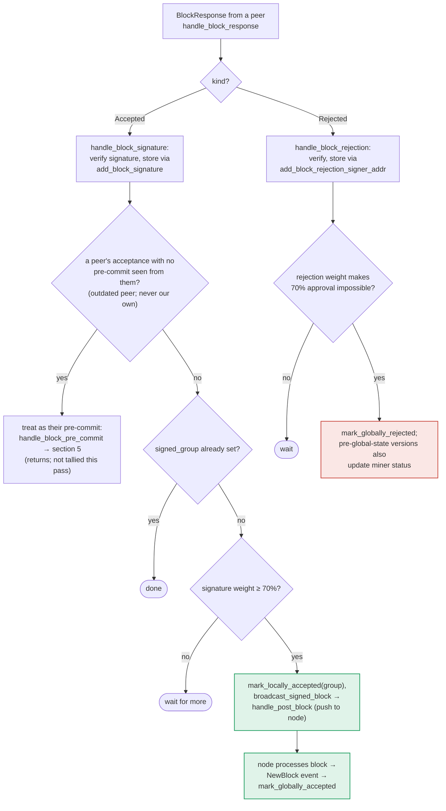

### Title
Signature-tally finalization path skips the conflicting-sibling (equivocation) guard before broadcasting a block - ([File: stacks-signer/src/v0/signer.rs])

### Summary
When a signer receives *other signers'* `BlockAccepted` messages and its own tally crosses the 70% weight threshold, `store_and_process_block_signature` marks the block locally accepted and pushes it to the node via `broadcast_signed_block` purely on a weight count. Unlike the parallel path that produces *this signer's own* signature at the pre‑commit threshold (`handle_block_pre_commit`), this signature‑tally path never re‑runs `check_block_against_signer_db_state` or the `get_signed_conflicts` equivocation guard before finalizing/broadcasting the block.

### Finding Description
The signer's "one last look" design is explicit and well‑documented for the path where *this signer* is about to place its own signature: before `mark_locally_accepted`, `handle_block_pre_commit` re‑runs `check_block_against_signer_db_state` and then `get_signed_conflicts`/`conflict_still_blocks`/`reorg_permit_stands` to make sure this signer has not already signed a conflicting sibling at the same (or higher) height, in any tenure [1](#0-0) . This is the guard `docs/signer-flows.md` calls out as "the world must be re-checked before the signature leaves the box" [2](#0-1) .

The parallel path — where a signer merely *tallies other signers'* accept messages and, upon reaching the same 70% threshold, marks the block locally accepted and pushes it to the node — has no equivalent check. `store_and_process_block_signature` only verifies: the signature is new (`add_block_signature`), `signed_group` isn't already set, and the accumulated signature weight meets `compute_voting_weight_threshold`; it then calls `block_info.mark_locally_accepted(true)` and `self.broadcast_signed_block(...)` [3](#0-2) . Nowhere in this function (nor in its caller `handle_block_signature`, lines 2371–2440) is `check_block_against_signer_db_state` or `get_signed_conflicts` invoked.

The documentation itself confirms this asymmetry: section 5 ("Pre-commit threshold → signature") explicitly shows a `RECHECK` step and the conflict-guard flow before `SIGN`, while section 6 ("Responses from other signers") shows only `TALLY → BCAST` with no recheck node [4](#0-3) . The doc's own commentary about the conflict guard states it exists to stop the signer from "endorsing two blocks that could both end up in the chain" and that "a rejection... does not clear" a conflict because "a signature is a bearer instrument that can still be aggregated toward the 70% threshold" [5](#0-4) . But that same bearer-instrument aggregation is exactly what happens unchecked in `store_and_process_block_signature`: a signer that has already signed block A at height h (via its own pre-commit path, which *did* check conflicts at that time) can subsequently receive enough *peer* signatures over a different sibling block B at the same height h to cross the 70% tally threshold purely from other signers' weight — and this signer will locally accept and broadcast B to its node without ever checking that B conflicts with the A it already signed.

### Impact Explanation
This breaks the "signer signing/endorsing a conflicting block" invariant that the rest of the codebase goes to significant lengths to protect (see `get_signed_conflicts`, `conflict_still_blocks`, `reorg_permit_stands` in `stacks-signer/src/v0/signer.rs` lines 1110–1206 and `stacks-signer/src/signerdb.rs` lines 1599–1629). A signer can end up relaying/finalizing (pushing to its own node) a block that is a sibling of one it has already locally/globally accepted, undermining the single-slot equivocation guard that the pre-commit path enforces. Per the rules, this maps to the "Critical" bucket: a signer effectively acting on/broadcasting a conflicting block due to a missing re-validation step, analogous to generating a signature/finalization action without re-checking current validity (the CVE's "no revocation check before signature generation" bug class).

### Likelihood Explanation
This requires no majority collusion and no key compromise: it only requires normal network conditions where enough *other* signers (each individually passing their own conflict checks at their own signing time) sign a sibling block at the same height as one this particular signer already signed — a scenario the codebase's own reorg/sibling tests (`stacks-signer/src/chainstate/tests/v2.rs`, `stacks-node/src/tests/signer/v0/reorg.rs`) show is a realistic race during tenure transitions/forks. A single miner (plus normal gossip of already-collected accept messages) can trigger this by causing a fork/re-proposal race that naturally produces siblings signed by different subsets of signers.

### Recommendation
Before `mark_locally_accepted`/`broadcast_signed_block` in `store_and_process_block_signature`, re-run the same guard used in `handle_block_pre_commit`: call `check_block_against_signer_db_state` and check `get_signed_conflicts` (respecting freshness/`conflict_still_blocks`/`reorg_permit_stands`) for the block about to be finalized, and refuse to broadcast if an un-stale conflicting signed block exists.

### Proof of Concept
1. Signer S signs block A at height h in tenure T1 via the normal pre-commit→sign path (`handle_block_pre_commit`, which passes the conflict checks because at that time no other block existed at height h).
2. A fork/race causes a different subset of signers (excluding S, or S having not yet pre-committed to B) to sign sibling block B at height h in tenure T2.
3. S receives `BlockAccepted` messages for B from those other signers via `handle_block_signature` → `store_and_process_block_signature`.
4. Once the aggregated weight of B's signatures (from peers only) crosses `compute_voting_weight_threshold`, S executes `mark_locally_accepted(true)` and `broadcast_signed_block` for B [6](#0-5)  — with no check that B conflicts with A, which S itself already signed.

**Uncertainty**: I could not fully trace whether `broadcast_signed_block`/`handle_post_block` performs any independent downstream conflict rejection before actually pushing to the node's `/v3` endpoints, nor whether the node-side `postblock_proposal.rs`/`verify_signer_signatures` would independently reject B for an unrelated reason (e.g., non-canonical tenure) in this exact race. Given the size limits on the indexed codebase, I was not able to inspect the full body of `broadcast_signed_block` and `handle_post_block` to rule out a downstream safety net; a Devin session with full repository access would be needed to confirm there is no such downstream check before treating this as fully exploitable end-to-end.

### Citations

**File:** stacks-signer/src/v0/signer.rs (L1345-1421)
```rust
        if let Some(block_rejection) =
            self.check_block_against_signer_db_state(stacks_client, &block_info.block)
        {
            warn!(
                "{self}: Reached the pre-commit threshold for a block, but it no longer passes the chainstate checks. Rejecting.";
                "signer_signature_hash" => %block_hash,
                "block_height" => block_info.block.header.chain_length,
                "reject_code" => %block_rejection.reason_code,
                "reject_reason" => &block_rejection.reason,
            );
            if let Err(e) = block_info.mark_locally_rejected() {
                if !block_info.has_reached_consensus() {
                    warn!("{self}: Failed to mark block as locally rejected: {e:?}");
                }
            };
            self.signer_db
                .insert_block(&block_info)
                .unwrap_or_else(|e| self.handle_insert_block_error(e));
            self.handle_block_rejection(&block_rejection, sortition_state);
            self.send_block_response(&block_info.block, block_rejection.into());
            return;
        }

        // A pre-commit may be superseded by a competing proposal at the same height (e.g. a
        // re-proposed tenure-start block after the first failed to reach consensus), but a
        // signature must not be superseded while it's still "fresh". A signed block at the
        // same or higher height in ANY tenure is a conflict: two blocks at the same height are
        // siblings no matter which tenure they belong to (e.g. the next tenure's tenure-start
        // block conflicts with the current tenure's block at the same height). Blocks in
        // tenures whose reorg we sanctioned under the reorg-timing rules are excluded, but
        // only while the sortition the permit was granted to is still canonical
        // (`check_parent_tenure_choice` records the permit, `reorg_permit_stands` re-derives
        // its validity from the node); every other question about whether a conflict is
        // still live is derived from the node in `conflict_still_blocks`.
        //
        // Unlike the chainstate check above, a refusal here is "for now" rather than a
        // broadcast rejection: a later pre-commit re-evaluation may still sign the block once
        // the conflicting signature has gone stale.
        let conflicts = match self
            .signer_db
            .get_signed_conflicts(block_info.block.header.chain_length, &block_hash)
        {
            Ok(conflicts) => conflicts,
            Err(e) => {
                warn!("{self}: Failed to query the signed blocks. Refusing to sign block {block_hash}: {e:?}");
                return;
            }
        };
        let freshness_cutoff = get_epoch_time_secs().saturating_sub(
            self.proposal_config
                .tenure_last_block_proposal_timeout
                .as_secs(),
        );
        // A fresh signature only blocks while the block it covers could still be part of the
        // chain: see `conflict_still_blocks`, which asks the node whether it is. Check
        // freshness first: it is a local timestamp comparison, while `reorg_permit_stands`
        // and `conflict_still_blocks` each query the node, so stale conflicts cost no
        // round-trips.
        if let Some(conflict) = conflicts.iter().find(|conflict| {
            conflict.last_endorsed > freshness_cutoff
                && !self.reorg_permit_stands(stacks_client, conflict)
                && self.conflict_still_blocks(
                    stacks_client,
                    conflict,
                    block_info.block.header.chain_length,
                )
        }) {
            warn!(
                "{self}: Reached the pre-commit threshold for a block, but we have recently signed or accepted a different block at the same or higher height. Refusing to sign.";
                "signer_signature_hash" => %block_hash,
                "block_height" => block_info.block.header.chain_length,
                "conflicting_signer_signature_hash" => %conflict.signer_signature_hash,
                "conflicting_block_height" => conflict.stacks_height,
                "conflicting_consensus_hash" => %conflict.consensus_hash,
            );
            return;
        }
```

**File:** stacks-signer/src/v0/signer.rs (L2442-2538)
```rust
    /// Store the block acceptance signature and check if we have reached a consensus decision on the block because of it. If we have, update the block state accordingly and broadcast the block if accepted.
    fn store_and_process_block_signature(
        &mut self,
        stacks_client: &StacksClient,
        sortition_state: &mut Option<SortitionsView>,
        block_info: &mut BlockInfo,
        signer_address: &StacksAddress,
        signature: &MessageSignature,
    ) {
        let block_hash = &block_info.signer_signature_hash();
        // signature is valid! store it.
        // if this returns false, it means the signature already exists in the DB, so just return.
        if !self
            .signer_db
            .add_block_signature(block_hash, signer_address, signature)
            .unwrap_or_else(|_| panic!("{self}: Failed to save block signature"))
        {
            return;
        }

        // If this isn't our own signature and we haven't seen a pre-commit from this signer yet, try treating it as a pre-commit in case the caller is running an outdated version
        if signer_address != &self.stacks_address && !self.signer_db.has_committed(block_hash, signer_address).inspect_err(|e| warn!("Failed to check if pre-commit message already considered for {signer_address:?} for {block_hash}: {e}")).unwrap_or(false) {
            self.handle_block_pre_commit(stacks_client, sortition_state, signer_address, block_hash);
            return;
        }

        if block_info.signed_group.is_some() {
            // We have already processed this block to the accepted state. Adding more signatures will not change anything so nothing to check.
            return;
        }
        // do we have enough signatures to broadcast?
        // i.e. is the threshold reached?
        let signatures = self
            .signer_db
            .get_block_signatures(block_hash)
            .unwrap_or_else(|_| panic!("{self}: Failed to load block signatures"));

        // put signatures in order by signer address (i.e. reward cycle order)
        let addrs_to_sigs: HashMap<_, _> = signatures
            .into_iter()
            .filter_map(|sig| {
                let Ok(public_key) = Secp256k1PublicKey::recover_to_pubkey_without_validating_low_s(
                    block_hash.bits(),
                    &sig,
                ) else {
                    return None;
                };
                let addr = StacksAddress::p2pkh(self.mainnet, &public_key);
                Some((addr, sig))
            })
            .collect();

        let signature_weight = self.signer_weights.get(signer_address).unwrap_or(&0);
        let total_signature_weight = self.compute_signature_signing_weight(addrs_to_sigs.keys());
        let total_weight = self.compute_signature_total_weight();

        let min_weight = NakamotoBlockHeader::compute_voting_weight_threshold(total_weight)
            .unwrap_or_else(|_| {
                panic!("{self}: Failed to compute threshold weight for {total_weight}")
            });

        if min_weight > total_signature_weight {
            info!("{self}: Received block acceptance, but have not yet reached the acceptance threshold.";
                "signer_signature_hash" => %block_hash,
                "signature_weight" => signature_weight,
                "consensus_hash" => %block_info.block.header.consensus_hash,
                "block_height" => block_info.block.header.chain_length,
                "total_weight_approved" => total_signature_weight,
                "total_weight" => total_weight,
                "percent_approved" => (total_signature_weight as f64 / total_weight as f64 * 100.0),
            );
            return;
        }
        info!("{self}: have reached the block acceptance threshold";
            "signer_signature_hash" => %block_hash,
            "signature_weight" => signature_weight,
            "consensus_hash" => %block_info.block.header.consensus_hash,
            "block_height" => block_info.block.header.chain_length,
            "total_weight_approved" => total_signature_weight,
            "total_weight" => total_weight,
            "percent_approved" => (total_signature_weight as f64 / total_weight as f64 * 100.0),
        );

        // have enough signatures to broadcast!
        // move block to LOCALLY accepted state.
        // It is only considered globally accepted IFF we receive a new block event confirming it OR see the chain tip of the node advance to it.
        if let Err(e) = block_info.mark_locally_accepted(true) {
            if !block_info.has_reached_consensus() {
                warn!("{self}: Failed to mark block as locally accepted: {e:?}");
            }
        }
        let _ = self.signer_db.insert_block(block_info).map_err(|e| {
            warn!("Failed to set group threshold signature timestamp for {block_hash}: {e:?}");
            panic!("{self} Failed to write block to signerdb: {e}");
        });
        self.broadcast_signed_block(stacks_client, block_info.block.clone(), &addrs_to_sigs);
    }
```

**File:** docs/signer-flows.md (L229-235)
```markdown
## 5. Pre-commit threshold → signature

The only place the signer produces a block signature by counting votes.
Pre-commits from peers (and our own) accumulate; at ≥70% weight the signer
decides whether to follow through. Between validation and threshold, we may have
signed a _different_ block at the same height, possibly in another tenure, so
the world must be re-checked before the signature leaves the box.
```

**File:** docs/signer-flows.md (L322-327)
```markdown
A conflict is any block a signature was ever put over — ours, or a group
threshold we observed — whatever its state now. In particular rejection, even
_global_ rejection, does not clear one: a rejection is a revocable opinion,
while a signature is a bearer instrument that can still be aggregated toward
the 70% threshold if rejecting signers change their minds. Only staleness or
node-derived death (the two questions above) clears a conflict.
```

**File:** docs/signer-flows.md (L357-375)
```markdown

```
