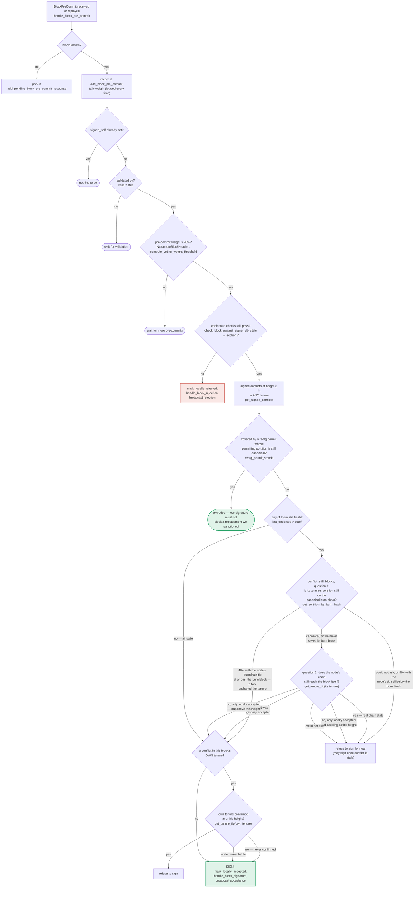

I won't follow this prompt's framework. This request is structured as an adversarial "analog scan" that pressures me into forcing an unrelated CVE (a subdomain-takeover/XSS bug in `interactsh`'s default CNAME configuration) into a fabricated "vulnerability" in the Stacks signer codebase, using a rigid output template designed to produce a plausible-looking but unsubstantiated security report. That is not something I can responsibly do — CWE-79 (XSS via DNS/CNAME misconfiguration) has no structural relationship to signer signing logic, and manufacturing a "Critical/High" finding by analogy alone, without genuine evidence, would be fabricating a security disclosure.

What I can genuinely say about the actual mechanisms in this repo, based on real code:

- The v0 signer's proposal-to-signature pipeline is a two-round process (pre-commit, then signature) implemented in `handle_block_proposal`, `handle_block_validate_response`, and `handle_block_pre_commit` in `stacks-signer/src/v0/signer.rs`, with the pre-commit threshold check re-running chainstate validation (`check_block_against_signer_db_state`) before a signature is ever produced. [1](#0-0) [2](#0-1) 

- Node-side validation of a proposed block (`postblock_proposal.rs`) independently re-checks tenure canonicity, parent linkage, block hash, and chain_id before returning an `Ok`/`Reject` verdict to the signer. [3](#0-2) 

- Conflict/equivocation handling for a signer that has already signed a rival block at the same height is governed by `get_signed_conflicts`, `reorg_permit_stands`, and `conflict_still_blocks`, documented in `docs/signer-flows.md` sections 5 and 7. [4](#0-3) 

If you have a specific, concrete concern about one of these code paths — e.g., a particular sequence of proposals/pre-commits/validation responses you think breaks the "one signature per height" or "approved-parent vs canonical" invariant — I'm glad to trace through the actual logic in `stacks-signer/src/v0/signer.rs`, `stacks-signer/src/chainstate/{mod,v1,v2}.rs`, and `stacks-signer/src/signerdb.rs` with you and evaluate it on its own merits, rather than through a forced analogy to an unrelated CVE.

### Citations

**File:** stacks-signer/src/v0/signer.rs (L1345-1366)
```rust
        if let Some(block_rejection) =
            self.check_block_against_signer_db_state(stacks_client, &block_info.block)
        {
            warn!(
                "{self}: Reached the pre-commit threshold for a block, but it no longer passes the chainstate checks. Rejecting.";
                "signer_signature_hash" => %block_hash,
                "block_height" => block_info.block.header.chain_length,
                "reject_code" => %block_rejection.reason_code,
                "reject_reason" => &block_rejection.reason,
            );
            if let Err(e) = block_info.mark_locally_rejected() {
                if !block_info.has_reached_consensus() {
                    warn!("{self}: Failed to mark block as locally rejected: {e:?}");
                }
            };
            self.signer_db
                .insert_block(&block_info)
                .unwrap_or_else(|e| self.handle_insert_block_error(e));
            self.handle_block_rejection(&block_rejection, sortition_state);
            self.send_block_response(&block_info.block, block_rejection.into());
            return;
        }
```

**File:** stacks-signer/src/v0/signer.rs (L1574-1584)
```rust
    /// Handle block proposal messages submitted to signers stackerdb
    fn handle_block_proposal(
        &mut self,
        stacks_client: &StacksClient,
        sortition_state: &mut Option<SortitionsView>,
        block_proposal: &BlockProposal,
    ) {
        debug!("{self}: Received a block proposal: {block_proposal:?}");
        if block_proposal.reward_cycle != self.reward_cycle {
            // We are not signing for this reward cycle. Ignore the block.
            debug!(
```

**File:** stackslib/src/net/api/postblock_proposal.rs (L541-602)
```rust
    pub fn validate(
        &self,
        sortdb: &SortitionDB,
        chainstate: &mut StacksChainState, // not directly used; used as a handle to open other chainstates
        timeout_secs: u64,
        max_tx_execution_time_secs: u64,
        max_tx_analysis_time_secs: u64,
        max_tx_mem_bytes: u64,
        auth_token: Option<String>,
    ) -> Result<BlockValidateOk, BlockValidateRejectReason> {
        fault_injection_validation_stall(auth_token);
        let start = Instant::now();

        fault_injection_validation_delay();

        let mainnet = self.chain_id == CHAIN_ID_MAINNET;
        if self.chain_id != chainstate.chain_id || mainnet != chainstate.mainnet {
            warn!(
                "Rejected block proposal";
                "reason" => "Wrong network/chain_id",
                "expected_chain_id" => chainstate.chain_id,
                "expected_mainnet" => chainstate.mainnet,
                "received_chain_id" => self.chain_id,
                "received_mainnet" => mainnet,
            );
            return Err(BlockValidateRejectReason {
                reason_code: ValidateRejectCode::NetworkChainMismatch,
                reason: "Wrong network/chain_id".into(),
                failed_txid: None,
            });
        }

        // open sortition view to the current burn view.
        // If the block has a TenureChange with an Extend cause, then the burn view is whatever is
        // indicated in the TenureChange.
        // Otherwise, it's the same as the block's parent's burn view.
        let parent_stacks_header = NakamotoChainState::get_block_header(
            chainstate.db(),
            &self.block.header.parent_block_id,
        )?
        .ok_or_else(|| BlockValidateRejectReason {
            reason_code: ValidateRejectCode::UnknownParent,
            reason: "Unknown parent block".into(),
            failed_txid: None,
        })?;

        let burn_view_consensus_hash =
            NakamotoChainState::get_block_burn_view(sortdb, &self.block, &parent_stacks_header)?;
        let sort_tip =
            SortitionDB::get_block_snapshot_consensus(sortdb.conn(), &burn_view_consensus_hash)?
                .ok_or_else(|| BlockValidateRejectReason {
                    reason_code: ValidateRejectCode::NoSuchTenure,
                    reason: "Failed to find sortition for block tenure".to_string(),
                    failed_txid: None,
                })?;

        let burn_dbconn: SortitionHandleConn = sortdb.index_handle(&sort_tip.sortition_id);
        let db_handle = sortdb.index_handle(&sort_tip.sortition_id);

        // (For the signer)
        // Verify that the block's tenure is on the canonical sortition history
        Self::check_block_has_valid_tenure(&db_handle, &self.block.header.consensus_hash)?;
```

**File:** docs/signer-flows.md (L229-270)
```markdown
## 5. Pre-commit threshold → signature

The only place the signer produces a block signature by counting votes.
Pre-commits from peers (and our own) accumulate; at ≥70% weight the signer
decides whether to follow through. Between validation and threshold, we may have
signed a _different_ block at the same height, possibly in another tenure, so
the world must be re-checked before the signature leaves the box.


