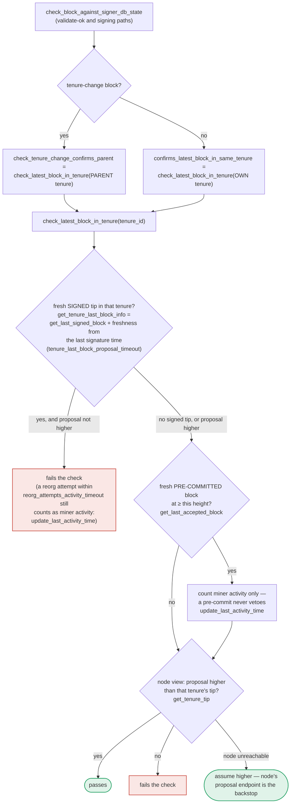

### Title
Signer's own-tenure duplicate-tenure-change guard silently no-ops when the node is unreachable, letting a duplicate `BlockFound` tenure-change block accumulate pre-commits and be signed - (File: `stacks-signer/src/v0/signer.rs`)

### Summary
The Connect-CMS advisory is a class of bug where a restriction is enforced on one access path (search results) but not re-checked on another path that reaches the same data (main text), letting restricted content leak through the unchecked path. The stacks-signer codebase has a structurally identical gap: the "no duplicate tenure-change block in this tenure" restriction is enforced only on the proposal path (`validate_tenure_change_payload`), is explicitly *not* re-run by the chainstate re-check that runs at validate-ok and at signing time, and the one substitute guard that is supposed to "cover the same ground" (the own-tenure conflict check in `handle_block_pre_commit`) degrades to a permissive default when the node is unreachable.

### Finding Description
`docs/signer-flows.md:425-437` documents explicitly that the duplicate-tenure-change check (`validate_tenure_change_payload`, which rejects with `DuplicateBlockFound`) runs **only** at proposal time and is never re-run at validate-ok or at the moment of signing: [1](#0-0) 

The documented mitigation for this gap is "section 5's own-tenure conflict guard" inside `handle_block_pre_commit`. That guard only fires for a fresh, still-live, same-tenure conflict, and even then it consults the node's `get_tenure_tip` to decide whether the tenure already covers the proposed height: [2](#0-1) 

Critically, when `get_tenure_tip` errors (node unreachable/transiently behind), the code logs a warning and **treats the tenure as unconfirmed** rather than blocking the signature: [3](#0-2) 

Execution then falls straight through to `mark_locally_accepted` and the block is signed and broadcast: [4](#0-3) 

The chainstate re-check that runs at validate-ok and again at pre-commit (`check_block_against_signer_db_state`) also does not cover this case for tenure-change blocks: for a tenure-change block it checks the **parent** tenure's tip via `check_tenure_change_confirms_parent`, never the block's own tenure, so it cannot catch a second `BlockFound` tenure-change proposed within the same tenure: [5](#0-4) [6](#0-5) 

So the "restriction" (one tenure-change block per tenure) is enforced on the proposal-arrival path only, and the two paths that reach the same outcome (validate-ok re-check, and the pre-commit-threshold signing path) either skip it entirely (chainstate re-check looks at the wrong tenure) or apply it only conditionally, defaulting to "allow" when the node cannot answer `get_tenure_tip`. This is the same equality/consistency violation as the Connect-CMS bug: a restriction visible/enforced on one path is bypassable via a sibling path that reaches the same protected state.

### Impact Explanation
This breaks the "one tenure-change (`BlockFound`) block per tenure" invariant that both the node (`postblock_proposal.rs`, `check_block_has_valid_parent`/`check_block_has_valid_tenure`) and the signer set rely on to keep the canonical chain single-valued per tenure. A signer that signs a duplicate/conflicting tenure-change block contributes weight toward group-signing a non-canonical/conflicting block, which is the "Critical" class described in the rules ("a signer signing an invalid, non-canonical, or conflicting block").

### Likelihood Explanation
The one-slot miner (plus gossip) can trigger this without needing a majority of signers or another signer's key: it simply needs to (a) get one legitimate tenure-change block signed/accepted (recorded in signerdb), then (b) propose a second, duplicate tenure-change block for the same tenure while the signer's node is momentarily unable to answer `get_tenure_tip` for that tenure (e.g., transient RPC failure, node still catching up to its own signed block, or timing where the tenure tip hasn't propagated into the node's index yet). The comment in the code (lines 1448-1456) shows this is an anticipated and accepted-as-safe fallback by the implementers, which is exactly the kind of edge case that is easy to hit under normal network jitter rather than requiring adversarial control of a majority.

### Recommendation
- Make the "node unreachable" fallback in the own-tenure conflict guard fail closed (refuse to sign / hold) rather than fail open ("treat as unconfirmed"), at least for tenure-change blocks, since a false negative here directly enables signing a duplicate `BlockFound` block.
- Re-run (or add) an own-tenure duplicate-tenure-change check inside `check_block_against_signer_db_state` for tenure-change blocks, using signerdb state (`get_last_signed_block`/`get_last_accepted_block` for the block's *own* tenure) as a local backstop that doesn't depend on node reachability, mirroring what `validate_tenure_change_payload` already does at proposal time.

### Proof of Concept
1. Tenure T starts; miner proposes tenure-change Block X (`BlockFound`). Signers validate it via `validate_tenure_change_payload` (no prior block in T), sign it; it becomes globally accepted and recorded in signerdb via `get_last_signed_block`.
2. The same miner (or a byzantine one occupying the slot) proposes a second `BlockFound` tenure-change Block Y also claiming tenure T. Because of timing (Y proposed to a signer before that signer's local proposal-time duplicate check observes X, or after a restart before signerdb state loads), the proposal-time `DuplicateBlockFound` rejection is bypassed for at least one signer, and Y is submitted for validation and stored.
3. Y accumulates pre-commits from peers that also let it slip through (e.g., signers behind on the tenure's state) until the pre-commit weight crosses 70% (`handle_block_pre_commit`, `stacks-signer/src/v0/signer.rs:1250-1345`).
4. `check_block_against_signer_db_state` re-check passes because it inspects the *parent* tenure's tip for a tenure-change block, not T's own tip (`stacks-signer/src/v0/signer.rs:1803-1840`).
5. The own-tenure conflict guard (`stacks-signer/src/v0/signer.rs:1423-1457`) finds the fresh same-tenure conflict (Block X) but its call to `get_tenure_tip(T)` errors/times out; the code logs "Treating the tenure as unconfirmed" and does not block.
6. Execution reaches `mark_locally_accepted`/`handle_block_signature` (`stacks-signer/src/v0/signer.rs:1466-1478`); the signer signs Y, contributing weight toward group-signing a second, conflicting tenure-change block in tenure T.

### Citations

**File:** docs/signer-flows.md (L391-424)
```markdown
`check_latest_block_in_tenure` answers "does this block confirm the tip we
expect?" and it runs in three places: at proposal arrival (inside
`check_proposal`), at validate-ok, and at the moment of signing. _Which_ tenure
it is asked about depends on the block: a tenure-change block is checked against
its **parent** tenure, every other block against its **own**. Never both. The
pivotal helper is `get_tenure_last_block_info`, which considers only blocks that
carry a signature (`get_last_signed_block`): a pre-commit never vetoes anything,
it only counts as miner activity.



A failed check becomes a different rejection depending on who asked.
`check_block_against_signer_db_state` returns `SortitionViewMismatch`, or
`ConnectivityIssues` when the lookup itself errored rather than answering; the v2
`check_proposal` path returns `InvalidParentBlock`.

```

**File:** docs/signer-flows.md (L425-437)
```markdown
Two things belong to the proposal path only and are **not** re-run at validate-ok
or at signing:

- `validate_tenure_change_payload` rejects with `DuplicateBlockFound` when we
  have already accepted a block in the tenure a tenure-change block is starting.
  v2 counts locally or globally accepted blocks (`get_last_signed_block`); v1
  counts only globally accepted ones (`get_last_globally_accepted_block`).
- the v2 `check_proposal` wrapper checks miner pubkey hash, consensus hash, the
  pox bitvec, and tenure-extend rules before delegating here.

Because the duplicate check never runs again, a block that crosses the pre-commit
threshold long after it was proposed relies on section 5's own-tenure conflict
guard to cover the same ground.
```

**File:** stacks-signer/src/v0/signer.rs (L1423-1457)
```rust
        // No conflict is both fresh and still live. A conflict that no longer matters, i.e.
        // stale, or provably dead per `conflict_still_blocks`, cannot veto on its own. A
        // stale conflict in another tenure in particular no longer speaks for us: whether this
        // block may replace what another tenure built is settled by the chainstate checks above.
        // A stale conflict in this block's own tenure still blocks if the node already has that
        // tenure at or above the proposed height, since the proposal then duplicates state the
        // node has already built on. (The chainstate checks don't cover this for tenure-change
        // blocks: those check the parent tenure instead of their own.)
        // The permit check is deferred to here so that only same-tenure conflicts pay for it.
        if conflicts.iter().any(|conflict| {
            conflict.consensus_hash == block_info.block.header.consensus_hash
                && !self.reorg_permit_stands(stacks_client, conflict)
        }) {
            match stacks_client.get_tenure_tip(&block_info.block.header.consensus_hash) {
                Ok(tip) => {
                    let tip_height = tip.anchored_header.height();
                    if tip_height >= block_info.block.header.chain_length {
                        warn!(
                            "{self}: Reached the pre-commit threshold for a block that conflicts with previously signed or accepted blocks, and the canonical tip of its tenure is already at or above the proposed height. Refusing to sign.";
                            "signer_signature_hash" => %block_hash,
                            "block_height" => block_info.block.header.chain_length,
                            "canonical_tip_height" => tip_height,
                        );
                        return;
                    }
                }
                Err(e) => {
                    warn!(
                        "{self}: Failed to fetch the canonical tip of the proposed block's tenure: {e:?}. Treating the tenure as unconfirmed.";
                        "signer_signature_hash" => %block_hash,
                        "consensus_hash" => %block_info.block.header.consensus_hash,
                    );
                }
            }
        }
```

**File:** stacks-signer/src/v0/signer.rs (L1458-1478)
```rust
        if !conflicts.is_empty() {
            info!(
                "{self}: Reached the pre-commit threshold for a block that conflicts with previously signed or accepted blocks, but none of those conflicts still blocks it. Signing the replacement.";
                "signer_signature_hash" => %block_hash,
                "block_height" => block_info.block.header.chain_length,
                "num_conflicts" => conflicts.len(),
            );
        }
        // It is only considered globally accepted IFF we receive a new block event confirming it OR see the chain tip of the node advance to it.
        if let Err(e) = block_info.mark_locally_accepted(false) {
            if !block_info.has_reached_consensus() {
                warn!("{self}: Failed to mark block as locally accepted: {e:?}",);
            }
        }
        self.signer_db
            .insert_block(&block_info)
            .unwrap_or_else(|e| self.handle_insert_block_error(e));
        let accepted = self.create_block_acceptance(&block_info.block);
        // have to save the signature _after_ the block info
        self.handle_block_signature(stacks_client, sortition_state, &accepted);
        self.send_block_response(&block_info.block, accepted.into());
```

**File:** stacks-signer/src/v0/signer.rs (L1803-1840)
```rust
    fn check_block_against_signer_db_state(
        &mut self,
        stacks_client: &StacksClient,
        proposed_block: &NakamotoBlock,
    ) -> Option<BlockRejection> {
        let signer_signature_hash = proposed_block.header.signer_signature_hash();
        // If this is a tenure change block, ensure that it confirms the correct number of blocks from the parent tenure.
        if let Some(tenure_change) = proposed_block.get_tenure_change_tx_payload() {
            // Ensure that the tenure change block confirms the expected parent block
            match SortitionData::check_tenure_change_confirms_parent(
                tenure_change,
                proposed_block,
                &mut self.signer_db,
                stacks_client,
                self.proposal_config.tenure_last_block_proposal_timeout,
                self.proposal_config.reorg_attempts_activity_timeout,
            ) {
                Ok(true) => return None,
                Ok(false) => {
                    return Some(self.create_block_rejection(
                        RejectReason::SortitionViewMismatch,
                        proposed_block,
                    ))
                }
                Err(e) => {
                    warn!("{self}: Error checking block proposal: {e}";
                        "signer_signature_hash" => %signer_signature_hash,
                        "block_id" => %proposed_block.block_id()
                    );
                    return Some(self.create_block_rejection(
                        RejectReason::ConnectivityIssues(
                            "error checking block proposal".to_string(),
                        ),
                        proposed_block,
                    ));
                }
            }
        }
```
