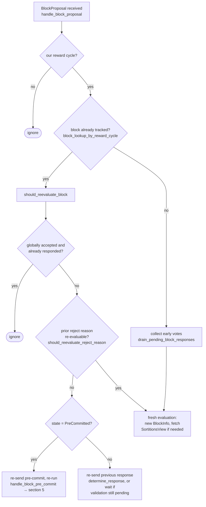

### Title
Stale rejection weight is never revoked when a signer switches its vote from Reject to Accept, allowing a single signer to inflate `total_weight_rejected` and falsely trigger `SignersRejected` — ([File: stacks-node/src/nakamoto_node/stackerdb_listener.rs])

### Summary
`BlockStatus` tracks two independent, monotonically-increasing weight counters, `total_weight_approved` and `total_weight_rejected`, which the mining coordinator treats as mutually exclusive partitions of the signer set's weight when deciding whether a block should be broadcast or abandoned [1](#0-0) . The code that increments `total_weight_rejected` guards against double-counting via the shared `responded_signers` set [2](#0-1) , but the code that increments `total_weight_approved` only guards against double-counting using the unrelated `gathered_signatures` map [3](#0-2) . Consequently a single signer who first sends `Rejected` and then `Accepted` for the same block sighash has its weight added to *both* counters, with no code path ever decrementing `total_weight_rejected`. This breaks the implicit invariant `total_weight_approved + total_weight_rejected <= total_weight` in the same way the referenced report's `plotsAvailablePerSize` bug broke the invariant that per-size caps sum to `MAX_SUPPLY` — a value that is supposed to represent a bounded partition is allowed to be inflated beyond what the underlying set of unique signers actually supports.

### Finding Description
`SignerCoordinator::send_and_wait_for_signatures` (or its polling loop) checks the rejection condition before the acceptance condition:

```
if block_status.total_weight_rejected.saturating_add(self.weight_threshold) > self.total_weight {
    ... return Err(NakamotoNodeError::SignersRejected { ... });
} else if block_status.total_weight_approved >= self.weight_threshold {
    ... return Ok(...);
}
``` [4](#0-3) 

`total_weight_rejected` and `total_weight_approved` are maintained by `StackerDBListener`'s event loop:

- On `Accepted`, weight is added iff `slot_id` is not already a key in `gathered_signatures` [5](#0-4) .
- On `Rejected`, weight is added iff `responded_signers.insert(slot_id)` succeeds (i.e., the slot had never responded before, in either direction) [2](#0-1) .

Because both branches unconditionally call `block.responded_signers.insert(slot_id)` (line 465 for Accept, and the `insert` check for Reject at line 515) but only the Accept branch also writes to `gathered_signatures`, the guard conditions are asymmetric:

- **Accept → Reject**: `responded_signers` already contains the slot, so the second `Rejected` message's `insert` returns `false` and no additional weight is added. This direction is protected.
- **Reject → Accept**: `gathered_signatures` never contained the slot before the `Accepted` message, so `!block.gathered_signatures.contains_key(&slot_id)` is `true` and `total_weight_approved` is incremented — while `total_weight_rejected` (already incremented when the earlier `Rejected` message arrived) is never decremented.

The result: after Reject-then-Accept, that signer's weight is counted in both `total_weight_approved` and `total_weight_rejected` simultaneously, so `total_weight_approved + total_weight_rejected` can exceed `total_weight`, the maximum possible if every signer's weight were counted exactly once. This is directly analogous to the referenced bug: an aggregate/derived quantity that is supposed to be bounded by (or exactly partition) a fixed total is allowed to exceed it because no invariant check enforces the relationship between the parts and the whole.

### Impact Explanation
Because the rejection check runs first in the polling loop [6](#0-5) , a stale/duplicated rejection weight can push `total_weight_rejected` past `total_weight - weight_threshold` even though the true, current set of rejecting signers (by actual latest vote) does not support that conclusion. This causes the mining coordinator to abort with `NakamotoNodeError::SignersRejected`, discarding a block that in reality has legitimate approving weight ≥ threshold from the current votes of the signer set. This is a liveness wedge on block production for that tenure attempt: a single Byzantine or simply flip-flopping signer (e.g., due to a race between reject-then-accept during re-evaluation) can force the miner to give up on an otherwise valid, sufficiently-signed block, and can repeat this on every block proposal to persistently stall the miner. This matches the "signer wedged into never signing valid blocks" / liveness-wedge impact category, since the aggregated-weight metric used to gate approval no longer equals the verified set of current accepts/rejects.

### Likelihood Explanation
No majority is required — the anomaly is created entirely by one signer's own two messages (`Rejected` then `Accepted`) sent over gossip/StackerDB for the same `signer_signature_hash`, well within the capability of a single malicious or misbehaving signer that controls only its own key and slot. Vote flip-flopping can also occur innocently under `should_reevaluate_block`/re-evaluation logic described in `docs/signer-flows.md`, where a block's local verdict can flip from rejected to accepted after re-evaluation [7](#0-6) , making this reachable without any adversarial intent, purely through the documented state-machine behavior of the signer.

### Recommendation
Track a single per-signer vote state (e.g., `HashMap<u32, Vote>`) in `BlockStatus` instead of two independently incremented totals gated by different sets (`gathered_signatures` vs `responded_signers`). When a signer's vote changes, recompute both totals from the per-signer vote map (or explicitly subtract the old contribution before adding the new one), so that `total_weight_approved + total_weight_rejected` can never exceed `total_weight`, and any specific signer's weight counts toward at most one side at any point in time.

### Proof of Concept
1. Signer S (weight `w`) responds `Rejected` for block `B`. `total_weight_rejected += w`; `responded_signers.insert(S_slot)`.
2. Enough other signers reject such that `total_weight_rejected` is just below the abort threshold.
3. Signer S then re-evaluates and responds `Accepted` for the same `B` (e.g., after a state-machine re-evaluation per `should_reevaluate_block`). Since `gathered_signatures` does not yet contain `S_slot`, `total_weight_approved += w` is executed at [3](#0-2) ; `total_weight_rejected` is left unchanged.
4. Now `total_weight_rejected` still reflects S's stale rejection, so `total_weight_rejected + weight_threshold > total_weight` can trip in `signer_coordinator.rs` even though the current votes (excluding S's stale reject) would not warrant it, causing `SignersRejected` to be returned and the block discarded despite sufficient live approving weight.

### Citations

**File:** stacks-node/src/nakamoto_node/stackerdb_listener.rs (L70-82)
```rust
#[derive(Debug, Clone)]
pub struct BlockStatus {
    /// Set of the slot ids of signers who have responded
    pub responded_signers: HashSet<u32>,
    /// Map of the slot id of signers who have signed the block and their signature
    pub gathered_signatures: BTreeMap<u32, MessageSignature>,
    /// Total weight of signers who have signed the block
    pub total_weight_approved: u32,
    /// Total weight of signers who have rejected the block
    pub total_weight_rejected: u32,
    /// Per-txid rejection tracking from signers
    pub failed_txids: HashMap<Txid, FailedTxInfo>,
}
```

**File:** stacks-node/src/nakamoto_node/stackerdb_listener.rs (L443-465)
```rust
                        if !block.gathered_signatures.contains_key(&slot_id) {
                            block.total_weight_approved = block
                                .total_weight_approved
                                .saturating_add(signer_entry.weight);

                            info!("StackerDBListener: Signature Added to block";
                                "signer_signature_hash" => %block_sighash,
                                "signer_pubkey" => signer_pubkey.to_hex(),
                                "signer_slot_id" => slot_id,
                                "signature" => %signature,
                                "signer_weight" => signer_entry.weight,
                                "total_weight_approved" => block.total_weight_approved,
                                "percent_approved" => block.total_weight_approved as f64 / self.total_weight as f64 * 100.0,
                                "total_weight_rejected" => block.total_weight_rejected,
                                "percent_rejected" => block.total_weight_rejected as f64 / self.total_weight as f64 * 100.0,
                                "weight_threshold" => self.weight_threshold,
                                "tenure_extend_timestamp" => tenure_extend_timestamp,
                                "read_count_extend_timestamp" => read_count_extend_timestamp,
                                "server_version" => metadata.server_version,
                            );
                        }
                        block.gathered_signatures.insert(slot_id, signature);
                        block.responded_signers.insert(slot_id);
```

**File:** stacks-node/src/nakamoto_node/stackerdb_listener.rs (L515-519)
```rust
                        if block.responded_signers.insert(slot_id) {
                            block.total_weight_rejected = block
                                .total_weight_rejected
                                .saturating_add(signer_entry.weight);

```

**File:** stacks-node/src/nakamoto_node/signer_coordinator.rs (L509-545)
```rust
            if block_status
                .total_weight_rejected
                .saturating_add(self.weight_threshold)
                > self.total_weight
            {
                info!(
                    "{}/{} signer weight votes to reject block",
                    block_status.total_weight_rejected, self.total_weight;
                    "signer_signature_hash" => %block_signer_sighash,
                );
                counters.bump_naka_rejected_blocks();

                // Only act on failed txids that a blocking minority (>30% weight) agrees on
                let blocking_minority = self.total_weight.saturating_sub(self.weight_threshold);
                let mut temporarily_excluded_txids = HashSet::new();
                let mut permanently_excluded_txids = HashSet::new();
                for (txid, info) in &block_status.failed_txids {
                    if info.total_weight > blocking_minority {
                        // Do not perma ban txids that only a small minority of signers reported as problematic
                        // But make sure its removed from the next block proposal
                        if info.problematic_weight > blocking_minority {
                            permanently_excluded_txids.insert(txid.clone());
                        } else {
                            temporarily_excluded_txids.insert(txid.clone());
                        }
                    }
                }

                return Err(NakamotoNodeError::SignersRejected {
                    temporarily_excluded_txids,
                    permanently_excluded_txids,
                });
            } else if block_status.total_weight_approved >= self.weight_threshold {
                info!("Received enough signatures, block accepted";
                    "signer_signature_hash" => %block_signer_sighash,
                );
                return Ok(block_status.gathered_signatures.values().cloned().collect());
```

**File:** docs/signer-flows.md (L164-185)
```markdown
## 3. A block proposal arrives

The miner broadcasts a proposal. If we've seen this exact block before,
`should_reevaluate_block` decides whether the old verdict stands; a block we
only pre-committed to is deliberately routed back through the pre-commit
evaluation so a re-proposal cannot shortcut to a signature. A fresh proposal is
checked against our view of the world _before_ spending a node validation on it.


