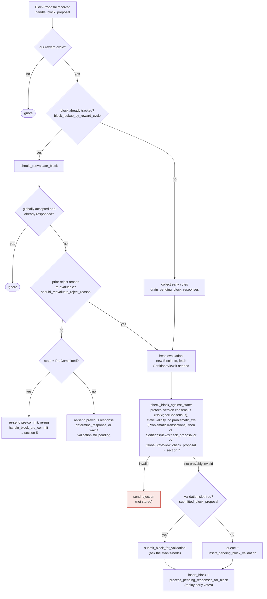

### Title
Pre-commit threshold signing path skips the miner-timeout/`InvalidMiner` re-check that `check_proposal` enforces, allowing a signer to sign for a miner it has already invalidated - ([File: stacks-signer/src/chainstate/v1.rs])

### Summary
`SortitionsView::check_proposal` is the only place that promotes a sortition's `miner_status` to `InvalidatedBeforeFirstBlock` when `SortitionState::is_timed_out` fires, and it is the only place that turns that status into an `InvalidMiner`/`NotLatestSortitionWinner` rejection [1](#0-0) . Once a block has already been pre-committed (validated ok, `valid = true`, `state = PreCommitted`), the code path that fires when the pre-commit weight crosses the 70% threshold does **not** call `check_proposal` again. It calls `check_block_against_signer_db_state`, which only re-checks tenure-change-parent-confirmation and "latest block in tenure" - it never consults `miner_status`/timeout [2](#0-1) . This mirrors the reported bug class exactly: a validation ("is this representative/miner acceptable") performed only at the initial admission step (`registerNodeRunner` / `check_proposal`) is bypassed on a later state-changing path (`rotateEOARepresentative` / pre-commit-threshold signing) that reuses the already-accepted object instead of re-running the original check.

### Finding Description
The equality this breaks is: *"a signer only signs blocks from a miner it currently regards as valid."* That equality is enforced by `check_proposal`'s `miner_status` gate, but the gate is only evaluated when `check_proposal` itself runs - i.e. on fresh proposal arrival, or in the narrow re-evaluation branches that explicitly call it (`should_reevaluate_block`'s "fresh evaluation" path) [3](#0-2) . A block that has already reached `PreCommitted` (validated, `valid = true`, no signature yet) is deliberately **not** routed back through `check_proposal` on re-proposal; instead it is routed through `handle_block_pre_commit`'s threshold-and-conflict evaluation [4](#0-3) . That evaluation's only "is this still consistent" gate is `check_block_against_signer_db_state`, whose own doc comment even warns "Do NOT call this function PRIOR to check_proposal... This is an incomplete check" [5](#0-4)  - yet it is the *only* check run at the moment of signing (section 5 of the flow doc: `RECHECK -- chainstate checks still pass? -- check_block_against_signer_db_state`) [6](#0-5) .

Concretely:
1. Miner M proposes block B1 for tenure T1. `check_proposal` runs, `cur_sortition.miner_status == Valid`, all checks pass; the block validates OK and reaches `PreCommitted` on this signer (and possibly a minority of others).
2. M then goes quiet (or the network partitions this signer from further activity on T1) long enough that `SortitionState::is_timed_out` would return `true` for T1 on a fresh evaluation [7](#0-6) . Since B1 is not a signed block (only pre-committed), `has_signed_block_in_tenure` is `false`, so the timeout guard does not protect it [8](#0-7) .
3. No fresh `check_proposal` call happens for B1 again (it's already tracked and in `PreCommitted`), so `cur_sortition.miner_status` is never flipped to `InvalidatedBeforeFirstBlock` from this signer's perspective for B1's evaluation - the flip only happens the next time `check_proposal` executes for *some* proposal, and even then it only rejects a *fresh* proposal for that consensus hash, not an already-`PreCommitted` block.
4. A late batch of gossiped pre-commits from other signers (slow, or M's more cooperative but delayed peers) now pushes the tallied weight for B1 over the 70% threshold on this signer. `handle_block_pre_commit` runs `check_block_against_signer_db_state`, which passes (it never asks about miner timeout/`miner_status`), and the signer proceeds to `mark_locally_accepted` and broadcast a signature [9](#0-8) .

The signer therefore signs a block for a miner/tenure that its own state machine would have declared `InvalidMiner` had the same gate been re-applied - the same class of gap as skipping the `Address.isContract` check on the "rotate" path while enforcing it only at initial registration.

### Impact Explanation
This is a Critical-class issue per the rules: a signer signs a block despite its own chainstate view holding it to be from an invalidated/timed-out miner - i.e., a non-canonical/abandoned tenure from that signer's perspective. Because a signature is described in the docs themselves as "a bearer instrument" that keeps counting toward the 70% threshold regardless of later opinion changes [10](#0-9) , a stale signature produced this way can help push a competing/abandoned tenure's block to consensus even after the signer's local view has moved on, which is exactly the sort of signed-vs-validated equality violation the scan targets.

### Likelihood Explanation
No majority of signers, no other signer's key, and no auth-token/local access is needed - only the timing of a single miner going idle plus ordinary StackerDB gossip of pre-commits (in scope per the rules: "a one-slot miner (plus gossip) can trigger"). The precondition is simply that a block reaches `PreCommitted` before the miner is judged timed-out, and that peers' pre-commits arrive/replay after that point - both are realistic race conditions given `block_proposal_timeout` windows and asynchronous StackerDB propagation.

### Recommendation
Re-run (or re-derive) the `miner_status`/timeout gate that `check_proposal` performs before crossing the pre-commit-threshold and signing, i.e. have `check_block_against_signer_db_state` (or a new check invoked from `handle_block_pre_commit`) also verify `SortitionState::is_timed_out` / `miner_status == Valid` for the block's tenure, matching the analogous fix of re-asserting the EOA-only check on every path that can produce a signature, not only on the initial admission path.

### Proof of Concept
Conceptual reproduction using existing test scaffolding (`stacks-signer/src/v0/tests.rs` sibling-race harness style, e.g. `run_sibling_scenario`):
1. Propose block B1 for tenure T1; drive `process_event` so `check_proposal` succeeds and `handle_block_validate_ok` marks it `PreCommitted` (mirrors `validate_ok` helper) [11](#0-10) .
2. Advance the mock clock/backing signer_db state past `block_proposal_timeout` without a signed block in T1, so a fresh `is_timed_out` call would return `true` [7](#0-6) .
3. Deliver a batch of `BlockPreCommit` events from simulated peers for B1 that pushes tallied weight past 70%, via `handle_block_pre_commit`.
4. Observe that `check_block_against_signer_db_state` is the only gate exercised [9](#0-8) , `is_timed_out`/`miner_status` is never consulted, and the signer emits `handle_block_signature`/broadcasts an `Accepted` response for a tenure it would reject as `InvalidMiner` if `check_proposal` were re-invoked.

Note: I was not able to execute this scenario in the index (read-only access); the trace above is derived directly from the cited control-flow in `signer.rs`, `chainstate/v1.rs`, and `docs/signer-flows.md`, which explicitly documents that the timeout/miner-status gate lives only in `check_proposal` and that the pre-commit-threshold recheck function is a known "incomplete check" by its own doc comment.

### Citations

**File:** stacks-signer/src/chainstate/v1.rs (L52-94)
```rust
impl SortitionState {
    /// Check if the given sortition identified by its ConsensusHash has timed out based on current signed blocks
    /// and the time at which the burn block for it was first recorded in the provided signerdb
    pub fn is_timed_out(
        sortition: &ConsensusHash,
        db: &SignerDb,
        block_proposal_timeout: Duration,
    ) -> Result<bool, SignerChainstateError> {
        // If we've already signed a block in this tenure, the miner can't have timed out: we have
        // committed a signature to this tenure and must not help abandon it.
        //
        // Importantly, a block we have only pre-committed to does not count! A pre-commit carries
        // no signature, and if it never reaches the pre-commit threshold the tenure can stall
        // indefinitely. Treating it as signed here would suppress the inactivity timeout for
        // exactly the signers that pre-committed, so they could never fall back to the prior
        // miner and the tenure could never recover.
        let has_block = db.has_signed_block_in_tenure(sortition)?;
        if has_block {
            return Ok(false);
        }
        let Some(received_ts) = db.get_burn_block_receive_time_ch(sortition)? else {
            return Ok(false);
        };
        let received_time = UNIX_EPOCH + Duration::from_secs(received_ts);
        let last_activity = db
            .get_last_activity_time(sortition)?
            .map(|time| UNIX_EPOCH + Duration::from_secs(time))
            .unwrap_or(received_time);

        let Ok(elapsed) = std::time::SystemTime::now().duration_since(last_activity) else {
            return Ok(false);
        };

        if elapsed > block_proposal_timeout {
            info!(
                "Tenure miner was inactive too long and timed out";
                "tenure_ch" => %sortition,
                "elapsed_inactive" => elapsed.as_secs(),
                "config_block_proposal_timeout" => block_proposal_timeout.as_secs()
            );
        }
        Ok(elapsed > block_proposal_timeout)
    }
```

**File:** stacks-signer/src/chainstate/v1.rs (L144-163)
```rust
        if self.cur_sortition.miner_status == SortitionMinerStatus::Valid
            && SortitionState::is_timed_out(
                &self.cur_sortition.data.consensus_hash,
                signer_db,
                self.config.block_proposal_timeout,
            )?
        {
            info!(
                "Current miner timed out, marking as invalid.";
                "block_height" => block.header.chain_length,
                "block_proposal_timeout" => ?self.config.block_proposal_timeout,
                "current_sortition_consensus_hash" => ?self.cur_sortition.data.consensus_hash,
            );
            self.cur_sortition.miner_status = SortitionMinerStatus::InvalidatedBeforeFirstBlock;

            // If the current proposal is also for this current
            // sortition, then we can return early here.
            if self.cur_sortition.data.consensus_hash == block.header.consensus_hash {
                return Err(RejectReason::InvalidMiner);
            }
```

**File:** stacks-signer/src/v0/signer.rs (L1345-1366)
```rust
        if let Some(block_rejection) =
            self.check_block_against_signer_db_state(stacks_client, &block_info.block)
        {
            warn!(
                "{self}: Reached the pre-commit threshold for a block, but it no longer passes the chainstate checks. Rejecting.";
                "signer_signature_hash" => %block_hash,
                "block_height" => block_info.block.header.chain_length,
                "reject_code" => %block_rejection.reason_code,
                "reject_reason" => &block_rejection.reason,
            );
            if let Err(e) = block_info.mark_locally_rejected() {
                if !block_info.has_reached_consensus() {
                    warn!("{self}: Failed to mark block as locally rejected: {e:?}");
                }
            };
            self.signer_db
                .insert_block(&block_info)
                .unwrap_or_else(|e| self.handle_insert_block_error(e));
            self.handle_block_rejection(&block_rejection, sortition_state);
            self.send_block_response(&block_info.block, block_rejection.into());
            return;
        }
```

**File:** stacks-signer/src/v0/signer.rs (L1799-1841)
```rust
    /// WARNING: This is an incomplete check. Do NOT call this function PRIOR to check_proposal or block_proposal validation succeeds.
    ///
    /// Re-verify a block's chain length against the last signed block within signerdb.
    /// This is required in case a block has been approved since the initial checks of the block validation endpoint.
    fn check_block_against_signer_db_state(
        &mut self,
        stacks_client: &StacksClient,
        proposed_block: &NakamotoBlock,
    ) -> Option<BlockRejection> {
        let signer_signature_hash = proposed_block.header.signer_signature_hash();
        // If this is a tenure change block, ensure that it confirms the correct number of blocks from the parent tenure.
        if let Some(tenure_change) = proposed_block.get_tenure_change_tx_payload() {
            // Ensure that the tenure change block confirms the expected parent block
            match SortitionData::check_tenure_change_confirms_parent(
                tenure_change,
                proposed_block,
                &mut self.signer_db,
                stacks_client,
                self.proposal_config.tenure_last_block_proposal_timeout,
                self.proposal_config.reorg_attempts_activity_timeout,
            ) {
                Ok(true) => return None,
                Ok(false) => {
                    return Some(self.create_block_rejection(
                        RejectReason::SortitionViewMismatch,
                        proposed_block,
                    ))
                }
                Err(e) => {
                    warn!("{self}: Error checking block proposal: {e}";
                        "signer_signature_hash" => %signer_signature_hash,
                        "block_id" => %proposed_block.block_id()
                    );
                    return Some(self.create_block_rejection(
                        RejectReason::ConnectivityIssues(
                            "error checking block proposal".to_string(),
                        ),
                        proposed_block,
                    ));
                }
            }
        }

```

**File:** docs/signer-flows.md (L164-203)
```markdown
## 3. A block proposal arrives

The miner broadcasts a proposal. If we've seen this exact block before,
`should_reevaluate_block` decides whether the old verdict stands; a block we
only pre-committed to is deliberately routed back through the pre-commit
evaluation so a re-proposal cannot shortcut to a signature. A fresh proposal is
checked against our view of the world _before_ spending a node validation on it.



Early votes: acceptances, rejections, and pre-commits that arrived before the
proposal itself are parked in pending tables and replayed once the proposal is
known.

> Anchors: `handle_block_proposal`, `should_reevaluate_block`,
> `should_reevaluate_reject_reason`, `check_block_against_state`,
> `submit_block_for_validation`, `process_pending_responses_for_block`
> (signer.rs); `check_proposal` (chainstate/v1.rs, v2.rs)
```

**File:** docs/signer-flows.md (L246-250)
```markdown
    VALID -- yes --> TH{"pre-commit weight ≥ 70%?<br/>NakamotoBlockHeader::<br/>compute_voting_weight_threshold"}
    TH -- no --> N3(["wait for more pre-commits"])
    TH -- yes --> RECHECK{"chainstate checks still pass?<br/>check_block_against_signer_db_state<br/>→ section 7"}
    RECHECK -- no --> REJ["mark_locally_rejected,<br/>handle_block_rejection,<br/>broadcast rejection"]:::bad
    RECHECK -- yes --> CONF["signed conflicts at height ≥ h,<br/>in ANY tenure<br/>get_signed_conflicts"]
```

**File:** docs/signer-flows.md (L322-327)
```markdown
A conflict is any block a signature was ever put over — ours, or a group
threshold we observed — whatever its state now. In particular rejection, even
_global_ rejection, does not clear one: a rejection is a revocable opinion,
while a signature is a bearer instrument that can still be aggregated toward
the 70% threshold if rejecting signers change their minds. Only staleness or
node-derived death (the two questions above) clears a conflict.
```

**File:** docs/signer-flows.md (L1505-1528)
```markdown

```

**File:** stacks-signer/src/v0/tests.rs (L580-589)
```rust
    fn validate_ok(hash: &Sha512Trunc256Sum) -> SignerEvent<SignerMessage> {
        SignerEvent::BlockValidationResponse(BlockValidateResponse::Ok(BlockValidateOk {
            signer_signature_hash: hash.clone(),
            cost: ExecutionCost::ZERO,
            size: 0,
            validation_time_ms: 1,
            replay_tx_hash: None,
            replay_tx_exhausted: false,
        }))
    }
```
