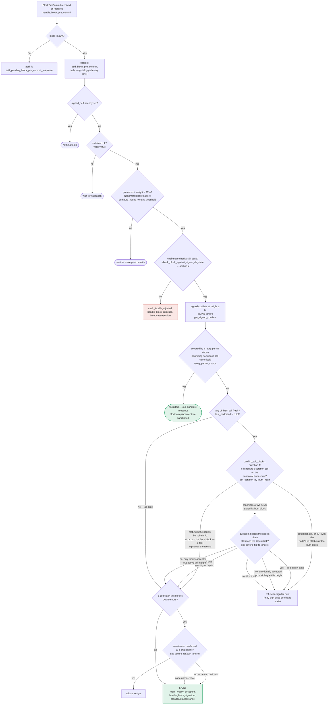
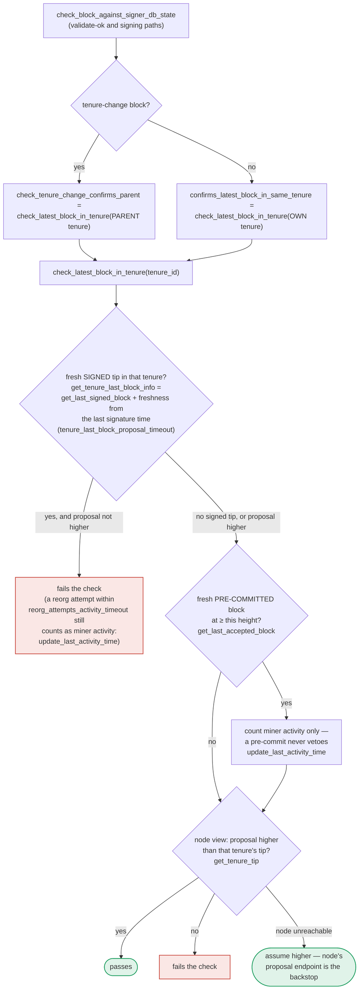

Based on my research, I found a genuine analog to the "fallback doesn't work as designed" bug class in `stacks-signer/src/chainstate/mod.rs`'s `check_latest_block_in_tenure` function, which is reused across proposal-arrival, validate-ok, and pre-commit/signing paths despite its safety rationale only holding for one of those call sites.

### Title
Fail-open node-unreachable fallback in `check_latest_block_in_tenure` is reused at the signing-time recheck where its safety justification does not hold, risking a conflicting block signature - (File: stacks-signer/src/chainstate/mod.rs)

### Summary
`check_latest_block_in_tenure` explicitly fails open (`Ok(true)` = "block confirms enough") when it cannot reach the stacks-node to fetch a tenure's tip. Its own docstring justifies this by pointing to the `/v3/block_proposal` endpoint as a "backstop" — but that endpoint is only invoked once, at proposal arrival. The same function is reused later at the validate-ok and pre-commit/signing rechecks (`check_block_against_signer_db_state`), where no fresh node validation occurs, so a transient node-connectivity gap at that later point causes the signer to sign without the safety net the comment relies on — mirroring the FlatCoin report's core defect: a fallback intended to preserve availability during an outage instead silently drops the safety check it was supposed to preserve.

### Finding Description
`SortitionData::check_latest_block_in_tenure` first consults the local `SignerDb` for a known signed/pre-committed tip in the tenure; if neither exists, it queries the node's tenure tip via `client.get_tenure_tip(tenure_id)`. If that RPC call fails, the function does not reject or wait — it returns `Ok(true)`: [1](#0-0) [2](#0-1) 

The docstring's stated rationale is:
> "If we can't look up `tenure_id`, assume `block` is higher. This assumption is safe because this proposal ultimately must be passed to the `stacks-node` for proposal processing: so, if we pass the block height check here, we are relying on the `stacks-node` proposal endpoint to do the validation..."

That rationale is only true for the **proposal-arrival** call path (`handle_block_proposal` → `check_proposal` → `submit_block_for_validation`), where the full `/v3/block_proposal` validation genuinely happens afterward. However, per the documented flow, the same helper (`check_latest_block_in_tenure`, via `confirms_latest_block_in_same_tenure` / `check_tenure_change_confirms_parent`) is also invoked from `check_block_against_signer_db_state`, which runs at two additional points that do **not** re-invoke node block validation:
- at `handle_block_validate_ok`, right after the node's OK response, to catch DB-state drift since submission,
- at the pre-commit threshold recheck (section 5, "RECHECK") right before a signature is actually produced. [3](#0-2) 

At those later points, if `client.get_tenure_tip` transiently fails (node restart, RPC timeout, network hiccup), the check again returns "passes," but this time with no subsequent call to `/v3/block_proposal` to serve as the claimed backstop. The signer can then proceed to `mark_pre_committed` / sign, having skipped the one mechanism designed to detect that a higher, conflicting block has already become the tenure's canonical tip.

### Impact Explanation
This falls under the Critical impact category: a signer may sign a non-canonical or conflicting block. If the tenure has already advanced past what this signer's local `SignerDb` and the (now-unreachable) node would otherwise reveal, the signer's participation in reaching the aggregate signature threshold contributes to potentially certifying a stale/duplicate block for that tenure height — the exact "equality" (one confirmed tip per tenure) that `check_latest_block_in_tenure` exists to protect is bypassed precisely when connectivity is degraded, which is when protection matters most.

### Likelihood Explanation
Requires only a transient node RPC failure (`get_tenure_tip`) coinciding with the validate-ok or pre-commit recheck window for a single signer — no majority collusion, no other signer's key, and no auth_token access needed. Node restarts, RPC timeouts, or brief network partitions between signer and node are realistic, non-adversarial conditions that this code path already anticipates (it has an explicit `Err` branch for it), making this a plausible operational scenario rather than a purely theoretical one.

### Recommendation
Do not fail open uniformly for every caller of `check_latest_block_in_tenure`. At minimum, distinguish the proposal-arrival call (where the backstop of `/v3/block_proposal` truly follows) from the validate-ok/pre-commit-recheck calls (where it does not): for the latter, either fail closed (treat an unreachable node as "cannot confirm, do not sign/pre-commit yet") or re-issue a fresh validation request to the node before proceeding.

### Proof of Concept
Not independently exploitable in isolation without a live cluster; the mechanism is demonstrated by tracing the shared code path:
1. `check_latest_block_in_tenure`'s `Err` branch on `client.get_tenure_tip` returns `Ok(true)` unconditionally: [2](#0-1) .
2. This same function backs `check_block_against_signer_db_state`, invoked from `handle_block_validate_ok`: [4](#0-3) .
3. Per the documented flow, the identical check also gates the pre-commit-threshold signing decision (RECHECK step), with no further node validation call in between: [5](#0-4) .

I was unable to fully trace, within the remaining tool budget, the exact call site inside `handle_block_pre_commit`'s RECHECK step in `stacks-signer/src/v0/signer.rs` to confirm word-for-word that no node re-validation occurs between pre-commit and signing; this is inferred from the documented flow (`docs/signer-flows.md`, section 5, "RECHECK") which explicitly labels the node's proposal endpoint as consulted only once, at section 4. A background Devin session with full repository access could confirm this by reading the complete body of `handle_block_pre_commit` in `stacks-signer/src/v0/signer.rs`.

### Citations

**File:** stacks-signer/src/chainstate/mod.rs (L366-384)
```rust
    /// Check whether or not `block` is higher than the highest block in `tenure_id`.
    ///  returns `Ok(true)` if `block` is higher, `Ok(false)` if not.
    ///
    /// If we can't look up `tenure_id`, assume `block` is higher.
    /// This assumption is safe because this proposal ultimately must be passed
    /// to the `stacks-node` for proposal processing: so, if we pass the block
    /// height check here, we are relying on the `stacks-node` proposal endpoint
    /// to do the validation on the chainstate data that it has.
    ///
    /// This updates the activity timer for the miner of `block`.
    pub fn check_latest_block_in_tenure(
        tenure_id: &ConsensusHash,
        block: &NakamotoBlock,
        signer_db: &mut SignerDb,
        client: &StacksClient,
        tenure_last_block_proposal_timeout: Duration,
        reorg_attempts_activity_timeout: Duration,
    ) -> Result<bool, ClientError> {
        let last_block_info = SortitionData::get_tenure_last_block_info(
```

**File:** stacks-signer/src/chainstate/mod.rs (L450-461)
```rust
        let tip = match client.get_tenure_tip(tenure_id) {
            Ok(tip) => tip.anchored_header,
            Err(e) => {
                warn!(
                    "Failed to fetch the tenure tip for the parent tenure: {e:?}. Assuming proposal is higher than the parent tenure for now.";
                    "proposed_block_consensus_hash" => %block.header.consensus_hash,
                    "signer_signature_hash" => %block.header.signer_signature_hash(),
                    "parent_tenure" => %tenure_id,
                );
                return Ok(true);
            }
        };
```

**File:** docs/signer-flows.md (L237-270)
```markdown


**File:** docs/signer-flows.md (L389-418)
```markdown
## 7. The chainstate checks (shared)

`check_latest_block_in_tenure` answers "does this block confirm the tip we
expect?" and it runs in three places: at proposal arrival (inside
`check_proposal`), at validate-ok, and at the moment of signing. _Which_ tenure
it is asked about depends on the block: a tenure-change block is checked against
its **parent** tenure, every other block against its **own**. Never both. The
pivotal helper is `get_tenure_last_block_info`, which considers only blocks that
carry a signature (`get_last_signed_block`): a pre-commit never vetoes anything,
it only counts as miner activity.


```

**File:** stacks-signer/src/v0/signer.rs (L1946-1959)
```rust
        if let Some(block_rejection) =
            self.check_block_against_signer_db_state(stacks_client, &block_info.block)
        {
            // The signer db state has changed. We no longer view this block as valid. Override the validation response.
            if let Err(e) = block_info.mark_locally_rejected() {
                if !block_info.has_reached_consensus() {
                    warn!("{self}: Failed to mark block as locally rejected: {e:?}");
                }
            };
            self.signer_db
                .insert_block(&block_info)
                .unwrap_or_else(|e| self.handle_insert_block_error(e));
            self.handle_block_rejection(&block_rejection, sortition_state);
            self.send_block_response(&block_info.block, block_rejection.into());
```
