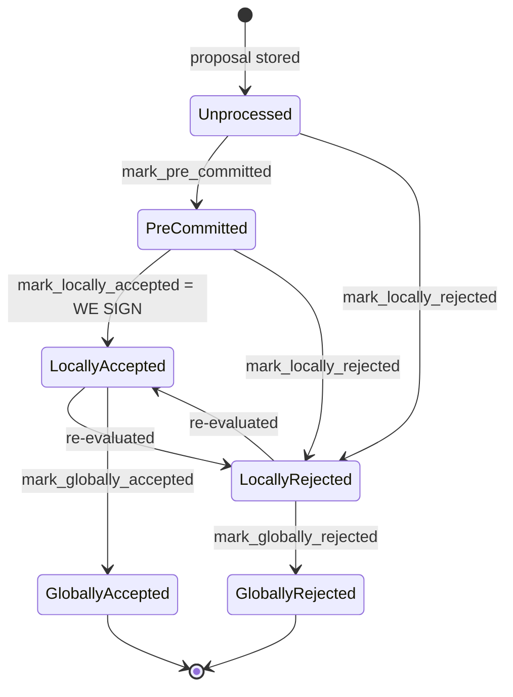

### Title
Reorg-permit check counts only globally-accepted blocks, letting a miner supersede tenures with multiple quorum-signed blocks - (File: stacks-signer/src/chainstate/mod.rs)

### Summary
`SortitionData::check_parent_tenure_choice` decides whether a new miner's tenure choice (a Bitcoin-fork-driven reorg of a prior tenure) is acceptable, and — if it is — permanently silences the double-sign conflict guard for every block in the reorged tenure via `record_superseded_tenure` → `mark_tenure_superseded`. The "is this reorg safe" gate is checked with `get_globally_accepted_block_count_in_tenure > 1`, i.e. it only counts blocks whose state is `GloballyAccepted` (node-confirmed). Everywhere else in the codebase that decides whether a block is "signed" and therefore must be protected against conflicting signatures (`get_last_signed_block`, `get_signed_conflicts`, `get_tenure_last_block_info`) uses the broader predicate `LocallyAccepted OR GloballyAccepted`. This mismatch lets a single miner construct a tenure choice that the signer set will treat as a legitimate replacement even though the tenure being reorged already carries multiple quorum-signed (>70% weight) blocks that were merely not yet confirmed by the node. [1](#0-0) 

### Finding Description
`check_parent_tenure_choice` is invoked at proposal time (via `SortitionState::is_tenure_valid`) whenever a miner's parent tenure is not the immediately-prior sortition, i.e., they're proposing a reorg: [2](#0-1) 

The gate that is supposed to prevent reorging tenures with meaningful chain history reads:
```rust
let globally_accepted_blocks =
    signer_db.get_globally_accepted_block_count_in_tenure(&tenure.consensus_hash)?;
if globally_accepted_blocks > 1 {
    ... return Ok(false);
}
```
This counts only blocks in `BlockState::GloballyAccepted` — the state reached only once the node itself has processed the block (see `docs/signer-flows.md` section 2, and `mark_globally_accepted`). It ignores blocks in `BlockState::LocallyAccepted`, which is the state a block reaches the moment the signer set crosses the 70% weight signature threshold, *before* the node has necessarily seen or processed it: [3](#0-2) 

Every other place in the codebase that must decide "has this block been durably signed, such that a conflicting sibling must not also be signed" explicitly includes both states:
- `get_last_signed_block` selects `state IN ('GloballyAccepted', 'LocallyAccepted')`. [4](#0-3) 
- `get_signed_conflicts`, which powers the pre-commit-time double-sign guard, is documented as considering a block "signed" if `signed_self` or `signed_group` is set — i.e. LocallyAccepted counts. [5](#0-4) 
- `get_tenure_last_block_info`, used by the height-monotonicity check, also uses `get_last_signed_block` (both states). [6](#0-5) 

Because the reorg-timing gate in `check_parent_tenure_choice` uses the narrower "globally accepted" definition instead of the "signed" definition used everywhere else, a tenure that has, e.g., 3 blocks each individually signed by ≥70% of signer weight (so each is `LocallyAccepted`, real quorum-endorsed state) but 0 or 1 of which the node has processed into `GloballyAccepted`, does **not** trip the `globally_accepted_blocks > 1` early rejection. Execution falls through to the per-tenure timing check (`first_proposal_burn_block_timing`) based on `get_first_approved_block_in_tenure`, and if that individually-checked condition is satisfied for the *first* block of the tenure, the whole tenure — including its other already-quorum-signed blocks — is pushed into `superseded_tenures` and recorded via `record_superseded_tenure`/`mark_tenure_superseded`.

Once a tenure is marked superseded, `reorg_permit_stands` (consulted from the pre-commit signing path, section 5 of the flow doc) causes the conflict guard to *exclude* that tenure's signed blocks from blocking a new signature, on the premise that "our signature must not block a replacement we sanctioned." The net effect: the signer set can be induced to place fresh, quorum-crossing signatures on a competing tenure's blocks at the same heights as blocks that already carry a separate quorum's signatures — the exact conflicting/equivocating-signature outcome the whole `get_signed_conflicts` / `conflict_still_blocks` / `reorg_permit_stands` machinery in section 5 exists to prevent. [7](#0-6) [8](#0-7) 

### Impact Explanation
This breaks the "at most one signed block per height" invariant that the signer's double-sign guard (section 5 of `docs/signer-flows.md`, `get_signed_conflicts`/`conflict_still_blocks`/`reorg_permit_stands`) is designed to enforce. A single one-slot miner, by timing tenure production so that only ≤1 block in a multi-block tenure reaches node-confirmed (`GloballyAccepted`) status before proposing a reorg, can get the signer set to treat several already quorum-signed blocks as fair game for replacement — inducing the signers to sign a conflicting sibling tenure at heights where a different quorum-signed block already exists. This is a "signer signing a conflicting block" outcome (Critical impact per the stated criteria), since it produces two competing sets of validly-thresholded signatures rooted in the same chain history, which is exactly the equivocation scenario the pre-commit conflict guard exists to prevent.

### Likelihood Explanation
Triggering this requires only a single miner's slot (no majority of signers, no other signer's key, no auth token): the attacker simply mines several blocks in their tenure fast enough that they get individually signed by the signer set (crossing 70% weight quickly, as designed) but proposes/loses the tenure (via a Bitcoin reorg or a competing miner winning the next sortition) before the node processes and globally accepts more than one of them. The `first_proposal_burn_block_timing` "poorly timed" branch already exists specifically to permit reorgs of tenures whose *first* block was slow relative to the next sortition — an attacker (or a legitimately-competing next miner) can rely on ordinary timing variance to land in this branch while the reorged tenure nonetheless has multiple quorum-signed blocks sitting in `LocallyAccepted`. No special network manipulation is required beyond normal proposal/mining timing, which the reorg-guard code already anticipates as a natural occurrence.

### Recommendation
Change the guard in `check_parent_tenure_choice` (`stacks-signer/src/chainstate/mod.rs`) to use the same "signed" definition used by the rest of the conflict-guard machinery — i.e., count blocks in `LocallyAccepted` OR `GloballyAccepted` state (equivalent to `get_last_signed_block`'s predicate) rather than calling `get_globally_accepted_block_count_in_tenure`. Concretely, add/repurpose a `SignerDb` accessor that counts *signed* (not just globally-accepted) blocks in a tenure, and use it for the `> 1` early-rejection check, so that a tenure with multiple quorum-signed-but-not-yet-node-confirmed blocks is never eligible to be superseded by a competing tenure.

### Proof of Concept
Conceptual PoC (cannot be executed without live signer/node infrastructure, based on tracing the code paths above):
1. Attacker mines Tenure A and proposes blocks A1, A2, A3 in quick succession. The signer set signs each as it arrives, moving each to `LocallyAccepted` (crossing the 70% pre-commit/signature threshold each time) as described in `handle_block_pre_commit`/`store_and_process_block_signature`. [9](#0-8) 
2. Before the stacks-node processes/announces all three as its canonical tip (so at most one becomes `GloballyAccepted`), a Bitcoin reorg (or a competing miner) causes a new tenure B to be proposed whose parent tenure is not A, but the sortition prior to A (reorging A away).
3. `check_parent_tenure_choice` is invoked for B's proposal. `get_globally_accepted_block_count_in_tenure(A) <= 1`, so the `> 1` guard does not trip. [10](#0-9) 
4. The per-tenure timing check on A's first block (A1) evaluates as "poorly timed" relative to B's sortition (a condition attacker can influence via timing), so A is added to `superseded_tenures` and `mark_tenure_superseded` is recorded for the whole tenure A, even though A2/A3 were separately quorum-signed. [11](#0-10) 
5. When B's blocks reach the pre-commit threshold at the same heights as A2/A3, `reorg_permit_stands` finds A superseded by B's still-canonical sortition and excludes A2/A3 as conflicts, so signers proceed to sign B's blocks — producing quorum signatures for two conflicting blocks at the same height. [12](#0-11) 

Note: I was unable to view the exact SQL/implementation of `get_globally_accepted_block_count_in_tenure` and `get_first_approved_block_in_tenure` in `stacks-signer/src/signerdb.rs` within the available search results (only their call sites and doc comments were retrieved), so the precise state filter used by `get_globally_accepted_block_count_in_tenure` is inferred from its name and from the contrast with `get_last_signed_block`'s documented predicate rather than directly read from its body. A full session with file access would be needed to confirm the exact SQL/state filter in that function before treating this as a fully verified vulnerability rather than a strong analog.

### Citations

**File:** stacks-signer/src/chainstate/mod.rs (L159-169)
```rust
impl SortitionData {
    /// Check if the tenure defined by `sortition_state` is building off of an
    ///  appropriate tenure.
    ///
    /// A permitted reorg is recorded once the whole reorg is permitted: each tenure whose
    /// blocks this one is allowed to replace is marked superseded (see
    /// [`SignerDb::mark_tenure_superseded`]), so a signature we already placed on one of those
    /// blocks does not later block the replacement. The record carries this tenure's sortition
    /// as the permitting one, so the permit stops applying if a burnchain fork later orphans
    /// it. Nothing is recorded for a refused reorg, even for the tenures in it that
    /// individually qualified.
```

**File:** stacks-signer/src/chainstate/mod.rs (L170-223)
```rust
    pub fn check_parent_tenure_choice(
        &self,
        signer_db: &mut SignerDb,
        client: &StacksClient,
        first_proposal_burn_block_timing: &Duration,
    ) -> Result<bool, SignerChainstateError> {
        // if the parent tenure is the last sortition, it is a valid choice.
        // if the parent tenure is a reorg, then all of the reorged sortitions
        //  must either have produced zero blocks _or_ produced their first (and only) block
        //  very close to the burn block transition.
        if self.prior_sortition == self.parent_tenure_id {
            return Ok(true);
        }
        info!(
            "Most recent miner's tenure does not build off the prior sortition, checking if this is valid behavior";
            "sortition_state.consensus_hash" => %self.consensus_hash,
            "sortition_state.prior_sortition" => %self.prior_sortition,
            "sortition_state.parent_tenure_id" => %self.parent_tenure_id,
        );

        let tenures_reorged =
            client.get_tenure_forking_info(&self.parent_tenure_id, &self.prior_sortition)?;
        if tenures_reorged.is_empty() {
            warn!("Miner is not building off of most recent tenure, but stacks node was unable to return information about the relevant sortitions. Marking miner invalid.");
            return Ok(false);
        }

        // this value *should* always be some, but try to do the best we can if it isn't
        let sortition_state_received_time =
            signer_db.get_burn_block_receive_time(&self.burn_block_hash)?;

        // Track which tenures are superseded by the reorg, then mark them in
        // the DB after the reorg is permitted.
        let mut superseded_tenures = Vec::new();
        for tenure in tenures_reorged.iter() {
            if tenure.consensus_hash == self.parent_tenure_id {
                // this was a built-upon tenure, no need to check this tenure as part of the reorg.
                continue;
            }

            // disallow reorg if more than one block has already been signed
            let globally_accepted_blocks =
                signer_db.get_globally_accepted_block_count_in_tenure(&tenure.consensus_hash)?;
            if globally_accepted_blocks > 1 {
                warn!(
                    "Miner is not building off of most recent tenure, but a tenure they attempted to reorg has already more than one globally accepted block.";
                    "parent_tenure" => %self.parent_tenure_id,
                    "last_sortition" => %self.prior_sortition,
                    "violating_tenure_id" => %tenure.consensus_hash,
                    "violating_tenure_first_block_id" => ?tenure.first_block_mined,
                    "globally_accepted_blocks" => globally_accepted_blocks,
                );
                return Ok(false);
            }
```

**File:** stacks-signer/src/chainstate/mod.rs (L247-294)
```rust
            let checked_proposal_timing = if let Some(sortition_state_received_time) =
                sortition_state_received_time
            {
                // how long was there between when the proposal was received and the next sortition started?
                let proposal_to_sortition = if let Some(approved_at) =
                    local_block_info.approved_time
                {
                    sortition_state_received_time.saturating_sub(approved_at)
                } else {
                    info!("We did not sign over the reorged tenure's first block, considering it as a late-arriving proposal");
                    0
                };
                if Duration::from_secs(proposal_to_sortition) < *first_proposal_burn_block_timing {
                    info!(
                        "Miner is not building off of most recent tenure. A tenure they reorg has already mined blocks, but the block was poorly timed, allowing the reorg.";
                        "parent_tenure" => %self.parent_tenure_id,
                        "last_sortition" => %self.prior_sortition,
                        "violating_tenure_id" => %tenure.consensus_hash,
                        "violating_tenure_first_block_id" => %first_block_mined,
                        "violating_tenure_proposed_time" => local_block_info.proposed_time,
                        "new_tenure_received_time" => sortition_state_received_time,
                        "new_tenure_burn_timestamp" => self.burn_header_timestamp,
                        "first_proposal_burn_block_timing_secs" => first_proposal_burn_block_timing.as_secs(),
                        "proposal_to_sortition" => proposal_to_sortition,
                    );
                    superseded_tenures.push(tenure);
                    continue;
                }
                true
            } else {
                false
            };

            warn!(
                "Miner is not building off of most recent tenure, but a tenure they attempted to reorg has already mined blocks.";
                "parent_tenure" => %self.parent_tenure_id,
                "last_sortition" => %self.prior_sortition,
                "violating_tenure_id" => %tenure.consensus_hash,
                "violating_tenure_first_block_id" => %first_block_mined,
                "checked_proposal_timing" => checked_proposal_timing,
            );
            return Ok(false);
        }
        // Every reorged tenure cleared the rules, so the reorg is permitted.
        for tenure in superseded_tenures {
            self.record_superseded_tenure(signer_db, tenure);
        }
        Ok(true)
```

**File:** stacks-signer/src/chainstate/mod.rs (L296-315)
```rust

    /// Note that we have sanctioned `self`'s tenure replacing whatever `tenure` built, so a
    /// signature we already placed on one of its blocks must stop counting as a conflict while
    /// `self`'s sortition remains canonical.
    ///
    /// A failure to record only costs a delayed replacement -- the conflict keeps blocking until
    /// the signature goes stale -- so it is logged rather than propagated.
    fn record_superseded_tenure(&self, signer_db: &mut SignerDb, tenure: &TenureForkingInfo) {
        if let Err(e) = signer_db.mark_tenure_superseded(
            &tenure.consensus_hash,
            tenure.burn_block_height,
            &self.consensus_hash,
            &self.burn_block_hash,
        ) {
            warn!("Failed to record a tenure whose reorg we permitted: {e}";
                "superseded_tenure_id" => %tenure.consensus_hash,
                "superseded_by" => %self.consensus_hash,
            );
        }
    }
```

**File:** stacks-signer/src/chainstate/mod.rs (L330-347)
```rust
    pub fn get_tenure_last_block_info(
        consensus_hash: &ConsensusHash,
        signer_db: &SignerDb,
        tenure_last_block_proposal_timeout: Duration,
    ) -> Result<Option<BlockInfo>, ClientError> {
        // Get the last signed block in the tenure
        let last_signed_block = signer_db
            .get_last_signed_block(consensus_hash)
            .map_err(|e| ClientError::InvalidResponse(e.to_string()))?;

        let Some(block_info) = last_signed_block else {
            return Ok(None);
        };

        // `approved_time` may hold the pre-commit time; use the actual signature time.
        let Some(signed_over_time) = block_info.signed_self.max(block_info.signed_group) else {
            return Ok(None);
        };
```

**File:** docs/signer-flows.md (L130-162)
```markdown
## 2. Block lifecycle (`BlockState`)

Every proposal tracked in the signer DB carries a `BlockState`. **`PreCommitted`
carries no signature**: it means "validated, willing to sign if the pre-commit
threshold is met." The first signature appears at `mark_locally_accepted`.
Global states are terminal against each other.



Canonical paths shown; the exact rule in `BlockInfo::check_state` is: either
local state is reachable from anything not yet global, `PreCommitted` only from
`Unprocessed`, and each global state is unreachable from the other.

Timestamps: `approved_time` is stamped at pre-commit _or_ local acceptance
(first wins), `signed_self` only when we sign, `signed_group` when the group
threshold is observed.

> Anchors: `BlockInfo::check_state`, `move_to`, `mark_pre_committed`,
> `mark_locally_accepted`, `mark_globally_accepted`, `mark_locally_rejected`,
> `mark_globally_rejected` (signerdb.rs)
```

**File:** docs/signer-flows.md (L496-510)
```markdown
One decision does have to be recorded, because it is ours rather than the
node's. When a miner builds off something other than the prior sortition,
`check_parent_tenure_choice` decides whether the reorg is allowed: it is, if
every tenure being reorged has at most one globally accepted block and produced
its first block too close to the next sortition to count
(`first_proposal_burn_block_timing`). Having sanctioned that replacement, the
signer records those tenures as **superseded** (`mark_tenure_superseded`), so its
own signature over what they built does not then block the replacement it just
permitted — the node cannot answer this one at signing time, since it still
serves the reorged tenure as fully live until the replacement lands. What _is_
still derived from the node is the permit's own validity: the record carries the
permitting tenure's sortition, and it only excludes conflicts while that
sortition remains canonical (section 5, `reorg_permit_stands`), so a burnchain
fork that orphans the permitting tenure automatically voids the permit. A record
more than `MAX_FORK_DEPTH` (100) burn blocks below the tip is dropped; a fork
```

**File:** stacks-signer/src/signerdb.rs (L1572-1585)
```rust
    pub fn get_last_signed_block(
        &self,
        tenure: &ConsensusHash,
    ) -> Result<Option<BlockInfo>, DBError> {
        let query = "SELECT block_info FROM blocks WHERE consensus_hash = ?1 AND state IN (?2, ?3) ORDER BY stacks_height DESC LIMIT 1";
        let args = params![
            tenure,
            &BlockState::GloballyAccepted.to_string(),
            &BlockState::LocallyAccepted.to_string(),
        ];
        let result: Option<String> = query_row(&self.db, query, args)?;

        try_deserialize(result)
    }
```

**File:** stacks-signer/src/signerdb.rs (L1587-1600)
```rust
    /// Return every signed block at or above the given Stacks height, in ANY tenure, excluding
    /// the block with the given signer signature hash, ordered by height (highest first). A
    /// block is considered signed if a signature was ever put over it, ours (`signed_self`)
    /// or the observed group's (`signed_group`). Blocks that were only pre-committed carry no
    /// signature and are never returned. Each row carries the most recent endorsement time
    /// (`signed_self`/`signed_group`, whichever is later) so the caller can judge freshness per
    /// conflict.
    ///
    /// The search deliberately spans all tenures: two blocks at the same height are siblings
    /// no matter which tenure they belong to (e.g. a tenure-start block conflicts with the
    /// previous tenure's block at the same height), so a signature over either may conflict
    /// with a fresh signature over the other.
    ///
    /// Blocks in tenures whose reorg we sanctioned under the reorg-timing rules (see
```

**File:** stacks-signer/src/v0/signer.rs (L1374-1421)
```rust
        // tenures whose reorg we sanctioned under the reorg-timing rules are excluded, but
        // only while the sortition the permit was granted to is still canonical
        // (`check_parent_tenure_choice` records the permit, `reorg_permit_stands` re-derives
        // its validity from the node); every other question about whether a conflict is
        // still live is derived from the node in `conflict_still_blocks`.
        //
        // Unlike the chainstate check above, a refusal here is "for now" rather than a
        // broadcast rejection: a later pre-commit re-evaluation may still sign the block once
        // the conflicting signature has gone stale.
        let conflicts = match self
            .signer_db
            .get_signed_conflicts(block_info.block.header.chain_length, &block_hash)
        {
            Ok(conflicts) => conflicts,
            Err(e) => {
                warn!("{self}: Failed to query the signed blocks. Refusing to sign block {block_hash}: {e:?}");
                return;
            }
        };
        let freshness_cutoff = get_epoch_time_secs().saturating_sub(
            self.proposal_config
                .tenure_last_block_proposal_timeout
                .as_secs(),
        );
        // A fresh signature only blocks while the block it covers could still be part of the
        // chain: see `conflict_still_blocks`, which asks the node whether it is. Check
        // freshness first: it is a local timestamp comparison, while `reorg_permit_stands`
        // and `conflict_still_blocks` each query the node, so stale conflicts cost no
        // round-trips.
        if let Some(conflict) = conflicts.iter().find(|conflict| {
            conflict.last_endorsed > freshness_cutoff
                && !self.reorg_permit_stands(stacks_client, conflict)
                && self.conflict_still_blocks(
                    stacks_client,
                    conflict,
                    block_info.block.header.chain_length,
                )
        }) {
            warn!(
                "{self}: Reached the pre-commit threshold for a block, but we have recently signed or accepted a different block at the same or higher height. Refusing to sign.";
                "signer_signature_hash" => %block_hash,
                "block_height" => block_info.block.header.chain_length,
                "conflicting_signer_signature_hash" => %conflict.signer_signature_hash,
                "conflicting_block_height" => conflict.stacks_height,
                "conflicting_consensus_hash" => %conflict.consensus_hash,
            );
            return;
        }
```

**File:** stacks-signer/src/v0/signer.rs (L2442-2537)
```rust
    /// Store the block acceptance signature and check if we have reached a consensus decision on the block because of it. If we have, update the block state accordingly and broadcast the block if accepted.
    fn store_and_process_block_signature(
        &mut self,
        stacks_client: &StacksClient,
        sortition_state: &mut Option<SortitionsView>,
        block_info: &mut BlockInfo,
        signer_address: &StacksAddress,
        signature: &MessageSignature,
    ) {
        let block_hash = &block_info.signer_signature_hash();
        // signature is valid! store it.
        // if this returns false, it means the signature already exists in the DB, so just return.
        if !self
            .signer_db
            .add_block_signature(block_hash, signer_address, signature)
            .unwrap_or_else(|_| panic!("{self}: Failed to save block signature"))
        {
            return;
        }

        // If this isn't our own signature and we haven't seen a pre-commit from this signer yet, try treating it as a pre-commit in case the caller is running an outdated version
        if signer_address != &self.stacks_address && !self.signer_db.has_committed(block_hash, signer_address).inspect_err(|e| warn!("Failed to check if pre-commit message already considered for {signer_address:?} for {block_hash}: {e}")).unwrap_or(false) {
            self.handle_block_pre_commit(stacks_client, sortition_state, signer_address, block_hash);
            return;
        }

        if block_info.signed_group.is_some() {
            // We have already processed this block to the accepted state. Adding more signatures will not change anything so nothing to check.
            return;
        }
        // do we have enough signatures to broadcast?
        // i.e. is the threshold reached?
        let signatures = self
            .signer_db
            .get_block_signatures(block_hash)
            .unwrap_or_else(|_| panic!("{self}: Failed to load block signatures"));

        // put signatures in order by signer address (i.e. reward cycle order)
        let addrs_to_sigs: HashMap<_, _> = signatures
            .into_iter()
            .filter_map(|sig| {
                let Ok(public_key) = Secp256k1PublicKey::recover_to_pubkey_without_validating_low_s(
                    block_hash.bits(),
                    &sig,
                ) else {
                    return None;
                };
                let addr = StacksAddress::p2pkh(self.mainnet, &public_key);
                Some((addr, sig))
            })
            .collect();

        let signature_weight = self.signer_weights.get(signer_address).unwrap_or(&0);
        let total_signature_weight = self.compute_signature_signing_weight(addrs_to_sigs.keys());
        let total_weight = self.compute_signature_total_weight();

        let min_weight = NakamotoBlockHeader::compute_voting_weight_threshold(total_weight)
            .unwrap_or_else(|_| {
                panic!("{self}: Failed to compute threshold weight for {total_weight}")
            });

        if min_weight > total_signature_weight {
            info!("{self}: Received block acceptance, but have not yet reached the acceptance threshold.";
                "signer_signature_hash" => %block_hash,
                "signature_weight" => signature_weight,
                "consensus_hash" => %block_info.block.header.consensus_hash,
                "block_height" => block_info.block.header.chain_length,
                "total_weight_approved" => total_signature_weight,
                "total_weight" => total_weight,
                "percent_approved" => (total_signature_weight as f64 / total_weight as f64 * 100.0),
            );
            return;
        }
        info!("{self}: have reached the block acceptance threshold";
            "signer_signature_hash" => %block_hash,
            "signature_weight" => signature_weight,
            "consensus_hash" => %block_info.block.header.consensus_hash,
            "block_height" => block_info.block.header.chain_length,
            "total_weight_approved" => total_signature_weight,
            "total_weight" => total_weight,
            "percent_approved" => (total_signature_weight as f64 / total_weight as f64 * 100.0),
        );

        // have enough signatures to broadcast!
        // move block to LOCALLY accepted state.
        // It is only considered globally accepted IFF we receive a new block event confirming it OR see the chain tip of the node advance to it.
        if let Err(e) = block_info.mark_locally_accepted(true) {
            if !block_info.has_reached_consensus() {
                warn!("{self}: Failed to mark block as locally accepted: {e:?}");
            }
        }
        let _ = self.signer_db.insert_block(block_info).map_err(|e| {
            warn!("Failed to set group threshold signature timestamp for {block_hash}: {e:?}");
            panic!("{self} Failed to write block to signerdb: {e}");
        });
        self.broadcast_signed_block(stacks_client, block_info.block.clone(), &addrs_to_sigs);
```
