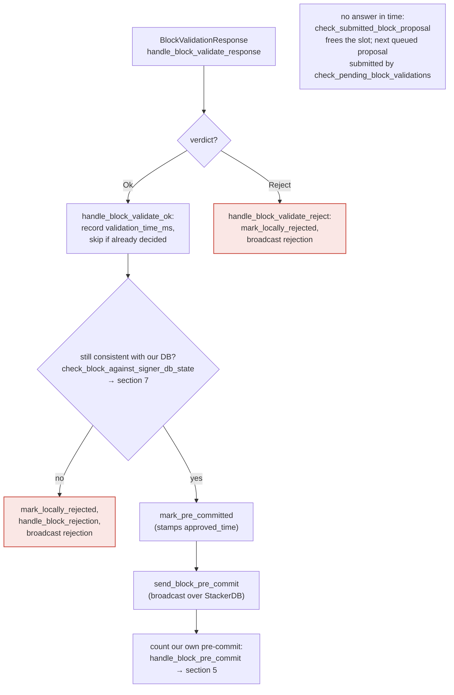

### Title
Height-only (not identity) check in `check_block_builds_on_highest_block_in_tenure` lets a miner anchor a tenure-start block to a non-canonical sibling, causing signers to sign a conflicting block - (File: stackslib/src/net/api/postblock_proposal.rs)

### Summary
`NakamotoBlockProposal::check_block_has_valid_parent` is the signer-facing "(For the signer)" guard invoked from `validate()` to convince a signer that a tenure-start block builds on the right predecessor. It delegates to `check_block_builds_on_highest_block_in_tenure`, which compares only block **heights**, not block **identity**, between the attacker-supplied `parent_block_id` and the tenure's `highest_header`. This lets a miner point a new tenure-start block's `parent_block_id` at any known header that merely ties the tenure's max height, including a non-canonical/rejected sibling block, and still pass this check.

### Finding Description
In `stackslib/src/net/api/postblock_proposal.rs`: [1](#0-0) 

`check_block_builds_on_highest_block_in_tenure` fetches `highest_header` (the tenure's max-height known header) and `parent_header` (looked up strictly by the attacker-controlled `parent_block_id`), and rejects only when:

```
if parent_header.anchored_header.height() != highest_header.anchored_header.height() {
```

There is no comparison of `parent_header`'s block hash/id against `highest_header`'s block hash/id — only their heights. This function is explicitly marked "DO NOT CALL FROM CONSENSUS CODE" and is used only from the signer-facing `check_block_has_valid_parent`, invoked in `validate()` right after `check_block_has_valid_tenure`, both annotated "(For the signer)": [2](#0-1) 

If the tenure's chainstate ever contains two distinct headers tied at the tenure's maximum height — e.g. a byzantine/faulty miner proposes two different tenure-final blocks at the same `chain_length` that the node independently validated and stored as known headers, or a competing branch that some signers locally/pre-committed but never globally accepted — a subsequent tenure-start proposal can set `parent_block_id` to either one. The height-only check accepts either, even the one that is not the actual canonical/highest-known block by identity.

Because this check is precisely what the signer relies on (per `docs/signer-flows.md` section 7, `check_block_has_valid_parent`/`check_block_has_valid_tenure` are the "(For the signer)" gates run inside `validate()` before the stacks-node returns `BlockValidateOk`), an `Ok` result here is what triggers the signer's `handle_block_validate_ok` → `mark_pre_committed` → `send_block_pre_commit` → (at 70% weight) `mark_locally_accepted`/signature path: [3](#0-2) 

The signer-side chainstate re-checks (`check_block_against_signer_db_state`, `get_signed_conflicts`, `conflict_still_blocks`) guard against signing two *different* blocks at the *same* height as each other, but they do not re-derive or verify that a tenure-start block's chosen parent is the identity-correct canonical predecessor within its own tenure — they only compare heights via `get_tenure_last_block_info`/`check_latest_block_in_tenure` in `stacks-signer/src/chainstate/mod.rs`: [4](#0-3) 

That function, too, is height-based (`block.header.chain_length <= info.block.header.chain_length` / `tip.height() < block.header.chain_length`), never checking that the new block's `parent_block_id` matches the specific `signer_signature_hash`/block-id of the block it should be extending. So neither the node-side signer-oriented pre-check nor the signer's own chainstate logic closes the gap: a tenure-start block can be pre-committed and signed while resting on an orphaned sibling rather than the true tip.

### Impact Explanation
This breaks the "approved-parent vs canonical" equality the rules call out: the signer's willingness-to-sign gate (`check_block_has_valid_parent`) can be satisfied by a parent block that is height-equal but not identity-equal to the tenure's actual highest/canonical block. A signer can therefore place its pre-commit/signature (`mark_locally_accepted`, `handle_block_signature`) over a tenure-start block anchored to a non-canonical predecessor — the "Critical" impact category of "a signer signing an invalid, non-canonical, or conflicting block."

### Likelihood Explanation
This requires only a single miner (the one-slot proposer for that tenure) to have previously caused two headers to tie at the tenure's max height — plausible in ordinary byzantine-miner or network-partition conditions where a miner proposes competing tenure-final blocks that different nodes/signers independently validate and store — and then to submit a follow-on tenure-start proposal whose `parent_block_id` selects the "wrong" (non-canonical) one. No signer private key, no majority collusion, and no StackerDB manipulation is needed; ordinary gossip of two competing proposals plus one more proposal from the same miner is sufficient to reach this code path.

### Recommendation
In `check_block_builds_on_highest_block_in_tenure`, replace the height-equality comparison with an identity comparison (compare `parent_header`'s block id/hash against `highest_header`'s block id/hash, or additionally verify that `parent_block_id == highest_header.index_block_hash()`), so a same-height-but-different-block parent is rejected. Correspondingly, harden `SortitionData::check_latest_block_in_tenure` / `get_tenure_last_block_info` in `stacks-signer/src/chainstate/mod.rs` to compare the proposal's `parent_block_id` against the tracked last-signed block's id, not merely `chain_length`, closing the same gap on the signer side.

### Proof of Concept
1. Miner M controls the current tenure and, due to a network partition or intentional equivocation, gets two different tenure-final blocks B1 and B2 both validated/stored by a node at the same `chain_length` H within tenure T (e.g., B1 reaches only local/pre-commit acceptance among some signers while B2 is the one that actually continues toward global acceptance elsewhere).
2. M starts tenure T' and proposes a tenure-start block whose `parent_block_id` = B1's block id (the non-canonical/orphaned one) rather than B2.
3. The node's `/v3/block_proposal` handler calls `NakamotoBlockProposal::validate` → `check_block_has_valid_parent` → `check_block_builds_on_highest_block_in_tenure(chainstate, sortdb, T, B1_id)`. Because `find_highest_known_block_header_in_tenure(T)` returns a header at height H (whichever of B1/B2 the query resolves to) and `B1`'s header height also equals H, the height-equality check at `stackslib/src/net/api/postblock_proposal.rs:435` passes even though `parent_header != highest_header` by identity.
4. Validation returns `BlockValidateOk`; the signer's `handle_block_validate_ok` re-checks only `check_block_against_signer_db_state` (height-based), finds no conflict, and proceeds to `mark_pre_committed`/broadcast pre-commit, ultimately reaching `mark_locally_accepted` and issuing a signature over the tenure-start block anchored to the non-canonical B1 once 70% weight pre-commits.

### Citations

**File:** stackslib/src/net/api/postblock_proposal.rs (L389-449)
```rust
    fn check_block_builds_on_highest_block_in_tenure(
        chainstate: &StacksChainState,
        sortdb: &SortitionDB,
        tenure_id: &ConsensusHash,
        parent_block_id: &StacksBlockId,
    ) -> Result<(), BlockValidateRejectReason> {
        let Some(highest_header) = NakamotoChainState::find_highest_known_block_header_in_tenure(
            chainstate, sortdb, tenure_id,
        )
        .map_err(|e| BlockValidateRejectReason {
            reason_code: ValidateRejectCode::ChainstateError,
            reason: format!("Failed to query highest block in tenure ID: {:?}", &e),
            failed_txid: None,
        })?
        else {
            warn!(
                "Rejected block proposal";
                "reason" => "Block is not a tenure-start block, and has an unrecognized tenure consensus hash",
                "consensus_hash" => %tenure_id,
            );
            return Err(BlockValidateRejectReason {
                reason_code: ValidateRejectCode::NoSuchTenure,
                reason: "Block is not a tenure-start block, and has an unrecognized tenure consensus hash".into(),
                failed_txid: None,
            });
        };
        let Some(parent_header) =
            NakamotoChainState::get_block_header(chainstate.db(), parent_block_id).map_err(
                |e| BlockValidateRejectReason {
                    reason_code: ValidateRejectCode::ChainstateError,
                    reason: format!("Failed to query block header by block ID: {:?}", &e),
                    failed_txid: None,
                },
            )?
        else {
            warn!(
                "Rejected block proposal";
                "reason" => "Block has no parent",
                "parent_block_id" => %parent_block_id
            );
            return Err(BlockValidateRejectReason {
                reason_code: ValidateRejectCode::UnknownParent,
                reason: "Block has no parent".into(),
                failed_txid: None,
            });
        };
        if parent_header.anchored_header.height() != highest_header.anchored_header.height() {
            warn!(
                "Rejected block proposal";
                "reason" => "Block's parent is not the highest block in this tenure",
                "consensus_hash" => %tenure_id,
                "parent_header.height" => parent_header.anchored_header.height(),
                "highest_header.height" => highest_header.anchored_header.height(),
            );
            return Err(BlockValidateRejectReason {
                reason_code: ValidateRejectCode::InvalidParentBlock,
                reason: "Block is not higher than the highest block in its tenure".into(),
                failed_txid: None,
            });
        }
        Ok(())
```

**File:** stackslib/src/net/api/postblock_proposal.rs (L600-606)
```rust
        // (For the signer)
        // Verify that the block's tenure is on the canonical sortition history
        Self::check_block_has_valid_tenure(&db_handle, &self.block.header.consensus_hash)?;

        // (For the signer)
        // Verify that this block's parent is the highest such block we can build off of
        Self::check_block_has_valid_parent(chainstate, sortdb, &self.block)?;
```

**File:** docs/signer-flows.md (L211-227)
```markdown


> Anchors: `handle_block_validate_response`, `handle_block_validate_ok`,
> `handle_block_validate_reject`, `check_block_against_signer_db_state`,
> `send_block_pre_commit` (signer.rs)
```

**File:** stacks-signer/src/chainstate/mod.rs (L376-420)
```rust
    pub fn check_latest_block_in_tenure(
        tenure_id: &ConsensusHash,
        block: &NakamotoBlock,
        signer_db: &mut SignerDb,
        client: &StacksClient,
        tenure_last_block_proposal_timeout: Duration,
        reorg_attempts_activity_timeout: Duration,
    ) -> Result<bool, ClientError> {
        let last_block_info = SortitionData::get_tenure_last_block_info(
            tenure_id,
            signer_db,
            tenure_last_block_proposal_timeout,
        )?;

        if let Some(info) = last_block_info {
            // N.B. this block might not be the last globally accepted block across the network;
            // it's just the highest one in this tenure that we know about.  If this given block is
            // no higher than it, then it's definitely no higher than the last globally accepted
            // block across the network, so we can do an early rejection here.
            if block.header.chain_length <= info.block.header.chain_length {
                warn!(
                    "Miner's block proposal does not confirm as many blocks as we expect";
                    "proposed_block_consensus_hash" => %block.header.consensus_hash,
                    "signer_signature_hash" => %block.header.signer_signature_hash(),
                    "proposed_chain_length" => block.header.chain_length,
                    "expected_at_least" => info.block.header.chain_length + 1,
                );
                if info.signed_group.is_none_or(|signed_time| {
                    signed_time + reorg_attempts_activity_timeout.as_secs() > get_epoch_time_secs()
                }) {
                    // Note if there is no signed_group time, this is a locally accepted block (i.e. tenure_last_block_proposal_timeout has not been exceeded).
                    // Treat any attempt to reorg a locally accepted block as valid miner activity.
                    // If the call returns a globally accepted block, check its globally accepted time against a quarter of the block_proposal_timeout
                    // to give the miner some extra buffer time to wait for its chain tip to advance
                    // The miner may just be slow, so count this invalid block proposal towards valid miner activity.
                    if let Err(e) = signer_db.update_last_activity_time(
                        &block.header.consensus_hash,
                        get_epoch_time_secs(),
                    ) {
                        warn!("Failed to update last activity time: {e}");
                    }
                }
                return Ok(false);
            }
        }
```
