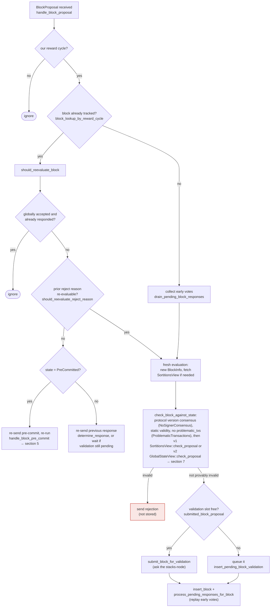

### Title
Stale rejection weight is never retracted when a signer later accepts the same block, letting node-side vote tallies double-count a signer's weight across mutually-exclusive accept/reject totals - (File: `stacks-node/src/nakamoto_node/stackerdb_listener.rs`)

### Summary
`StackerDBListener` tracks per-block consensus by summing `total_weight_approved` and `total_weight_rejected` as independent, monotonically-increasing counters keyed only by "have I already added this slot_id's weight to *this* counter". Nothing clears a signer's contribution to `total_weight_rejected` when that same signer later legitimately reconsiders and sends `BlockAccepted` for the identical `signer_signature_hash` (a flow the signer explicitly supports, per `should_reevaluate_reject_reason`/`should_reevaluate_block` in `stacks-signer/src/v0/signer.rs`). The result is that one signer's weight can be counted in both totals simultaneously, breaking the implicit invariant `total_weight_approved + total_weight_rejected <= total_weight` that the coordinator's threshold arithmetic in `stacks-node/src/nakamoto_node/signer_coordinator.rs` relies on.

### Finding Description
On the node side, `StackerDBListener`'s message loop (`stacks-node/src/nakamoto_node/stackerdb_listener.rs:385-591`) processes `BlockResponse` messages per block, keyed by `signer_signature_hash`, and maintains two weight counters, `total_weight_approved` and `total_weight_rejected`, plus a `responded_signers` set and a `gathered_signatures` map.

- On `BlockResponse::Rejected` (lines 486-591): weight is added to `total_weight_rejected` only if `block.responded_signers.insert(slot_id)` returns `true` (line 515), i.e. only the first time this slot is seen at all.
- On `BlockResponse::Accepted` (lines 386-484): weight is added to `total_weight_approved` if `!block.gathered_signatures.contains_key(&slot_id)` (line 443), and then `block.responded_signers.insert(slot_id)` is *also* called (line 465) unconditionally.

Because the "already counted" guards for the two branches are independent (`gathered_signatures` vs. a shared `responded_signers` set that is written by *both* branches but only *read* by the reject branch), the following sequence causes double counting:

1. Signer S (weight `w`) is the first to respond for block B and sends `BlockResponse::Rejected`. `responded_signers.insert(slot_id)` succeeds ⇒ `total_weight_rejected += w`.
2. S later re-evaluates the same block B (e.g., after `should_reevaluate_reject_reason` in `stacks-signer/src/v0/signer.rs` decides the earlier rejection reason - such as `ConnectivityIssues` or a transient `SortitionViewMismatch` - is no longer applicable) and legitimately signs and broadcasts `BlockResponse::Accepted` for the *same* `signer_signature_hash`.
3. The node's Accepted branch checks only `gathered_signatures.contains_key(&slot_id)`, which is still empty for S, so it adds `w` to `total_weight_approved` as well.
4. `total_weight_rejected` is never decremented. S's weight `w` is now counted in **both** totals for the same block.

This is a genuine analog of the Traefik bug class in spirit (state meant for one context leaking/persisting into another context it should not influence): a value ("this signer's weight") that should be attributable to exactly one of two mutually exclusive outcomes is retained in the "wrong" bucket after the signer's decision changed, corrupting the aggregate used for consensus decisions - i.e., an "aggregated-weight vs verified-accepts" equality break as called out in the rules.

### Impact Explanation
`signer_coordinator.rs::wait_for_signer_signatures` (or its equivalent polling loop, `stacks-node/src/nakamoto_node/signer_coordinator.rs:509-562`) decides the outcome purely from these two node-tracked counters:
- `total_weight_rejected + weight_threshold > total_weight` ⇒ treat block as rejected (`NakamotoNodeError::SignersRejected`).
- `total_weight_approved >= weight_threshold` ⇒ treat block as accepted and push the gathered signatures.

Because `total_weight_rejected` is never retracted once a signer switches to accept, stale rejection weight from signers who have since legitimately signed the block can linger and combine with weight from other, still-genuinely-rejecting signers to spuriously cross the `>30%` rejection threshold, causing the node to abandon and resubmit (or treat as invalid) a block that in reality has, or would have, sufficient distinct support. This is a liveness/wedge problem on the block-production path: valid blocks can be spuriously treated as globally rejected due to double-counted/stale weight, stalling tenure progress until a new proposal round. It does not require a majority of signers to collude - it only requires ordinary vote reconsideration by one or a few signers together with normal transient conditions (slow burn-block catch-up, momentarily-mismatched sortition view) that the signer protocol is explicitly designed to tolerate and recover from.

It does not, by itself, cause an invalid/non-canonical block to be *signed* (accept-side double counting could in principle also inflate `total_weight_approved`, but note that path requires `gathered_signatures` to not already contain the slot, so it only occurs once per Accepted message and is bounded by real signatures actually collected - the primary and clearly demonstrable break is the *stale reject weight never being cleared*, which is a availability/liveness concern rather than a block-validity break).

### Likelihood Explanation
Likelihood is moderate: it requires (a) a signer to reject a proposal for a reason that its own logic considers re-evaluable (the signer flow document explicitly enumerates such reasons and a `should_reevaluate_reject_reason` gate exists precisely to allow this), and (b) that signer to subsequently accept the very same block hash. This is a supported, documented behavior of the v0 signer (not an edge case reachable only via memory corruption or malicious keys), so it can occur during ordinary operation whenever a signer's local chain/sortition view catches up mid-vote - conditions a miner can encourage by proposing at the edge of validity (e.g., right as a sortition/tenure boundary is settling) to make some signers reject-then-recover.

### Recommendation
On the node side (`stacks-node/src/nakamoto_node/stackerdb_listener.rs`), make `total_weight_approved` and `total_weight_rejected` mutually exclusive per slot: track a single "current side" per `slot_id` (e.g. an enum `Accepted`/`Rejected` in a `HashMap<slot_id, Vote>`) and, when a slot's vote changes side, subtract the weight from the old total before adding it to the new one, rather than gating solely on "have I ever seen this slot before" via two independently-checked structures (`gathered_signatures` and `responded_signers`). Add a regression test that has a signer send `Rejected` then `Accepted` for the same `signer_signature_hash` and asserts `total_weight_rejected` reflects the retraction.

### Proof of Concept
Conceptual reproduction (unit/integration test against `StackerDBListener`):
1. Configure `N` signers with weights such that `total_weight_rejected` from other genuinely-rejecting signers is just below the rejection threshold.
2. Have signer S send `SignerMessageV0::BlockResponse(BlockResponse::Rejected(...))` for block B's `signer_signature_hash`; assert `total_weight_rejected` includes S's weight.
3. Have the same signer S then send `SignerMessageV0::BlockResponse(BlockResponse::Accepted(...))` for the identical `signer_signature_hash`.
4. Observe `total_weight_approved` now also includes S's weight, while `total_weight_rejected` is unchanged (still includes S's weight) - i.e. `total_weight_approved + total_weight_rejected > total_weight` for this block, demonstrating the double count / stale retention that can push either threshold check in `signer_coordinator.rs` past its bound using overlapping weight. [1](#0-0) [2](#0-1) [3](#0-2) [4](#0-3)

### Citations

**File:** stacks-node/src/nakamoto_node/stackerdb_listener.rs (L443-465)
```rust
                        if !block.gathered_signatures.contains_key(&slot_id) {
                            block.total_weight_approved = block
                                .total_weight_approved
                                .saturating_add(signer_entry.weight);

                            info!("StackerDBListener: Signature Added to block";
                                "signer_signature_hash" => %block_sighash,
                                "signer_pubkey" => signer_pubkey.to_hex(),
                                "signer_slot_id" => slot_id,
                                "signature" => %signature,
                                "signer_weight" => signer_entry.weight,
                                "total_weight_approved" => block.total_weight_approved,
                                "percent_approved" => block.total_weight_approved as f64 / self.total_weight as f64 * 100.0,
                                "total_weight_rejected" => block.total_weight_rejected,
                                "percent_rejected" => block.total_weight_rejected as f64 / self.total_weight as f64 * 100.0,
                                "weight_threshold" => self.weight_threshold,
                                "tenure_extend_timestamp" => tenure_extend_timestamp,
                                "read_count_extend_timestamp" => read_count_extend_timestamp,
                                "server_version" => metadata.server_version,
                            );
                        }
                        block.gathered_signatures.insert(slot_id, signature);
                        block.responded_signers.insert(slot_id);
```

**File:** stacks-node/src/nakamoto_node/stackerdb_listener.rs (L486-518)
```rust
                    SignerMessageV0::BlockResponse(BlockResponse::Rejected(rejected_data)) => {
                        let (lock, cvar) = &*self.blocks;
                        let mut blocks = lock.lock().expect("FATAL: failed to lock block status");

                        let Some(block) = blocks.get_mut(&rejected_data.signer_signature_hash)
                        else {
                            info!(
                                "StackerDBListener: Received rejection for block that we did not request. Ignoring.";
                                "signer_signature_hash" => %rejected_data.signer_signature_hash,
                                "slot_id" => slot_id,
                                "signer_set" => self.signer_set,
                            );
                            continue;
                        };

                        let rejected_pubkey = match rejected_data.recover_public_key() {
                            Ok(rejected_pubkey) => {
                                if rejected_pubkey != signer_pubkey {
                                    warn!("StackerDBListener: Recovered public key from rejected data does not match signer's public key. Ignoring.");
                                    continue;
                                }
                                rejected_pubkey
                            }
                            Err(e) => {
                                warn!("StackerDBListener: Failed to recover public key from rejected data: {e:?}. Ignoring.");
                                continue;
                            }
                        };

                        if block.responded_signers.insert(slot_id) {
                            block.total_weight_rejected = block
                                .total_weight_rejected
                                .saturating_add(signer_entry.weight);
```

**File:** stacks-node/src/nakamoto_node/signer_coordinator.rs (L487-520)
```rust
            if rejections != block_status.total_weight_rejected {
                rejections = block_status.total_weight_rejected;
                let (rejections_step, new_rejections_timeout) = self
                    .block_rejection_timeout_steps
                    .range((Included(0), Included(rejections)))
                    .last()
                    .ok_or_else(|| {
                        NakamotoNodeError::SigningCoordinatorFailure(
                            "Invalid rejection timeout step function definition".into(),
                        )
                    })?;
                rejections_timeout = new_rejections_timeout;
                info!("Number of received rejections updated, resetting timeout";
                                    "rejections" => rejections,
                                    "rejections_timeout" => rejections_timeout.as_secs(),
                                    "rejections_step" => rejections_step,
                                    "rejections_threshold" => self.total_weight.saturating_sub(self.weight_threshold));

                counters.set_miner_current_rejections_timeout_secs(rejections_timeout.as_secs());
                counters.set_miner_current_rejections(rejections);
            }

            if block_status
                .total_weight_rejected
                .saturating_add(self.weight_threshold)
                > self.total_weight
            {
                info!(
                    "{}/{} signer weight votes to reject block",
                    block_status.total_weight_rejected, self.total_weight;
                    "signer_signature_hash" => %block_signer_sighash,
                );
                counters.bump_naka_rejected_blocks();

```

**File:** docs/signer-flows.md (L164-203)
```markdown
## 3. A block proposal arrives

The miner broadcasts a proposal. If we've seen this exact block before,
`should_reevaluate_block` decides whether the old verdict stands; a block we
only pre-committed to is deliberately routed back through the pre-commit
evaluation so a re-proposal cannot shortcut to a signature. A fresh proposal is
checked against our view of the world _before_ spending a node validation on it.



Early votes: acceptances, rejections, and pre-commits that arrived before the
proposal itself are parked in pending tables and replayed once the proposal is
known.

> Anchors: `handle_block_proposal`, `should_reevaluate_block`,
> `should_reevaluate_reject_reason`, `check_block_against_state`,
> `submit_block_for_validation`, `process_pending_responses_for_block`
> (signer.rs); `check_proposal` (chainstate/v1.rs, v2.rs)
```
