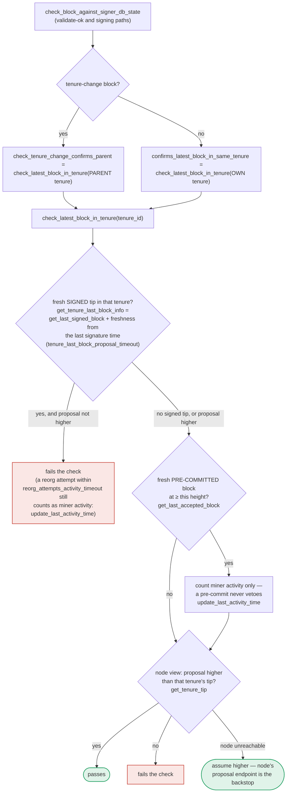

### Title
Fail-open fallback in `check_latest_block_in_tenure` lets a signer approve/sign a non-canonical block when the node RPC is congested - ([File: stacks-signer/src/chainstate/mod.rs])

### Summary
The external report's bug class is: under network congestion, a safety check that depends on timely counterparty/oracle data degrades to "no data available," and the protocol's fallback behavior in that degraded state is permissive rather than restrictive, letting a bad outcome (a too-cheap winning bid) go through unchallenged. The reachable analog in this repo is `SortitionData::check_latest_block_in_tenure` in `stacks-signer/src/chainstate/mod.rs`, which fails **open** (returns `Ok(true)`, i.e. "the proposal passes the check") whenever the node's `get_tenure_tip` RPC call errors out, instead of failing closed.

### Finding Description
`check_latest_block_in_tenure` is the shared routine that answers "does this proposed block confirm at least as much of the tenure as the node's canonical view?" for both the same-tenure case (`confirms_latest_block_in_same_tenure`) and the tenure-change parent case (`check_tenure_change_confirms_parent`). These two entry points feed `check_block_against_signer_db_state`, which — per `docs/signer-flows.md` section 7 — is invoked at proposal arrival, at validate-ok, and again at the moment of signing. [1](#0-0) 

When `client.get_tenure_tip(tenure_id)` fails, the code logs a warning and unconditionally returns `Ok(true)`:
```
Err(e) => {
    warn!("Failed to fetch the tenure tip for the parent tenure: {e:?}. Assuming proposal is higher than the parent tenure for now.");
    return Ok(true);
}
``` [2](#0-1) 
The comment justifies this as "safe" because the block will ultimately still go through the node's own proposal-validation endpoint. That justification only holds for the **proposal-arrival** call site. `docs/signer-flows.md` itself documents that the same helper is re-used at the **signing** step, where there is no subsequent node-side gate protecting against this specific tip-height comparison: [3](#0-2) 

This is structurally the same failure mode as the auction bug: a check that is supposed to require a "counterparty" (here, the node's authoritative view of the tenure tip) to validate an assertion instead defaults to accepting the assertion when that counterparty data cannot be obtained — which is exactly the condition network congestion or a transient node RPC hiccup produces. An adversarial or merely poorly-timed miner could propose a block that does not actually confirm enough of the tenure, and if enough signers experience an RPC failure/timeout to their local node at that moment (congestion, node under load, etc.), the check silently passes for all of them, rather than blocking.

### Impact Explanation
If exploited at the signing-time call path (not just the pre-node-validation proposal path), this allows the state-machine equality "signed block == validated/canonical block" to break: signers could co-sign a block that does not correctly confirm the highest known tenure tip, because the confirming check assumed pass-through instead of blocking on the RPC failure. This matches the report's "Critical — a signer signing an invalid/non-canonical/conflicting block" impact bucket, since the fail-open behavior removes the intended veto precisely during the failure condition (congestion/RPC unavailability) that the check exists to guard against.

### Likelihood Explanation
Requires only a single-node RPC hiccup (timeout, congestion, temporary unavailability) coincident with a miner's proposal — no majority collusion or key compromise needed, consistent with the "one slot miner + gossip" trigger constraint. RPC calls to a local node failing under load/congestion is a realistic condition, and the code path explicitly anticipates and handles the "node unreachable" case by choosing the permissive branch.

### Recommendation
- Change the error branch in `check_latest_block_in_tenure` (stacks-signer/src/chainstate/mod.rs) to fail closed (return `Ok(false)` or propagate the error) at least for the call sites reached during the signing decision, not just proposal arrival.
- Alternatively, split the helper so the "proposal arrival, gated by node-side validation" caller can keep the permissive fallback, while the signing-time caller enforces a strict/closed fallback, since no further authoritative check exists downstream of signing.
- Add regression tests that simulate a `get_tenure_tip` RPC failure exactly at the signing step and assert that the signer does not produce a signature in that scenario.

### Proof of Concept
1. A signer's local `stacks-node` experiences a transient RPC failure/timeout (simulable via network congestion or an injected fault) precisely when `check_latest_block_in_tenure` is invoked from the signing-time call path (via `confirms_latest_block_in_same_tenure` / `check_tenure_change_confirms_parent` → `check_block_against_signer_db_state`).
2. `client.get_tenure_tip(tenure_id)` returns `Err`, and the function returns `Ok(true)` unconditionally (stacks-signer/src/chainstate/mod.rs:450-461), bypassing the "does this block confirm enough of the tenure" check.
3. If enough signers hit this condition simultaneously (plausible under real congestion, matching the auction report's threat model), a block that does not actually build on the correct/highest tenure tip can collect enough valid signatures to cross the aggregation threshold, without the intended veto ever firing.

Note: I was not able to fully trace, within the available index, whether every current call site of `confirms_latest_block_in_same_tenure`/`check_tenure_change_confirms_parent` at signing time has an additional independent guard that would catch this case (e.g., `conflict_still_blocks` in `stacks-signer/src/v0/signer.rs`, mentioned in the docs but not fully read). The `docs/signer-flows.md` text explicitly states the conflict-guard is a "silent backstop for what the [chainstate] re-check cannot see," which suggests it does not universally cover this exact RPC-failure fail-open branch, but I could not verify this by directly reading `conflict_still_blocks`'s implementation before running out of iterations. A Devin session with full file access would be needed to close this gap definitively.

### Citations

**File:** stacks-signer/src/chainstate/mod.rs (L366-374)
```rust
    /// Check whether or not `block` is higher than the highest block in `tenure_id`.
    ///  returns `Ok(true)` if `block` is higher, `Ok(false)` if not.
    ///
    /// If we can't look up `tenure_id`, assume `block` is higher.
    /// This assumption is safe because this proposal ultimately must be passed
    /// to the `stacks-node` for proposal processing: so, if we pass the block
    /// height check here, we are relying on the `stacks-node` proposal endpoint
    /// to do the validation on the chainstate data that it has.
    ///
```

**File:** stacks-signer/src/chainstate/mod.rs (L450-461)
```rust
        let tip = match client.get_tenure_tip(tenure_id) {
            Ok(tip) => tip.anchored_header,
            Err(e) => {
                warn!(
                    "Failed to fetch the tenure tip for the parent tenure: {e:?}. Assuming proposal is higher than the parent tenure for now.";
                    "proposed_block_consensus_hash" => %block.header.consensus_hash,
                    "signer_signature_hash" => %block.header.signer_signature_hash(),
                    "parent_tenure" => %tenure_id,
                );
                return Ok(true);
            }
        };
```

**File:** docs/signer-flows.md (L389-418)
```markdown
## 7. The chainstate checks (shared)

`check_latest_block_in_tenure` answers "does this block confirm the tip we
expect?" and it runs in three places: at proposal arrival (inside
`check_proposal`), at validate-ok, and at the moment of signing. _Which_ tenure
it is asked about depends on the block: a tenure-change block is checked against
its **parent** tenure, every other block against its **own**. Never both. The
pivotal helper is `get_tenure_last_block_info`, which considers only blocks that
carry a signature (`get_last_signed_block`): a pre-commit never vetoes anything,
it only counts as miner activity.


```
