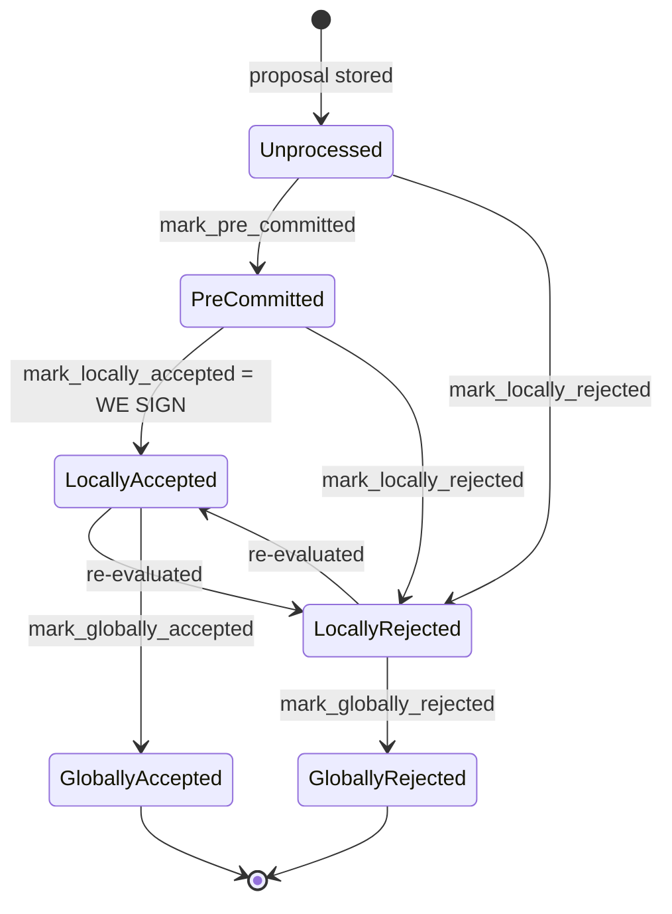

### Title
Stale rejection weight is never retracted when a signer later accepts, causing spurious "signers rejected" for a valid block - (File: stacks-node/src/nakamoto_node/stackerdb_listener.rs)

### Summary
The `StackerDBListener`'s per-block vote tally (`BlockStatus`) accumulates `total_weight_approved` and `total_weight_rejected` independently, guarded by two different fields (`gathered_signatures` vs `responded_signers`). When a signer rejects a block and later re-evaluates and accepts the same block (a normal, documented transition in the signer state machine), its weight remains counted in `total_weight_rejected` forever, while also being added to `total_weight_approved`. This breaks the aggregated-weight-vs-verified-position equality the coordinator relies on to decide between "block accepted" and "block rejected."

### Finding Description
`BlockStatus` tracks two independent tallies per block: [1](#0-0) 

When an `Accepted` response arrives, the weight is only added if the slot is not already present in `gathered_signatures`: [2](#0-1) 

Nothing here checks or clears any prior entry the same slot may have contributed to `total_weight_rejected`.

When a `Rejected` response arrives, the weight is only added if the slot is not already present in `responded_signers` (a set shared with the accept path, since `responded_signers.insert(slot_id)` is also called on acceptance): [3](#0-2) 

This makes the guard asymmetric:
- Accept → later Reject: `responded_signers` already contains the slot (set during the earlier Accept), so the later Reject's weight is correctly **not** added to `total_weight_rejected`. Safe.
- Reject → later Accept: the Accept path only checks `gathered_signatures` (which is empty before any acceptance), so the Accept's weight is added to `total_weight_approved` — **while the earlier Reject's weight is never removed from `total_weight_rejected`.** The same signer's weight is now double-booked across both tallies.

This is a direct structural analog to the `CRV` bug: in the original report, a value (`claimed`) was only updated in the fallback code path and silently skipped on the primary/success path, causing funds to be miscounted and stuck. Here, the retraction/adjustment logic exists only in one direction (Accept-then-Reject) and is silently absent in the other (Reject-then-Accept), causing weight to be miscounted and "stuck" in the stale tally.

A signer switching from reject to accept for the same block is not an edge case requiring Byzantine behavior — it is an explicit, intended transition in the signer's local state machine (`LocallyRejected -> LocallyAccepted : re-evaluated`), documented as occurring when `should_reevaluate_reject_reason` determines the earlier rejection reason no longer applies (e.g., the block is re-proposed by the miner, or the chainstate view that caused the rejection changes). A miner (or gossip relay) can trigger this by re-proposing the same block (or causing a reject-then-accept flip through routine timing), which is squarely within the "one-slot miner plus gossip" trigger class. [4](#0-3) 

### Impact Explanation
Once a signer's weight is retained in `total_weight_rejected` despite that signer having since accepted the block, `signer_coordinator.rs`'s rejection check can fire on stale data: [5](#0-4) 

The coordinator can conclude `total_weight_rejected + weight_threshold > total_weight` (returning `NakamotoNodeError::SignersRejected`, which excludes transactions and aborts the block) using rejection weight that no longer reflects any signer's current position — the signer who originally rejected now supports the block. This is a liveness degradation: a legitimately signable, valid block can be prematurely and permanently treated as globally rejected by the mining coordinator, purely due to stale bookkeeping, without any signer's current vote actually reaching the 30% blocking-minority threshold. This falls under the "signer wedged into never signing valid blocks" / stale-threshold class of High-impact findings, manifesting here as the coordinator acting on a stale, uncorrected aggregate rather than the verified, current set of accepts/rejects.

### Likelihood Explanation
Reachable with a single signer flipping its stored response from Reject to Accept for the same block hash, which is a normal path in the signer's own re-evaluation logic (`should_reevaluate_reject_reason`, `LocallyRejected -> LocallyAccepted`) and can be induced by ordinary miner re-proposal/timing rather than a majority or malicious secret. No cryptographic material beyond what the signer already legitimately controls is needed.

### Recommendation
When processing an `Accepted` response, check whether the slot is present in `responded_signers` as a rejector (or track reject/accept status per slot explicitly) and, if so, retract the previously counted weight from `total_weight_rejected` before/while adding it to `total_weight_approved` — mirroring the symmetric protection already present in the reverse (Accept-before-Reject) direction. Alternatively, replace the two independent counters with a single per-slot "latest verdict" map and recompute `total_weight_approved`/`total_weight_rejected` from that map on each update, guaranteeing a signer's weight is attributed to exactly one side at any time.

### Proof of Concept
1. Node/coordinator opens a `BlockStatus` for a proposed block; signer `S` (weight `w`) sends `BlockResponse::Rejected` for it. `stackerdb_listener.rs` records: `responded_signers = {S}`, `total_weight_rejected = w`.
2. The miner re-proposes the same block (or `S`'s local rejection condition becomes stale, e.g., the reorg condition it rejected for is no longer active — a normal `should_reevaluate_reject_reason` outcome). `S` re-evaluates and now signs, broadcasting `BlockResponse::Accepted`.
3. `stackerdb_listener.rs` processes the `Accepted` message: since `S`'s slot is absent from `gathered_signatures`, `total_weight_approved` is incremented by `w`, `gathered_signatures[S] = signature`, `responded_signers` already contains `S` (no-op).
4. Now `total_weight_rejected` still equals `w` from step 1 (never decremented) *and* `total_weight_approved` equals `w` from step 3 — `S`'s weight is counted on both sides simultaneously.
5. If enough other signers are near the rejection boundary, `signer_coordinator.rs`'s check `total_weight_rejected.saturating_add(self.weight_threshold) > self.total_weight` can trip using this stale weight from `S`, causing `SignersRejected` to be returned even though `S` (and possibly enough others) currently support the block — the block that could have reached the acceptance threshold is discarded instead.

### Citations

**File:** stacks-node/src/nakamoto_node/stackerdb_listener.rs (L70-82)
```rust
#[derive(Debug, Clone)]
pub struct BlockStatus {
    /// Set of the slot ids of signers who have responded
    pub responded_signers: HashSet<u32>,
    /// Map of the slot id of signers who have signed the block and their signature
    pub gathered_signatures: BTreeMap<u32, MessageSignature>,
    /// Total weight of signers who have signed the block
    pub total_weight_approved: u32,
    /// Total weight of signers who have rejected the block
    pub total_weight_rejected: u32,
    /// Per-txid rejection tracking from signers
    pub failed_txids: HashMap<Txid, FailedTxInfo>,
}
```

**File:** stacks-node/src/nakamoto_node/stackerdb_listener.rs (L443-465)
```rust
                        if !block.gathered_signatures.contains_key(&slot_id) {
                            block.total_weight_approved = block
                                .total_weight_approved
                                .saturating_add(signer_entry.weight);

                            info!("StackerDBListener: Signature Added to block";
                                "signer_signature_hash" => %block_sighash,
                                "signer_pubkey" => signer_pubkey.to_hex(),
                                "signer_slot_id" => slot_id,
                                "signature" => %signature,
                                "signer_weight" => signer_entry.weight,
                                "total_weight_approved" => block.total_weight_approved,
                                "percent_approved" => block.total_weight_approved as f64 / self.total_weight as f64 * 100.0,
                                "total_weight_rejected" => block.total_weight_rejected,
                                "percent_rejected" => block.total_weight_rejected as f64 / self.total_weight as f64 * 100.0,
                                "weight_threshold" => self.weight_threshold,
                                "tenure_extend_timestamp" => tenure_extend_timestamp,
                                "read_count_extend_timestamp" => read_count_extend_timestamp,
                                "server_version" => metadata.server_version,
                            );
                        }
                        block.gathered_signatures.insert(slot_id, signature);
                        block.responded_signers.insert(slot_id);
```

**File:** stacks-node/src/nakamoto_node/stackerdb_listener.rs (L515-519)
```rust
                        if block.responded_signers.insert(slot_id) {
                            block.total_weight_rejected = block
                                .total_weight_rejected
                                .saturating_add(signer_entry.weight);

```

**File:** docs/signer-flows.md (L130-150)
```markdown
## 2. Block lifecycle (`BlockState`)

Every proposal tracked in the signer DB carries a `BlockState`. **`PreCommitted`
carries no signature**: it means "validated, willing to sign if the pre-commit
threshold is met." The first signature appears at `mark_locally_accepted`.
Global states are terminal against each other.


```

**File:** stacks-node/src/nakamoto_node/signer_coordinator.rs (L509-540)
```rust
            if block_status
                .total_weight_rejected
                .saturating_add(self.weight_threshold)
                > self.total_weight
            {
                info!(
                    "{}/{} signer weight votes to reject block",
                    block_status.total_weight_rejected, self.total_weight;
                    "signer_signature_hash" => %block_signer_sighash,
                );
                counters.bump_naka_rejected_blocks();

                // Only act on failed txids that a blocking minority (>30% weight) agrees on
                let blocking_minority = self.total_weight.saturating_sub(self.weight_threshold);
                let mut temporarily_excluded_txids = HashSet::new();
                let mut permanently_excluded_txids = HashSet::new();
                for (txid, info) in &block_status.failed_txids {
                    if info.total_weight > blocking_minority {
                        // Do not perma ban txids that only a small minority of signers reported as problematic
                        // But make sure its removed from the next block proposal
                        if info.problematic_weight > blocking_minority {
                            permanently_excluded_txids.insert(txid.clone());
                        } else {
                            temporarily_excluded_txids.insert(txid.clone());
                        }
                    }
                }

                return Err(NakamotoNodeError::SignersRejected {
                    temporarily_excluded_txids,
                    permanently_excluded_txids,
                });
```
