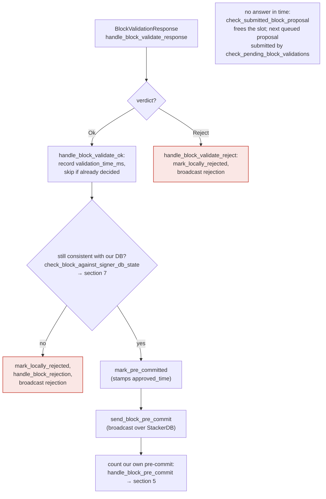

### Title
Height-only equality check in `check_block_builds_on_highest_block_in_tenure` lets a proposal build on a non-canonical sibling parent - (File: `stackslib/src/net/api/postblock_proposal.rs`)

### Summary
The Apache Airflow bug is a case where a security check meant to compare a *specific, trusted identity* (the safe redirect target) was actually implemented as a weaker, easily-satisfied proxy comparison, letting a crafted value pass the check while violating its real intent. The stacks-node analog is `check_block_builds_on_highest_block_in_tenure`, which is supposed to verify that a proposed block's parent *is* the highest block in its tenure, but actually only compares block **heights**, not block identity (hash/`block_id`). A miner can therefore point `parent_block_id` at any block that merely shares the same height as the tenure's true highest block, and the check passes even though the parent is not that block.

### Finding Description
`check_block_builds_on_highest_block_in_tenure` looks up the tenure's true highest header via `NakamotoChainState::find_highest_known_block_header_in_tenure` and then asserts only: [1](#0-0) 

```rust
if parent_header.anchored_header.height() != highest_header.anchored_header.height() {
    ... // reject
}
Ok(())
```

There is no comparison of `parent_header`'s block hash/`block_id` against `highest_header`'s block hash/`block_id`. The function's own doc comment states the intended guarantee is "its parent must be as high as the highest block in the given tenure" and is invoked (for both tenure-start blocks against the parent tenure, and normal blocks against their own tenure) from `check_block_has_valid_parent`: [2](#0-1)  — comments explicitly frame this as the check that guarantees "the parent must be as high as the highest block in the tenure," i.e., an *identity* claim, but the code only enforces a *height* claim.

This check is called from `validate()`, the function backing the `/v3/block_proposal` endpoint that signers rely on: [3](#0-2) . On the signer side, an `Ok` result here (`handle_block_validate_ok`) is treated as the node's authoritative confirmation that the block is well-formed and confirms the correct parent, after which the signer only re-runs its own DB-state check (`check_block_against_signer_db_state`) before pre-committing and eventually signing, per the documented flow: [4](#0-3) .

Because within a tenure it is possible — as the signer's own regression tests acknowledge — for two different blocks to end up signed at the same height in the same tenure during timing windows (`signer_refuses_to_sign_second_sibling_tenure_start`, `stale_sibling_replaced_when_canonical_tip_below`): [5](#0-4) , the node's `nakamoto_block_headers` table can legitimately contain two headers at the same height for one tenure consensus hash. `find_highest_known_block_header_in_tenure` picks one canonical winner via `get_highest_canonical_block_header_from_candidates`: [6](#0-5) , but `check_block_builds_on_highest_block_in_tenure` then throws away that identity information and re-derives "highest" purely from height, so a proposal whose `parent_block_id` names the *other* (non-canonical/orphaned) sibling at that same height will still pass.

### Impact Explanation
This breaks the "approved-parent vs canonical" equality the rules describe as Critical: a single miner can craft a `parent_block_id` referencing a non-canonical sibling block that happens to share the tenure's highest height, causing the node's `/v3/block_proposal` validation to return `Ok`. Signers trust that `Ok` as confirmation the block "confirms the expected parent" and proceed to pre-commit/sign it (`handle_block_validate_ok` → `check_block_against_signer_db_state` → `mark_pre_committed` → sign at threshold), per [4](#0-3) . This can result in a signer placing a signature on a block that does not actually build on the tenure's canonical tip — a signer signing a conflicting/non-canonical block.

### Likelihood Explanation
Exploitation requires only the tenure's current single miner and does not require signer collusion or a majority. It does require that a within-tenure same-height sibling situation exists (a fork/race at the block-validation layer), which is an acknowledged, tested scenario in the signer's own test suite rather than a purely theoretical edge case. The window is narrow (it depends on a race/timeout condition producing two stored headers at the same height for one tenure), which keeps likelihood moderate rather than trivial, but the root-cause code defect (height-only comparison instead of identity comparison) is unconditional and present on every call.

### Recommendation
In `check_block_builds_on_highest_block_in_tenure`, compare `parent_header`'s block identity (e.g., `block_id()`/`index_block_hash`) to `highest_header`'s identity, not merely `.height()`, before accepting the proposal. Reject when the parent is not exactly the canonical highest block, even if it happens to share the same height.

### Proof of Concept
1. Induce a within-tenure timing race so the node stores two Nakamoto block headers at the same `chain_length` for the same tenure `consensus_hash` (e.g., the sibling scenario already exercised by `run_sibling_scenario`/`stale_sibling_replaced_when_canonical_tip_below`): [7](#0-6) .
2. As the tenure's miner, propose a new block whose `parent_block_id` points to the *non-canonical* sibling (same height, different hash) rather than the one `find_highest_known_block_header_in_tenure` would select as canonical.
3. Submit via `/v3/block_proposal`; `check_block_builds_on_highest_block_in_tenure` only compares `parent_header.anchored_header.height() != highest_header.anchored_header.height()` [1](#0-0) , which is satisfied, so `validate()` returns `Ok`.
4. Signers receive `BlockValidateOk`, run only their local DB-state re-check, and proceed to pre-commit/sign the block even though it did not build on the true canonical parent.

Note: I was unable to fully trace whether a later, independent chainstate-append-time check (outside `postblock_proposal.rs`) would additionally catch this discrepancy before the block is durably appended; that would need to be confirmed in a live/Devin session with full repository access to `stackslib/src/chainstate/nakamoto/mod.rs`'s block-append path.

### Citations

**File:** stackslib/src/net/api/postblock_proposal.rs (L435-448)
```rust
        if parent_header.anchored_header.height() != highest_header.anchored_header.height() {
            warn!(
                "Rejected block proposal";
                "reason" => "Block's parent is not the highest block in this tenure",
                "consensus_hash" => %tenure_id,
                "parent_header.height" => parent_header.anchored_header.height(),
                "highest_header.height" => highest_header.anchored_header.height(),
            );
            return Err(BlockValidateRejectReason {
                reason_code: ValidateRejectCode::InvalidParentBlock,
                reason: "Block is not higher than the highest block in its tenure".into(),
                failed_txid: None,
            });
        }
```

**File:** stackslib/src/net/api/postblock_proposal.rs (L474-524)
```rust
    /// Verify that the block we received builds on the highest block in its tenure.
    /// * For tenure-start blocks, the parent must be as high as the highest block in the parent
    ///   block's tenure.
    /// * For all other blocks, the parent must be as high as the highest block in the tenure.
    ///
    /// Implemented as a static function to facilitate testing
    pub(crate) fn check_block_has_valid_parent(
        chainstate: &StacksChainState,
        sortdb: &SortitionDB,
        block: &NakamotoBlock,
    ) -> Result<(), BlockValidateRejectReason> {
        let is_tenure_start =
            block
                .is_wellformed_tenure_start_block()
                .map_err(|_| BlockValidateRejectReason {
                    reason_code: ValidateRejectCode::InvalidBlock,
                    reason: "Block is not well-formed".into(),
                    failed_txid: None,
                })?;

        if !is_tenure_start {
            // this is a well-formed block that is not the start of a tenure, so it must build
            // atop an existing block in its tenure.
            Self::check_block_builds_on_highest_block_in_tenure(
                chainstate,
                sortdb,
                &block.header.consensus_hash,
                &block.header.parent_block_id,
            )?;
        } else {
            // this is a tenure-start block, so it must build atop a parent which has the
            // highest height in the *previous* tenure.
            let parent_header = NakamotoChainState::get_block_header(
                chainstate.db(),
                &block.header.parent_block_id,
            )?
            .ok_or_else(|| BlockValidateRejectReason {
                reason_code: ValidateRejectCode::UnknownParent,
                reason: "No parent block".into(),
                failed_txid: None,
            })?;

            Self::check_block_builds_on_highest_block_in_tenure(
                chainstate,
                sortdb,
                &parent_header.consensus_hash,
                &block.header.parent_block_id,
            )?;
        }
        Ok(())
    }
```

**File:** stackslib/src/net/api/postblock_proposal.rs (L600-606)
```rust
        // (For the signer)
        // Verify that the block's tenure is on the canonical sortition history
        Self::check_block_has_valid_tenure(&db_handle, &self.block.header.consensus_hash)?;

        // (For the signer)
        // Verify that this block's parent is the highest such block we can build off of
        Self::check_block_has_valid_parent(chainstate, sortdb, &self.block)?;
```

**File:** docs/signer-flows.md (L205-227)
```markdown
## 4. The node's validation verdict

The stacks-node answers the `/v3/block_proposal` submission. On OK, the signer
re-checks its own DB state and only then advertises willingness to sign by
broadcasting a **pre-commit**. A signature is _not_ produced here.



> Anchors: `handle_block_validate_response`, `handle_block_validate_ok`,
> `handle_block_validate_reject`, `check_block_against_signer_db_state`,
> `send_block_pre_commit` (signer.rs)
```

**File:** stacks-signer/src/v0/tests.rs (L591-678)
```rust
    /// Drive the sibling race: two conflicting tenure-start blocks A and B are both tracked
    /// (as they would be after screening two proposals within the async-validation window),
    /// A's validation returns first and is signed, then B's validation returns. Returns the
    /// resulting `BlockInfo` for A (captured right after its own validation), for B (captured
    /// right after its validation), and for B after an optional re-proposal.
    ///
    /// `tenure_last_block_proposal_timeout` controls whether A's signature is still fresh when
    /// B crosses the pre-commit threshold. `serve_sibling_as_tip` controls whether the mock
    /// node reports A (height 10) or the parent (height 9) as the canonical tenure tip, which
    /// is what the signer consults once the signature has timed out. If `re_propose_b_after` is
    /// set, the miner re-submits B's proposal after that delay (as it does after a signature
    /// timeout) and B's `BlockInfo` is captured again as the third element.
    fn run_sibling_scenario(
        tenure_last_block_proposal_timeout: Duration,
        serve_sibling_as_tip: bool,
        re_propose_b_after: Option<Duration>,
    ) -> (BlockInfo, BlockInfo, Option<BlockInfo>) {
        let miner = StacksPrivateKey::from_seed(&[0, 1]);
        let tenure = ConsensusHash([1; 20]);
        let parent_tenure = ConsensusHash([0; 20]);

        // The parent block of the tenure (height 9); both siblings build on it at height 10.
        let mut parent_header = NakamotoBlockHeader {
            version: 1,
            chain_length: 9,
            burn_spent: 10,
            consensus_hash: parent_tenure.clone(),
            parent_block_id: StacksBlockId([9; 32]),
            tx_merkle_root: Sha512Trunc256Sum([0; 32]),
            state_index_root: TrieHash([0; 32]),
            timestamp: 9,
            miner_signature: MessageSignature::empty(),
            signer_signature: vec![],
            pox_treatment: BitVec::ones(1).unwrap(),
            problematic_txs: vec![],
        };
        parent_header.sign_miner(&miner).unwrap();
        let parent_id = parent_header.block_id();

        // Two conflicting sibling tenure-start blocks: same tenure, parent, and height; the only
        // difference is the timestamp (hence the hash). The timestamps are current so that a
        // re-proposal of B passes the proposal age check.
        let now = get_epoch_time_secs();
        let block_a = tenure_start(&miner, &tenure, &parent_tenure, &parent_id, now);
        let block_b = tenure_start(&miner, &tenure, &parent_tenure, &parent_id, now + 1);
        let hash_a = block_a.header.signer_signature_hash();
        let hash_b = block_b.header.signer_signature_hash();
        assert_ne!(hash_a, hash_b);
        assert_eq!(block_a.header.consensus_hash, block_b.header.consensus_hash);
        assert_eq!(block_a.header.chain_length, block_b.header.chain_length);

        // The parent tenure's tip is always the parent block, so the tenure-change parent
        // check passes for both siblings. The current tenure's tip is what the signing-time
        // check consults once a conflicting signature has timed out: either A itself (it
        // became canonical) or still the parent (it did not).
        let parent_tip = BlockHeaderWithMetadata {
            anchored_header: parent_header.clone().into(),
            burn_view: Some(tenure.clone()),
        };
        let tenure_tip = if serve_sibling_as_tip {
            BlockHeaderWithMetadata {
                anchored_header: block_a.header.clone().into(),
                burn_view: Some(tenure.clone()),
            }
        } else {
            BlockHeaderWithMetadata {
                anchored_header: parent_header.into(),
                burn_view: Some(tenure.clone()),
            }
        };
        let tips = vec![
            (
                format!("/v3/tenures/tip_metadata/{parent_tenure}"),
                serde_json::to_string(&parent_tip).unwrap(),
            ),
            (
                format!("/v3/tenures/tip_metadata/{tenure}"),
                serde_json::to_string(&tenure_tip).unwrap(),
            ),
            // Accept signed-block uploads immediately, so the broadcast after a signing does
            // not spend seconds in retry backoff (which would let fresh signatures go stale
            // mid-test and make the freshness-window timing unreliable).
            (
                "/v3/blocks/upload".to_string(),
                format!(r#"{{"stacks_block_id":"{parent_id}","accepted":true}}"#),
            ),
        ];

```

**File:** stacks-signer/src/v0/tests.rs (L770-826)
```rust
    #[test]
    fn signer_refuses_to_sign_second_sibling_tenure_start() {
        // Pin the fresh window far beyond the test's runtime so the guard can only take the
        // fresh branch; the stale branch is covered by the tests below.
        let (info_a, info_b, _) = run_sibling_scenario(Duration::from_secs(100_000), false, None);
        assert_a_signed(&info_a);
        // B is still pre-committed (the sibling is allowed to reach pre-commit), but the signer
        // must refuse to place a second signature on a conflicting same-height block in this
        // tenure while its signature on A is fresh.
        assert_eq!(
            info_b.state,
            BlockState::PreCommitted,
            "block B should be pre-committed but not promoted, got: {}",
            info_b.state
        );
        assert!(
            info_b.signed_self.is_none(),
            "block B must NOT be signed: the signer already signed a conflicting sibling in this tenure"
        );
    }

    #[test]
    fn stale_sibling_still_refused_when_canonical_tip_at_height() {
        // A zero timeout makes A's signature stale immediately, but the node reports A as the
        // canonical tip at the same height, so the replacement must still be refused.
        let (info_a, info_b, _) = run_sibling_scenario(Duration::ZERO, true, None);
        assert_a_signed(&info_a);
        assert_eq!(
            info_b.state,
            BlockState::PreCommitted,
            "block B should be pre-committed but not promoted, got: {}",
            info_b.state
        );
        assert!(
            info_b.signed_self.is_none(),
            "block B must NOT be signed: the conflicting sibling is canonical at this height"
        );
    }

    #[test]
    fn stale_sibling_replaced_when_canonical_tip_below() {
        // A zero timeout makes A's signature stale immediately, and the node's canonical tip
        // is still the parent (height 9): A failed to be confirmed, so the signer must sign
        // the replacement rather than stall the tenure (the reorg-recovery case).
        let (info_a, info_b, _) = run_sibling_scenario(Duration::ZERO, false, None);
        assert_a_signed(&info_a);
        assert_eq!(
            info_b.state,
            BlockState::LocallyAccepted,
            "block B should be signed: the conflicting sibling timed out and is not canonical, got: {}",
            info_b.state
        );
        assert!(
            info_b.signed_self.is_some(),
            "block B should carry our signature after the conflict timed out unconfirmed"
        );
    }
```

**File:** stackslib/src/chainstate/nakamoto/mod.rs (L3268-3286)
```rust
    /// DO NOT USE IN CONSENSUS CODE.  Different nodes can have different blocks for the same
    /// tenure.
    ///
    /// Get the highest block in a given tenure (identified by its consensus hash) with a canonical
    ///  burn_view (i.e., burn_view on the canonical sortition fork)
    pub fn find_highest_known_block_header_in_tenure(
        chainstate: &StacksChainState,
        sort_db: &SortitionDB,
        tenure_id: &ConsensusHash,
    ) -> Result<Option<StacksHeaderInfo>, ChainstateError> {
        let chainstate_db_conn = chainstate.db();

        let candidates = Self::get_highest_known_block_header_in_tenure_at_each_burnview(
            chainstate_db_conn,
            tenure_id,
        )?;

        Self::get_highest_canonical_block_header_from_candidates(sort_db, candidates)
    }
```
