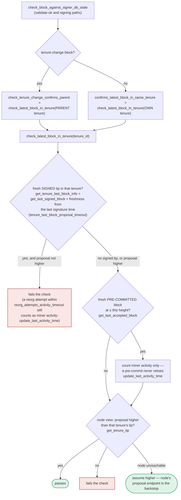

### Title
Duplicate-tenure-start block signable under `SortitionsView` (v1) because it counts only globally-accepted blocks, while the pre-commit "own-tenure conflict" guard also fails to close the gap - ([File: stacks-signer/src/chainstate/v1.rs])

### Summary
The v1 and v2 signer chainstate paths implement the "does a tenure-change block duplicate an already-accepted block in its parent tenure" check with different strength, and this check is documented as running *only* at proposal time, never again at validate-ok or at the pre-commit/signature moment. This mirrors the Scroll finding's root cause: two supposedly-equivalent guards (L1 vs L2 pause state / here, v1 vs v2 duplicate-detection) are asymmetric, and a message that is safe on one side of the asymmetry can still complete an irreversible action (a signature) on the other side.

### Finding Description
`docs/signer-flows.md` (section 7, verified against `stacks-signer/src/chainstate/v1.rs` / `v2.rs`) states explicitly: [1](#0-0) 

- `validate_tenure_change_payload` rejects with `DuplicateBlockFound` when a block has already been accepted in the tenure a new tenure-change block is starting.
- **v2** counts a duplicate using `get_last_signed_block`, i.e. any block that is either *locally* or *globally* accepted.
- **v1** counts a duplicate using `get_last_globally_accepted_block`, i.e. only blocks that have already reached *global* acceptance.

This means that under the v1 (`SortitionsView`) protocol path, if a signer has already locally-accepted (signed) a competing block for a tenure but that block has not yet reached the 70% global-acceptance threshold, a second, different tenure-start block for the same tenure will **not** be rejected as a duplicate by `check_proposal` — because v1's duplicate check only looks at globally accepted blocks, and this new block hasn't reached global acceptance yet either.

The doc further states this duplicate check is "proposal path only" and is never re-run at `check_block_against_signer_db_state` (validate-ok) or at the pre-commit → signature moment: [2](#0-1) 

The only later-stage safety net is the "own-tenure conflict" check performed while counting pre-commits before actually signing (section 5, `handle_block_pre_commit`), which relies on `get_signed_conflicts` / `conflict_still_blocks` / `reorg_permit_stands`: [3](#0-2) 

Which protocol path is used for any given proposal is decided by `check_block_against_state`, dispatching to `check_block_against_local_state` (v1/`SortitionsView`) or `check_block_against_global_state` (v2/`GlobalStateView`) based on `determine_active_signer_protocol_version`: [4](#0-3) [5](#0-4) 

Notably, `determine_active_signer_protocol_version` can fall back to the **local** signer's own protocol version when there is no majority consensus among peers on the protocol version, but only when that local version does not use global state: [6](#0-5) 

So a signer still running the older (v1) protocol — during a rollover window where the network hasn't reached majority consensus on the active version — validates proposals with the weaker, "globally-accepted-only" duplicate check, while v2 signers use the stronger "locally-or-globally-accepted" check. This is structurally the same defect class as the report: two components (v1 signers vs v2 signers, analogous to L1 vs L2 gateways) enforce different strength of the *same* invariant, and there is no mechanism forcing both sides to be equally strict at the same time. During a mixed-version window (explicitly tested for in this repo — see `stacks-node/src/tests/signer/multiversion.rs` and `downgrade_signer_protocol_version` / `rollover_signer_protocol_version` in `stacks-node/src/tests/signer/v0/mod.rs`), a miner could exploit v1 signers' weaker duplicate detection to get a signature on a second, competing tenure-start block for a tenure where a first block has already been locally (but not yet globally) accepted — before the pre-commit-stage own-tenure-conflict guard has a chance to observe the freshly-signed competitor (that guard depends on `last_endorsed`/freshness cutoffs and canonical-sortition lookups that can themselves return "wait" states rather than a hard block).

### Impact Explanation
If this gap can be forced (v1 signer weight sufficient, combined with timing such that the first locally-accepted block has not yet propagated as "signed" to the querying signer, and the own-tenure conflict guard's freshness/canonicity checks don't yet see it as a live conflict), a signer could contribute a valid signature to two conflicting blocks in the same tenure. This is exactly the "signer signing a conflicting block" class called out as Critical in the rules: it breaks the one-per-height / non-conflicting equality the pre-commit and signing pipeline is designed to guarantee.

### Likelihood Explanation
This requires: (a) a signer operating under the v1 (local-state) path — realistic during any version rollover, which the codebase explicitly tests for; (b) a miner or gossip actor presenting two distinct tenure-start proposals for the same tenure in a timing window before global acceptance and before the pre-commit conflict guard has fresh/canonical information to hard-block the second. This is a single-slot-miner/gossip-triggerable timing race, not requiring a signer majority or key compromise, but it does depend on precise timing and on the freshness/canonicity fallbacks in section 5 not intervening — which I could not fully verify resolve to "always safe" from the excerpts read. I was not able to trace every branch of `get_signed_conflicts`/`conflict_still_blocks` end-to-end in this pass, so I can't state with certainty that the section-5 guard never covers this gap; the documentation itself is the strongest evidence that the proposal-time duplicate check is intentionally not re-run, and that v1's version of that check is weaker than v2's.

### Recommendation
- Align `validate_tenure_change_payload` in `chainstate/v1.rs` with `chainstate/v2.rs` so both count locally-accepted (signed) blocks, not only globally-accepted ones, when detecting a duplicate tenure-start block — removing the asymmetry between protocol versions.
- Re-run (or strengthen) the duplicate/own-tenure-conflict check at the pre-commit→signature boundary explicitly against "any locally-signed block in this tenure," independent of freshness/canonicity heuristics, rather than relying solely on `get_signed_conflicts`'s staleness/canonical-sortition logic.
- During protocol-version rollover, avoid permitting the weaker/older check to be used for consensus-critical decisions when a stronger definition is known to exist elsewhere in the fleet.

### Proof of Concept
I could not construct a concrete end-to-end runnable PoC within the available index/tool access (the repository's full test harness for multiversion rollover, e.g. `stacks-node/src/tests/signer/multiversion.rs`, would be the right place to adapt), and I was unable to fully trace `get_signed_conflicts`/`conflict_still_blocks` to conclusively confirm no hidden safety net closes the gap. A Devin session with full file/test access would be needed to write and run a targeted integration test (mixed v1/v2 signer set, two competing tenure-start proposals for the same tenure, timed so the first is only locally accepted when the second is checked) to empirically confirm whether a v1 signer can be made to sign both.

### Citations

**File:** docs/signer-flows.md (L248-268)
```markdown
    TH -- yes --> RECHECK{"chainstate checks still pass?<br/>check_block_against_signer_db_state<br/>→ section 7"}
    RECHECK -- no --> REJ["mark_locally_rejected,<br/>handle_block_rejection,<br/>broadcast rejection"]:::bad
    RECHECK -- yes --> CONF["signed conflicts at height ≥ h,<br/>in ANY tenure<br/>get_signed_conflicts"]
    CONF --> PERM{"covered by a reorg permit whose<br/>permitting sortition is still canonical?<br/>reorg_permit_stands"}
    PERM -- yes --> EXCL(["excluded — our signature must not<br/>block a replacement we sanctioned"]):::good
    PERM -- no --> FRESH{"any of them still fresh?<br/>last_endorsed > cutoff"}
    FRESH -- yes --> SORT{"conflict_still_blocks, question 1:<br/>is its tenure's sortition still on the<br/>canonical burn chain?<br/>get_sortition_by_burn_hash"}
    SORT -- "404, with the node's burnchain tip<br/>at or past the burn block — a fork<br/>orphaned the tenure" --> OWN
    SORT -- "canonical, or we never<br/>saved its burn block" --> LIVE{"question 2: does the node's chain<br/>still reach the block itself?<br/>get_tenure_tip(its tenure)"}
    SORT -- "could not ask, or 404 with the<br/>node's tip still below the burn block" --> HOLD1
    LIVE -- "yes — real chain state" --> HOLD1["refuse to sign for now<br/>(may sign once conflict is stale)"]:::hold
    LIVE -- "no, and it was<br/>globally accepted" --> OWN
    LIVE -- "no, only locally accepted<br/>— but above this height" --> OWN
    LIVE -- "no, only locally accepted<br/>and a sibling at this height" --> HOLD1
    LIVE -- "could not ask" --> HOLD1
    FRESH -- "no — all stale" --> OWN{"a conflict in this block's<br/>OWN tenure?"}
    OWN -- yes --> TIP{"own tenure confirmed<br/>at ≥ this height?<br/>get_tenure_tip(own tenure)"}
    TIP -- yes --> HOLD2["refuse to sign"]:::hold
    TIP -- "no — never confirmed" --> SIGN
    TIP -- "node unreachable" --> SIGN
    OWN -- no --> SIGN["SIGN: mark_locally_accepted,<br/>handle_block_signature,<br/>broadcast acceptance"]:::good
```

**File:** docs/signer-flows.md (L391-424)
```markdown
`check_latest_block_in_tenure` answers "does this block confirm the tip we
expect?" and it runs in three places: at proposal arrival (inside
`check_proposal`), at validate-ok, and at the moment of signing. _Which_ tenure
it is asked about depends on the block: a tenure-change block is checked against
its **parent** tenure, every other block against its **own**. Never both. The
pivotal helper is `get_tenure_last_block_info`, which considers only blocks that
carry a signature (`get_last_signed_block`): a pre-commit never vetoes anything,
it only counts as miner activity.



A failed check becomes a different rejection depending on who asked.
`check_block_against_signer_db_state` returns `SortitionViewMismatch`, or
`ConnectivityIssues` when the lookup itself errored rather than answering; the v2
`check_proposal` path returns `InvalidParentBlock`.

```

**File:** docs/signer-flows.md (L425-434)
```markdown
Two things belong to the proposal path only and are **not** re-run at validate-ok
or at signing:

- `validate_tenure_change_payload` rejects with `DuplicateBlockFound` when we
  have already accepted a block in the tenure a tenure-change block is starting.
  v2 counts locally or globally accepted blocks (`get_last_signed_block`); v1
  counts only globally accepted ones (`get_last_globally_accepted_block`).
- the v2 `check_proposal` wrapper checks miner pubkey hash, consensus hash, the
  pox bitvec, and tenure-extend rules before delegating here.

```

**File:** stacks-signer/src/v0/signer.rs (L782-807)
```rust
    /// Get the global signer protocol version
    fn determine_active_signer_protocol_version(&mut self) -> Option<SortitionStateVersion> {
        let local_version = self.get_signer_protocol_version();
        if let Ok(update) = self
            .local_state_machine
            .try_into_update_message_with_version(local_version)
        {
            self.global_state_evaluator
                .insert_update(self.stacks_address.clone(), update);
        };
        let local_state_version = SortitionStateVersion::from_protocol_version(local_version);
        self
            .global_state_evaluator
            .determine_latest_supported_signer_protocol_version().map(|version| {
                SortitionStateVersion::from_protocol_version(version)
            })
            .or_else(|| {
                // Don't default if we are in a global consensus activation state as its pointless
                if local_state_version.uses_global_state() {
                    None
                } else {
                    warn!("{self}: No consensus on signer protocol version. Defaulting to local state version: {local_version}.");
                    Some(local_state_version)
                }
            })
    }
```

**File:** stacks-signer/src/v0/signer.rs (L865-869)
```rust
        if state_version.uses_global_state() {
            self.check_block_against_global_state(stacks_client, &block_info.block)
        } else {
            self.check_block_against_local_state(stacks_client, sortition_state, &block_info.block)
        }
```
