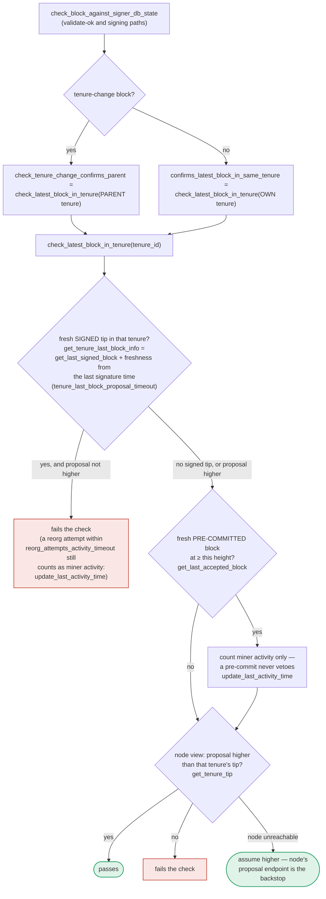

### Title
Signer permanently caches a stale, time-dependent rejection verdict and never re-validates a re-proposed block, wedging it out of ever signing a now-valid block - ([File: stacks-signer/src/v0/signer.rs])

### Summary
The Stargate bug is caused by a callback (`sgReceive`) whose outcome depends on external, time-varying data (swap slippage), and once it fails there is no path to re-attempt with fresh data — the same stale inputs are retried forever, permanently trapping funds. The stacks-signer has a structurally analogous defect: certain block-proposal rejection reasons are hard-coded as "final" and never re-evaluated on re-proposal, even though the underlying check that produced them is itself time-dependent and can flip from reject→accept as the chain state advances. Once a signer caches one of these "terminal" verdicts, it will resend the stale rejection forever for that exact block, even after the real-world condition that caused the rejection is gone.

### Finding Description
`should_reevaluate_reject_reason` classifies rejection reasons into "re-evaluable" (re-run the checks) and "final" (never re-check, just resend the stored answer): [1](#0-0) 

`SortitionViewMismatch`, `InvalidParentBlock`, `ReorgNotAllowed`, and `DuplicateBlockFound` are all placed in the "no need to re-validate" branch (`false`). These are exactly the rejection codes produced by `check_latest_block_in_tenure` / `check_block_against_signer_db_state` / `check_proposal`, whose outcome is explicitly time-dependent: [2](#0-1) 

The freshness of a competing tip is measured against `tenure_last_block_proposal_timeout` — i.e. a block that conflicts with a "fresh" competing tip today can stop conflicting once that competing tip goes stale, without the proposed block itself changing at all. `check_block_against_signer_db_state` documents this exact ambiguity: the same underlying check returns `SortitionViewMismatch` in one caller and `InvalidParentBlock` in another. [3](#0-2) 

When such a block is re-proposed (same `signer_signature_hash`, which miners routinely do verbatim after a timeout/rejection, per `proposal_replication_void.rs`), `should_reevaluate_block` consults `should_reevaluate_reject_reason` first: [4](#0-3) 

Because the reason is in the "final" list, the signer never re-runs `check_block_against_state` / `check_latest_block_in_tenure`. Instead, for a block not in `PreCommitted` state it calls `determine_response`, which purely replays the cached `block_info.valid` flag: [5](#0-4) 

Since `valid` was cached as `false` at the moment the stale conflict existed, `determine_response` returns `RejectedInPriorRound` forever, no matter how the chain state (freshness of the conflicting tip, burnchain reorg status) subsequently evolves — the signer never asks the question again for that exact block.

### Impact Explanation
This is a liveness wedge matching the "High" category: a signer wedged into never signing a valid block. If the proposal is re-sent verbatim (which the miner does on timeout, and which multiple signers may receive at the same near-simultaneous moment when the transient conflict is still fresh), all of them cache the same stale `SortitionViewMismatch`/`InvalidParentBlock` verdict and none of them will ever revisit it, even after the transient competing tip is stale or orphaned. That specific, objectively canonical block can then never accumulate the 70% pre-commit/signature weight from those signers, stalling the tenure until an entirely different block (a different `signer_signature_hash`) is proposed — analogous to the Stargate tokens that are permanently stuck because the cached swap parameters are never refreshed on retry.

### Likelihood Explanation
This requires only a normal, one-slot occurrence: a miner proposing a tenure-start (or reorging) block while a competing tenure's tip is still within `tenure_last_block_proposal_timeout`, and the miner later re-proposing the identical block (which the codebase's own tests, e.g. `proposal_replication_void.rs`, confirm is the miner's standard retry behavior). No majority collusion, no external key, and no protocol violation is needed — it is a natural consequence of time-sensitive checks being placed on the "final, non-reevaluable" list.

### Recommendation
Remove time-dependent rejection reasons (`SortitionViewMismatch`, `InvalidParentBlock`, `ReorgNotAllowed`, `DuplicateBlockFound`) from the "final" branch of `should_reevaluate_reject_reason`, or otherwise ensure that any rejection produced by a check whose result depends on `tenure_last_block_proposal_timeout`/freshness windows or node chain-tip state is always re-run on re-proposal, mirroring the fresh-check behavior already guaranteed for `PreCommitted` blocks in `should_reevaluate_block`.

### Proof of Concept
1. Miner proposes block `B1` (tenure-start) at height `H` while a competing tenure's signed tip `B0` is still fresh (`< tenure_last_block_proposal_timeout`).
2. `check_latest_block_in_tenure` fails; the signer stores `reject_reason = SortitionViewMismatch` for `B1`'s hash via `handle_block_proposal` → `check_block_against_state`.
3. Time passes past `tenure_last_block_proposal_timeout`; `B0` is no longer "fresh" (or gets orphaned by continued burnchain progress), so `B1` is now the objectively correct block to sign.
4. The miner re-proposes the identical `B1` (same `signer_signature_hash`), as it normally does on rejection/timeout.
5. `handle_block_proposal` → `should_reevaluate_block` → `should_reevaluate_reject_reason` returns `false` for `SortitionViewMismatch` → `determine_response` resends the cached `RejectedInPriorRound` without ever re-invoking `check_block_against_state`.
6. The signer can never sign `B1`, even though it is now canonical; if enough signers were caught in the same transient window, `B1` never reaches the pre-commit/signature threshold, wedging the tenure.

### Citations

**File:** stacks-signer/src/v0/signer.rs (L454-471)
```rust
impl Signer {
    /// Determine this signers response to a proposed block
    /// Returns a BlockResponse if we have already validated the block
    /// Returns None otherwise
    fn determine_response(&mut self, block_info: &BlockInfo) -> Option<BlockResponse> {
        // We will only have the valid field set if we have already validated this block
        // against our stacks-node/local state.
        let valid = block_info.valid?;
        let response = if valid {
            debug!("{self}: Accepting block {}", block_info.block.block_id());
            self.create_block_acceptance(&block_info.block).into()
        } else {
            debug!("{self}: Rejecting block {}", block_info.block.block_id());
            self.create_block_rejection(RejectReason::RejectedInPriorRound, &block_info.block)
                .into()
        };
        Some(response)
    }
```

**File:** stacks-signer/src/v0/signer.rs (L1481-1572)
```rust
    /// Determine if an already tracked block should be re-evaluated based on a new block proposal for it.
    /// Returns true if the block should be re-evaluated, false if it should be ignored.
    fn should_reevaluate_block(
        &mut self,
        stacks_client: &StacksClient,
        sortition_state: &mut Option<SortitionsView>,
        block_info: &BlockInfo,
        block_proposal: &BlockProposal,
    ) -> bool {
        let signer_signature_hash = block_info.block.header.signer_signature_hash();
        if block_info.globally_approved_and_responded() {
            info!("{self}: received a block proposal for a globally accepted block to which we have already responded. Ignoring.";
                "signer_signature_hash" => %signer_signature_hash,
                "block_id" => %block_info.block.block_id(),
                "block_height" => block_info.block.header.chain_length,
                "burn_height" => block_proposal.burn_height,
                "consensus_hash" => %block_info.block.header.consensus_hash,
                "timestamp" => block_info.block.header.timestamp,
                "signed_group" => block_info.signed_group,
                "signed_self" => block_info.signed_self,
                "valid" => ?block_info.valid
            );
            return false;
        }
        if !should_reevaluate_reject_reason(block_info) {
            if block_info.state == BlockState::PreCommitted {
                // We validated this block but haven't signed it. Signing requires the
                // pre-commit threshold and the conflict checks in `handle_block_pre_commit`.
                // Re-broadcast our pre-commit and re-run that evaluation instead of
                // responding with a signature directly, so a re-proposed block can't
                // bypass those checks.
                info!(
                    "{self}: received a block proposal for a block we have pre-committed to but not signed. Re-evaluating the pre-commit.";
                    "signer_signature_hash" => %signer_signature_hash,
                    "block_id" => %block_info.block.block_id(),
                    "block_height" => block_info.block.header.chain_length,
                    "burn_height" => block_proposal.burn_height,
                    "consensus_hash" => %block_info.block.header.consensus_hash
                );
                self.send_block_pre_commit(signer_signature_hash.clone());
                let address = self.stacks_address.clone();
                self.handle_block_pre_commit(
                    stacks_client,
                    sortition_state,
                    &address,
                    &signer_signature_hash,
                );
                return false;
            }
            if let Some(block_response) = self.determine_response(block_info) {
                self.send_block_response(&block_info.block, block_response);
                return false;
            } else {
                let is_pending = self
                    .signer_db
                    .has_pending_block_validation(&signer_signature_hash)
                    .unwrap_or_else(|e| {
                        warn!("{self}: Failed to load pending block validations: {e:?}");
                        false
                    });
                if is_pending {
                    debug!(
                        "{self}: received a block proposal for a block for which we is already pending validation. Do nothing.";
                        "signer_signature_hash" => %block_info.block.header.signer_signature_hash(),
                        "block_id" => %block_info.block.block_id()
                    );
                    return false;
                } else {
                    info!(
                        "{self}: received a block proposal for this block before, but we do not have a pending validation for it.";
                        "reject_reason" => ?block_info.reject_reason,
                        "signer_signature_hash" => %signer_signature_hash,
                        "block_id" => %block_info.block.block_id(),
                        "block_height" => block_info.block.header.chain_length,
                        "burn_height" => block_proposal.burn_height,
                        "consensus_hash" => %block_info.block.header.consensus_hash
                    );
                }
            }
        } else {
            info!(
                "{self}: received a block proposal for this block before, but our rejection reason allows us to reconsider";
                "reject_reason" => ?block_info.reject_reason,
                "signer_signature_hash" => %signer_signature_hash,
                "block_id" => %block_proposal.block.block_id(),
                "block_height" => block_proposal.block.header.chain_length,
                "burn_height" => block_proposal.burn_height,
                "consensus_hash" => %block_proposal.block.header.consensus_hash
            );
        }
        true
    }
```

**File:** stacks-signer/src/v0/signer.rs (L2705-2739)
```rust
/// Determine if a block should be re-evaluated based on its rejection reason˝
fn should_reevaluate_reject_reason(block_info: &BlockInfo) -> bool {
    if let Some(reject_reason) = &block_info.reject_reason {
        match reject_reason {
            RejectReason::ValidationFailed(ValidateRejectCode::UnknownParent)
            | RejectReason::ValidationFailed(ValidateRejectCode::NotFoundError)
            | RejectReason::NoSortitionView
            | RejectReason::ConnectivityIssues(_)
            | RejectReason::TestingDirective
            | RejectReason::InvalidTenureExtend
            | RejectReason::ConsensusHashMismatch { .. }
            | RejectReason::NoSignerConsensus
            | RejectReason::NotRejected
            | RejectReason::Unknown(_) => true,
            RejectReason::ValidationFailed(_)
            | RejectReason::RejectedInPriorRound
            | RejectReason::SortitionViewMismatch
            | RejectReason::ReorgNotAllowed
            | RejectReason::InvalidBitvec
            | RejectReason::PubkeyHashMismatch
            | RejectReason::InvalidMiner
            | RejectReason::NotLatestSortitionWinner
            | RejectReason::InvalidParentBlock
            | RejectReason::DuplicateBlockFound
            | RejectReason::IrrecoverablePubkeyHash
            | RejectReason::ProblematicTransactions
            | RejectReason::ProposalTooOld => {
                // No need to re-validate these types of rejections.
                false
            }
        }
    } else {
        false
    }
}
```

**File:** docs/signer-flows.md (L391-418)
```markdown
`check_latest_block_in_tenure` answers "does this block confirm the tip we
expect?" and it runs in three places: at proposal arrival (inside
`check_proposal`), at validate-ok, and at the moment of signing. _Which_ tenure
it is asked about depends on the block: a tenure-change block is checked against
its **parent** tenure, every other block against its **own**. Never both. The
pivotal helper is `get_tenure_last_block_info`, which considers only blocks that
carry a signature (`get_last_signed_block`): a pre-commit never vetoes anything,
it only counts as miner activity.


```

**File:** docs/signer-flows.md (L420-424)
```markdown
A failed check becomes a different rejection depending on who asked.
`check_block_against_signer_db_state` returns `SortitionViewMismatch`, or
`ConnectivityIssues` when the lookup itself errored rather than answering; the v2
`check_proposal` path returns `InvalidParentBlock`.

```
