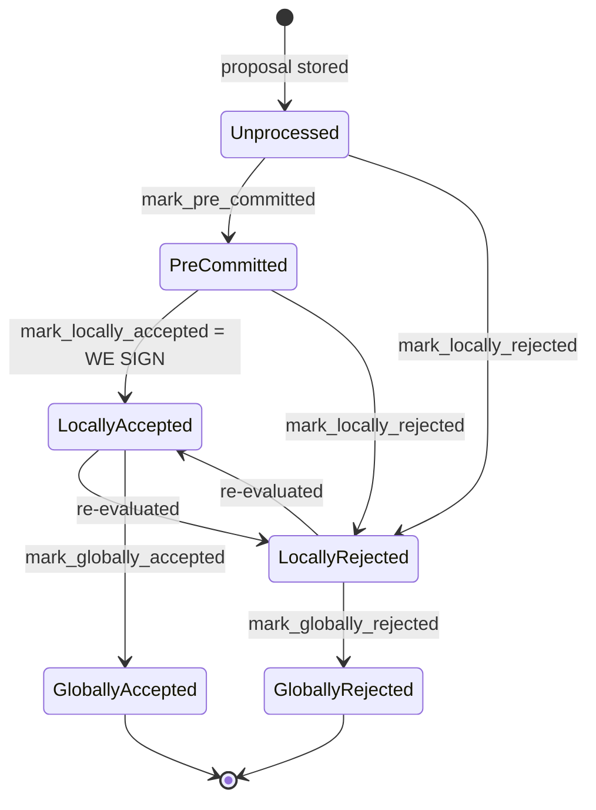

### Title
V1 SortitionsView Tenure-Change Duplicate Check Only Considers Globally-Accepted Blocks, Allowing a Signer to Sign Two Conflicting Tenure-Start Blocks - (File: stacks-signer/src/chainstate/v1.rs)

### Summary
In `SortitionsView::validate_tenure_change_payload` (v1 chainstate), the guard against re-signing a tenure-change block for a tenure the signer has already committed to queries `SignerDb::get_last_globally_accepted_block`, which only returns blocks in the terminal `GloballyAccepted` state. The equivalent guard in the v2 chainstate (`GlobalStateView::validate_tenure_change_payload`) was hardened to use `SignerDb::get_last_signed_block`, which also counts `LocallyAccepted` blocks (i.e., anything the signer has actually put a signature over, whether or not the group threshold/global acceptance has been observed yet). This is the same bug class as the referenced report: an untrusted/derived boundary value (`ticket_count`/here, "has a block already been signed in this tenure") is checked against too narrow a data source, so validation silently passes when it should not.

### Finding Description
`stacks-signer/src/chainstate/v1.rs`, `validate_tenure_change_payload`:
```
let last_in_current_tenure = signer_db
    .get_last_globally_accepted_block(&block.header.consensus_hash)
    ...
if let Some(last_in_current_tenure) = last_in_current_tenure {
    ... return Err(RejectReason::DuplicateBlockFound);
}
``` [1](#0-0) 

Compare to the v2 chainstate, which explicitly documents why the query must include locally-accepted (signed) blocks, not just globally-accepted ones:
```
// Only blocks we have signed (locally or globally accepted) count
// here: a block we have merely pre-committed to carries no signature from us, so it is safe to
// accept a competing tenure-start block in its place if it failed to reach consensus.
let last_in_current_tenure = signer_db
    .get_last_signed_block(&block.header.consensus_hash)
``` [2](#0-1) 

`SignerDb::get_last_signed_block` is documented as "a block is considered signed if it is locally or globally accepted," while `get_last_globally_accepted_block` requires the terminal `GloballyAccepted` state, which is only reached once the node itself has adopted the block (a separate, later event than the signer producing its own signature) [3](#0-2) . Between the moment a signer signs a tenure-start block (`mark_locally_accepted`, section 6 of the signer-flows documentation) and the moment that block is observed as globally accepted on the node, the v1 duplicate-block check for a second, competing tenure-change proposal for the *same tenure* consults only the (empty) globally-accepted state and finds nothing, so it does not reject.

The block lifecycle documentation confirms the terminal-state distinction and that pre-commit/local-acceptance is not the same as global acceptance [4](#0-3) , and a dedicated regression test enshrines the "approved != signed" distinction that this v1 code path does not respect for the *global* vs *local-signed* boundary [5](#0-4) .

### Impact Explanation
A miner (the only actor who proposes blocks/tenure-changes) can exploit the propagation delay between a signer signing (locally accepting) tenure-start block A and that acceptance becoming globally observed by presenting a second, competing tenure-change block B for the same tenure (same `consensus_hash`) to a v1-chainstate signer. Because `validate_tenure_change_payload` only checks `get_last_globally_accepted_block`, it will not detect that this signer already signed A, and (assuming the other v1 checks pass, e.g., parent tenure choice, pubkey match) the signer can go on to sign B as well. The signer's own signatures would then cover two conflicting tenure-start blocks in the same tenure — an equivocation that breaks the "one signed block per tenure/height" invariant the rest of the codebase (the conflict/reorg-guard logic and the v2 fix) is explicitly built to prevent.

This maps to the Critical impact bucket in scope: "a signer signing an invalid, non-canonical, or conflicting block."

### Likelihood Explanation
This requires no majority collusion — a single miner (one-slot) simply needs to broadcast two tenure-change proposals for the same tenure before the first one's signature propagates back as a globally-accepted event, which is a normal window in the signer protocol (network latency, or the miner intentionally racing StackerDB pushes). It only affects signers still running the v1 chainstate path (pre-global-signer-state protocol versions), since v2 already fixed exactly this gap.

### Recommendation
In `stacks-signer/src/chainstate/v1.rs::validate_tenure_change_payload`, replace the `signer_db.get_last_globally_accepted_block(...)` call with `signer_db.get_last_signed_block(...)`, mirroring the v2 fix, so the duplicate-tenure-change guard treats any block this signer has locally or globally accepted (i.e., anything it has signed) as blocking a competing tenure-start proposal for the same tenure.

### Proof of Concept
1. Signer running v1 chainstate validates and signs tenure-start block A for tenure T (`mark_locally_accepted`, state `LocallyAccepted`); this signature is broadcast but has not yet been observed as a `NewBlock` event by the node (so it is not yet `GloballyAccepted` in this signer's DB).
2. Before that happens, the miner (or an equivocating miner) sends a second tenure-change proposal B, also claiming tenure T (same `consensus_hash`), with a different parent-block confirmation, satisfying the earlier `check_parent_tenure_choice`/pubkey checks.
3. `check_proposal` routes to `validate_tenure_change_payload`, which calls `signer_db.get_last_globally_accepted_block(&block.header.consensus_hash)` — this returns `None` because A is only `LocallyAccepted`, not `GloballyAccepted`.
4. The `DuplicateBlockFound` rejection is skipped; validation of B proceeds and the signer can produce a valid signature over B.
5. The signer now holds signatures over two conflicting tenure-start blocks (A and B) for tenure T — an equivocation that a v2-chainstate signer (using `get_last_signed_block`) would have refused at step 3.

### Citations

**File:** stacks-signer/src/chainstate/v1.rs (L505-518)
```rust
        let last_in_current_tenure = signer_db
            .get_last_globally_accepted_block(&block.header.consensus_hash)
            .map_err(|e| {
                SignerChainstateError::from(ClientError::InvalidResponse(e.to_string()))
            })?;
        if let Some(last_in_current_tenure) = last_in_current_tenure {
            warn!(
                "Miner block proposal contains a tenure change, but we've already signed a block in this tenure. Considering proposal invalid.";
                "proposed_block_consensus_hash" => %block.header.consensus_hash,
                "proposed_block_signer_signature_hash" => %block.header.signer_signature_hash(),
                "last_in_tenure_signer_signature_hash" => %last_in_current_tenure.block.header.signer_signature_hash(),
            );
            return Err(RejectReason::DuplicateBlockFound);
        }
```

**File:** stacks-signer/src/chainstate/v2.rs (L340-348)
```rust
        // We already confirmed in check miner activity that the current tenure is valid. So check we are not
        // reorging the tenure blocks. Only blocks we have signed (locally or globally accepted) count
        // here: a block we have merely pre-committed to carries no signature from us, so it is safe to
        // accept a competing tenure-start block in its place if it failed to reach consensus.
        let last_in_current_tenure = signer_db
            .get_last_signed_block(&block.header.consensus_hash)
            .map_err(|e| {
                SignerChainstateError::from(ClientError::InvalidResponse(e.to_string()))
            })?;
```

**File:** stacks-signer/src/signerdb.rs (L1564-1585)
```rust
    /// Return the last signed block in a tenure (identified by its consensus hash).
    /// A block is considered signed if it is locally or globally accepted. Blocks that
    /// have only been pre-committed are excluded, because a pre-commit does not put a
    /// signature over the block and may be safely superseded by a competing proposal.
    ///
    /// This answers "what is the tenure's signed tip?", a different question from
    /// [`SignerDb::has_signed_block_in_tenure`]'s "does a signature bind us to this tenure?",
    /// which is why the predicates deliberately differ on rejected blocks (see there).
    pub fn get_last_signed_block(
        &self,
        tenure: &ConsensusHash,
    ) -> Result<Option<BlockInfo>, DBError> {
        let query = "SELECT block_info FROM blocks WHERE consensus_hash = ?1 AND state IN (?2, ?3) ORDER BY stacks_height DESC LIMIT 1";
        let args = params![
            tenure,
            &BlockState::GloballyAccepted.to_string(),
            &BlockState::LocallyAccepted.to_string(),
        ];
        let result: Option<String> = query_row(&self.db, query, args)?;

        try_deserialize(result)
    }
```

**File:** stacks-signer/src/signerdb.rs (L4107-4115)
```rust
        // A pre-commit sets `approved_time` but puts no signature over the block, so it must
        // not count as a signed block. This is the regression: treating it as signed suppressed
        // the miner inactivity timeout and stalled the tenure.
        block_info.mark_pre_committed().unwrap();
        db.insert_block(&block_info).unwrap();

        assert!(db.has_approved_block_in_tenure(&consensus_hash_1).unwrap());
        assert!(!db.has_signed_block_in_tenure(&consensus_hash_1).unwrap());
        assert!(!db.has_signed_block_in_tenure(&consensus_hash_2).unwrap());
```

**File:** docs/signer-flows.md (L130-150)
```markdown
## 2. Block lifecycle (`BlockState`)

Every proposal tracked in the signer DB carries a `BlockState`. **`PreCommitted`
carries no signature**: it means "validated, willing to sign if the pre-commit
threshold is met." The first signature appears at `mark_locally_accepted`.
Global states are terminal against each other.


```
