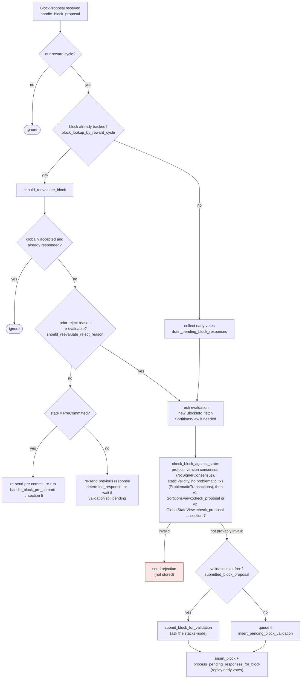

### Title
Stale rejection weight retained when a signer flips reject→accept lets `total_weight_rejected` and `total_weight_approved` double-count the same signer's weight - (File: `stacks-node/src/nakamoto_node/stackerdb_listener.rs`)

### Summary
`StackerDBListener::poll_events` tallies signer responses into a single shared `BlockStatus` using two independent dedup sets: `gathered_signatures`/`total_weight_approved` for `Accepted` messages, and `responded_signers`/`total_weight_rejected` for `Rejected` messages. A signer that first rejects a block and later (legitimately, via the signer's own reject-reason re-evaluation path) accepts the same block hash has its weight added to `total_weight_approved` without ever being removed from `total_weight_rejected`, permanently double-booking that signer's weight across both mutually exclusive tallies.

### Finding Description
In `stackerdb_listener.rs`, the `Rejected` branch increments `total_weight_rejected` guarded only by insertion into `responded_signers`: [1](#0-0) 

The `Accepted` branch increments `total_weight_approved` guarded only by whether `gathered_signatures` already contains the slot id — a completely separate set: [2](#0-1) 

If a signer's messages for the same `block_sighash` arrive in the order Reject → Accept:
1. On `Rejected`: `responded_signers.insert(slot_id)` succeeds (first time) → `total_weight_rejected` gets that signer's weight added.
2. On the later `Accepted`: `gathered_signatures.contains_key(&slot_id)` is `false` (nothing populated it during the reject path) → `total_weight_approved` also gets that signer's weight added. `total_weight_rejected` is never decremented.

The result is `total_weight_rejected + total_weight_approved` can exceed the true weight of distinct final positions, i.e. the same signer's weight is simultaneously counted as "rejecting" and "approving." This is not a theoretical byzantine-only path: the v0 signer's own re-proposal handling explicitly allows a prior rejection to be superseded by a fresh evaluation and a different verdict when `should_reevaluate_reject_reason` determines the original reject reason no longer applies, which is exactly documented in the flow: [3](#0-2) 

So a single, otherwise-honest signer that rejects a proposal for a transient reason (e.g. a temporarily-unreachable node, a reorg-permit window that later passes) and subsequently accepts the same block hash on re-evaluation will trigger this stale double-count on the coordinator side.

### Impact Explanation
The miner's `SignerCoordinator::wait_for_signer_signatures_or_timeout` consumes this same `BlockStatus` to decide the block's fate: [4](#0-3) 

Because `total_weight_rejected` is never decremented when a signer flips to accept, a block can be prematurely and incorrectly classified as `SignersRejected` (line 537) using a stale/obsolete rejection weight that has, in the current true state, already moved to acceptance — this is a miscounted tally in the strict sense of "a rejection recounted as an accept" (mirrored: an accept recorded as accept without ever ceasing to also count as reject). This can wedge otherwise-valid, sufficiently-supported blocks into rejection, or cause the coordinator's log/telemetry (`bump_naka_rejected_blocks`, excluded txid logic keyed on `blocking_minority`) to act on an inflated rejection count that does not reflect the current voting state — a liveness/miscount defect matching the required impact class.

### Likelihood Explanation
This requires no majority, no other signer's key, and no auth-token access — a single signer flipping its own vote for the same block (a normal, code-supported behavior per `should_reevaluate_reject_reason`) is sufficient to desynchronize the two weight counters on any node/coordinator instance tracking that block's `BlockStatus`.

### Recommendation
Track each signer's final response in a single map from `slot_id` to verdict, and when a new verdict is recorded for a slot that already has a different prior verdict, subtract the old verdict's weight from its tally before adding the new weight to the new tally (mirroring `handle_block_rejection`/`store_and_process_block_signature`'s dedup-by-signer approach in `stacks-signer/src/v0/signer.rs`, which instead recomputes weight from the full set of stored addresses on each processing pass rather than incrementally accumulating two independent counters).

### Proof of Concept
1. Node's `SignerCoordinator` starts collecting responses for a block via `StackerDBListener`, `weight_threshold` at 70% of `total_weight`.
2. Signer S (weight w) sends `BlockResponse::Rejected` for the block; `responded_signers` and `total_weight_rejected += w` (`stackerdb_listener.rs:515-518`).
3. Signer S later re-evaluates the same block (its own reject reason no longer applies, per `should_reevaluate_reject_reason`, `docs/signer-flows.md:180-184`) and sends `BlockResponse::Accepted` for the same `signer_signature_hash`.
4. The `Accepted` handler checks only `gathered_signatures.contains_key(&slot_id)` (false) and adds `total_weight_approved += w` (`stackerdb_listener.rs:443-465`), while `total_weight_rejected` retains its earlier `+= w` from step 2.
5. `total_weight_rejected` and `total_weight_approved` now both include S's weight `w`, inflating both tallies beyond the real, current distinct-signer weight — enabling either a spurious `SignersRejected` decision or an inflated approval count depending on which threshold check in `signer_coordinator.rs:487-545` is hit first.

### Citations

**File:** stacks-node/src/nakamoto_node/stackerdb_listener.rs (L443-465)
```rust
                        if !block.gathered_signatures.contains_key(&slot_id) {
                            block.total_weight_approved = block
                                .total_weight_approved
                                .saturating_add(signer_entry.weight);

                            info!("StackerDBListener: Signature Added to block";
                                "signer_signature_hash" => %block_sighash,
                                "signer_pubkey" => signer_pubkey.to_hex(),
                                "signer_slot_id" => slot_id,
                                "signature" => %signature,
                                "signer_weight" => signer_entry.weight,
                                "total_weight_approved" => block.total_weight_approved,
                                "percent_approved" => block.total_weight_approved as f64 / self.total_weight as f64 * 100.0,
                                "total_weight_rejected" => block.total_weight_rejected,
                                "percent_rejected" => block.total_weight_rejected as f64 / self.total_weight as f64 * 100.0,
                                "weight_threshold" => self.weight_threshold,
                                "tenure_extend_timestamp" => tenure_extend_timestamp,
                                "read_count_extend_timestamp" => read_count_extend_timestamp,
                                "server_version" => metadata.server_version,
                            );
                        }
                        block.gathered_signatures.insert(slot_id, signature);
                        block.responded_signers.insert(slot_id);
```

**File:** stacks-node/src/nakamoto_node/stackerdb_listener.rs (L515-518)
```rust
                        if block.responded_signers.insert(slot_id) {
                            block.total_weight_rejected = block
                                .total_weight_rejected
                                .saturating_add(signer_entry.weight);
```

**File:** docs/signer-flows.md (L164-194)
```markdown
## 3. A block proposal arrives

The miner broadcasts a proposal. If we've seen this exact block before,
`should_reevaluate_block` decides whether the old verdict stands; a block we
only pre-committed to is deliberately routed back through the pre-commit
evaluation so a re-proposal cannot shortcut to a signature. A fresh proposal is
checked against our view of the world _before_ spending a node validation on it.


```

**File:** stacks-node/src/nakamoto_node/signer_coordinator.rs (L509-545)
```rust
            if block_status
                .total_weight_rejected
                .saturating_add(self.weight_threshold)
                > self.total_weight
            {
                info!(
                    "{}/{} signer weight votes to reject block",
                    block_status.total_weight_rejected, self.total_weight;
                    "signer_signature_hash" => %block_signer_sighash,
                );
                counters.bump_naka_rejected_blocks();

                // Only act on failed txids that a blocking minority (>30% weight) agrees on
                let blocking_minority = self.total_weight.saturating_sub(self.weight_threshold);
                let mut temporarily_excluded_txids = HashSet::new();
                let mut permanently_excluded_txids = HashSet::new();
                for (txid, info) in &block_status.failed_txids {
                    if info.total_weight > blocking_minority {
                        // Do not perma ban txids that only a small minority of signers reported as problematic
                        // But make sure its removed from the next block proposal
                        if info.problematic_weight > blocking_minority {
                            permanently_excluded_txids.insert(txid.clone());
                        } else {
                            temporarily_excluded_txids.insert(txid.clone());
                        }
                    }
                }

                return Err(NakamotoNodeError::SignersRejected {
                    temporarily_excluded_txids,
                    permanently_excluded_txids,
                });
            } else if block_status.total_weight_approved >= self.weight_threshold {
                info!("Received enough signatures, block accepted";
                    "signer_signature_hash" => %block_signer_sighash,
                );
                return Ok(block_status.gathered_signatures.values().cloned().collect());
```
