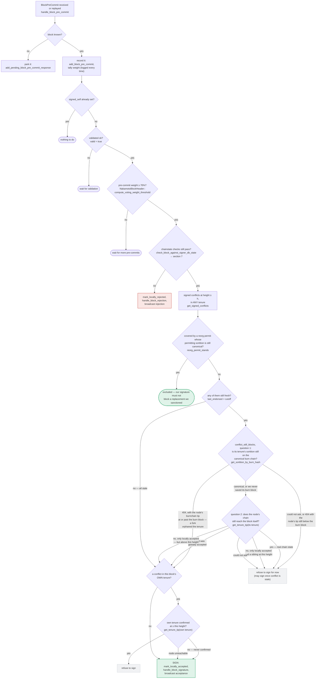

### Title
Stale in-memory `BlockInfo` overwrite in `process_pending_responses_for_block` can clobber a just-persisted signature and re-open the equivocation guard - (File: `stacks-signer/src/v0/signer.rs`)

### Summary
`process_pending_responses_for_block` replays a proposal's parked early votes (pre-commits, rejections, signatures) against one long-lived, mutable `BlockInfo` value held in the caller's stack frame. The pre-commit branch of that replay, however, does not touch this value at all: `handle_block_pre_commit` independently re-fetches its *own* copy of the block from the signer DB, mutates it (potentially signing the block and persisting `signed_self`/`BlockState::LocallyAccepted`), and writes it back. The outer `block_info` reference used for the subsequent rejection/signature replay iterations is never refreshed from that write, so later iterations act on stale, pre-signature data and can persist it back over the canonical, just-signed row — the same "use of stale/superseded state after another path has already dropped/replaced it" class of bug as the referenced Quiche use-after-free (returning/using a handle to data whose authoritative owner has moved on).

### Finding Description
`process_pending_responses_for_block` takes `block_info: &mut BlockInfo` and drains three pending-response queues in sequence over that single object: [1](#0-0) 

For each parked pre-commit, it calls `handle_block_pre_commit(stacks_client, sortition_state, &stacker_address, &signer_signature_hash)` — passing only the hash, not `block_info`: [2](#0-1) 

`handle_block_pre_commit` re-fetches its own independent copy of the block via `block_lookup_by_reward_cycle`, tallies pre-commit weight, and — once the ≥70% threshold and chainstate re-checks pass — signs the block, persisting `signed_self`/`BlockState` changes to the signer DB: [3](#0-2) 

This is the identical "take it out of the map/DB, mutate, put it back" pattern documented and used elsewhere in this file (e.g. `handle_block_validate_ok`, which explicitly calls out "For mutability reasons, we need to take the block_info out of the map and add it back after processing"): [4](#0-3) [5](#0-4) 

Because `process_pending_responses_for_block`'s pre-commit branch performs this same fetch-mutate-persist cycle on a *second, independent* copy of the row, the outer `block_info` still reflects the pre-processing state (e.g. `signed_self == None`, `state == Unprocessed/PreCommitted`) once control returns to the rejection and signature loops that follow: [6](#0-5) 

Those loops call `store_and_process_block_rejection` / `store_and_process_block_signature` with this same stale `&mut BlockInfo`. Consistent with every other handler in this file, those functions mutate the `BlockInfo` they are given and persist it via `self.signer_db.insert_block(&block_info)` (the same write-back idiom shown at lines 1928-1930/1955-1957/1972-1974 above). If a parked pre-commit processed earlier in the same call caused a signature to be produced and persisted, a rejection or signature entry processed afterward writes the outer, stale copy back over that row — silently reverting `signed_self` to `None` and the state to its pre-signature value in the signer DB.

This breaks the "sign only once per block/height" equality the whole pre-commit/signature design exists to protect (see `docs/signer-flows.md` sections 3/5, which explicitly rely on `signed_self` being sticky once set): [7](#0-6) 

Once `signed_self` is erased from persistent state, the signer's own bookkeeping believes it never signed this block. A subsequent re-proposal, pre-commit replay, or conflicting sibling at the same height would then be evaluated by `handle_block_pre_commit`'s "signed_self already set? -> nothing to do" short-circuit as if no signature had ever been placed, re-opening the exact double-signature/equivocation window sections 5's conflict guard is designed to close: [8](#0-7) 

### Impact Explanation
Erasing a persisted `signed_self` for a block the signer already put a signature over reopens the equivocation guard: the signer can subsequently be induced to sign a second, conflicting block at the same height/tenure believing it never signed the first, since all of the downstream conflict checks (`get_signed_conflicts`, `handle_block_pre_commit`'s "already signed" short-circuit) key off the persisted `signed_self`/`BlockState`, not off any in-memory record of what was actually broadcast. This matches the "High - losing the equivocation guard" impact bucket: it is a purely local, single-signer/miner-triggerable state corruption, not something requiring another signer's key or a signer majority.

### Likelihood Explanation
The trigger only requires the ordinary flow of early votes arriving before a proposal and being drained together: a miner (or gossiping peer) needs a pre-commit for a not-yet-seen block to arrive early enough to be parked (`add_pending_block_pre_commit_response`), together with a rejection or signature response for the same block also arriving early and being parked, before the proposal itself lands and triggers `drain_pending_block_responses` -> `process_pending_responses_for_block`. This ordering can be produced by a single miner/proposer choosing message timing/ordering relative to a lagging signer, i.e. within the stated one-slot-miner-plus-gossip threat model; it needs no majority and no other signer's key.

### Recommendation
`process_pending_responses_for_block` should not operate on a locally-held, stale `BlockInfo` across the whole replay. After each sub-step that can mutate and persist the block (in particular after each `handle_block_pre_commit` call), the function should re-fetch the current `BlockInfo` from `signer_db` (the same way `handle_block_pre_commit`/`handle_block_validate_ok` already do) before continuing to the rejection/signature replay, or refactor these handlers to always source their working copy fresh from the DB immediately before mutating and writing it back, rather than accepting a long-lived `&mut BlockInfo` that other code paths can invalidate underneath it.

### Proof of Concept
1. Signer has not yet seen proposal `P` for block `B` at height `h` in tenure `T`.
2. Miner/attacker-controlled gossip delivers, in order, before `P` arrives:
   - Peer pre-commit for `B` from enough weight to cross the 70% pre-commit threshold on its own (or combined with our own upcoming pre-commit) — parked via `add_pending_block_pre_commit_response`.
   - A signature/acceptance response for `B` from some other peer — parked via the pending-signature table.
3. Proposal `P` for `B` finally arrives; `handle_block_proposal` validates it, stores a fresh `BlockInfo`, and calls `drain_pending_block_responses` -> `process_pending_responses_for_block(block_info)`.
4. The pre-commit loop runs first: `handle_block_pre_commit` re-fetches its own `BlockInfo` copy, finds the pre-commit threshold already met, passes the chainstate re-check, signs `B`, and persists `signed_self = Some(t)` / `BlockState::LocallyAccepted` to `signer_db`.
5. The signature loop then runs on the caller's stale `block_info` (still showing `signed_self = None`) via `store_and_process_block_signature`, which mutates and persists that stale copy back to `signer_db`, overwriting step 4's row and erasing `signed_self`.
6. A conflicting sibling block `B'` at height `h` in tenure `T` (or another tenure) is now proposed. `handle_block_pre_commit`'s "already signed" short-circuit no longer fires (DB shows `signed_self = None` for `B`), and `get_signed_conflicts`/the pre-commit conflict guard no longer see `B` as a signed conflict, so the signer proceeds to sign `B'` as well — producing two signer signatures over conflicting blocks at the same height from the same signer.

*Caveat:* full confirmation that `store_and_process_block_rejection`/`store_and_process_block_signature` unconditionally persist their `&mut BlockInfo` parameter back via `signer_db.insert_block` was not directly re-verified in this pass (index truncation prevented viewing their bodies), but this write-back idiom is used consistently by every other handler shown above that takes a `BlockInfo`/`&mut BlockInfo` in this file, so it is the expected behavior. A Devin session with full repository access should confirm the bodies of `store_and_process_block_rejection` and `store_and_process_block_signature` to nail down the exact overwrite mechanics before treating this as fully proven.

### Citations

**File:** stacks-signer/src/v0/signer.rs (L1250-1345)
```rust
    /// Handle pre-commit message from another signer
    fn handle_block_pre_commit(
        &mut self,
        stacks_client: &StacksClient,
        sortition_state: &mut Option<SortitionsView>,
        stacker_address: &StacksAddress,
        block_hash: &Sha512Trunc256Sum,
    ) {
        let Some(mut block_info) = self.block_lookup_by_reward_cycle(block_hash) else {
            // A pre-commit for a block we have not seen proposed yet means the proposal
            // has not reached us. Log it at INFO: it is a direct signal that our view of
            // the proposal stream is behind the rest of the signer set.
            info!("{self}: Received block pre-commit for an unknown block, storing as pending";
                "signer_address" => %stacker_address,
                "signer_signature_hash" => %block_hash,
                "signer_weight" => self.signer_weights.get(stacker_address).copied().unwrap_or(0),
            );
            if let Err(e) = self
                .signer_db
                .add_pending_block_pre_commit_response(block_hash, stacker_address)
            {
                warn!("{self}: Failed to save pending block pre-commit response: {e:?}");
            }
            return;
        };
        // Always save the pre-commit - we will need to store signer responses for determining which
        // are misbehaving, offline, etc.
        // commit message is from a valid sender! store it
        self.signer_db
            .add_block_pre_commit(block_hash, stacker_address)
            .unwrap_or_else(|_| panic!("{self}: Failed to save block pre-commit"));

        let block_hash = block_info.block.header.signer_signature_hash();
        // do we have enough pre-commits to reach consensus?
        // i.e. is the threshold reached?
        //
        // Tally this up front, before the early returns below, so that every pre-commit we
        // receive can be logged with the running weight. Crossing this threshold is what
        // triggers our block response, so without it the wait for the threshold, which can
        // be minutes and is the bulk of a stalled block's latency, leaves no trace at all.
        let committers = self
            .signer_db
            .get_block_pre_committers(&block_hash)
            .unwrap_or_else(|_| panic!("{self}: Failed to load block commits"));

        let commit_weight = self.compute_signature_signing_weight(committers.iter());
        let total_weight = self.compute_signature_total_weight();

        let min_weight = NakamotoBlockHeader::compute_voting_weight_threshold(total_weight)
            .unwrap_or_else(|_| {
                panic!("{self}: Failed to compute threshold weight for {total_weight}")
            });

        info!("{self}: Received block pre-commit";
            "signer_address" => %stacker_address,
            "signer_signature_hash" => %block_hash,
            "consensus_hash" => %block_info.block.header.consensus_hash,
            "block_height" => block_info.block.header.chain_length,
            "signer_weight" => self.signer_weights.get(stacker_address).copied().unwrap_or(0),
            "pre_commit_weight" => commit_weight,
            "pre_commit_weight_required" => min_weight,
            "total_weight" => total_weight,
            "pre_commit_threshold_reached" => commit_weight >= min_weight,
            "already_signed" => block_info.signed_self.is_some(),
        );

        if block_info.signed_self.is_some() {
            debug!(
                "{self}: Received pre-commit for a block that we have already signed. Doing nothing...",
            );
            return;
        }

        if !block_info.valid.unwrap_or(false) {
            // We received a pre-commit for a block that we have not validated or we have already marked this block as invalid.
            // We should not do anything further as we do not know what our response should be and we do not change our votes on rejected
            // blocks unless we receive a new block proposal for it and the reject reason allows us to reconsider.
            debug!(
                "{self}: Received a pre-commit for a block that we have not determined to be valid: {:?}. Doing nothing...", block_info.valid
            );
            return;
        }

        if min_weight > commit_weight {
            debug!(
                "{self}: Not enough pre-committed to block {block_hash} (have {commit_weight}, need at least {min_weight}/{total_weight})"
            );
            return;
        }

        // The chain and signer db state may have changed materially since this block passed the
        // proposal-time checks (e.g. between validation and reaching the pre-commit threshold we
        // may have signed a block that this one would reorg). Re-run the chainstate checks
        // before putting a signature over the block, and respond with a rejection if they no
        // longer pass, just as the block validation response handler does.
        if let Some(block_rejection) =
```

**File:** stacks-signer/src/v0/signer.rs (L1730-1750)
```rust
    fn process_pending_responses_for_block(
        &mut self,
        stacks_client: &StacksClient,
        sortition_state: &mut Option<SortitionsView>,
        block_info: &mut BlockInfo,
        pending_responses: PendingBlockResponses,
    ) {
        let signer_signature_hash = block_info.block.header.signer_signature_hash();
        for stacker_address in pending_responses.pre_commits {
            debug!("{self}: Processing pending pre-commit.";
                "stacker_address" => %stacker_address,
                "signer_signature_hash" => %signer_signature_hash,
                "block_id" => %block_info.block.block_id(),
            );
            self.handle_block_pre_commit(
                stacks_client,
                sortition_state,
                &stacker_address,
                &signer_signature_hash,
            );
        }
```

**File:** stacks-signer/src/v0/signer.rs (L1751-1780)
```rust
        for (stacker_address, reject_reason) in pending_responses.rejections {
            debug!("{self}: Processing pending rejection.";
                "stacker_address" => %stacker_address,
                "signer_signature_hash" => %signer_signature_hash,
                "block_id" => %block_info.block.block_id(),
                "reject_reason" => ?reject_reason,
            );
            self.store_and_process_block_rejection(
                sortition_state,
                block_info,
                &stacker_address,
                reject_reason,
            );
        }
        let block_id = block_info.block.block_id();
        for (stackers_address, signature) in pending_responses.signatures {
            debug!("{self}: Processing pending signature.";
                "stacker_address" => %stackers_address,
                "signer_signature_hash" => %signer_signature_hash,
                "block_id" => %block_id,
            );
            self.store_and_process_block_signature(
                stacks_client,
                sortition_state,
                block_info,
                &stackers_address,
                &signature,
            );
        }
    }
```

**File:** stacks-signer/src/v0/signer.rs (L1913-1930)
```rust
        }
        // For mutability reasons, we need to take the block_info out of the map and add it back after processing
        let Some(mut block_info) = self.block_lookup_by_reward_cycle(signer_signature_hash) else {
            // We have not seen this block before. Why are we getting a response for it?
            debug!("{self}: Received a block validate response for a block we have are not tracking. Ignoring...");
            return;
        };

        // Record the block validation time but do not consider stx transfers or boot contract calls
        block_info.validation_time_ms = if block_validate_ok.cost.is_zero() {
            Some(0)
        } else {
            Some(block_validate_ok.validation_time_ms)
        };

        self.signer_db
            .insert_block(&block_info)
            .unwrap_or_else(|e| self.handle_insert_block_error(e));
```

**File:** stacks-signer/src/v0/signer.rs (L1960-1984)
```rust
        } else {
            if let Err(e) = block_info.mark_pre_committed() {
                // The block may have reached enough signatures before we validated the block so should fail to mark pre-committed
                // but still call to make sure the timestamps and validity are updated correctly.
                if !block_info.has_reached_consensus()
                    && block_info.state != BlockState::LocallyAccepted
                {
                    warn!("{self}: Failed to mark block as approved: {e:?}",);
                    return;
                }
            }

            self.signer_db
                .insert_block(&block_info)
                .unwrap_or_else(|e| self.handle_insert_block_error(e));
            self.send_block_pre_commit(signer_signature_hash.clone());
            // have to save the signature _after_ the block info
            let address = self.stacks_address.clone();
            self.handle_block_pre_commit(
                stacks_client,
                sortition_state,
                &address,
                signer_signature_hash,
            );
        }
```

**File:** docs/signer-flows.md (L229-272)
```markdown
## 5. Pre-commit threshold → signature

The only place the signer produces a block signature by counting votes.
Pre-commits from peers (and our own) accumulate; at ≥70% weight the signer
decides whether to follow through. Between validation and threshold, we may have
signed a _different_ block at the same height, possibly in another tenure, so
the world must be re-checked before the signature leaves the box.


```
