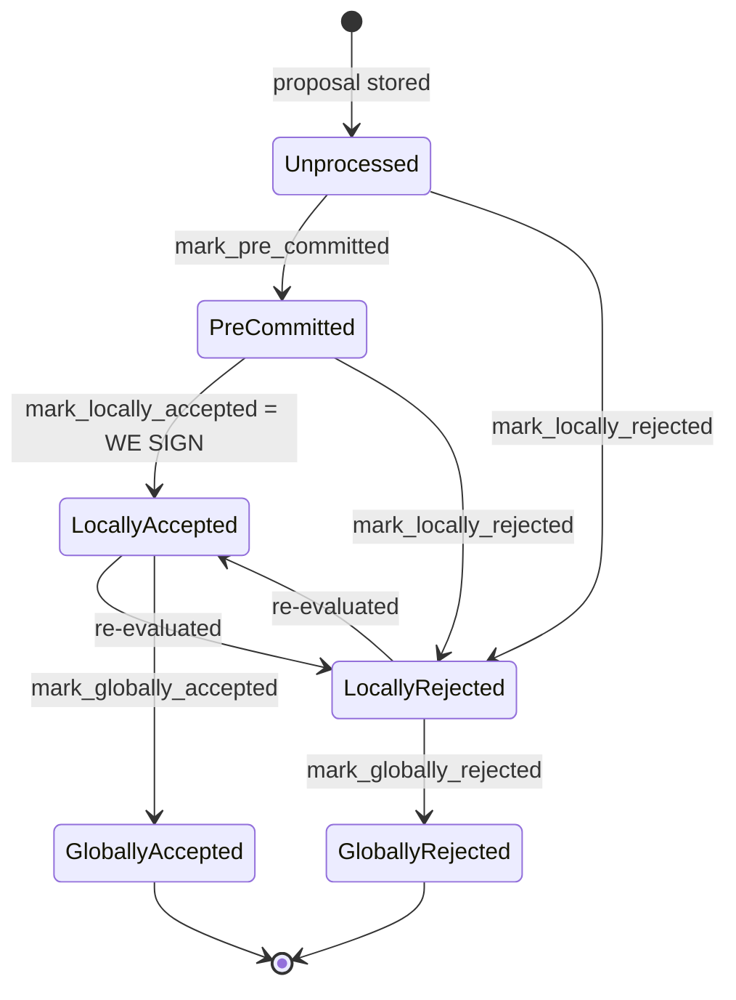

### Title
Signer coordinator double-counts weight when a reject-then-accept response pair arrives from the same signer, letting stale rejection weight falsely trigger `SignersRejected` on an actually-approved block - (File: `stacks-node/src/nakamoto_node/stackerdb_listener.rs`)

### Summary
The `StackerDBListener` tallies two independent weight counters per block — `total_weight_approved` and `total_weight_rejected` — inside a single `BlockStatus` struct that is meant to guarantee a signer's weight is counted at most once across the whole tally. The two update paths use different, asymmetric guards, so a signer that first rejects and later accepts (signs) the same block has its weight credited to *both* counters, breaking the invariant the `SignerCoordinator`'s accept/reject decision relies on.

### Finding Description
`BlockStatus` carries two independent bookkeeping structures: [1](#0-0) 

The `Accepted` handler gates crediting `total_weight_approved` on `gathered_signatures` only: [2](#0-1) 

The `Rejected` handler gates crediting `total_weight_rejected` on `responded_signers` only: [3](#0-2) 

Both branches insert into `responded_signers` (line 465 for accept, implicitly via the `insert` check for reject), but the *accept* branch never checks `responded_signers` before crediting weight — it only checks whether this slot already appears in `gathered_signatures`. This is exactly the asymmetric-guard pattern in the external report: one side of a two-sided invariant is checked against a durable/snapshotted state (`responded_signers`, checked only by the reject path) while the other side (`accept`) is evaluated independently and unconditionally credits weight.

Sequence that breaks the invariant "each signer's weight counts at most once across `total_weight_approved`/`total_weight_rejected`":
1. Signer S (weight `w`) sends `BlockResponse::Rejected` for block B. `responded_signers.insert(slot)` → `true` → `total_weight_rejected += w`.
2. The same signer S later reconsiders and sends `BlockResponse::Accepted` (a valid signature) for the *same* block B — this is an explicitly supported protocol path, not just a malicious act: the signer-side state machine documents `LocallyRejected --> LocallyAccepted : re-evaluated` for reject reasons that are "re-evaluable" (e.g. transient reasons such as connectivity or view issues) [4](#0-3) .
3. On receiving the Accepted message, `gathered_signatures.contains_key(&slot)` is `false` (S never accepted before), so `total_weight_approved += w` is executed, even though `responded_signers` already contains `slot` from step 1.

Result: `w` is now counted in *both* `total_weight_rejected` and `total_weight_approved` for the same block. This directly parallels the Klever bug's root cause: an invariant ("a signer's weight belongs to exactly one bucket") that is enforced asymmetrically — one path snapshots/guards, the other re-derives independently — so the combined accounting silently exceeds what should be possible, instead of erroring.

### Impact Explanation
The `SignerCoordinator`'s decision loop evaluates the reject condition before the accept condition: [5](#0-4) 

Because `total_weight_rejected` can retain stale weight from signers who have since validly signed (accepted) the block, `total_weight_rejected.saturating_add(self.weight_threshold) > self.total_weight` can become true purely from double-counted, stale rejection weight — even while `total_weight_approved` has genuinely also crossed the 70% signature threshold with real, cryptographically-verified signatures (verified at `signer_pubkey.verify(...)` [6](#0-5) ). Since the reject branch is checked first, the coordinator returns `NakamotoNodeError::SignersRejected` and abandons a block that in reality has enough valid signer support, forcing the miner to re-propose. This is a liveness wedge driven by acting on a stale/corrupted weight threshold accounting rather than the true, mutually-exclusive tally the design assumes — matching the "acting on a stale reward set/threshold" High-impact category. It requires no majority of signers and no other signer's key: a single signer legitimately (or maliciously) sending a reject followed by an accept for the same block over StackerDB gossip is sufficient to corrupt the shared `BlockStatus` tally that the coordinator relies on for every subsequent decision on that block.

### Likelihood Explanation
This does not require a majority of signers, an attacker's private key, or local/auth-token access — only one signer's own legitimate (or crafted) reject-then-accept message pair over StackerDB, which the signer-side design already anticipates as a supported transition (`LocallyRejected --> LocallyAccepted`). Any single signer that re-evaluates a previously-rejected block (a normal, documented occurrence) triggers the double count, making this readily reachable in ordinary operation, not just via an adversarial actor.

### Recommendation
Make the two credit paths mutually exclusive on the same shared state:
- Before crediting `total_weight_approved` in the `Accepted` branch, check (and clear/adjust) any prior rejection credit recorded for that slot in `responded_signers`/`total_weight_rejected`, or maintain a single per-slot "current verdict" enum instead of two independently-gated counters.
- Alternatively, gate the `Accepted` branch's weight credit on `!block.responded_signers.contains(&slot_id)` consistently with the `Rejected` branch, and explicitly handle (subtract/replace) the case where a signer flips its vote, so the two totals can never both include the same signer's weight simultaneously.
- Add an invariant assertion (e.g. `total_weight_approved + total_weight_rejected - overlap <= total_weight`) in tests to catch regressions of this accounting.

### Proof of Concept
1. Set up a `StackerDBListener`/`BlockStatus` for a tracked block `B` with signer S at slot `k`, weight `w`.
2. Deliver `SignerMessageV0::BlockResponse(BlockResponse::Rejected(...))` from S for `B` → observe `total_weight_rejected == w`, `responded_signers == {k}`.
3. Deliver `SignerMessageV0::BlockResponse(BlockResponse::Accepted(...))` from S for `B` (valid signature) → observe `total_weight_approved == w` as well, while `total_weight_rejected` remains `w` (never decremented).
4. Confirm `total_weight_approved + total_weight_rejected > total_weight` is now representable for a single-signer flip, and that in `SignerCoordinator::gather_signatures`'s decision loop this can cause the `if block_status.total_weight_rejected.saturating_add(self.weight_threshold) > self.total_weight` branch to fire (returning `SignersRejected`) even though `total_weight_approved >= self.weight_threshold` also holds from genuinely valid signatures.

### Citations

**File:** stacks-node/src/nakamoto_node/stackerdb_listener.rs (L70-82)
```rust
#[derive(Debug, Clone)]
pub struct BlockStatus {
    /// Set of the slot ids of signers who have responded
    pub responded_signers: HashSet<u32>,
    /// Map of the slot id of signers who have signed the block and their signature
    pub gathered_signatures: BTreeMap<u32, MessageSignature>,
    /// Total weight of signers who have signed the block
    pub total_weight_approved: u32,
    /// Total weight of signers who have rejected the block
    pub total_weight_rejected: u32,
    /// Per-txid rejection tracking from signers
    pub failed_txids: HashMap<Txid, FailedTxInfo>,
}
```

**File:** stacks-node/src/nakamoto_node/stackerdb_listener.rs (L411-417)
```rust
                        let Ok(valid_sig) = signer_pubkey.verify(block_sighash.bits(), &signature)
                        else {
                            warn!(
                                "StackerDBListener: Got invalid signature from a signer. Ignoring."
                            );
                            continue;
                        };
```

**File:** stacks-node/src/nakamoto_node/stackerdb_listener.rs (L443-465)
```rust
                        if !block.gathered_signatures.contains_key(&slot_id) {
                            block.total_weight_approved = block
                                .total_weight_approved
                                .saturating_add(signer_entry.weight);

                            info!("StackerDBListener: Signature Added to block";
                                "signer_signature_hash" => %block_sighash,
                                "signer_pubkey" => signer_pubkey.to_hex(),
                                "signer_slot_id" => slot_id,
                                "signature" => %signature,
                                "signer_weight" => signer_entry.weight,
                                "total_weight_approved" => block.total_weight_approved,
                                "percent_approved" => block.total_weight_approved as f64 / self.total_weight as f64 * 100.0,
                                "total_weight_rejected" => block.total_weight_rejected,
                                "percent_rejected" => block.total_weight_rejected as f64 / self.total_weight as f64 * 100.0,
                                "weight_threshold" => self.weight_threshold,
                                "tenure_extend_timestamp" => tenure_extend_timestamp,
                                "read_count_extend_timestamp" => read_count_extend_timestamp,
                                "server_version" => metadata.server_version,
                            );
                        }
                        block.gathered_signatures.insert(slot_id, signature);
                        block.responded_signers.insert(slot_id);
```

**File:** stacks-node/src/nakamoto_node/stackerdb_listener.rs (L515-518)
```rust
                        if block.responded_signers.insert(slot_id) {
                            block.total_weight_rejected = block
                                .total_weight_rejected
                                .saturating_add(signer_entry.weight);
```

**File:** docs/signer-flows.md (L130-154)
```markdown
## 2. Block lifecycle (`BlockState`)

Every proposal tracked in the signer DB carries a `BlockState`. **`PreCommitted`
carries no signature**: it means "validated, willing to sign if the pre-commit
threshold is met." The first signature appears at `mark_locally_accepted`.
Global states are terminal against each other.



Canonical paths shown; the exact rule in `BlockInfo::check_state` is: either
local state is reachable from anything not yet global, `PreCommitted` only from
`Unprocessed`, and each global state is unreachable from the other.
```

**File:** stacks-node/src/nakamoto_node/signer_coordinator.rs (L509-545)
```rust
            if block_status
                .total_weight_rejected
                .saturating_add(self.weight_threshold)
                > self.total_weight
            {
                info!(
                    "{}/{} signer weight votes to reject block",
                    block_status.total_weight_rejected, self.total_weight;
                    "signer_signature_hash" => %block_signer_sighash,
                );
                counters.bump_naka_rejected_blocks();

                // Only act on failed txids that a blocking minority (>30% weight) agrees on
                let blocking_minority = self.total_weight.saturating_sub(self.weight_threshold);
                let mut temporarily_excluded_txids = HashSet::new();
                let mut permanently_excluded_txids = HashSet::new();
                for (txid, info) in &block_status.failed_txids {
                    if info.total_weight > blocking_minority {
                        // Do not perma ban txids that only a small minority of signers reported as problematic
                        // But make sure its removed from the next block proposal
                        if info.problematic_weight > blocking_minority {
                            permanently_excluded_txids.insert(txid.clone());
                        } else {
                            temporarily_excluded_txids.insert(txid.clone());
                        }
                    }
                }

                return Err(NakamotoNodeError::SignersRejected {
                    temporarily_excluded_txids,
                    permanently_excluded_txids,
                });
            } else if block_status.total_weight_approved >= self.weight_threshold {
                info!("Received enough signatures, block accepted";
                    "signer_signature_hash" => %block_signer_sighash,
                );
                return Ok(block_status.gathered_signatures.values().cloned().collect());
```
