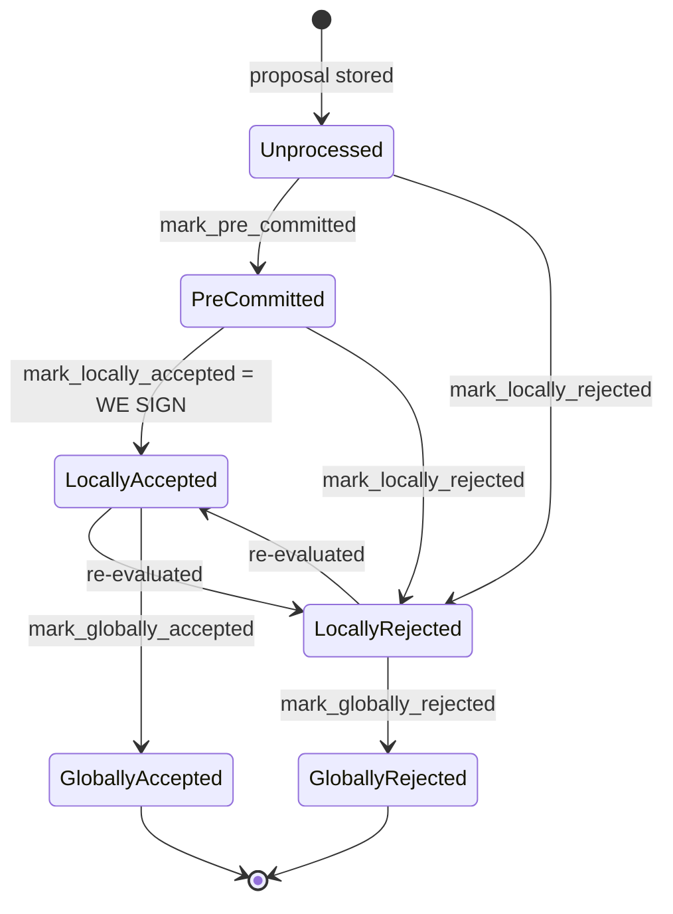

### Title
Signer forwards an already globally-rejected block's aggregated signatures to the node — `mark_locally_accepted` failure is silently ignored before `broadcast_signed_block` ([File: stacks-signer/src/v0/signer.rs])

### Summary
`store_and_process_block_signature` recomputes the aggregate signing weight for a block whenever a peer's `BlockAccepted` message arrives, and once the weight crosses the 70% threshold it unconditionally calls `broadcast_signed_block` (which pushes the block + gathered signatures to the stacks-node via `handle_post_block`) — even when the attempt to record that decision locally (`mark_locally_accepted`) fails because the block has already been finalized as `GloballyRejected` in this signer's own state machine.

### Finding Description
In `stacks-signer/src/v0/signer.rs`, `store_and_process_block_signature` [1](#0-0)  only short-circuits on two conditions: the signature already existing in the DB, or `block_info.signed_group.is_some()`. It does **not** check `block_info.state`. It then recomputes `total_signature_weight` from every stored signature in the DB [2](#0-1) , and if that meets the threshold it proceeds:

```
if let Err(e) = block_info.mark_locally_accepted(true) {
    if !block_info.has_reached_consensus() {
        warn!("{self}: Failed to mark block as locally accepted: {e:?}");
    }
}
...
self.broadcast_signed_block(stacks_client, block_info.block.clone(), &addrs_to_sigs);
``` [3](#0-2) 

`BlockInfo::check_state` explicitly disallows the transition `GloballyRejected -> LocallyAccepted` [4](#0-3) , so if this signer had already finalized the block as `GloballyRejected` (i.e., it already counted a blocking >30% rejection weight and moved to a terminal, "we will never sign this" state), `mark_locally_accepted` returns `Err`. Because `has_reached_consensus()` is `true` in that state, the `warn!` branch is skipped entirely — the error is swallowed with no log, no early return — and the function falls through to unconditionally call `broadcast_signed_block`, which assembles the gathered peer signatures and calls `handle_post_block` to `POST` the block to the local stacks-node [5](#0-4) .

This breaks the equality the state machine is supposed to enforce: "GloballyRejected is terminal — this signer must never act as if the block were accepted" (see `docs/signer-flows.md` §2, "Global states are terminal against each other" [6](#0-5) ). Instead, purely on the basis of accumulated raw signature weight in the local DB (which is populated as `BlockAccepted` messages arrive over StackerDB, independent of this signer's own rejection determination), the signer becomes a relay that pushes a block it has already locally rejected, forwarding it to the node's `/v3/block_proposal`-adjacent post-block path as if it had reached legitimate consensus.

This is the direct analog of the Gogs bug: a lower-privilege/rejected-context signal (`GloballyRejected`, "this block must not be adopted") is used to gate a write/push action only loosely, and the actual "push" operation (`broadcast_signed_block` → `handle_post_block`) is executed regardless of whether the authorization check (`mark_locally_accepted`) succeeded — exactly as Gogs's `PutContents()` executed the write (commit + `git push`) after only a read-permission check (`repoAssignment()`), ignoring the missing write-authorization.

### Impact Explanation
This is a concrete break of the "aggregated-weight vs verified-accepts" equality and a rejection-recounted-as-accept scenario: a signer whose own state machine determined a block is `GloballyRejected` still assembles and forwards the aggregate signature set to its node as an accepted block. Whether the node ultimately adopts it depends on `NakamotoBlockHeader::verify_signer_signatures` re-checking the raw signature weight independently [7](#0-6)  — so the node-side check is a backstop, but the signer's own local safety invariant ("never act on a block I have already globally rejected") is silently violated. Because rejection and acceptance tallies are accumulated in independent DB tables keyed per-signer (`add_block_signature` / `add_block_rejection_signer_addr`), and a signer is not prevented from flip-flopping (sending a rejection and later an acceptance, or vice versa, as explicitly permitted by the "re-evaluated" transitions in the state diagram), the two tallies as seen by a given observing signer are not guaranteed to be mutually exclusive at every point in time — allowing this stale/rejected-block push to occur without requiring a majority of colluding signers, only ordinary gossip-delay/re-evaluation behavior already built into the protocol.

### Likelihood Explanation
Likelihood is limited by the fact that the node performs its own independent `verify_signer_signatures` check before actually adopting the block, so the ultimate chain-safety impact depends on whether the aggregated real signatures (not just this signer's belief) truly reach 70% threshold under the canonical reward set — a scenario that, by design, should be complementary to (and thus should preclude) the >30% rejection threshold. The bug is nonetheless a clear implementation flaw: the omission of a state check before `broadcast_signed_block`, and the silent swallowing of the `mark_locally_accepted` error, is a real logic defect reachable by ordinary message reordering/gossip rather than requiring a majority of malicious signers.

### Recommendation
In `store_and_process_block_signature`, check `block_info.has_reached_consensus()` (or specifically `block_info.state == BlockState::GloballyRejected`) before recomputing weight and before calling `broadcast_signed_block`; on `Err` from `mark_locally_accepted`, return early rather than falling through to broadcast. This restores the invariant that a signer never pushes/broadcasts a block that its own state machine has already finalized as rejected.

### Proof of Concept
1. Signer S receives enough `BlockRejected` gossip messages for block `B` to cross the >30% blocking-minority threshold; `store_and_process_block_rejection` moves `B`'s `BlockInfo.state` to `GloballyRejected`.
2. Due to network/gossip reordering, S later receives a `BlockAccepted` message from a signer who signed `B` before it became aware of the conflict (permitted by the protocol's "re-evaluated" transitions).
3. `handle_block_signature` → `store_and_process_block_signature` is invoked: `block_info.signed_group.is_some()` is `false` (never set, since `mark_locally_accepted` never succeeded), so processing continues; the recomputed `total_signature_weight` from stored signatures happens to meet `min_weight`.
4. `mark_locally_accepted(true)` returns `Err` (blocked transition from `GloballyRejected`), but since `has_reached_consensus()` is `true`, no warning is logged and no early return occurs.
5. `self.broadcast_signed_block(...)` executes unconditionally, assembling `addrs_to_sigs` and calling `handle_post_block`, POSTing the already-`GloballyRejected` block `B` to the stacks-node as though it were validly accepted.

### Citations

**File:** stacks-signer/src/v0/signer.rs (L2442-2471)
```rust
    /// Store the block acceptance signature and check if we have reached a consensus decision on the block because of it. If we have, update the block state accordingly and broadcast the block if accepted.
    fn store_and_process_block_signature(
        &mut self,
        stacks_client: &StacksClient,
        sortition_state: &mut Option<SortitionsView>,
        block_info: &mut BlockInfo,
        signer_address: &StacksAddress,
        signature: &MessageSignature,
    ) {
        let block_hash = &block_info.signer_signature_hash();
        // signature is valid! store it.
        // if this returns false, it means the signature already exists in the DB, so just return.
        if !self
            .signer_db
            .add_block_signature(block_hash, signer_address, signature)
            .unwrap_or_else(|_| panic!("{self}: Failed to save block signature"))
        {
            return;
        }

        // If this isn't our own signature and we haven't seen a pre-commit from this signer yet, try treating it as a pre-commit in case the caller is running an outdated version
        if signer_address != &self.stacks_address && !self.signer_db.has_committed(block_hash, signer_address).inspect_err(|e| warn!("Failed to check if pre-commit message already considered for {signer_address:?} for {block_hash}: {e}")).unwrap_or(false) {
            self.handle_block_pre_commit(stacks_client, sortition_state, signer_address, block_hash);
            return;
        }

        if block_info.signed_group.is_some() {
            // We have already processed this block to the accepted state. Adding more signatures will not change anything so nothing to check.
            return;
        }
```

**File:** stacks-signer/src/v0/signer.rs (L2472-2496)
```rust
        // do we have enough signatures to broadcast?
        // i.e. is the threshold reached?
        let signatures = self
            .signer_db
            .get_block_signatures(block_hash)
            .unwrap_or_else(|_| panic!("{self}: Failed to load block signatures"));

        // put signatures in order by signer address (i.e. reward cycle order)
        let addrs_to_sigs: HashMap<_, _> = signatures
            .into_iter()
            .filter_map(|sig| {
                let Ok(public_key) = Secp256k1PublicKey::recover_to_pubkey_without_validating_low_s(
                    block_hash.bits(),
                    &sig,
                ) else {
                    return None;
                };
                let addr = StacksAddress::p2pkh(self.mainnet, &public_key);
                Some((addr, sig))
            })
            .collect();

        let signature_weight = self.signer_weights.get(signer_address).unwrap_or(&0);
        let total_signature_weight = self.compute_signature_signing_weight(addrs_to_sigs.keys());
        let total_weight = self.compute_signature_total_weight();
```

**File:** stacks-signer/src/v0/signer.rs (L2525-2538)
```rust
        // have enough signatures to broadcast!
        // move block to LOCALLY accepted state.
        // It is only considered globally accepted IFF we receive a new block event confirming it OR see the chain tip of the node advance to it.
        if let Err(e) = block_info.mark_locally_accepted(true) {
            if !block_info.has_reached_consensus() {
                warn!("{self}: Failed to mark block as locally accepted: {e:?}");
            }
        }
        let _ = self.signer_db.insert_block(block_info).map_err(|e| {
            warn!("Failed to set group threshold signature timestamp for {block_hash}: {e:?}");
            panic!("{self} Failed to write block to signerdb: {e}");
        });
        self.broadcast_signed_block(stacks_client, block_info.block.clone(), &addrs_to_sigs);
    }
```

**File:** stacks-signer/src/v0/signer.rs (L2540-2583)
```rust
    fn broadcast_signed_block(
        &mut self,
        stacks_client: &StacksClient,
        mut block: NakamotoBlock,
        addrs_to_sigs: &HashMap<StacksAddress, MessageSignature>,
    ) {
        #[cfg(any(test, feature = "testing"))]
        self.test_pause_block_broadcast(&block);

        // collect signatures for the block
        let signatures: Vec<_> = self
            .signer_addresses
            .iter()
            .filter_map(|addr| addrs_to_sigs.get(addr).cloned())
            .collect();

        block.header.signer_signature_hash();
        block.header.signer_signature = signatures;

        self.handle_post_block(stacks_client, &block);
    }

    /// Attempt to post a block to the stacks-node and handle the result
    pub fn handle_post_block(&mut self, stacks_client: &StacksClient, block: &NakamotoBlock) {
        #[cfg(any(test, feature = "testing"))]
        if self.test_skip_block_broadcast(block) {
            return;
        }
        let block_hash = block.header.signer_signature_hash();
        match stacks_client.post_block(block) {
            Ok(accepted) => {
                debug!("{self}: Block {block_hash} accepted by stacks node: {accepted}");
                if let Err(e) = self
                    .signer_db
                    .set_block_broadcasted(&block_hash, get_epoch_time_secs())
                {
                    warn!("{self}: Failed to set block broadcasted for {block_hash}: {e:?}");
                }
            }
            Err(e) => {
                warn!("{self}: Failed to broadcast block {block_hash} to the node: {e}")
            }
        }
    }
```

**File:** stacks-signer/src/signerdb.rs (L313-329)
```rust
    /// Check if the block state transition is valid
    fn check_state(&self, state: BlockState) -> bool {
        let prev_state = &self.state;
        if *prev_state == state {
            return true;
        }
        match state {
            BlockState::Unprocessed => false,
            BlockState::LocallyAccepted | BlockState::LocallyRejected => !matches!(
                prev_state,
                BlockState::GloballyRejected | BlockState::GloballyAccepted
            ),
            BlockState::GloballyAccepted => !matches!(prev_state, BlockState::GloballyRejected),
            BlockState::GloballyRejected => !matches!(prev_state, BlockState::GloballyAccepted),
            BlockState::PreCommitted => matches!(prev_state, BlockState::Unprocessed),
        }
    }
```

**File:** docs/signer-flows.md (L130-150)
```markdown
## 2. Block lifecycle (`BlockState`)

Every proposal tracked in the signer DB carries a `BlockState`. **`PreCommitted`
carries no signature**: it means "validated, willing to sign if the pre-commit
threshold is met." The first signature appears at `mark_locally_accepted`.
Global states are terminal against each other.


```

**File:** stackslib/src/chainstate/nakamoto/mod.rs (L1097-1189)
```rust
    pub fn verify_signer_signatures(
        &self,
        reward_set: &RewardSet,
        epoch_id: StacksEpochId,
    ) -> Result<u32, ChainstateError> {
        let message = self.signer_signature_hash();
        let Some(signers) = reward_set.signers() else {
            return Err(ChainstateError::InvalidStacksBlock(
                "No signers in the reward set".to_string(),
            ));
        };

        // if this is a shadow block, then its signing weight is as if every signer signed it, even
        // though the signature vector is undefined.
        if self.is_shadow_block() {
            return Ok(self.get_shadow_signer_weight(reward_set)?);
        }

        let mut total_weight_signed: u32 = 0;
        // `last_index` is used to prevent out-of-order signatures
        let mut last_index = None;
        // Before Epoch 4.0, signature order check contained a bug, so gate the
        // strict ordering behavior on the epoch.
        let strict_order = epoch_id.enforces_strict_signature_order();

        let total_weight = reward_set
            .total_signing_weight()
            .map_err(|_| ChainstateError::NoRegisteredSigners(0))?;

        // HashMap of <PublicKey, (Signer, Index)>
        let mut signers_by_pk: HashMap<_, _> = signers
            .iter()
            .enumerate()
            .map(|(i, signer)| (&signer.signing_key, (signer, i)))
            .collect();

        for signature in self.signer_signature.iter() {
            let public_key = Secp256k1PublicKey::recover_to_pubkey_without_validating_low_s(
                message.bits(),
                signature,
            )
            .map_err(|_| {
                ChainstateError::InvalidStacksBlock(format!(
                    "Unable to recover public key from signature {}",
                    signature.to_hex()
                ))
            })?;

            let mut public_key_bytes = [0u8; 33];
            public_key_bytes.copy_from_slice(&public_key.to_bytes_compressed()[..]);

            let (signer, signer_index) = signers_by_pk.remove(&public_key_bytes).ok_or_else(|| {
                warn!(
                    "Found an invalid public key. Reward set has {} signers. Chain length {}. Signatures length {}",
                    signers.len(),
                    self.chain_length,
                    self.signer_signature.len(),
                );
                ChainstateError::InvalidStacksBlock(format!(
                    "Public key {} not found in the reward set",
                    public_key.to_hex()
                ))
            })?;

            // Enforce order of signatures
            if let Some(index) = last_index.as_ref() {
                if *index >= signer_index {
                    return Err(ChainstateError::InvalidStacksBlock(
                        "Signatures are out of order".to_string(),
                    ));
                }
                if strict_order {
                    last_index = Some(signer_index);
                }
            } else {
                last_index = Some(signer_index);
            }

            total_weight_signed = total_weight_signed
                .checked_add(signer.weight)
                .expect("FATAL: overflow while computing signer set threshold");
        }

        let threshold = Self::compute_voting_weight_threshold(total_weight)?;

        if total_weight_signed < threshold {
            return Err(ChainstateError::InvalidStacksBlock(format!(
                "Not enough signatures. Needed at least {} but got {} (out of {})",
                threshold, total_weight_signed, total_weight,
            )));
        }

        return Ok(total_weight_signed);
```
