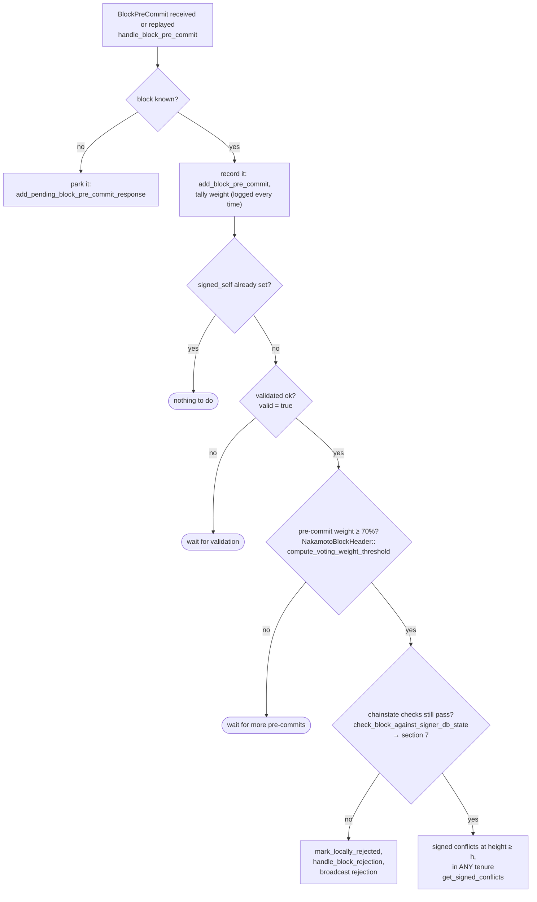
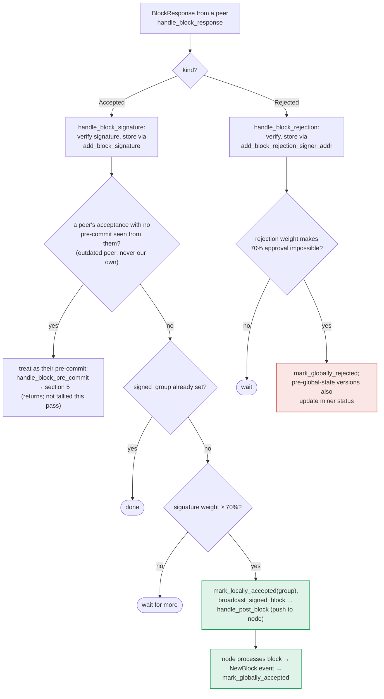

### Title
Signer relays a block it locally rejected once peer acceptance weight crosses threshold, because `store_and_process_block_signature` never re-checks `block_info.valid` — ([File: stacks-signer/src/v0/signer.rs])

### Summary
`handle_block_pre_commit` explicitly refuses to act on pre-commit tallying unless the local signer has already determined the block valid (`block_info.valid.unwrap_or(false)`), and it even re-runs the full chainstate check before signing. `store_and_process_block_signature` — the sibling function that tallies *other signers' acceptance signatures* and pushes the block to the node once 70% weight is reached — has no equivalent check. A signer that has itself rejected a block (`valid = Some(false)`) will still count peers' `Accepted` signatures toward the threshold and broadcast the block to its own node once that threshold is crossed, silently overriding its own rejection decision.

### Finding Description
In `handle_block_pre_commit`, before tallying weight toward the signature threshold, the code explicitly bails out if the local validity flag isn't `true`: [1](#0-0) 

By contrast, `handle_block_signature` → `store_and_process_block_signature` — the path that tallies *other signers'* `BlockAccepted` messages — never inspects `block_info.valid` at all: [2](#0-1) [3](#0-2) 

The only gates present are: (1) is this a duplicate/known signature (`add_block_signature`), (2) is the peer an "outdated" one that never pre-committed (redirect to `handle_block_pre_commit`, which *does* check validity — but only for the case where our own pre-commit tally crosses threshold, not for an already-crossed peer-signature tally), (3) is `signed_group` already set, and (4) is the aggregated weight ≥ threshold. None of these consult `block_info.valid`. `mark_locally_accepted(true)` (called with `group_signed = true`) does not set `valid`, so a block that this signer separately marked `valid = Some(false)` via `handle_block_validate_reject` / `handle_block_validate_ok`'s recheck path keeps that flag while its `state` moves to `LocallyAccepted` and `broadcast_signed_block` pushes it to the node: [4](#0-3) 

The project's own architecture docs confirm this asymmetry: section 5 ("Pre-commit threshold → signature") shows an explicit `VALID{"validated ok? valid = true"}` gate before any tally proceeds, while section 6 ("Responses from other signers") shows the acceptance-tally path (`HBS → OLD → GRP → TALLY → BCAST`) with no such gate: [5](#0-4) [6](#0-5) 

This is the exact analog of the lxd bug: one code path (`handle_block_pre_commit` / non-recursive-equivalent-guard) applies the correctness check, while the structurally parallel path (`store_and_process_block_signature`) that reaches the very same "push the result forward" action omits it.

### Impact Explanation
This breaks the "own rejection is final until re-evaluated" invariant. In an asynchronous network, a miner can (via ordinary tenure timing / sibling-proposal races that this codebase's own tests already exercise, e.g. `run_sibling_scenario`) cause one signer's view of the chain to diverge from its peers' at proposal time, leading that signer to reject a block while other signers — each independently and honestly convinced by their own view — accept it and reach 70% weight. The rejecting signer then relays/pushes that very block to its own node via `broadcast_signed_block`, contradicting its own stored rejection reason and validity determination, and does so without ever re-running `check_block_against_signer_db_state` on the state at time of relaying. This is a "rejection recounted as acceptance" style break of the signer's own bookkeeping/consensus guarantee, and it happens without requiring a majority of malicious signers — only honest peers with a different, timing-driven view of the chain and a single miner exploiting that timing window.

### Likelihood Explanation
The precondition (a signer that itself rejected a block via `check_block_against_signer_db_state` / `handle_block_validate_reject`, while ≥70% weight of peers accept the same signature hash) is exactly the race window the codebase's own sibling/reorg tests are built to probe (`run_sibling_scenario`, `reproposal_cannot_bypass_fresh_conflict`), showing this divergence is a realistic, reachable state rather than a purely theoretical one. No StackerDB flooding, majority corruption, or key compromise is needed — a miner needs only to exploit normal proposal/gossip timing.

### Recommendation
Add a validity gate to `store_and_process_block_signature` (and/or `handle_block_signature`) mirroring `handle_block_pre_commit`'s check: before tallying weight and before calling `mark_locally_accepted`/`broadcast_signed_block`, verify `block_info.valid.unwrap_or(false)` is true, and if it is `Some(false)` re-run `check_block_against_signer_db_state` (or otherwise refuse to relay) rather than pushing a block this signer has locally rejected.

### Proof of Concept
1. Construct two conflicting tenure-start blocks A and B at the same height/tenure (as in `run_sibling_scenario`).
2. Arrange (via proposal-broadcast stalling, as the existing tests do with `TEST_BROADCAST_PROPOSAL_STALL`) that signer S receives B's proposal, validates it, and its own `check_block_against_signer_db_state` determines B conflicts with A (which S already signed) — S calls `handle_block_validate_reject`/marks `valid = Some(false)` for B and broadcasts a rejection.
3. Meanwhile ≥70% weight of other signers, seeing a different ordering/timing (e.g., A's signature is stale for them or they haven't seen A), validate and sign B, broadcasting `BlockAccepted` for B.
4. S receives these `BlockAccepted` messages; `handle_block_signature` → `store_and_process_block_signature` tallies them without checking S's own `block_info.valid` for B, crosses threshold, calls `mark_locally_accepted(true)`, and calls `broadcast_signed_block`, pushing block B to S's own node — despite S having locally rejected B moments earlier.

### Citations

**File:** stacks-signer/src/v0/signer.rs (L1316-1331)
```rust
        if block_info.signed_self.is_some() {
            debug!(
                "{self}: Received pre-commit for a block that we have already signed. Doing nothing...",
            );
            return;
        }

        if !block_info.valid.unwrap_or(false) {
            // We received a pre-commit for a block that we have not validated or we have already marked this block as invalid.
            // We should not do anything further as we do not know what our response should be and we do not change our votes on rejected
            // blocks unless we receive a new block proposal for it and the reject reason allows us to reconsider.
            debug!(
                "{self}: Received a pre-commit for a block that we have not determined to be valid: {:?}. Doing nothing...", block_info.valid
            );
            return;
        }
```

**File:** stacks-signer/src/v0/signer.rs (L2372-2440)
```rust
    fn handle_block_signature(
        &mut self,
        stacks_client: &StacksClient,
        sortition_state: &mut Option<SortitionsView>,
        accepted: &BlockAccepted,
    ) {
        let BlockAccepted {
            signer_signature_hash: block_hash,
            signature,
            metadata,
            ..
        } = accepted;
        debug!(
            "{self}: Received a block-accept signature: ({block_hash}, {signature}, {})",
            metadata.server_version
        );

        // recover public key
        let Ok(public_key) = Secp256k1PublicKey::recover_to_pubkey_without_validating_low_s(
            block_hash.bits(),
            signature,
        ) else {
            debug!("{self}: Received unrecovarable signature. Will not store.";
                   "signature" => %signature,
                   "signer_signature_hash" => %block_hash);

            return;
        };

        // authenticate the signature -- it must be signed by one of the stacking set
        let signer_address = StacksAddress::p2pkh(self.mainnet, &public_key);
        if !self.is_valid_signer(&signer_address) {
            debug!("{self}: Received block acceptance with an invalid signature. Will not store.";
                "signer_public_key" => ?public_key,
                "signer_address" => %signer_address,
                "signer_signature_hash" => %block_hash,
                "signature" => %signature
            );
            return;
        }
        let Some(mut block_info) = self.block_lookup_by_reward_cycle(block_hash) else {
            if let Err(e) = self.signer_db.add_pending_block_signature_response(
                block_hash,
                &signer_address,
                signature,
            ) {
                warn!("{self}: Failed to add pending block signature response: {e:?}");
            }
            return;
        };

        info!("{self}: Received block acceptance";
            "signer_pubkey" => public_key.to_hex(),
            "signer_address" => %signer_address,
            "signer_signature_hash" => %block_hash,
            "consensus_hash" => %block_info.block.header.consensus_hash,
            "block_height" => block_info.block.header.chain_length,
            "signer_weight" => self.signer_weights.get(&signer_address).copied().unwrap_or(0),
            "tenure_extend_timestamp" => accepted.response_data.tenure_extend_timestamp,
            "tenure_extend_read_count_timestamp" => accepted.response_data.tenure_extend_read_count_timestamp
        );
        self.store_and_process_block_signature(
            stacks_client,
            sortition_state,
            &mut block_info,
            &signer_address,
            signature,
        );
    }
```

**File:** stacks-signer/src/v0/signer.rs (L2442-2538)
```rust
    /// Store the block acceptance signature and check if we have reached a consensus decision on the block because of it. If we have, update the block state accordingly and broadcast the block if accepted.
    fn store_and_process_block_signature(
        &mut self,
        stacks_client: &StacksClient,
        sortition_state: &mut Option<SortitionsView>,
        block_info: &mut BlockInfo,
        signer_address: &StacksAddress,
        signature: &MessageSignature,
    ) {
        let block_hash = &block_info.signer_signature_hash();
        // signature is valid! store it.
        // if this returns false, it means the signature already exists in the DB, so just return.
        if !self
            .signer_db
            .add_block_signature(block_hash, signer_address, signature)
            .unwrap_or_else(|_| panic!("{self}: Failed to save block signature"))
        {
            return;
        }

        // If this isn't our own signature and we haven't seen a pre-commit from this signer yet, try treating it as a pre-commit in case the caller is running an outdated version
        if signer_address != &self.stacks_address && !self.signer_db.has_committed(block_hash, signer_address).inspect_err(|e| warn!("Failed to check if pre-commit message already considered for {signer_address:?} for {block_hash}: {e}")).unwrap_or(false) {
            self.handle_block_pre_commit(stacks_client, sortition_state, signer_address, block_hash);
            return;
        }

        if block_info.signed_group.is_some() {
            // We have already processed this block to the accepted state. Adding more signatures will not change anything so nothing to check.
            return;
        }
        // do we have enough signatures to broadcast?
        // i.e. is the threshold reached?
        let signatures = self
            .signer_db
            .get_block_signatures(block_hash)
            .unwrap_or_else(|_| panic!("{self}: Failed to load block signatures"));

        // put signatures in order by signer address (i.e. reward cycle order)
        let addrs_to_sigs: HashMap<_, _> = signatures
            .into_iter()
            .filter_map(|sig| {
                let Ok(public_key) = Secp256k1PublicKey::recover_to_pubkey_without_validating_low_s(
                    block_hash.bits(),
                    &sig,
                ) else {
                    return None;
                };
                let addr = StacksAddress::p2pkh(self.mainnet, &public_key);
                Some((addr, sig))
            })
            .collect();

        let signature_weight = self.signer_weights.get(signer_address).unwrap_or(&0);
        let total_signature_weight = self.compute_signature_signing_weight(addrs_to_sigs.keys());
        let total_weight = self.compute_signature_total_weight();

        let min_weight = NakamotoBlockHeader::compute_voting_weight_threshold(total_weight)
            .unwrap_or_else(|_| {
                panic!("{self}: Failed to compute threshold weight for {total_weight}")
            });

        if min_weight > total_signature_weight {
            info!("{self}: Received block acceptance, but have not yet reached the acceptance threshold.";
                "signer_signature_hash" => %block_hash,
                "signature_weight" => signature_weight,
                "consensus_hash" => %block_info.block.header.consensus_hash,
                "block_height" => block_info.block.header.chain_length,
                "total_weight_approved" => total_signature_weight,
                "total_weight" => total_weight,
                "percent_approved" => (total_signature_weight as f64 / total_weight as f64 * 100.0),
            );
            return;
        }
        info!("{self}: have reached the block acceptance threshold";
            "signer_signature_hash" => %block_hash,
            "signature_weight" => signature_weight,
            "consensus_hash" => %block_info.block.header.consensus_hash,
            "block_height" => block_info.block.header.chain_length,
            "total_weight_approved" => total_signature_weight,
            "total_weight" => total_weight,
            "percent_approved" => (total_signature_weight as f64 / total_weight as f64 * 100.0),
        );

        // have enough signatures to broadcast!
        // move block to LOCALLY accepted state.
        // It is only considered globally accepted IFF we receive a new block event confirming it OR see the chain tip of the node advance to it.
        if let Err(e) = block_info.mark_locally_accepted(true) {
            if !block_info.has_reached_consensus() {
                warn!("{self}: Failed to mark block as locally accepted: {e:?}");
            }
        }
        let _ = self.signer_db.insert_block(block_info).map_err(|e| {
            warn!("Failed to set group threshold signature timestamp for {block_hash}: {e:?}");
            panic!("{self} Failed to write block to signerdb: {e}");
        });
        self.broadcast_signed_block(stacks_client, block_info.block.clone(), &addrs_to_sigs);
    }
```

**File:** stacks-signer/src/signerdb.rs (L279-289)
```rust
    /// Mark this block as valid and the appropriate timestamps if they aren't already set, and attempt to mark it as locally accepted.
    pub fn mark_locally_accepted(&mut self, group_signed: bool) -> Result<(), String> {
        if group_signed {
            self.signed_group.get_or_insert(get_epoch_time_secs());
        } else {
            self.valid = Some(true);
            self.approved_time.get_or_insert(get_epoch_time_secs());
            self.signed_self.get_or_insert(get_epoch_time_secs());
        }
        self.move_to(BlockState::LocallyAccepted)
    }
```

**File:** docs/signer-flows.md (L237-250)
```markdown


**File:** docs/signer-flows.md (L357-375)
```markdown

```
