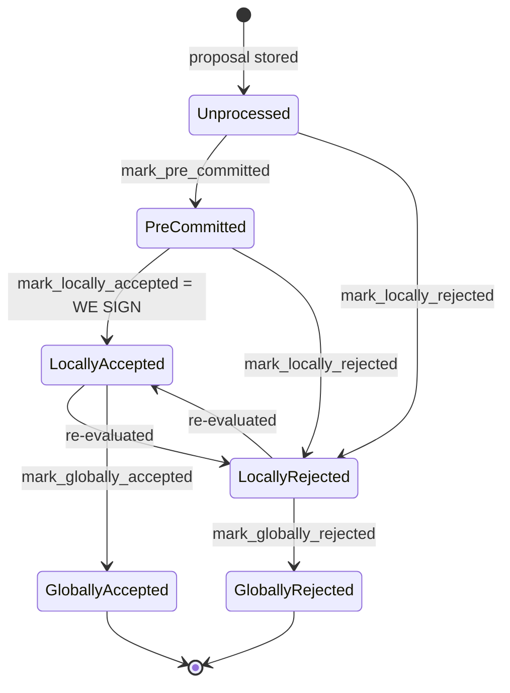
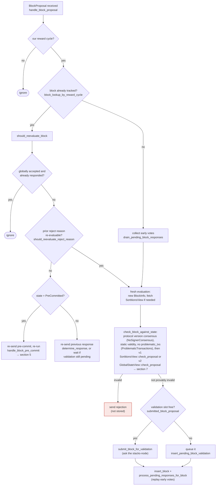

## Title
Stale rejection weight from a switched signer vote persists forever in the miner's block-status tally, causing false `SignersRejected` on a legitimately-approved block - (File: `stacks-node/src/nakamoto_node/stackerdb_listener.rs`)

## Summary
The node-side `StackerDBListener` tallies signer votes for a proposed block into two independent counters, `total_weight_approved` and `total_weight_rejected`, guarded by two *different* sets: `gathered_signatures` (touched only on `Accepted`) and `responded_signers` (touched on both `Accepted` and `Rejected`) [1](#0-0) . When a signer first rejects a block and later legitimately switches to accept the *same* block hash (a state transition the signer protocol explicitly allows), the earlier weight credited to `total_weight_rejected` is never reversed, while the new weight is separately credited to `total_weight_approved`. This is the same bug class as H-3: a running total is updated once from a past event and never reconciled against the actual, current outcome.

## Finding Description
`BlockStatus` tracks vote weight with two independent guard collections [1](#0-0) :
- On `BlockResponse::Accepted`, the weight is added to `total_weight_approved` only if the signer's slot is not already in `gathered_signatures`, and then the slot is inserted into both `gathered_signatures` and `responded_signers` [2](#0-1) .
- On `BlockResponse::Rejected`, the weight is added to `total_weight_rejected` only if the signer's slot is not already in `responded_signers` [3](#0-2) .

Because `gathered_signatures` is never touched by the reject path, a signer that first sends `Rejected` (crediting `total_weight_rejected`, and marking `responded_signers`) and later sends `Accepted` for the identical `signer_signature_hash` will pass the `!gathered_signatures.contains_key(&slot_id)` check and get credited a second time into `total_weight_approved` — with no code path anywhere that decrements the stale `total_weight_rejected` credit for that signer. The reverse case (accept-then-reject) is silently dropped instead (no credit at all), which is also wrong but less dangerous.

This vote flip is not theoretical: the signer's own local state machine explicitly documents and permits `LocallyRejected --> LocallyAccepted` (and vice versa) transitions on "re-evaluated" [4](#0-3) , triggered when the miner re-sends the exact same block proposal and the previous reject reason is judged re-evaluable [5](#0-4) . The signer-side handlers that emit the two conflicting `BlockResponse` messages consumed by the listener are `store_and_process_block_rejection` (emits `Rejected`) and `store_and_process_block_signature`/`handle_block_pre_commit` (emits `Accepted`) [6](#0-5) [7](#0-6) .

## Impact Explanation
`SignCoordinator::wait_for_signatures` (or equivalent) checks the rejection condition before the approval condition on each poll: if `total_weight_rejected + weight_threshold > total_weight`, it immediately returns `Err(NakamotoNodeError::SignersRejected{...})`, abandoning the block [8](#0-7) . Because the stale rejection weight from a signer who has since switched to accept is never removed, this permanently-inflated `total_weight_rejected` can push the aggregate rejection weight over the blocking-minority threshold even when the real, currently-active set of rejecting signers is below it — a legitimately signed/approvable block can be wrongly discarded as globally rejected. This breaks the aggregated-weight-vs-verified-accepts equality the coordinator relies on and is a liveness wedge on block production: a single signer's protocol-legal vote switch (triggerable merely by the block proposer re-sending the same block) is enough, no signer majority or forged keys required.

## Likelihood Explanation
Re-proposal of an identical block that causes a signer to re-evaluate and flip its vote is a normal, documented path in the signer state machine [9](#0-8) , fully controllable by the tenure's own miner (the entity that decides when/whether to re-broadcast a proposal). No cooperation from other signers or access to any private keys is required — only the vote-switching signer's own legitimate signature on its own second message.

## Recommendation
Track a single authoritative vote-outcome per signer slot (e.g., `HashMap<u32, Vote>` where `Vote` is `Accepted(weight)`/`Rejected(weight)`), and recompute `total_weight_approved`/`total_weight_rejected` by summing over that map rather than maintaining two independently-guarded running totals. When a signer's slot changes outcome, subtract its previous contribution from the old bucket before crediting the new one, so the tallies always reflect the signer's current, not historical, vote.

## Proof of Concept
1. Miner proposes block `B` (hash `H`) to the signer set.
2. Signer `S` (weight `w`) evaluates `B` as invalid for a re-evaluable reason (e.g. `ConnectivityIssues`) and broadcasts `BlockResponse::Rejected(H)`. The listener credits `total_weight_rejected += w` and marks `S`'s slot in `responded_signers` [3](#0-2) .
3. The miner re-sends the identical proposal for `H`. Per `should_reevaluate_reject_reason`, `S` re-evaluates and now finds it valid (or reaches pre-commit threshold and signs), broadcasting `BlockResponse::Accepted(H)` [10](#0-9) .
4. The listener checks `!gathered_signatures.contains_key(slot_S)`, which is true (never touched before), so it credits `total_weight_approved += w` [2](#0-1) . `total_weight_rejected` still contains `S`'s earlier `w`, permanently.
5. If other signers' genuine rejections, combined with `S`'s stale `w`, push `total_weight_rejected + weight_threshold` over `total_weight`, `SignCoordinator` returns `SignersRejected` and abandons a block that in reality has `S` (and possibly quorum) approving it [8](#0-7) .

### Citations

**File:** stacks-node/src/nakamoto_node/stackerdb_listener.rs (L70-82)
```rust
#[derive(Debug, Clone)]
pub struct BlockStatus {
    /// Set of the slot ids of signers who have responded
    pub responded_signers: HashSet<u32>,
    /// Map of the slot id of signers who have signed the block and their signature
    pub gathered_signatures: BTreeMap<u32, MessageSignature>,
    /// Total weight of signers who have signed the block
    pub total_weight_approved: u32,
    /// Total weight of signers who have rejected the block
    pub total_weight_rejected: u32,
    /// Per-txid rejection tracking from signers
    pub failed_txids: HashMap<Txid, FailedTxInfo>,
}
```

**File:** stacks-node/src/nakamoto_node/stackerdb_listener.rs (L443-465)
```rust
                        if !block.gathered_signatures.contains_key(&slot_id) {
                            block.total_weight_approved = block
                                .total_weight_approved
                                .saturating_add(signer_entry.weight);

                            info!("StackerDBListener: Signature Added to block";
                                "signer_signature_hash" => %block_sighash,
                                "signer_pubkey" => signer_pubkey.to_hex(),
                                "signer_slot_id" => slot_id,
                                "signature" => %signature,
                                "signer_weight" => signer_entry.weight,
                                "total_weight_approved" => block.total_weight_approved,
                                "percent_approved" => block.total_weight_approved as f64 / self.total_weight as f64 * 100.0,
                                "total_weight_rejected" => block.total_weight_rejected,
                                "percent_rejected" => block.total_weight_rejected as f64 / self.total_weight as f64 * 100.0,
                                "weight_threshold" => self.weight_threshold,
                                "tenure_extend_timestamp" => tenure_extend_timestamp,
                                "read_count_extend_timestamp" => read_count_extend_timestamp,
                                "server_version" => metadata.server_version,
                            );
                        }
                        block.gathered_signatures.insert(slot_id, signature);
                        block.responded_signers.insert(slot_id);
```

**File:** stacks-node/src/nakamoto_node/stackerdb_listener.rs (L515-518)
```rust
                        if block.responded_signers.insert(slot_id) {
                            block.total_weight_rejected = block
                                .total_weight_rejected
                                .saturating_add(signer_entry.weight);
```

**File:** docs/signer-flows.md (L130-203)
```markdown
## 2. Block lifecycle (`BlockState`)

Every proposal tracked in the signer DB carries a `BlockState`. **`PreCommitted`
carries no signature**: it means "validated, willing to sign if the pre-commit
threshold is met." The first signature appears at `mark_locally_accepted`.
Global states are terminal against each other.



Canonical paths shown; the exact rule in `BlockInfo::check_state` is: either
local state is reachable from anything not yet global, `PreCommitted` only from
`Unprocessed`, and each global state is unreachable from the other.

Timestamps: `approved_time` is stamped at pre-commit _or_ local acceptance
(first wins), `signed_self` only when we sign, `signed_group` when the group
threshold is observed.

> Anchors: `BlockInfo::check_state`, `move_to`, `mark_pre_committed`,
> `mark_locally_accepted`, `mark_globally_accepted`, `mark_locally_rejected`,
> `mark_globally_rejected` (signerdb.rs)

## 3. A block proposal arrives

The miner broadcasts a proposal. If we've seen this exact block before,
`should_reevaluate_block` decides whether the old verdict stands; a block we
only pre-committed to is deliberately routed back through the pre-commit
evaluation so a re-proposal cannot shortcut to a signature. A fresh proposal is
checked against our view of the world _before_ spending a node validation on it.



Early votes: acceptances, rejections, and pre-commits that arrived before the
proposal itself are parked in pending tables and replayed once the proposal is
known.

> Anchors: `handle_block_proposal`, `should_reevaluate_block`,
> `should_reevaluate_reject_reason`, `check_block_against_state`,
> `submit_block_for_validation`, `process_pending_responses_for_block`
> (signer.rs); `check_proposal` (chainstate/v1.rs, v2.rs)
```

**File:** stacks-signer/src/v0/signer.rs (L2274-2337)
```rust
    ) {
        let block_hash = &block_info.signer_signature_hash();
        // We should still store signatures even on consensus reached blocks for auditing purposes.
        // signature is valid! store it
        match self.signer_db.add_block_rejection_signer_addr(
            block_hash,
            signer_address,
            reject_reason,
        ) {
            Err(e) => {
                warn!("{self}: Failed to save block rejection signature: {e:?}",);
            }
            Ok(false) => return, // We already have this signature, do not process it again.
            Ok(true) => (),
        }

        if block_info.has_reached_consensus() {
            // Checking the rejection signatures is pointless. We have already reached consensus on this block.
            return;
        }

        // do we have enough signatures to mark a block a globally rejected?
        // i.e. is (set-size) - (threshold) + 1 reached.
        let rejection_addrs = match self.signer_db.get_block_rejection_signer_addrs(block_hash) {
            Ok(addrs) => addrs,
            Err(e) => {
                warn!("{self}: Failed to load block rejection addresses: {e:?}.",);
                return;
            }
        };
        let signature_weight = self.signer_weights.get(signer_address).unwrap_or(&0);
        let total_reject_weight =
            self.compute_signature_signing_weight(rejection_addrs.iter().map(|(addr, _)| addr));
        let total_weight = self.compute_signature_total_weight();

        let min_weight = NakamotoBlockHeader::compute_voting_weight_threshold(total_weight)
            .unwrap_or_else(|_| {
                panic!("{self}: Failed to compute threshold weight for {total_weight}")
            });
        if total_reject_weight.saturating_add(min_weight) <= total_weight {
            // Not enough rejection signatures to make a decision
            info!("{self}: Have not yet received enough block rejections to reach a consensus decision on this block";
                "signer_signature_hash" => %block_hash,
                "signature_weight" => signature_weight,
                "consensus_hash" => %block_info.block.header.consensus_hash,
                "block_height" => block_info.block.header.chain_length,
                "total_weight_rejected" => total_reject_weight,
                "total_weight" => total_weight,
                "percent_rejected" => (total_reject_weight as f64 / total_weight as f64 * 100.0),
            );
            return;
        }
        info!("{self}: have reached the block rejection threshold";
            "signer_signature_hash" => %block_hash,
            "signature_weight" => signature_weight,
            "consensus_hash" => %block_info.block.header.consensus_hash,
            "block_height" => block_info.block.header.chain_length,
            "total_weight_rejected" => total_reject_weight,
            "total_weight" => total_weight,
            "percent_rejected" => (total_reject_weight as f64 / total_weight as f64 * 100.0),
        );
        if let Err(e) = block_info.mark_globally_rejected() {
            warn!("{self}: Failed to mark block as globally rejected: {e:?}",);
        }
```

**File:** stacks-signer/src/v0/signer.rs (L2442-2537)
```rust
    /// Store the block acceptance signature and check if we have reached a consensus decision on the block because of it. If we have, update the block state accordingly and broadcast the block if accepted.
    fn store_and_process_block_signature(
        &mut self,
        stacks_client: &StacksClient,
        sortition_state: &mut Option<SortitionsView>,
        block_info: &mut BlockInfo,
        signer_address: &StacksAddress,
        signature: &MessageSignature,
    ) {
        let block_hash = &block_info.signer_signature_hash();
        // signature is valid! store it.
        // if this returns false, it means the signature already exists in the DB, so just return.
        if !self
            .signer_db
            .add_block_signature(block_hash, signer_address, signature)
            .unwrap_or_else(|_| panic!("{self}: Failed to save block signature"))
        {
            return;
        }

        // If this isn't our own signature and we haven't seen a pre-commit from this signer yet, try treating it as a pre-commit in case the caller is running an outdated version
        if signer_address != &self.stacks_address && !self.signer_db.has_committed(block_hash, signer_address).inspect_err(|e| warn!("Failed to check if pre-commit message already considered for {signer_address:?} for {block_hash}: {e}")).unwrap_or(false) {
            self.handle_block_pre_commit(stacks_client, sortition_state, signer_address, block_hash);
            return;
        }

        if block_info.signed_group.is_some() {
            // We have already processed this block to the accepted state. Adding more signatures will not change anything so nothing to check.
            return;
        }
        // do we have enough signatures to broadcast?
        // i.e. is the threshold reached?
        let signatures = self
            .signer_db
            .get_block_signatures(block_hash)
            .unwrap_or_else(|_| panic!("{self}: Failed to load block signatures"));

        // put signatures in order by signer address (i.e. reward cycle order)
        let addrs_to_sigs: HashMap<_, _> = signatures
            .into_iter()
            .filter_map(|sig| {
                let Ok(public_key) = Secp256k1PublicKey::recover_to_pubkey_without_validating_low_s(
                    block_hash.bits(),
                    &sig,
                ) else {
                    return None;
                };
                let addr = StacksAddress::p2pkh(self.mainnet, &public_key);
                Some((addr, sig))
            })
            .collect();

        let signature_weight = self.signer_weights.get(signer_address).unwrap_or(&0);
        let total_signature_weight = self.compute_signature_signing_weight(addrs_to_sigs.keys());
        let total_weight = self.compute_signature_total_weight();

        let min_weight = NakamotoBlockHeader::compute_voting_weight_threshold(total_weight)
            .unwrap_or_else(|_| {
                panic!("{self}: Failed to compute threshold weight for {total_weight}")
            });

        if min_weight > total_signature_weight {
            info!("{self}: Received block acceptance, but have not yet reached the acceptance threshold.";
                "signer_signature_hash" => %block_hash,
                "signature_weight" => signature_weight,
                "consensus_hash" => %block_info.block.header.consensus_hash,
                "block_height" => block_info.block.header.chain_length,
                "total_weight_approved" => total_signature_weight,
                "total_weight" => total_weight,
                "percent_approved" => (total_signature_weight as f64 / total_weight as f64 * 100.0),
            );
            return;
        }
        info!("{self}: have reached the block acceptance threshold";
            "signer_signature_hash" => %block_hash,
            "signature_weight" => signature_weight,
            "consensus_hash" => %block_info.block.header.consensus_hash,
            "block_height" => block_info.block.header.chain_length,
            "total_weight_approved" => total_signature_weight,
            "total_weight" => total_weight,
            "percent_approved" => (total_signature_weight as f64 / total_weight as f64 * 100.0),
        );

        // have enough signatures to broadcast!
        // move block to LOCALLY accepted state.
        // It is only considered globally accepted IFF we receive a new block event confirming it OR see the chain tip of the node advance to it.
        if let Err(e) = block_info.mark_locally_accepted(true) {
            if !block_info.has_reached_consensus() {
                warn!("{self}: Failed to mark block as locally accepted: {e:?}");
            }
        }
        let _ = self.signer_db.insert_block(block_info).map_err(|e| {
            warn!("Failed to set group threshold signature timestamp for {block_hash}: {e:?}");
            panic!("{self} Failed to write block to signerdb: {e}");
        });
        self.broadcast_signed_block(stacks_client, block_info.block.clone(), &addrs_to_sigs);
```

**File:** stacks-node/src/nakamoto_node/signer_coordinator.rs (L509-540)
```rust
            if block_status
                .total_weight_rejected
                .saturating_add(self.weight_threshold)
                > self.total_weight
            {
                info!(
                    "{}/{} signer weight votes to reject block",
                    block_status.total_weight_rejected, self.total_weight;
                    "signer_signature_hash" => %block_signer_sighash,
                );
                counters.bump_naka_rejected_blocks();

                // Only act on failed txids that a blocking minority (>30% weight) agrees on
                let blocking_minority = self.total_weight.saturating_sub(self.weight_threshold);
                let mut temporarily_excluded_txids = HashSet::new();
                let mut permanently_excluded_txids = HashSet::new();
                for (txid, info) in &block_status.failed_txids {
                    if info.total_weight > blocking_minority {
                        // Do not perma ban txids that only a small minority of signers reported as problematic
                        // But make sure its removed from the next block proposal
                        if info.problematic_weight > blocking_minority {
                            permanently_excluded_txids.insert(txid.clone());
                        } else {
                            temporarily_excluded_txids.insert(txid.clone());
                        }
                    }
                }

                return Err(NakamotoNodeError::SignersRejected {
                    temporarily_excluded_txids,
                    permanently_excluded_txids,
                });
```
