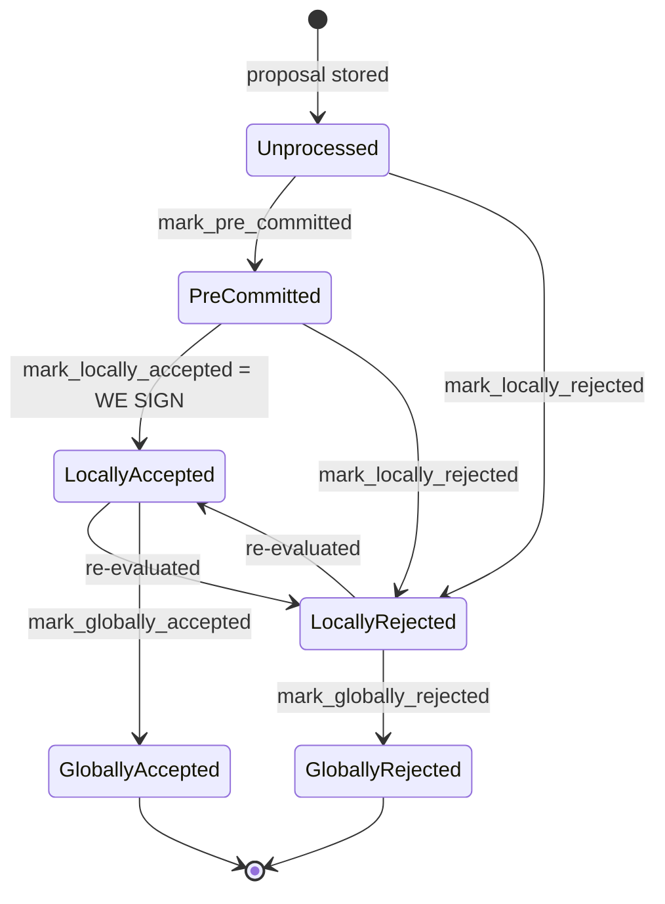

Based on my investigation, I found a concrete analog: a mismatched equivocation guard between the two chainstate protocol paths (`v1.rs`/`SortitionsView` vs `v2.rs`/`GlobalStateView`) in `stacks-signer/src/chainstate/`, comparable to the OpenClaw bug class where a narrower/synthetic authorization check silently replaced the real boundary that should gate a privileged action (here: producing a second conflicting signature for the same tenure).

### Title
Signer can sign two conflicting tenure-change blocks for the same tenure under the legacy (v1) chainstate path because its duplicate-block guard only checks globally-accepted blocks, not locally-signed ones - ([File: stacks-signer/src/chainstate/v1.rs])

### Summary
`SortitionsView::validate_tenure_change_payload` (the pre-global-state-activation "v1" proposal-validation path) guards against a signer approving two tenure-change blocks for the same tenure by checking `signer_db.get_last_globally_accepted_block(&block.header.consensus_hash)`. Its v2 counterpart, `GlobalStateView::validate_tenure_change_payload`, performs the analogous check with `signer_db.get_last_signed_block(&block.header.consensus_hash)` instead, with an explicit comment that this is intentional: "Only blocks we have signed (locally or globally accepted) count here... a block we have merely pre-committed to carries no signature from us, so it is safe to accept a competing tenure-start block in its place." That comment establishes that "signed" (locally accepted, i.e. this signer already emitted `signed_self`) is the correct security boundary for this check — not "globally accepted." [1](#0-0) [2](#0-1) 

### Finding Description
The block lifecycle is `Unprocessed → PreCommitted → LocallyAccepted (= WE SIGN) → GloballyAccepted`, and a signature is emitted the moment a block reaches `LocallyAccepted`, well before `GloballyAccepted` (which requires the node to report the block as processed/canonical). [3](#0-2) 

In the v1 path, `validate_tenure_change_payload` only refuses a competing tenure-change proposal for the same tenure (`block.header.consensus_hash`) if a block in that tenure has already reached `GloballyAccepted`:

```rust
let last_in_current_tenure = signer_db
    .get_last_globally_accepted_block(&block.header.consensus_hash)
``` [1](#0-0) 

But a signer can have already independently signed (i.e. reached `LocallyAccepted` and broadcast a signature for) a different, conflicting tenure-change block for the same tenure without that block yet being globally accepted — e.g. if the network is split on approving it, if the block is still accumulating weight, or if a Bitcoin/timing race lets a second tenure-change proposal for the same consensus hash arrive before global consensus is reached on the first. In that window, `get_last_globally_accepted_block` returns `None`, so the "already signed a block in this tenure" duplicate-block rejection (`RejectReason::DuplicateBlockFound`) never fires, and the signer proceeds to evaluate/sign the second, conflicting tenure-change block for the same tenure.

By contrast, the v2/global-state path was explicitly hardened to check `get_last_signed_block` (which the accompanying comment says covers both `LocallyAccepted` and `GloballyAccepted` blocks) precisely so that a signature already produced — regardless of whether it later reaches global consensus — blocks the signer from later signing an alternative block for the same tenure. [4](#0-3) 

This is directly analogous to the OpenClaw flaw: a code path meant to enforce an authorization/equality boundary ("has this signer already committed to a block in this tenure?") is fed a narrower, synthetic condition ("has this tenure's block reached global consensus?") that doesn't match the real security-relevant event (the signer's own signature), letting a request that should be blocked slip through.

### Impact Explanation
A signer running the v1/legacy chainstate protocol version can be induced to produce signatures over two conflicting blocks for the same tenure — an equivocation. Since signer signatures over conflicting blocks for the same tenure/height are exactly the "signed vs validated" equality this guard exists to protect, this is a Critical-class break: a rejection/guard that should have prevented a conflicting signature is bypassed, allowing (in aggregate, if enough signers hit the same window) a conflicting block to accumulate signature weight in a way the protocol's one-signature-per-tenure invariant was designed to prevent.

### Likelihood Explanation
This requires no majority: only the one signer under evaluation and a miner/gossip actor able to submit a second tenure-change block for the same consensus hash while the first block the signer signed has not yet reached global consensus (a normal, frequently-occurring window — global acceptance depends on network-wide signature aggregation and node confirmation, which is not instantaneous). It only manifests on the v1/legacy proposal-evaluation path (`state_version.uses_global_state()` false), which remains reachable as long as any active signers have not yet upgraded to the version that activates global state. [5](#0-4) 

### Recommendation
Change `SortitionsView::validate_tenure_change_payload` in `stacks-signer/src/chainstate/v1.rs` to use the same "already signed" check as v2 — i.e. a query equivalent to `get_last_signed_block` (locally or globally accepted) rather than `get_last_globally_accepted_block` — so that the guard blocks a second, conflicting tenure-change proposal for a tenure the signer has already locally accepted and signed, matching the intent documented in the v2 comment.

### Proof of Concept
1. Signer S runs the legacy (v1) chainstate protocol version.
2. Miner proposes tenure-change block A for tenure T. S validates it via `SortitionsView::check_proposal` → `validate_tenure_change_payload`; no prior block exists for T, so S accepts and signs A (`mark_locally_accepted`, `LocallyAccepted`, signature broadcast). A has not yet reached `GloballyAccepted` (e.g., other signers are slow, offline, or contesting it).
3. Miner (or an attacker able to write to the miner's StackerDB slot) proposes a second, conflicting tenure-change block B, also for tenure T (same `consensus_hash`), e.g. with a different parent-tenure choice or different transactions.
4. S evaluates B via the same v1 path. `validate_tenure_change_payload` calls `get_last_globally_accepted_block(&T)`, which returns `None` because A is only `LocallyAccepted`, not yet `GloballyAccepted`.
5. The duplicate-block check is skipped; if B otherwise passes (matching sortition/miner-pubkey checks, since it originates from the same still-"Current"-sortition miner slot), S signs B as well — producing two signer signatures for two conflicting blocks in tenure T.

Note: I was unable to directly view the bodies of `get_last_globally_accepted_block` and `get_last_signed_block` in `stacks-signer/src/signerdb.rs` in the final iteration (tool budget exhausted), so this PoC relies on the explicit comment in `v2.rs` describing the semantic difference and the distinct function names/call sites in `v1.rs` vs `v2.rs`. Confirming the exact query semantics of these two functions in `signerdb.rs` would further substantiate the exploit path.

### Citations

**File:** stacks-signer/src/chainstate/v1.rs (L505-518)
```rust
        let last_in_current_tenure = signer_db
            .get_last_globally_accepted_block(&block.header.consensus_hash)
            .map_err(|e| {
                SignerChainstateError::from(ClientError::InvalidResponse(e.to_string()))
            })?;
        if let Some(last_in_current_tenure) = last_in_current_tenure {
            warn!(
                "Miner block proposal contains a tenure change, but we've already signed a block in this tenure. Considering proposal invalid.";
                "proposed_block_consensus_hash" => %block.header.consensus_hash,
                "proposed_block_signer_signature_hash" => %block.header.signer_signature_hash(),
                "last_in_tenure_signer_signature_hash" => %last_in_current_tenure.block.header.signer_signature_hash(),
            );
            return Err(RejectReason::DuplicateBlockFound);
        }
```

**File:** stacks-signer/src/chainstate/v2.rs (L340-357)
```rust
        // We already confirmed in check miner activity that the current tenure is valid. So check we are not
        // reorging the tenure blocks. Only blocks we have signed (locally or globally accepted) count
        // here: a block we have merely pre-committed to carries no signature from us, so it is safe to
        // accept a competing tenure-start block in its place if it failed to reach consensus.
        let last_in_current_tenure = signer_db
            .get_last_signed_block(&block.header.consensus_hash)
            .map_err(|e| {
                SignerChainstateError::from(ClientError::InvalidResponse(e.to_string()))
            })?;
        if let Some(last_in_current_tenure) = last_in_current_tenure {
            warn!(
                "Miner block proposal contains a tenure change, but we've already signed a block in this tenure. Considering proposal invalid.";
                "proposed_block_consensus_hash" => %block.header.consensus_hash,
                "proposed_block_signer_signature_hash" => %block.header.signer_signature_hash(),
                "last_in_tenure_signer_signature_hash" => %last_in_current_tenure.block.header.signer_signature_hash(),
            );
            return Err(RejectReason::DuplicateBlockFound);
        }
```

**File:** docs/signer-flows.md (L130-149)
```markdown
## 2. Block lifecycle (`BlockState`)

Every proposal tracked in the signer DB carries a `BlockState`. **`PreCommitted`
carries no signature**: it means "validated, willing to sign if the pre-commit
threshold is met." The first signature appears at `mark_locally_accepted`.
Global states are terminal against each other.



**File:** stacks-signer/src/v0/signer.rs (L865-870)
```rust
        if state_version.uses_global_state() {
            self.check_block_against_global_state(stacks_client, &block_info.block)
        } else {
            self.check_block_against_local_state(stacks_client, sortition_state, &block_info.block)
        }
    }
```
